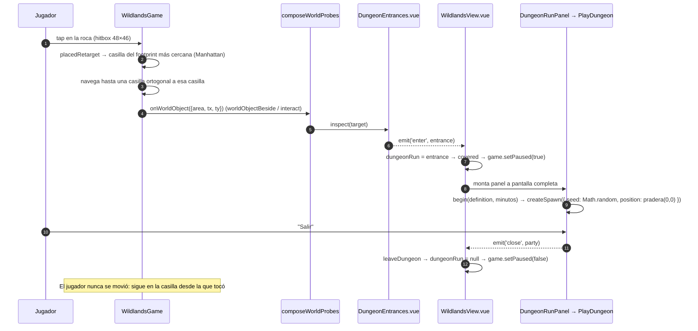
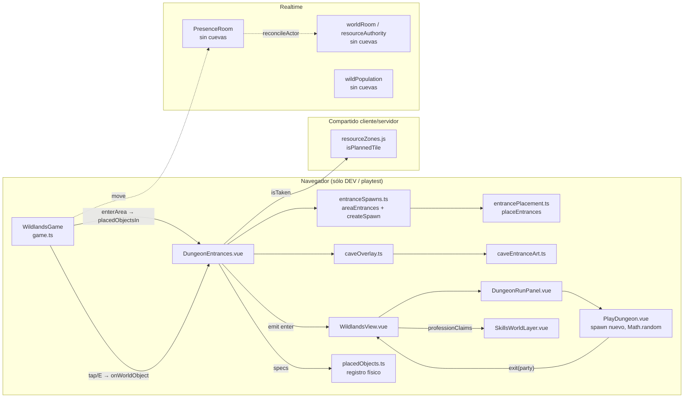
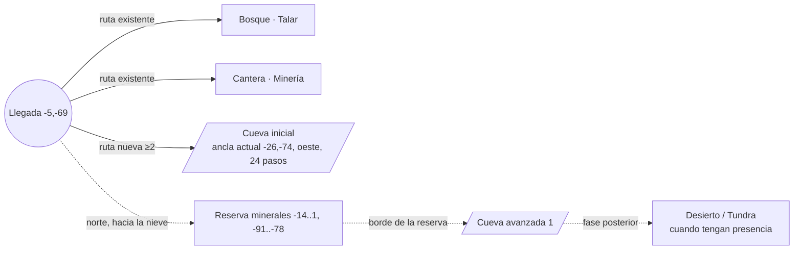

# CAVES-1 — Auditoría integral y propuesta de rediseño de cuevas

> Base: `origin/integration/world-skills-0.3 @ d8b5571` (verificada antes de empezar).
> Rama: `design/caves-audit-0.3`. Fase **exclusivamente documental**: no se tocó código productivo, assets, balance ni datos.
> Etiquetas: **FACT** = verificado en el código citado; **INFERENCE** = deducido del código, no reproducido en ejecución; **OPEN QUESTION** = requiere decisión o verificación.
> YIELD-2 (`world/multi-yield-*`) **no** se asume como base; donde una propuesta depende de él se dice explícitamente.

---

## 0. Resumen ejecutivo

1. **Hoy no existe ninguna cueva como lugar.** Lo que el jugador ve como "cueva" es un objeto sólido 3×2 dibujado sobre la Pradera que, al tocarlo, abre **a pantalla completa** el prototipo de Dungeon (`PlayDungeon.vue`) encima del mundo. No hay portal, no hay cambio de área, no hay interior en el Atlas, no hay salida espacial: al cerrar el panel el jugador sigue parado donde estaba. (FACT, §1.4)
2. **Las cuevas no son datos: son el resultado de un algoritmo del cliente.** Se recalculan en cada entrada al área a partir de terreno, zonas y lo que otros componentes digan ocupar (`placeEntrances`, `DungeonEntrances.vue`). El servidor no las conoce: ni la colisión de presencia, ni las patrullas de Pokémon salvajes, ni `workPlacement`. (FACT, §1.2 y §1.8)
3. **El interior no depende de la cueva.** El prototipo descarta el spawn de la entrada y crea otro con `Math.random()` y posición fija `pradera (0,0)`; lo único que viaja es `definitionId` y los minutos. Dos cuevas con la misma definición llevan al mismo tipo de dungeon aleatorio. (FACT, §1.4)
4. **Hay seis entradas en Pradera, todas equivalentes** (densidad declarada "PLAYTEST"), con definiciones asignadas en ciclo sin mirar el bioma: Pradera tiene dos "Grieta Glacial" y dos "Caverna Ígnea". (FACT, §1.2)
5. **La base técnica para hacerlo bien ya existe:** portales y viajes con fundido (`travel.ts`), `Area` como contrato (hasta el interior de dungeon ya lo implementa: `DungeonArea`), cancelación de trabajo del servidor al cambiar de área (`reconcileActor`), capa física de objetos (`placedObjects.ts`), y el patrón de "archivo canónico sin dependencias compartido por cliente y servidor" (`resourceZones.js`, `arrival.js`).

**Recomendación:** separar dos conceptos que hoy están mezclados — **Cueva** (un lugar permanente del mapa, con boca, interior y salida, autorado como datos) y **Dungeon** (un evento temporal jugable, el prototipo actual) — y construir las cuevas como **áreas del Atlas conectadas por portales**, definidas en un único archivo canónico `services/realtime/src/world/caves.js` que leen el render, la colisión, la presencia, el servidor y los tests. Fases: CAVES-2 (fuente canónica y guardas, sin gameplay nuevo) → CAVES-3 (primera cueva caminable, vacía) → CAVES-4 (minerales) → CAVES-5 (salvajes) → combate/captura fuera de alcance.

---

## 1. Inventario técnico actual

### 1.1 Qué se monta y cuándo

| Qué | Dónde | Hecho |
| --- | --- | --- |
| Gate de montaje | `src/features/wildlands/components/WildlandsView.vue:207-209` | FACT: `DungeonEntrances` y `DungeonRunPanel` sólo se montan con `import.meta.env.DEV \|\| isPlaytest`. Un build de producción normal **no tiene cuevas**. |
| Componente físico | `WildlandsView.vue:93-99` | FACT: `<DungeonEntrances :game :is-taken="professionClaims" @enter="dungeonRun = $event">`. |
| Panel de la run | `WildlandsView.vue:102-108` | FACT: `DungeonRunPanel` montado mientras `dungeonRun !== null`. |
| Chat oculto dentro | `WildlandsView.vue:115` | FACT: `ChatPanel` sólo con `!dungeonRun`. |
| Juego pausado dentro | `WildlandsView.vue:429-431` + `watchEffect` inmediatamente después | FACT: `covered` incluye `dungeonRun !== null` → `game.setPaused(true)` (`engine/game.ts:346`). |
| Sondas del mundo | `WildlandsView.vue:377`, `:536-538`; `src/features/wildlands/engine/worldProbes.ts:43` | FACT: `composeWorldProbes` une profesiones y cuevas para `inspect`, `isWorldObject` y `placedObjects`. |
| Overlay de dibujo | `WildlandsView.vue:564-567` | FACT: `CompositeOverlay(sharedWorld, professions, dungeon)` tras un `nextTick`. |
| Salida | `WildlandsView.vue:418-421` | FACT: `leaveDungeon` devuelve el desgaste del equipo al store de playtest y pone `dungeonRun = null`. Nada más. |

### 1.2 Colocación de las entradas (superficie)

| Pieza | Archivo:línea | Qué hace |
| --- | --- | --- |
| Footprint | `src/features/dungeonEntrances/domain/entrancePlacement.ts:55-61` | `width` casillas al este, `depth` hacia el norte desde el ancla (fila frontal). |
| Aproximación | `entrancePlacement.ts:64-65` | Casilla centrada **delante** de la fila frontal: `(anchor.tx + ⌊w/2⌋, anchor.ty + 1)`. |
| `fits` | `entrancePlacement.ts:74-77` | Todo el footprint y la aproximación deben ser no-sólidos, no-agua y no-`isTaken`. **No** verifica alcanzabilidad. |
| `placeEntrances` | `entrancePlacement.ts:103-133` | Anillos Chebyshev `[minRing, maxRing]` alrededor del origen, orden por hash de semilla, separación mínima. |
| Parámetros | `src/features/dungeonEntrances/domain/entranceSpawns.ts:26-41` | `3×2`, anillos `6–26`, **6 cuevas**, separación 7 — marcados "PLAYTEST … Revert = change this one block". |
| Reloj | `entranceSpawns.ts:48` | `COMMUNITY_PLAYTEST_MINUTES = 240`. |
| Definición por cueva | `entranceSpawns.ts:75-76` | `definitions[index % length]`: ciclo, sin mirar `definition.biomes`. |
| Id estable | `entranceSpawns.ts:90` | `spawnId = "${areaId}:${tx}:${ty}"` — estable mientras el ancla no se mueva. |
| Semilla de área | `src/features/dungeonEntrances/components/DungeonEntrances.vue:51-55` | FNV-1a del id de área (`seedOf`). |
| Puerto real | `DungeonEntrances.vue:62-87` | Sólo `area.kind === 'wild'`; origen = `area.arrival(null)`; `now: Date.now()`; `isTaken = portal ∪ isPlannedTile ∪ props.isTaken` (`:80`). |
| Reclamos de profesiones | `WildlandsView.vue:369-370` | `professionClaims` = `professionRef.isWorldObject(...)` (nodos y parcelas). |
| Objeto físico | `DungeonEntrances.vue:94-108` | `kind: 'dungeonEntrance'`, `solid`, `interactive`, `3×2`, hitbox de tap `48×46`. |

**Posiciones hoy (Pradera, única área jugable con presencia).** FACT, fijadas por test (`src/features/world/domain/zoneParity.test.ts:47-49`) y medidas en `docs/design/map-2/audit.json`:

| # | Ancla (front-left) | Aproximación | Pasos desde la llegada `(-5,-69)` | Definición (ciclo) |
| --- | --- | --- | --- | --- |
| 1 | `(-26,-74)` | `(-25,-73)` | 24 | Caverna Ígnea (volcán) |
| 2 | `(7,-59)` | `(8,-58)` | 28 | Grieta Glacial (tundra) |
| 3 | `(-24,-43)` | `(-23,-42)` | 47 | Simas de Sinnoh |
| 4 | `(19,-58)` | `(20,-57)` | 37 | Estratos Fósiles |
| 5 | `(-30,-85)` | `(-29,-84)` | 39 | Caverna Ígnea |
| 6 | `(16,-49)` | `(17,-48)` | 43 | Grieta Glacial |

Orientación: todas miran al **sur** (la boca está en la fila frontal, que es la de mayor `ty`). No hay otra orientación posible en el código actual. (FACT)

Los otros cuatro mundos (`atlas.ts:13-19`) también reciben seis cuevas cada uno, pero **no son alcanzables con presencia activa**: `game.travelTo` rechaza áreas fuera de `isPresenceAreaId` (`engine/game.ts:757-766`, `multiplayer/domain/presence.ts:6-8`) con "Esta zona llegará próximamente". Sólo se ven en desarrollo sin presencia o con `?area=` en la URL. (FACT)

### 1.3 Dibujo, capas y oclusión

| Pieza | Archivo:línea | Hecho |
| --- | --- | --- |
| Arte procedural | `src/features/dungeonEntrances/art/caveEntranceArt.ts:33,40,92-126` | `48×58` px (3 casillas de ancho, **~3,6 de alto** sobre 2 de fondo), macizo de elipses + boca oscura + dintel. Paletas de `ROCK_RECIPES` (piedra/hielo/arena). |
| Tono | `DungeonEntrances.vue:57-59,83`; `caveEntranceArt.ts:141-145` | Por **id de área**, no por bioma de la casilla. Pradera → `stone`. |
| Overlay | `src/features/dungeonEntrances/world/caveOverlay.ts:33-41` | Sprite en los "pies" del footprint (`placedFeet`, `engine/placedObjects.ts:150`), ordenado por profundidad con el resto de la escena (`engine/renderer.ts:354`). |
| Etiqueta | `caveOverlay.ts:19,43-67` | Nombre + cuenta regresiva, a ≤7 casillas de la aproximación, con fundido; `lift: 62`. Texto de canvas, nunca markup. |
| Pista | `DungeonEntrances.vue:129-135` | "Hay cuevas cerca…" visible en todo área salvaje **salvo** cuando el jugador está a ≤6 de una aproximación. |
| Canopy / z-index | — | No hay manejo específico: el sprite es un `OverlaySprite` sin `depthBias`. Un jugador parado detrás (norte) de la roca queda tapado por los ~26 px que sobresalen. (INFERENCE por la regla de orden por pies) |

### 1.4 Interacción, "portal" y transición



- **Entrada = interacción, no portal.** FACT: `engine/game.ts:737-745` (`worldObjectBeside`) y `:835` (`interact`, teclas `E`/`Espacio`, `engine/keyboard.ts:79`) llaman a `onWorldObject` con **cualquier casilla del footprint** adyacente ortogonalmente. `DungeonEntrances.entranceAt` (`:110-113`) acepta cualquier casilla del footprint. Resultado: **se entra desde los lados y desde atrás**, no sólo desde la aproximación.
- **Retarget.** FACT: `engine/game.ts:730-734` + `placedObjects.ts:173` (`nearestTile`): un tap en la roca apunta a la casilla del footprint más cercana al jugador; si el jugador viene del norte, entra por la espalda.
- **Portales reales** (`src/features/wildlands/engine/area.ts:20-28`, `engine/travel.ts:71-73`, `engine/game.ts:1001-1014`): se disparan al **llegar** a una casilla portal; el cambio de área ocurre al negro del fundido (`game.ts:904-914`) y pide colocación a presencia sólo para `ciudad-corazon` y `pradera`. **Las cuevas no usan nada de esto.**
- **Interior.** FACT: `DungeonRunPanel.vue:48,50` calcula minutos desde el spawn de la entrada y monta `PlayDungeon`; `PlayDungeon.vue:87-96` hace `begin(definition, minutes)`; `PlayDungeon.vue:435-453` crea un **spawn nuevo** con `seed: Math.floor(Math.random() * 100000)` (`:443`) y `position: { tx: 0, ty: 0, areaId: 'pradera' }`. La semilla, el id y la posición de la cueva **no llegan al interior**.
- **Salida.** FACT: `DungeonRunPanel.vue:62-65` → `PlayDungeon.leave` (`:695-699`) → `emit('exit', party)`. No hay spawn de salida porque no hubo cambio de posición.

### 1.5 Colisión y casillas transitables

| Capa | Conoce las cuevas | Evidencia |
| --- | --- | --- |
| Movimiento del jugador (cliente) | Sí | `engine/game.ts` `solidAt` = `area.isSolid ∪ placedObjects.isSolid` (bloque previo a `rules`). |
| Navegador (tap) | Sí | `engine/game.ts:141-147` (`isSolid`, `isInteractive`). |
| Patrullas de salvajes/NPC compartidos | **No** | `engine/game.ts:158-162`: "Placed objects are left out on purpose". |
| Hogares de salvajes (servidor) | **No** | `services/realtime/src/world/wildPopulation.js` usa `isSolidAtArea` (terreno + zonas), sin cuevas. |
| Movimiento de presencia (servidor) | **No** | `services/realtime/src/presence/movement.js:12-13`: "Walkability is decided by the client". |
| `workPlacement` (servidor) | **No** | Protegido sólo por test: `zoneParity.test.ts:83-115` comprueba que ningún stand/espera cae sobre una cueva real. |

### 1.6 Assets existentes

| Asset | Estado |
| --- | --- |
| `caveEntranceArt.ts` (procedural, 3 tonos) | En uso (superficie). |
| `dungeonPrototype/world/dungeonProps.ts:248` `entranceSprite` | En uso sólo en el catálogo del laboratorio (`EntranceArt.vue:66`). |
| Interior del prototipo: `DungeonArea` (`dungeonPrototype/world/dungeonArea.ts:143`), `dungeonTerrain.ts` (`themePaint`, texturas por tema), `floorTiles.ts`/`tileKinds.ts` (roca, suelo, escombro, agua, puente, cornisa, acento, escaleras), `decorPlan.ts`, `tileArt.ts`, antorchas/cofres/puertas (`dungeonProps.ts:243-248`) | En uso dentro de `PlayDungeon`. `DungeonArea` **ya implementa `Area`** (el contrato del Atlas). |
| `public/assets/images/brinecave.png` (648×504), `icecave.png` (360×264) | **Sin ninguna referencia** en el repo (grep completo). Son fondos estilo "escenario de combate", no tiles del estilo WildLands. Origen/licencia: **OPEN QUESTION**. No se recomienda reutilizarlos. |

### 1.7 Lógica especial por cueva

No hay. FACT: todas comparten forma, arte (salvo tono), densidad, reloj y flujo. La única diferencia es la `DungeonDefinition` asignada en ciclo (`dungeonPrototype/data/dungeonCatalog.ts:39-88`), cuyo campo `biomes` (`dungeonSpawn.ts`, interfaz `DungeonDefinition`) está documentado como "Not used until the overworld is real".

### 1.8 Dependencias con Pradera, recursos, parcelas, portal y `workPlacement`

- **Zonas MAP-2**: `isPlannedTile` (`services/realtime/src/world/resourceZones.js:76`) excluye zonas, rutas y reservas. Sin esa guarda la cueva 6 se habría movido a la cantera (`docs/design/MAP_2_RESOURCE_ZONES.md`, "Cuevas"). FACT.
- **Discrepancia menor**: el comentario de `isPlannedTile` dice que incluye "the arrival clearance", pero el cuerpo no consulta `ARRIVAL_CLEARANCE` (`resourceZones.js:54`). Hoy no importa (el `minRing 6` aleja las cuevas), pero es una regla escrita que el código no cumple. FACT.
- **Nodos y parcelas**: vía `professionClaims` (componente montado) en producción de playtest, y vía `resourceAt ∪ PLOTS` en el test y el script. FACT.
- **Portal a Ciudad**: `DungeonEntrances.isPortal` (`:90-92`). FACT.
- **Orden de montaje**: el juego llama `placedObjectsIn` en `enterArea` (`engine/game.ts:281-302`, `syncPlacedObjects` `:310-313`). Si el juego arranca directamente en Pradera (`?area=pradera`) antes de que el componente asíncrono monte, no hay cuevas hasta reentrar; y si `professionRef` aún es `null`, `isTaken` no ve nodos. **INFERENCE** (no reproducido); en el flujo normal se arranca en Ciudad y el problema no aparece.

### 1.9 Duplicación

| Duplicado | Lugares |
| --- | --- |
| `seedOf` (FNV-1a del área) | `DungeonEntrances.vue:51-55`, `scripts/dungeon-entrances.ts:16-21`, `scripts/map/audit-pradera.ts:48-52`, `zoneParity.test.ts:27-31`. |
| Puerto `isTaken` | Componente (`:80`), test (`zoneParity.test.ts:40-41`), auditoría (`audit-pradera.ts:59`) y **script `dungeon:entrances` que sólo mira portales** (`scripts/dungeon-entrances.ts:42`) → el script mide cuevas que **no** son las que ve el jugador desde MAP-2. |
| Footprint rectangular | `entranceFootprint` (`entrancePlacement.ts:55`) y `rectangleFootprint` (`placedObjects.ts:113`) — misma regla, dos implementaciones. |
| Ancho/fondo `3`/`2` | `COMMUNITY_PLAYTEST_DENSITY` y literales en `toSpec` (`DungeonEntrances.vue:103-104`). |
| Nodos de minería | `obstacles.ts:92-101` copia requisitos del catálogo (con test de deriva, aceptado por aislamiento del prototipo). |

### 1.10 Tests actuales relacionados

| Test | Cubre |
| --- | --- |
| `src/features/dungeonEntrances/domain/entrancePlacement.test.ts` | Footprint, aproximación, `fits`, determinismo, anillos, separación, no solapamiento, "menos antes que peor", aproximación sólida descarta. Sobre mundos sintéticos. |
| `src/features/world/domain/zoneParity.test.ts:77-81` | Las 6 cuevas no se movieron con MAP-2 y no pisan terreno planificado (lista fija de coordenadas). |
| `zoneParity.test.ts:83-115` | Ningún stand/espera de `workPlacement` cae en una cueva real (derivado de datos reales, 36 casillas). |
| Tests del prototipo (`dungeonPrototype/**`) | Generación, navegación, combate, jefe, obstáculos. Sin relación con la superficie. |

No hay tests de: entrada sólo frontal, alcanzabilidad de la aproximación, presencia/reconexión con cueva, tareas activas al entrar, salvajes sobre cuevas.

### 1.11 Diagrama del sistema actual



---

## 2. Auditoría jugable

Leyenda de tipo: **T** = problema técnico, **D** = problema de diseño.

| Pregunta | Respuesta | Tipo | Etiqueta |
| --- | --- | --- | --- |
| ¿Se reconoce como entrada? | Sí como silueta (roca con boca oscura, etiqueta con nombre a ≤7 casillas). Pero la etiqueta muestra una cuenta regresiva de ~4 h que se reinicia cada vez que se entra al área, y el nombre puede contradecir el entorno ("Grieta Glacial" en la pradera). | D | FACT |
| ¿Se alcanza caminando? | En Pradera, las 6 sí (24–47 pasos, `map-2/audit.json`). Ninguna guarda lo garantiza: `fits` no mira alcanzabilidad. | T | FACT |
| ¿Colisión = dibujo? | Colisión 3×2; arte 3 de ancho × ~3,6 de alto. La parte superior del arte sobresale sobre casillas caminables del norte (profundidad correcta, pero el jugador puede quedar oculto detrás). | D | INFERENCE |
| ¿Se entra por más de un lado? | **Sí**: cualquier casilla adyacente a cualquier celda del footprint dispara la entrada; un tap en la roca puede llevar a la espalda. | T | FACT |
| ¿La salida devuelve a una casilla segura? | Trivialmente: el jugador no se movió. Pero si entró por atrás, "sale" por atrás. | D | FACT |
| ¿Puede aparecer dentro de un objeto/nodo/parcela/portal? | No hoy (no hay reaparición). Riesgo nuevo en cuanto exista un portal real (ver §8, spawn seguro). | — | FACT |
| ¿Riesgo de loop de transición? | No hay transición. `E`/`Espacio` inmediatamente después de salir puede reabrir la run sin moverse (misma casilla, misma orientación). | D | INFERENCE |
| ¿Entradas decorativas que parecen usables y no lo son? | Las 6 son usables, pero **son idénticas y todas llevan a una run aleatoria**: no hay "lugar" detrás. Además hay 24 cuevas más en mundos inalcanzables con presencia. | D | FACT |
| ¿Distribución con sentido? | No: anillo aleatorio 6–26 alrededor de la llegada, pensado para "encontrar una en 1–3 minutos". Dos quedan junto a la cantera (2 y 4), una al sur del bosque (3). | D | FACT |
| ¿Demasiado juntas/aisladas? | Separación ≥7 casillas; seis en un radio de ~25 es denso para un elemento que debería ser un hito. | D | FACT |
| ¿Móvil y cámara reducida? | El panel es pantalla completa con áreas seguras (`DungeonRunPanel.vue:69-77`) y oculta el aviso en pantallas chicas (`:117-119`). Hitbox de tap 48×46 cómodo. En superficie, con `fit` mínimo 0,55 se ven varias cuevas a la vez y sus etiquetas compiten. | D | INFERENCE |
| ¿Presencia compartida al entrar/salir? | El avatar queda **quieto frente a la roca** para los demás; nadie sabe que está "dentro". No hay área de cueva en `AREAS`/`isPresenceAreaId`. Chat oculto para él. | T+D | FACT |
| ¿Tarea WORLD/SKILLS activa? | Si el jugador entra **sin moverse** (ya adyacente, o `E`), no se envía ningún `move` → el servidor **no** cancela la acción (`resourceAuthority.js:195-200` sólo cancela por posición/área) → la tarea sigue y puede completarse mientras el jugador está en la dungeon. Si camina hasta la cueva, CANCEL-1 la cancela. | T | FACT (mecanismo) / INFERENCE (caso adyacente: en el layout actual de Pradera no hay stands pegados a cuevas) |
| ¿Reconexión dentro? | La run vive en memoria. Recargar la pierde junto con el desgaste del equipo (`leaveDungeon` nunca se llama) y reaparece en Ciudad (`WildlandsView.vue:528-530`, `initialTownPosition` sólo para el pueblo). Reconexión de socket sin recarga: el avatar sigue en Pradera en la misma casilla. | T | FACT / INFERENCE |
| ¿Salvajes compartidos y cuevas? | Las patrullas y hogares no conocen las cuevas: un Pokémon salvaje puede cruzar la roca o pararse en la aproximación (no bloquea al jugador, `rules.occupied` ignora patrullas). | T | FACT (código) / INFERENCE (visual) |

---

## 3. Problemas clasificados

### Bloqueantes (para que las cuevas sean un elemento real del mapa)

| Id | Problema | Por qué bloquea |
| --- | --- | --- |
| **B1** | No existe interior como lugar: la cueva abre un overlay con una run aleatoria desconectada de la cueva (§1.4). | Sin área no hay exploración, rutas, presencia compartida, recursos ni encuentros ubicados. |
| **B2** | Las cuevas son salida de un algoritmo del cliente, dependiente de terreno, zonas y del orden de montaje; el servidor no las conoce (§1.2, §1.5, §1.8). | Recursos y encuentros futuros son server-authoritative (AGENTS §2, §8, §11): el servidor necesita saber dónde están las cuevas y sus interiores. |
| **B3** | Dos conceptos mezclados: "lugar permanente" y "evento temporal" (spawn con `closesAt`) comparten objeto, etiqueta y flujo. | Cualquier implementación tiene que elegir qué es una cueva antes de escribir código (decisión D1). |

### Importantes

| Id | Problema | Tipo |
| --- | --- | --- |
| **I1** | Entrada por cualquier lado y por la espalda (§1.4). | T |
| **I2** | Entrar sin moverse no cancela una tarea WORLD activa; con un área de cueva real el servidor la cancelaría solo (`reconcileActor`, por `areaId`). | T |
| **I3** | Salvajes/NPC compartidos ignoran las cuevas (patrulla y hogar). | T |
| **I4** | Recarga dentro de la run pierde run y desgaste; no hay estado de "estoy en una cueva". | T |
| **I5** | Reloj de spawn falso: `now: Date.now()` en cada entrada al área (`DungeonEntrances.vue:74`) → la cuenta regresiva se reinicia por visita y difiere entre jugadores; `acceptsEntries` (`dungeonSpawn.ts:105`) nunca se consulta en la superficie. | T+D |
| **I6** | Definiciones en ciclo sin respetar `biomes`; nombres incoherentes con el entorno. | D |
| **I7** | `seedOf` ×4 y puerto `isTaken` ×4, con el script `dungeon:entrances` desalineado (sólo portales). | T |
| **I8** | Sin guarda de alcanzabilidad ni de claro frontal. | T |
| **I9** | Densidad de playtest (6/área) sin jerarquía ni propósito de mapa. | D |

### Menores

| Id | Problema | Tipo |
| --- | --- | --- |
| M1 | `habitat: 'cave'` en `iron_vein`, `gold_vein`, `crystal_cluster` (`skills/domain/resources.ts:105,111,117`) nunca coincide con un bioma real: pista muerta. El roadmap (`skills/domain/roadmap.ts:40-41`) promete oro y cristal "en cuevas". | D |
| M2 | `brinecave.png`/`icecave.png` sin referencias; origen desconocido. | T |
| M3 | `DungeonArea` declara `kind = 'wild'` (`dungeonArea.ts:144`): si se registrara en el Atlas, `DungeonEntrances` colocaría cuevas dentro de la cueva. | T |
| M4 | Pista "Hay cuevas cerca" permanente en toda área salvaje. | D |
| M5 | Tono por id de área, no por bioma local. | D |
| M6 | Comentario de `isPlannedTile` promete `ARRIVAL_CLEARANCE` y el código no lo consulta. | T |
| M7 | Reapertura inmediata con `E` tras salir. | D |
| M8 | Posible ausencia de cuevas al arrancar directo en un área salvaje (orden de montaje). | T (INFERENCE) |
| M9 | Footprint rectangular implementado dos veces. | T |

---

## 4. Relación con recursos y mapa

### 4.1 Estado de partida (FACT)

- Superficie de Pradera: sólo dos zonas, `bosque` (árbol común, pino) y `cantera` (roca) (`resourceZones.js:34-45`; `worldSkills/resourceMapping.ts:39-42`). Fuera de zonas no hay nodos en Pradera (`hasResourceZones`).
- Hierro y carbón **no existen en la superficie** jugable: ningún prop de zona se mapea a `coal_seam` ni `iron_vein`.
- Reserva libre para minerales superiores: `reserva-minerales` `(-14,-91)…(1,-78)`, "toward the snow" (`resourceZones.js:48-51`).
- `skillsResourceFor` sólo resuelve áreas `procedural` con semilla (`worldSkills/resourceMapping.ts:45-47`): **un interior de cueva autorado no tendría recursos sin tocar ese gate** (a considerar en CAVES-4).
- Los cristales hoy son un pickup local no persistente (`WildArea.collect`, "+1 cristal · demo, no se guarda", `engine/game.ts:1001-1005`) y el servidor los excluye explícitamente de los recursos (`resourceLayout.js:34-37`).

### 4.2 Propuesta de distribución futura (sin cambiar valores)

| Material | Dónde (propuesta) | Depende de YIELD-2 | Notas |
| --- | --- | --- | --- |
| Roca básica (`stone_outcrop`) | Sigue en la **cantera** de superficie. Opcional: 2–4 rocas en la cámara de entrada de la cueva inicial como "ancla" visual de minería. | No | Nada cambia en la superficie. |
| Carbón (`coal_seam`) | **Cueva inicial**, cámara lateral a media profundidad. | No para ubicarlo. Sí para cualquier ajuste de cantidad por acción. | Se mantiene raro/avanzado y `[1,1]` como está decidido; su rareza la da el acceso (hay que entrar), no un cambio de valores. |
| Hierro (`iron_vein`) | Cámara profunda de la cueva inicial **o** primera cueva avanzada. | No para ubicarlo. | Anclas `boulder`/`icerock` del catálogo; en interior se dibujarían con el mismo arte de nodo. |
| Oro (`gold_vein`) | Cuevas avanzadas (bocas en la reserva de minerales o, más adelante, Desierto/Tundra). | No para ubicarlo. | Coherente con el roadmap ("lo más lejano… y cuevas"). |
| Cristal (`crystal_cluster`) | Sólo cuevas avanzadas, cámaras finales. | No, pero **requiere decisión D6** (pickup vs nodo) y una variante nueva en `RESOURCE_VARIANTS`. | Mínimo `minAptitude: 2` ya en catálogo; no se toca. |
| Otros avanzados del catálogo (`boreal_tree`, `hardwood_tree`) | No son de cueva: quedan para Tundra/Bosque. | — | Fuera de alcance de cuevas. |

Mecanismo recomendado: reutilizar el patrón MAP-2 — **zonas de recurso con `areaId` = área de cueva** y un mapeo `zona → prop → recurso` como `ZONE_RESOURCES`. Es un cambio de datos + el gate `procedural` de `skillsResourceFor`, no un sistema nuevo.

Lo que **sí depende de YIELD-2**: cuántas unidades rinde cada acción en cueva, el valor relativo "vale la pena entrar", y cualquier bonificación de profundidad. Esta auditoría no propone ninguna.

---

## 5. Pokémon salvajes — criterios (sin tabla final)

Hecho de partida (FACT): cada Pokémon salvaje es **una entidad única con dueño posible** decidida por el servidor (`wildPopulation.js`, cabecera), con un pool de 25 por hora (`:20`), categorías `legendary` 2 % / `highAura` 12 % / resto (`:46-56`) y afinidad por bioma (`BIOME_TYPES`, `:91-99`). Una cueva con encuentros toca **ownership**: tiene que pasar por ese servicio (AGENTS §2, §11).

**Tipos compatibles.** Primarios: `rock`, `ground`, `dark`, `ghost`, `steel`; secundarios admitidos: `poison`/`flying` nocturnos (familias tipo murciélago), `fighting`, `bug` de cueva. Hielo sólo en cuevas de Tundra; fuego sólo en cuevas volcánicas. Mecanismo natural: una entrada `cave` en `BIOME_TYPES` (y variantes por cueva si hace falta), no un sistema paralelo.

**Exclusiones.** Ninguna especie `is_legendary`; ninguna mítica; ningún pseudo-legendario; nada con `base_aura ≥ 250` (el umbral `highAura` que ya existe). **OPEN QUESTION**: el Pokédex de producción expone `is_legendary` y `base_aura`, pero no se verificó un flag de mítico ni de pseudo-legendario (este último existe sólo en fixtures del prototipo, `speciesFixtures.ts:22`). Hay que decidir de dónde sale esa lista antes de CAVES-5.

**Rareza.** En cueva, la categoría `legendary` debe ser 0 % y `highAura` 0 %: el pool de cueva usa sólo "resto". La rareza dentro de la cueva la da la profundidad (cámara), no una categoría especial.

**Densidad y zonas.** Orientativo, a validar en CAVES-5: cueva inicial ~1 salvaje cada 80–120 casillas caminables, máximo 3–4 simultáneos; avanzadas algo más densas. Hogares sólo en cámaras (ancho ≥ 5), nunca en pasillos.

**Convivencia.** Hogar a ≥ 3 casillas de cualquier portal/boca/llegada, a ≥ 2 de cualquier nodo y de sus stands de `workPlacement`; patrulla con `walkable` que excluya portales (ya lo hace) **y** casillas de trabajo.

**No bloquear.** Las patrullas compartidas ya no bloquean al jugador (`rules.occupied`); aun así, prohibir hogares y patrullas en pasillos de ancho < 3 y en el claro frontal de cualquier portal, para que no tapen visualmente la salida.

**Superficie vs cueva inicial vs avanzadas.**

| | Superficie | Cueva inicial | Cuevas avanzadas |
| --- | --- | --- | --- |
| Pool | Actual (sin cambios) | Sólo "resto", tipos de cueva comunes | Sólo "resto", tipos de cueva + del bioma de la boca |
| Legendarios/alto aura | Como hoy | 0 % | 0 % |
| Densidad | Como hoy | Baja | Media |
| Dónde | Como hoy | Cámaras | Cámaras profundas |

Combate y captura: **fuera de alcance**; CAVES-5 sólo hace aparecer y patrullar.

---

## 6. Arquitectura propuesta

### 6.1 Principios

1. **Una cueva es un dato autorado**, no el resultado de `placeEntrances`. El algoritmo queda como herramienta de propuesta (scripts), no como fuente de verdad en ejecución.
2. **Un único archivo canónico sin dependencias**, compartido por navegador y servidor, igual que `resourceZones.js` y `protocol/arrival.js`.
3. **Todo lo demás se deriva**: footprint, casilla de boca, aproximación, claro frontal, portales, llegadas, casillas ocupadas, tests.
4. **Una cueva es un `Area` del Atlas**, y se entra por un **portal** (caminar hacia la boca), reutilizando `travel.ts`, el fundido y `changeArea` de presencia.
5. **Cueva ≠ Dungeon.** El prototipo de Dungeon sigue siendo un evento aparte (decisión D1); una cueva avanzada podría, más adelante, contener una boca de Dungeon.

### 6.2 Fuente canónica propuesta

`services/realtime/src/world/caves.js` (+ `caves.d.ts`), sin dependencias, con la forma:

```text
CAVES = [
  {
    id: 'pradera-cueva-inicial',          // estable, nunca derivado de coordenadas
    hostAreaId: 'pradera',
    mouth: { anchor: {tx, ty}, width: 3, depth: 2, facing: 'down' },
    interiorAreaId: 'cueva-inicial',      // id de área de presencia
    interior: { layoutId, arrival: {tx, ty, dir}, exit: {tx, ty} },
    tier: 'inicial' | 'avanzada',
  },
]
```

Funciones puras derivadas en el mismo archivo: `mouthFootprint(cave)`, `mouthTile(cave)` (portal), `approachTile(cave)`, `frontClearance(cave)`, `caveTileAt(areaId, tx, ty)`, `isCaveTile(areaId, tx, ty)`, `cavesIn(areaId)`, `arrivalFromCave(cave)`.

Los interiores: layout autorado como datos (filas de caracteres o celdas) en `services/realtime/src/world/caveLayouts.js`, también sin dependencias, porque el servidor necesita la colisión para hogares de salvajes y `workPlacement` en CAVES-4/5.

### 6.3 Quién lee la fuente

```mermaid
flowchart TB
  C[(caves.js + caveLayouts.js<br/>fuente canónica)]
  C --> AR[protocol/arrival.js<br/>ARRIVALS / arrivalFor de cuevas]
  C --> MSG[protocol/messages.js<br/>AREAS]
  C --> WA[world/areas.js<br/>WORLD_AREAS de interiores]
  C --> RZ[resourceZones.js<br/>isPlannedTile incluye bocas y claros]
  C --> WP[wildPopulation.js<br/>hogares/patrullas excluyen bocas]
  C --> WPL[workPlacement.js<br/>standable excluye bocas]
  C --> PRES[multiplayer/domain/presence.ts<br/>isPresenceAreaId]
  C --> ATL[wildlands/areas/atlas.ts<br/>registra interiores]
  C --> WILD[WildArea.portals<br/>+ portal de boca]
  C --> CAVEAREA[features/caves/world/caveArea.ts<br/>Area del interior]
  C --> MOUTH[features/caves/world/caveMouthOverlay.ts<br/>dibujo de boca, reutiliza caveEntranceArt]
  C --> T[tests de guarda derivados]
```



### 6.4 Piezas por responsabilidad

| Responsabilidad | Hogar propuesto | Reutiliza |
| --- | --- | --- |
| Definición de cuevas | `services/realtime/src/world/caves.js` | Patrón de `resourceZones.js`. |
| Geometría pura (footprint, boca, aproximación, claro) | En `caves.js` (compartida) | Regla de `rectangleFootprint` (unificar M9). |
| Portal de entrada | `WildArea.portals` agrega, para su área, las casillas de boca de `cavesIn(id)` | `Portal`, `travel.ts`, `onPlayerArrive`. |
| Portal de salida | `Area.portals` del interior | Idem. |
| Llegadas/spawn seguro | `arrivalFor(to, from)` en `arrival.js` extendido: salir de una cueva → `approachTile`; entrar → `interior.arrival` | `TOWN_FROM_PRADERA` es el precedente exacto. |
| Colisión superficie | Boca: flancos y fila trasera sólidos (objeto colocado o `isSolidAtArea`), casilla de boca = portal. | `placedObjects` o la capa autorada de `resourceZones`. **OPEN QUESTION** técnica: si la boca es sólida para el servidor, conviene que viva en la capa autorada (`decorAtArea`/`isSolidAtArea`) y no sólo como `placedObject`. |
| Interior (render + colisión) | `src/features/caves/world/caveArea.ts` implementa `Area` | Texturas y props de `dungeonTerrain.ts`/`dungeonProps.ts`. **No** importar `PlayDungeon` ni el generador. Si reutilizar `DungeonArea` directamente exige arrastrar el prototipo, extraer sólo lo necesario cuando haya dos usuarios reales (AGENTS §7). |
| Identificadores | Id literal en `caves.js`; área de interior = id de presencia. | — |
| Presencia por área | `AREAS` (`messages.js`), `isPresenceAreaId`, `WORLD_AREAS`. `requestPresencePlacement` hoy tipa `'ciudad-corazon' \| 'pradera'` y `game.ts:904-914` elige con un ternario: generalizar a "área de presencia". | `changeArea` + `reconcileActor` ya cancelan tareas al cambiar de área. |
| Recursos futuros | Zonas con `areaId` de interior + gate `procedural` de `skillsResourceFor`. | MAP-2. |
| Encuentros futuros | `BIOME_TYPES.cave` + hogares desde `caveLayouts`. | WORLD-1D. |
| Validaciones | Tests que iteran `CAVES` (§8). | `zoneParity.test.ts` como modelo. |

Qué **no** se rediseña: WORLD, SKILLS, protocolo de presencia (sólo nuevos ids de área), Atlas (sólo nuevos registros), `placedObjects`, renderer.

### 6.5 Qué pasa con `dungeonEntrances/`

Propuesta (depende de D1/D2): en CAVES-2 deja de colocar "cuevas" en Pradera — o las coloca sólo donde `caves.js` no tiene nada y con otro arte/etiqueta que diga "evento". El algoritmo `placeEntrances` puede sobrevivir para *eventos* temporales, pero entonces su reloj y su semilla tienen que venir del servidor (`dungeonSpawn.ts` §SERVER AUTHORITY). No mantener dos implementaciones activas de "cueva" (AGENTS §14).

---

## 7. Propuesta visual y de mapa

### 7.1 Boca de cueva

```text
         x-1 x   x+1
 y-2      ^   ^   ^      arte que sobresale (no colisiona)
 y-1      R   R   R      R = roca sólida
 y        R   M   R      M = boca: casilla portal, única entrada
 y+1      .   A   .      A = aproximación = aparición al salir (mirando abajo)
 y+2      .   .   .      . = claro frontal: sin props, nodos, parcelas, portales,
 y+3      .   .   .          hogares de salvajes ni stands de trabajo
```

- **Jerarquía visual:** silueta de macizo (ya existe) > boca oscura con dintel (ya existe) > claro frontal liso > camino. La etiqueta sólo nombra el lugar ("Cueva Brisa"), sin cuenta regresiva.
- **Tamaño mínimo:** 3×2 casillas de colisión (la actual). Avanzadas: 5×3 con la misma regla (boca en la columna central de la fila frontal).
- **Claro frontal:** 3 de ancho × 3 de fondo delante de la boca (incluye `A`).
- **Señalización natural:** 2–3 rocas pequeñas decorativas (backdrop, nunca nodos) flanqueando el claro; suelo de tierra/grava en el claro (tile de camino existente); en cuevas avanzadas, tono del bioma.
- **Relación con caminos:** la boca se conecta con una ruta de ≥ 2 casillas de ancho, como `ROUTES` de MAP-2 (`resourceZones.js:57-60`).

### 7.2 Interior

```text
 #########################
 #####.......#############      # roca   . suelo   E salida (portal)
 ####.........####.....###      a llegada (2 casillas dentro, mirando arriba)
 ###...........##.......##      pasillo principal ≥ 3 de ancho
 ####.........#....C....##      C cámara ≥ 9 de ancho (MIN_CHAMBER)
 #####...a...##.........##
 ######.....#####.....####
 #######.E.###############
 #########################
```

- **Ancho mínimo de pasillos:** 3 (un jugador, su compañero y otro jugador que pasa). Estrechamientos de 2 sólo decorativos y nunca delante de un portal. (El prototipo usa 5/4/2 porque para combate se alinean tres cuerpos: `tileKinds.ts:36`.)
- **Cámaras:** ≥ 9 de ancho (`MIN_CHAMBER`, `tileKinds.ts:39`); la cueva inicial: 1 cámara de entrada + 2 laterales + 1 profunda.
- **Aparición:** `a` a 2 casillas del portal de salida y fuera de su línea de avance, para que un paso accidental no devuelva al jugador afuera.
- **Móvil:** con el `fit` mínimo (0,55) una cámara de 9–13 casillas entra en pantalla con sus paredes: el jugador ve los límites. Evitar cámaras > 20 de ancho sin referencias visuales.
- **Oscuridad:** reutilizar `DUNGEON_DARKNESS` y antorchas del prototipo (`dungeonArea.ts:27`, `dungeonProps.ts`).

### 7.3 Ubicación



- **Cueva inicial:** reutilizar el sitio de la cueva 1 actual `(-26,-74)`: la más cercana (24 pasos), al oeste, del lado opuesto a la cantera, sin tocar zonas ni reservas. **Decisión D3.**
- **Cuevas avanzadas:** en el borde de `reserva-minerales` (ya reservada para "minerales superiores hacia la nieve"), o donde está hoy la cueva 5 `(-30,-85)`. Más adelante, Desierto y Tundra cuando sean áreas de presencia.
- **Reutilizar assets:** `caveEntranceArt` para bocas (ya en tono del bioma), texturas/props/antorchas del prototipo para interiores, arte de nodos de minería existente (`skills/scene/art/miningNodes.ts`) para minerales. No usar `brinecave.png`/`icecave.png`.

---

## 8. Matriz de pruebas propuesta

Todas **derivadas de `CAVES` y de los layouts**, no de listas duplicadas de coordenadas (la lista fija de `zoneParity.test.ts:47-49` se reemplaza por "cada cueva de `CAVES` cumple X").

| Área | Test | Tipo | Fase |
| --- | --- | --- | --- |
| Identidad | Ids únicos en `CAVES`; `interiorAreaId` único y registrado en `AREAS`, `WORLD_AREAS`, Atlas e `isPresenceAreaId`. | unit | 2 |
| Footprint/colisión | Cada footprint está sobre terreno no-agua, no-planificado, sin nodos, parcelas ni portales ajenos; los flancos y la fila trasera son sólidos en cliente **y** servidor. | unit (datos reales) | 2 |
| Entrada única | Para cada cueva, la única casilla adyacente que dispara la entrada es la aproximación (lados y espalda no hacen nada). | unit + e2e | 2 |
| Claro frontal | Claro 3×3 libre de sólidos, decor, nodos, stands/esperas de `workPlacement`, hogares salvajes y portales. | unit (datos reales) | 2 |
| Reachability | BFS desde la llegada del área anfitriona alcanza cada aproximación; BFS desde la llegada interior alcanza cada cámara y la salida. | unit | 2 / 3 |
| Spawn seguro | `arrivalFor(host, interior)` = aproximación; `arrivalFor(interior, host)` = llegada interior; ambas caminables, no portal, no ocupadas por objeto/nodo/parcela. | unit | 3 |
| Sin loops | Ninguna llegada es casilla portal; la llegada interior no está en la línea de avance del portal de salida; un viaje ida-vuelta termina en la aproximación. | unit + e2e | 3 |
| Portales únicos | Ninguna casilla es portal de dos destinos; cada boca tiene exactamente un portal y cada interior exactamente una salida hacia su anfitrión. | unit | 3 |
| Presencia | Entrar/salir hace `changeArea` y los otros jugadores ven desaparecer/aparecer el avatar en el área correcta; paridad `ARRIVALS` cliente/servidor. | room test | 3 |
| Reconexión | Reconectar con el actor en un interior lo restaura en el interior (o en la aproximación, según D8) sin quedar en roca. | room test + e2e | 3 |
| Cancelación de tareas | Acción WORLD en curso + cambio de área a la cueva → `cancel('moved')`, nodo, jugador y Pokémon liberados. | room test (servidor real) | 3 |
| Recursos vs portales | Ningún nodo, stand ni espera a < 2 casillas de un portal o llegada; ningún nodo en pasillos de ancho < 3. | unit | 4 |
| Pasillos | Ancho mínimo 3 en todo el grafo de caminos principales del layout. | unit | 3 |
| Salvajes | Hogares y patrullas fuera de pasillos < 3, claros frontales y stands; pool de cueva sin legendarios ni alto aura. | unit | 5 |
| Clientes anteriores | Un cliente sin los ids nuevos no puede pedir `changeArea` a una cueva (servidor rechaza `area`), y el servidor nunca lo coloca en una. | room test | 3 |
| Móvil | Captura a 375×812: boca y etiqueta legibles; interior: la cámara de entrada muestra la salida. | e2e visual | 3 |
| Determinismo | Cliente y servidor responden idéntico `isSolid`/`decor` en interiores (como `zoneParity.test.ts:52-61`). | unit | 3 |

---

## 9. Plan por fases

### CAVES-2 — Fuente canónica, guardas y correcciones estructurales

- **Alcance:** crear `caves.js` con las cuevas decididas (D2/D3) como datos; la superficie las lee de ahí; entrada sólo por la aproximación (I1); eliminar `seedOf` duplicado y alinear/retirar el script `dungeon:entrances` (I7); guardas derivadas; decidir qué pasa con el overlay de Dungeon (D1). **Sin** interiores nuevos, sin recursos, sin encuentros.
- **Archivos probables:** `services/realtime/src/world/caves.js` (+ `.d.ts`), `src/features/dungeonEntrances/**`, `scripts/dungeon-entrances.ts`, `scripts/map/audit-pradera.ts`, `src/features/world/domain/zoneParity.test.ts`, nuevo `caves.test.js`, `resourceZones.js` (`isPlannedTile` consulta bocas/claros; opcionalmente M6).
- **Riesgos:** mover una cueva cambia su `spawnId`; romper el test de paridad MAP-2; cambiar lo que ven los testers del playtest.
- **Tests:** identidad, footprint/colisión, entrada única, claro frontal, reachability.
- **Aceptación:** una sola fuente de coordenadas; ningún `seedOf` duplicado; ninguna cueva entrable por atrás; guardas verdes con datos reales; build/lint/typecheck.
- **Dependencias:** base `integration/world-skills-0.3`. Independiente de YIELD-2.

### CAVES-3 — Primera cueva jugable sin recursos avanzados

- **Alcance:** un interior autorado (`caveLayouts.js`) como `Area` (`caveArea.ts`), portal de boca en Pradera, portal de salida, llegadas en `arrival.js`, área de presencia nueva, oscuridad y antorchas. Vacía o con decoración; sin nodos, sin salvajes.
- **Archivos probables:** `caves.js`, `caveLayouts.js`, `protocol/arrival.js`, `protocol/messages.js`, `world/areas.js`, `multiplayer/domain/presence.ts`, `engine/game.ts` (generalizar el ternario de área de presencia en el callback de `travel.update` y `requestPresencePlacement`), `areas/atlas.ts`, `areas/wildArea.ts` (portales), `src/features/caves/**`.
- **Riesgos:** desfasaje de llegada cliente/servidor (el problema histórico documentado en `arrival.js`), presencia con un área nueva, reconexión, clientes viejos.
- **Tests:** spawn seguro, sin loops, portales únicos, presencia, reconexión, cancelación de tareas, clientes anteriores, pasillos, móvil, determinismo.
- **Aceptación:** dos jugadores entran, se ven dentro, salen a la aproximación; una tarea WORLD activa se cancela al entrar; recargar dentro no deja al jugador en roca.
- **Dependencias:** CAVES-2. Independiente de YIELD-2.

### CAVES-4 — Distribución de minerales

- **Alcance:** zonas de recurso dentro del interior; mapeo carbón/hierro (cueva inicial) y oro/cristal (avanzada, si D6 lo permite); gate `procedural` de `skillsResourceFor`; `workPlacement` dentro de la cueva.
- **Archivos probables:** `resourceZones.js`, `resourceZoneLayout.js` (o equivalente de cueva), `worldSkills/resourceMapping.ts`, `workPlacement.js`, `resourceLayout.js` (si se agrega variante cristal).
- **Riesgos:** abrir un camino de progresión nuevo = impacto económico; nodos que bloquean pasillos; divergencia cliente/servidor.
- **Tests:** recursos vs portales, pasillos, paridad cliente/servidor, work placement dentro de cueva.
- **Aceptación:** los nodos de cueva son trabajables sólo por el servidor, sin cambiar valores del catálogo; ninguna casilla de trabajo bloquea un pasillo.
- **Dependencias:** CAVES-3. **Las cantidades por acción dependen de YIELD-2**: si YIELD-2 no está integrado, CAVES-4 usa el rendimiento vigente y no lo ajusta.

### CAVES-5 — Encuentros salvajes (sin combate ni captura)

- **Alcance:** `BIOME_TYPES.cave` (o por cueva), hogares desde el layout, pool sin legendarios/alto aura, patrullas que respetan pasillos y claros.
- **Archivos probables:** `wildPopulation.js`, `patrol.js`, `wildlands/engine/population.ts`.
- **Riesgos:** ownership (pool único compartido con la superficie — decisión D7), densidad, rendimiento.
- **Tests:** salvajes (tabla §8), paridad cliente/servidor de hogares.
- **Aceptación:** salvajes de tipos de cueva aparecen y patrullan sin tapar portales ni stands.
- **Dependencias:** CAVES-3 (CAVES-4 recomendable, no obligatorio).

### Fase posterior — combate/captura en cuevas

Fuera de alcance. Requiere server-authoritative RNG, captura y recompensas (`DUNGEON_PROTOTYPE_INTEGRATION.md` §4; AGENTS §11).

---

## 10. Alternativas descartadas

| Alternativa | Por qué no |
| --- | --- |
| Mantener el overlay de Dungeon como "cueva" y sólo pulirlo | No hay lugar, ni presencia compartida, ni recursos ubicables; el interior es aleatorio y client-only. Resolvería I1 pero no B1–B3. |
| Seguir colocando cuevas con `placeEntrances` y replicar el algoritmo en el servidor | Frágil: cualquier cambio de terreno/zona mueve cuevas (MAP-2 ya necesitó una guarda); para 1–5 lugares con intención de diseño, datos autorados son más simples y revisables. |
| Cuevas como zona oscura en la superficie, sin interior | Barato, pero no da exploración, rutas ni sensación de "entrar". Puede ser un paso visual, no el destino. |
| Interior generado por visita con el generador del prototipo (`floorPlan`/`floorTiles`) | Cada jugador vería una cueva distinta: incompatible con presencia compartida y autoridad del servidor. Útil para Dungeons instanciadas, no para cuevas. |
| Instancias por grupo desde el día uno | Complejidad de presencia y de servidor sin necesidad para una cueva inicial. Reconsiderar para Dungeons. |
| Reutilizar `brinecave.png`/`icecave.png` | Estilo de fondo de combate, no de tiles; origen sin verificar. |

---

## 11. Decisiones que necesito antes de implementar

| # | Decisión | Opciones | Recomendación |
| --- | --- | --- | --- |
| **D1** | ¿Cueva (lugar permanente) y Dungeon (evento temporal) son conceptos separados? | a) separados; b) la cueva *es* la Dungeon | a) separados. |
| **D2** | ¿Qué pasa con las 6 cuevas procedurales de Pradera (y las 24 de los otros mundos)? | a) quedan 1–2 autoradas y el resto desaparece; b) se convierten en bocas de evento Dungeon con otra señalización; c) se congelan tal cual como datos | a) para Pradera; b) sólo si se quiere mantener el prototipo accesible en playtest. |
| **D3** | Ubicación de la cueva inicial | Ancla actual de la cueva 1 `(-26,-74)` u otra | `(-26,-74)`. |
| **D4** | Forma de entrar | a) portal (caminar hacia la boca); b) interacción (tocar) | a) portal: una sola entrada física, reutiliza viajes y presencia. |
| **D5** | Interior | a) autorado como datos; b) generado con semilla fija y congelado | a) para la cueva inicial. |
| **D6** | Cristal | a) sigue como pickup de superficie; b) pasa a nodo de minería en cuevas avanzadas | Decidir antes de CAVES-4. |
| **D7** | Pool de salvajes de cueva | a) mismo pool único de 25/h filtrado; b) pool propio por área | Afecta ownership y unicidad: decidir antes de CAVES-5. |
| **D8** | Reconexión dentro de una cueva | a) reaparece dentro; b) reaparece en la aproximación | b) es más simple y siempre seguro; a) es más fiel. |
| **D9** | ¿Cueva compartida por todos o instanciada? | a) compartida; b) instanciada por jugador/grupo | a) para la cueva inicial. |
| **D10** | ¿Requisito de acceso a cuevas avanzadas? (sólo sí/no; sin balance) | a) libre; b) requisito de nivel de Minería | Decidir con SKILLS; no tocar valores. |
| **D11** | `brinecave.png` / `icecave.png` | a) retirar; b) conservar documentando origen | Verificar origen primero (OPEN QUESTION). |

---

## 12. Verificación de este documento

- Todos los archivos citados existen en `d8b5571`; los símbolos y líneas citados se comprobaron con `grep -n` contra el worktree `pokeswap-caves-audit`.
- Diagramas Mermaid: `flowchart` y `sequenceDiagram` estándar, sin HTML salvo `<br/>` en etiquetas.
- Diff: sólo `docs/design/CAVES_1_AUDIT.md`. Ningún archivo productivo, asset, test o script modificado.
