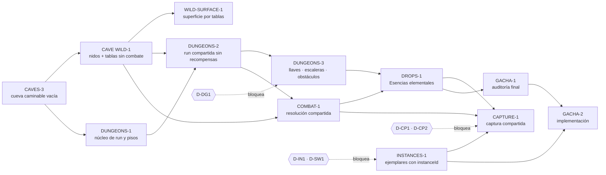

# CAVE ECOSYSTEM-1 — Threat model, pruebas, roadmap y decisiones

> Rama `design/cave-ecosystem-0.3`, base `2652a58`. Sólo diseño.
> Serie: `SHARED_DUNGEON_ARCHITECTURE.md` (auditoría y arquitectura), `CAVE_TYPES_AND_FAMILIES.md` (tipos y familias), `CAVE_RESPAWN_AND_TOKENS.md` (nidos, tokens, gacha y economía), `MMO_SPAWN_RARITY_AND_INSTANCES.md` (múltiples ejemplares, rareza, mapa, captura y gacha), este documento.
> **Corrección de premisa (posterior):** múltiples ejemplares por especie, cada uno con `instanceId` y como máximo un dueño. D-EC1 y D-GA1 quedan resueltos; se agregan las fases INSTANCES-1, WILD-SURFACE-1, CAPTURE-1 y GACHA-2.

---

## 0. Resumen

- **Doce fases**, cada una en su propia rama. Ninguna mezcla presencia, combate, ownership y economía:
  - CAVES-3: cueva vacía;
  - CAVE WILD-1: nidos y tablas de aparición sin combate;
  - WILD-SURFACE-1: la superficie pasa a tablas de aparición;
  - DUNGEONS-1: núcleo autoritativo de la run;
  - DUNGEONS-2: primera run compartida sin recompensas;
  - DUNGEONS-3: llaves, escaleras y obstáculos;
  - COMBAT-1: resolución compartida;
  - DROPS-1: Esencias;
  - INSTANCES-1: migración a ejemplares con `instanceId`;
  - CAPTURE-1: captura compartida;
  - GACHA-1: auditoría y decisión;
  - GACHA-2: implementación del gacha.
- **Decisiones resueltas:** D-EC1 (encuentros = ejemplares) y D-GA1 (el gacha crea ejemplares, sin stock). CAVE WILD-1 ya no está bloqueada.
- **Decisiones que bloquean fases:**
  - D-DG1 (fuente de la llave antes del combate) → DUNGEONS-3;
  - D-IN1 (ingreso pasivo con muchos ejemplares) y D-SW1 (swap con ejemplares) → INSTANCES-1;
  - D-CP1 y D-CP2 (derecho de captura, Ball y tope diario) → CAPTURE-1.
- **Relación con YIELD-2:**
  - ninguna fase depende de su código;
  - COMBAT-1 y DUNGEONS-3 reutilizan su **patrón** (lock por entidad + dedupe + CAS por generación);
  - CAVES-3 y DUNGEONS-2 van a chocar con él en `skills.generated.js`, `worldRoom.js` y `colyseusPresence.ts` si YIELD-2 se integra antes o después (§2.13).

---

## 1. Threat model

Leyenda de controles: **C** cliente, **RT** realtime, **EF** Edge Function (`world-authority`), **PG** Postgres.

| # | Amenaza | Vector | Impacto | Control | Capa | Test |
| --- | --- | --- | --- | --- | --- | --- |
| T1 | Cliente modificado | JS editado: envía intents falsos o campos extra (`reward`, `floor`, `quantity`) | Valor indebido | Los parsers de intents sólo leen los campos permitidos (como `workIntent`, `worldProtocol.js`). Ningún campo de resultado existe en el protocolo. | RT | malicioso: payload con campos extra se ignora |
| T2 | Teletransporte | Pasos a través de obstáculos o paredes (el servidor no valida caminabilidad, `movement.js:12`) | Saltear obstáculos, llegar a la escalera sin recorrer el piso | En `dg:*` el servidor valida caminabilidad con el layout derivado de `layoutSeed` y los obstáculos vigentes. Las acciones de valor exigen posición autoritativa (adyacencia, casilla de escalera). | RT | paso a una pared u obstáculo intacto → rechazado y resync |
| T3 | Petición directa de piso | `changeArea('dg:x:5')`, reconectar "en" el piso 5 | Saltear llaves | `changeArea` rechaza `dg:*`. La colocación la hace sólo `AccessAuthority`. Reconexión y re-entrada validan el acceso (`SHARED_DUNGEON_ARCHITECTURE.md` §4.3). | RT | sala: `changeArea` a `dg:*` → `area denied` |
| T4 | Llave duplicada | Replay de `dungeon:stairs`, dos pestañas | Dos accesos o dos viajes | La llave es una fila (run, jugador, piso), no un ítem. `permitId` idempotente. Una sola sesión por usuario (`rooms/PresenceRoom.js:95-96`). | RT + PG | dos `stairs` simultáneos → un permiso |
| T5 | Acción repetida | Reintento de red, spam | Doble contribución o doble combate | `requestId` por conexión en RT; `action_id` PK en PG | RT + PG | mismo `requestId` → `duplicate-request` |
| T6 | Carrera de obstáculos | Dos jugadores, o dos instancias, terminan a la vez | Doble `cleared`, doble XP | Lock consultivo + CAS de generación + contribución PK | PG | dos commits concurrentes → uno `applied`, otro `stale`/`already-cleared` |
| T7 | Recompensa duplicada | Reintento de la resolución, reinicio a mitad del settlement | Tokens dobles | `resolution_id` PK + `UNIQUE(source_id, user_id, token_type)` en el ledger, todo en una transacción | PG | resolver dos veces el mismo `encounterId` → mismos saldos |
| T8 | Bot de respawn | Script que espera en el nido y ataca al aparecer | Farmeo desproporcionado | `respawnAt` secreto, jitter ±20 %, rendimiento decreciente por nido, tope blando diario, límite de tasa de intents (patrón `workRateLimit.js`) | RT + PG | 7.ª derrota del mismo nido en 30 min → 50 % |
| T9 | Camping de raros | Esperar al Onix o al Sableye | Monopolio | Cooldown de 300 s para raros; la rareza no suma tokens; unirse al combate reparte | RT | tokens del raro = tokens de su etapa |
| T10 | Multicuenta | Varias cuentas del mismo humano | Más tokens, sello resonante inflado | Esencias intransferibles; elegibilidad exige actuar; N del sello fijado al primer trabajo | RT + PG | una cuenta sin acciones → no elegible |
| T11 | Desconexión estratégica | Cortar antes de perder o de "gastar" | Evitar costos, forzar re-roll | Sin botín en riesgo (v1); un combate abandonado no paga; reconectar no re-sortea nada ya decidido | RT | desconectar en `resolving` no cambia el resultado |
| T12 | Reinicio durante settlement | Caída entre el commit y la respuesta | Pago sin estado o estado sin pago | Pago y estado en una sola transacción. Tras el reinicio, `dungeon_load_run` reconstruye. El reintento con el mismo id devuelve lo guardado (patrón YIELD-2 "classify a failed commit by its final answer", commit `3fca914`). | PG | matar el proceso entre commit y ack → sin doble pago |
| T13 | Dos instancias del realtime | Deploy superpuesto, escalado accidental | Dos simulaciones de la misma run | Lease en `dungeon_runs` + CAS por generación en cada escritura de valor | PG | instancia con lease vencido → `stale`, no paga |
| T14 | Manipulación del reloj | Reloj local adelantado | Adelantar respawn, cierre o avisos | Todo el tiempo de reglas es `Date.now()` del **servidor**. El cliente sólo muestra. | RT | cliente con reloj +1 h no cambia nada |
| T15 | Filtración de seed, respawn o drops | Leer snapshots o el bundle | Predecir el próximo raro, drops o llave | `layoutSeed` sólo decide geometría. Drops, miembro del nido, llave y pity se deciden con CSPRNG en el momento. `respawnAt` y pity nunca salen del servidor. | RT | los snapshots públicos no contienen `respawnAt`, `pity`, `speciesId` futuro ni probabilidades por tirada |
| T16 | Inyección en nombres | Usernames en deltas de Dungeon | XSS | Interpolación de framework / texto de canvas (AGENTS §13) | C | nombre hostil en el delta de `transit` |
| T17 | Uso de la clave de servicio | Secretos en el frontend | Escrituras privilegiadas | Todo por `world-authority` con secreto de servidor (`handler.ts:70`). El cliente nunca llama funciones `dungeon_*`. | EF | grep del build: sin `service_role` ni secreto |
| T18 | Captura duplicada | Dos jugadores capturan a la vez; reintento tras un ack perdido | Dos ejemplares de un encuentro | Resolución única por `encounterId` (CAS de generación) + `UNIQUE (source, source_ref)` en `pokemon_instances`, en la misma transacción | PG | MMO C1–C3 |
| T19 | Resultado propuesto por el cliente | Payload con especie, IVs, shiny, nivel o tier en captura o gacha | Ejemplares a medida | Los intents no tienen esos campos; todo se sortea con CSPRNG en el servidor y el `instanceId` lo crea Postgres | RT + PG | MMO C5, G1 |
| T20 | Swap legacy sobre ejemplares ajenos | `pokeswap-swap` asigna por especie con `upsert` (`pokeswap-swap/index.ts:122-126`) | Reasignar el ejemplar de otro jugador | D-SW1 en INSTANCES-1: el swap crea o intercambia ejemplares, nunca reasigna | EF | INSTANCES-1 I1 + regresión de swap |
| T21 | Doble cobro de tirada | Reintento o doble clic en el gacha | Dos débitos, un ejemplar | `pullId` único: dedupe → débito → ejemplar en una transacción | PG | MMO G1 |

### 1.1 Qué controla cada capa

| Capa | Controla | Nunca controla |
| --- | --- | --- |
| **Cliente** | Render, animaciones (escalera, polvo, eclosión), cámara, predicción de movimiento, UI de probabilidades publicadas | Acceso, llaves, resultados, tokens, reloj, respawn, generación |
| **Realtime** | Reloj de la run, presencia por piso, posiciones y caminabilidad en `dg:*`, ocupación y combate, elegibilidad, sorteos CSPRNG, permisos de escalera, lease | Saldos, persistencia final (la delega) |
| **Edge Function** (`world-authority`) | Autenticación del realtime (secreto), validación de forma, invocación de RPCs `service_role` | Decisiones de juego (no sortea, no elige elegibles) |
| **Postgres** | Exactly-once (PKs, `UNIQUE`), CAS por generación, locks por entidad, saldos ≥ 0, ledger, índice "una run activa por Dungeon", RLS | Tiempo real, posiciones |

---

## 2. Plan de implementación

Cada fase: una rama, un PR, un informe en `docs/design/`. Los criterios de aceptación incluyen siempre build, lint, typecheck, Vitest y los tests del realtime en verde (AGENTS §25).

### 2.1 CAVES-3 — Primera cueva compartida caminable, vacía

| Campo | Contenido |
| --- | --- |
| Alcance | Interior autorado de `cueva-inicial` (`caveLayouts.js`); boca abierta (`entrance: 'open'`, la boca pasa a portal y sale de `isCaveRock`); portal de salida; llegadas en `arrival.js`; área de presencia nueva; generalizar el ternario de `game.ts:913` y `requestPresencePlacement` (`game.ts:793`); oscuridad y antorchas; reconexión según D8. |
| Fuera de alcance | Nidos, puerta de Dungeon, recursos, combate, tokens. |
| Archivos | `services/realtime/src/world/caves.js`, `caveLayouts.js` (nuevo), `caveTypes.js` (nuevo, sólo `caliza`), `protocol/arrival.js`, `protocol/messages.js`, `world/areas.js`, `src/features/wildlands/multiplayer/domain/presence.ts`, `engine/game.ts`, `areas/atlas.ts`, `areas/wildArea.ts`, `src/features/caves/**`, `skills.generated.js` (regenerado). |
| Migraciones | Ninguna. |
| Protocolos | Nuevo id de área en `AREAS` (misma forma de mensaje). Los clientes viejos no lo conocen y no pueden pedirlo. |
| Tests | Spawn seguro, sin loops, portales únicos, paridad de `ARRIVALS`, reconexión dentro de la cueva, cancelación de tareas WORLD al entrar (test de sala), pasillos ≥ 3, clientes anteriores, captura móvil. |
| Benchmark | `BenchmarkPresenceRoom` con 100 actores en 3 áreas (Ciudad, Pradera, cueva): latencia de flush y bytes por segundo contra la línea base. |
| Riesgos | Desfase de llegadas cliente/servidor (el problema histórico de `arrival.js:4-10`); tareas activas; área "nueva" para `WorldRoom` sin `procedural`. |
| Aceptación | Dos jugadores entran, se ven, salen a la aproximación; una tarea WORLD activa se cancela al entrar; recargar dentro no deja al jugador en roca; todas las guardas de CAVES-2 siguen verdes. |
| YIELD-2 | Sin dependencia. **Conflicto seguro** en `skills.generated.js` (cambia `caves.js`, que el bundle inlinea): se resuelve regenerando con `bundle-skills.mjs`. |

### 2.2 CAVE WILD-1 — Nidos familiares y respawn sin combate

| Campo | Contenido |
| --- | --- |
| Alcance | `caveFamilies.js` (familias, tamaños y exclusiones, huecos H1–H3) con test contra `core.json`; `spawnTables.js` con el esquema y las validaciones de `MMO_SPAWN_RARITY_AND_INSTANCES.md` §9 (tabla `caliza.vestibulo`); nidos del vestíbulo en `caveLayouts.js`; `NestAuthority` en el realtime: activación por presencia, sorteo CSPRNG de la entrada de la tabla (tier, especie, nivel, shiny), patrulla (`patrol.js`), suspensión sin jugadores, rotación horaria de la tabla de miembros; mensaje `cave:nests` (snapshot + deltas). |
| Fuera de alcance | Derrota, combate, recompensas y persistencia (sin valor, el estado vive en memoria). |
| Archivos | `services/realtime/src/world/caveFamilies.js` (nuevo), `caveNests.js` (nuevo), `worldRoom.js` (cableado), cliente: `features/caves/world/caveNestLayer.ts` (nuevo) sobre `population.ts`. |
| Migraciones | Ninguna. |
| Protocolos | `cave:nests` público: especie actual, hogar, `encounterId` y estado. Sin `respawnAt`. |
| Tests | Ningún hogar ni patrulla en casillas prohibidas (§2.3 de `CAVE_RESPAWN_AND_TOKENS.md`); L/XL sólo en cámaras; validaciones de tablas (`MMO_SPAWN_RARITY_AND_INSTANCES.md` §9.2: legendarios, míticos y starters sólo con `eventId`; pseudos sólo como `special` en tier ≥ B; S1–S4); determinismo de la patrulla cliente/servidor; activación según presencia; entrada tardía. |
| Benchmark | Área con 12 nidos y 30 viewers: bytes/s de `cave:nests`. |
| Riesgos | Familias o tablas mal curadas; patrullas que tapan la salida. (D-EC1 resuelto: encuentros = ejemplares.) |
| Aceptación | En el vestíbulo aparecen ejemplares de las familias de `caliza`, los mismos para todos, que respetan casillas prohibidas y se suspenden sin jugadores. |
| YIELD-2 | Sin dependencia. |
| **Bloqueo** | Ninguno (D-EC1 resuelto). D-SH1 (tasa de shiny) se decide dentro de la fase. |

### 2.3 DUNGEONS-1 — Contrato autoritativo de run y pisos

| Campo | Contenido |
| --- | --- |
| Alcance | Núcleo sin UI: portar a JS sin dependencias (o empaquetar como `skills.generated.js`) `rng.ts`, `tiers.ts`, `floorPlan.ts`, `floorTiles.ts`, `tileKinds.ts`, `decorPlan.ts` y la colocación de `obstacles.ts`, **sin** tocar su comportamiento; `dungeonDefinitions.js` (`caliza-d1`); `DungeonRunService` (máquina de §3.1, reloj, lease, apertura y cierre); ops `dungeon_open_run`, `dungeon_load_run`, `dungeon_close_run`. |
| Fuera de alcance | Presencia en pisos, cliente, nidos en pisos, llaves, combate. |
| Archivos | `services/realtime/src/dungeon/**` (nuevo), `supabase/functions/world-authority/handler.ts` (ops nuevas), migración nueva. |
| Migraciones | `dungeon_runs` + índice único parcial + funciones open/load/close, sólo `service_role`. |
| Protocolos | Ninguno hacia el cliente todavía. |
| Tests | Paridad del generador TS↔JS en 1 000 semillas (mismo layout); una sola run activa por `dungeonId` (concurrencia); reinicio → misma run; lease vencido → otra instancia la toma; llegada ≠ escalera ≠ portal. |
| Benchmark | Generación de 5 pisos: < 50 ms en el realtime. |
| Riesgos | Divergencia entre el generador portado y el TS original (que siga existiendo una sola fuente, AGENTS §14); costo de CPU. |
| Aceptación | Una run existe, rota con su reloj y sobrevive a un reinicio sin duplicarse. |
| YIELD-2 | Sin dependencia de código. Reutiliza el patrón de `stale` y lease. Si YIELD-2 ya está integrado, `handler.ts` cambia en el mismo `switch`: conflicto trivial. |

### 2.4 DUNGEONS-2 — Primera run compartida sin recompensas

| Campo | Contenido |
| --- | --- |
| Alcance | Puerta de Dungeon en el vestíbulo; áreas de presencia `dg:caliza-d1:1..5`; `DungeonFloorArea` en el cliente (reutiliza `DungeonArea`, `dungeonTerrain`, `dungeonProps`); `dungeon:enter/leave/snapshot/batch`; reloj, avisos, auto-extracción y reset; caminabilidad validada en el servidor dentro de `dg:*`; escaleras **sin llave** (se baja libremente); nidos de CAVE WILD-1 dentro de los pisos (sin combate). **Retiro del prototipo:** `PlayDungeon.vue`, `DungeonRunPanel.vue`, `entrancePlacement.ts`, `entranceSpawns.ts`, `coop.ts`, `THEME_POOLS` y las rutas `/dev/dungeon` que ya no aporten, probando antes que ninguna ruta de producción los alcanza (AGENTS §14). |
| Fuera de alcance | Llaves, obstáculos, combate, recompensas. |
| Archivos | `services/realtime/src/dungeon/**`, `rooms/PresenceRoom.js` (rechazo de `dg:*` en `changeArea`, colocación del servidor), `presence.ts`, `game.ts`, `src/features/dungeon-run/**` (nuevo), eliminación de `src/features/dungeonEntrances/**` y de partes de `dungeonPrototype/**`. |
| Migraciones | Ninguna nueva (si hiciera falta, `dungeon_nests` para el vestíbulo, sin valor). |
| Protocolos | `dungeonProtocol: 1`, **separado** de `WORLD_PROTOCOL` (YIELD-2 lo sube a 3: no acoplar versiones). |
| Tests | Presencia por piso; entrada tardía; reconexión (≤ 15 s, mismo piso; > 15 s, D8); reset; auto-extracción; dos jugadores en el mismo piso; clientes anteriores; móvil. |
| Benchmark | 100 actores: 20 en Ciudad, 20 en Pradera, 10 en el vestíbulo y 50 en 5 pisos. Flush p99 y bytes por viewer. |
| Riesgos | Colisión de servidor nueva (antes la decidía el cliente); `PresenceRoom` crece: el servicio de Dungeon tiene que vivir en su módulo (AGENTS §24). |
| Aceptación | Todos ven el mismo `runId`, pisos, layout, reloj y ejemplares; nadie atraviesa paredes; al cerrar la run todos salen y la siguiente es distinta; el prototipo ya no está en el repo. |
| YIELD-2 | Conflictos esperables en `worldRoom.js` y `colyseusPresence.ts` (opciones de join). |

### 2.5 DUNGEONS-3 — Llaves, escaleras personales y obstáculos compartidos

| Campo | Contenido |
| --- | --- |
| Alcance | `AccessAuthority` (§4 de la arquitectura): permiso, viaje del servidor, reutilización, reset por run; interfaz `KeySource` con la fuente v0 que decida **D-DG1**; `ObstacleAuthority` con derrumbe y muro agrietado (§5), reutilizando `workPlacement` y la cancelación por movimiento. |
| Fuera de alcance | Puente, puerta y sello; combate; tokens. |
| Archivos | `services/realtime/src/dungeon/access*.js`, `obstacles*.js`; `handler.ts`; cliente: animación de escalera y obstáculos. |
| Migraciones | `dungeon_floor_access`, `dungeon_obstacles`, `dungeon_obstacle_contributions` + `dungeon_use_access`, `dungeon_commit_obstacle`. |
| Protocolos | `dungeon:stairs`, `dungeon:transit`, `dungeon:self`, `dungeon:obstacle:work`. |
| Tests | Llave personal; escalera simultánea; jugador sin llave; petición directa de piso; loop llegada/escalera; desconexión durante la animación; fin de run durante la animación; obstáculo compartido y carreras (dos jugadores, dos "instancias" con la base real, patrón `2ea684c`). |
| Benchmark | 30 jugadores atacando el mismo muro: commits por segundo y latencia p99 del commit. |
| Riesgos | La fuente de llave provisional se vuelve permanente por inercia. |
| Aceptación | Un jugador solo completa los 5 pisos; otro sin llave no lo sigue; un muro roto por uno está roto para todos; ningún commit duplicado. |
| YIELD-2 | Patrón de CAS/lock/dedupe. Si YIELD-2 está integrado, se reutilizan sus tests de "ambiguous commit" como plantilla. |
| **Bloqueo** | **D-DG1**. |

### 2.6 COMBAT-1 — Resolución compartida

| Campo | Contenido |
| --- | --- |
| Alcance | `EncounterAuthority`: `engage`, unirse (hasta 4), inactividad, elegibilidad (§6 de la arquitectura), `dungeon_resolve_encounter` **sin** recompensas (outcome y participantes), `dungeon_nests` persistidos (generación, `respawnAt`); motor de combate del servidor sobre `battle/authority` (hay que resolver cómo lo importa el realtime JS, `expeditionRoomCore.ts:10-15`). |
| Fuera de alcance | Tokens, captura, jefe/Alfa. |
| Archivos | `services/realtime/src/dungeon/encounter*.js`, bundle de `battle/rules` + `battle/authority` para el realtime, cliente de combate compartido. |
| Migraciones | `dungeon_nests`, `encounter_resolutions` + `dungeon_resolve_encounter`. |
| Protocolos | `encounter:engage`, `encounter:action` (`actionId = controller:sequence`), deltas de combate. |
| Tests | Exactamente una derrota mundial; derrota simultánea; unirse tarde; AFK; desconexión en `resolving`; reinicio a mitad de combate (sin pago, nido vuelve); ABA (engage sobre una generación vieja); múltiples instancias. |
| Benchmark | 100 jugadores, 72 ejemplares, combates activos: mensajes por segundo y CPU del tick de 50 ms. |
| Riesgos | Es la fase más grande: sin límite claro, crece hasta 800+ líneas por módulo. Hay que dividirla por responsabilidad. |
| Aceptación | Dos jugadores pelean el mismo ejemplar, se resuelve una vez, ambos quedan registrados como participantes elegibles y el nido reaparece. |
| YIELD-2 | Patrón de CAS por generación. |

### 2.7 DROPS-1 — Esencias elementales

| Campo | Contenido |
| --- | --- |
| Alcance | `elemental_token_balances` + `elemental_token_ledger`; tokens dentro de `dungeon_resolve_encounter`; tope blando; rendimiento decreciente por nido; `KeySource` pasa a **drop con pity** en la misma resolución; UI de Esencias (toast + inventario) desde `player:state`/`dungeon:self`. |
| Fuera de alcance | Gacha, conversión 5:1 (opcional, fase aparte), mercado. |
| Archivos | Migración, `handler.ts`, `EncounterAuthority`, `player:state`, cliente de inventario. |
| Migraciones | Tablas y RLS de §5.3 de `CAVE_RESPAWN_AND_TOKENS.md`; extensión de `world_player_state`. |
| Protocolos | `dungeon:result` con tokens (privado); `player:state.essences`. |
| Tests | Recompensa personal exactly-once; doble tipo (primario garantizado, secundario 25 %, medido con semilla fija en tests); tope blando; rendimiento decreciente; reinicio durante el settlement; sin filtración en snapshots públicos; RLS (un usuario no lee Esencias de otro). |
| Benchmark | Ledger con 1 fila/s sostenida durante 1 h: crecimiento de la tabla y latencia del commit. |
| Riesgos | Confundir Esencias con `profiles.tokens` (D-TK1); economía sin medir. |
| Aceptación | Cada derrota elegible acredita exactamente lo que dicen las reglas publicadas, una vez, y se ve en el inventario. |
| YIELD-2 | Si YIELD-2 extendió `world_player_state` o `playerData.js`, conflicto trivial. |

### 2.8 GACHA-1 — Auditoría final

| Campo | Contenido |
| --- | --- |
| Alcance | **Documental**: medir la producción real de DROPS-1 (y de CAPTURE-1 si ya existe), cerrar D-GA2, D-GA3 y D-IN2, fijar la economía (propuesta: "media") y el formato (mezcla: huevos de hábitat + banner regional ordinario), y confirmar el contrato de `MMO_SPAWN_RARITY_AND_INSTANCES.md` §12. |
| Fuera de alcance | Código. |
| Archivos | `docs/design/GACHA_1_AUDIT.md`. |
| Migraciones / protocolos | — |
| Tests | Diseñar G1–G4 (`MMO_SPAWN_RARITY_AND_INSTANCES.md` §14). |
| Riesgos | Sobreoferta de ejemplares y duplicados (§10.5 de ese documento). El agotamiento por especie ya no aplica. |
| Aceptación | Decisiones cerradas por producto. |
| YIELD-2 | Sin dependencia. |
| **Bloqueo** | Ninguno de diseño (D-GA1 resuelto). |

### 2.9 INSTANCES-1 — Ejemplares con `instanceId`

| Campo | Contenido |
| --- | --- |
| Alcance | Conectar el modelo R32 a producción: tabla `pokemon_instances`; backfill M-1 desde `slots`; XP, mercado, transacciones, energía, locks, companion y ownership WORLD por ejemplar; rediseño del swap (D-SW1); ingreso pasivo (D-IN1); `slots` deja de ser la autoridad. Migraciones M1–M9 e inventario U1–U30 de `MMO_SPAWN_RARITY_AND_INSTANCES.md` §2 y §4. |
| Fuera de alcance | Captura, gacha, tablas de aparición. |
| Archivos | `supabase/migrations/**` (nuevas); Edge Functions `market-*`, `pokeswap-swap`, `dungeon-*`, `collect-passive-tokens`, `world-authority`; realtime `persistence/playerData.js`, `pokemonOwnership.js`, `worldProtocol.js`, `auth/supabaseAuth.js`; cliente `pokemon/api`, `wildlands/lobby`, `wildlands/identity`, `market`, `progression`. |
| Migraciones | M1–M9 (`MMO_SPAWN_RARITY_AND_INSTANCES.md` §4). M2 es irreversible y requiere aprobación humana. |
| Protocolos | Nueva versión del protocolo WORLD con `pokemonInstanceId` string (uuid); companion por ejemplar. |
| Tests | I1–I4; regresión del mercado (doble compra, compra y cancelación simultáneas); swap no reasigna ejemplares ajenos; ingreso pasivo según D-IN1. |
| Benchmark | Backfill en una copia de producción: conteos antes y después, tiempo, locks. |
| Riesgos | Irreversibilidad del backfill; mercado abierto durante la migración; clientes viejos; la documentación de producto (`POKEMON_PROFESSION_SYSTEM.md`, `HANDOFF.md`) sigue afirmando la unicidad hasta que se actualice en esta fase. |
| Aceptación | Dos jugadores poseen la misma especie; ningún camino de producción usa `pokemon_id` como identidad del individuo; `slots` ya no es la autoridad. |
| YIELD-2 | Conflicto en `worldProtocol.js` (YIELD-2 ya usa `WORLD_PROTOCOL = 3`: la versión nueva es la siguiente) y en `playerData.js`. |
| **Bloqueo** | **D-IN1**, **D-SW1** y la aprobación del backfill. |

### 2.10 WILD-SURFACE-1 — La superficie pasa a tablas de aparición

| Campo | Contenido |
| --- | --- |
| Alcance | Reemplazar el roster horario (`rollWildPool`) por tablas de Pradera, Bosque y Cantera (`MMO_SPAWN_RARITY_AND_INSTANCES.md` §7.2–§7.4) con `NestAuthority`; retirar la exclusión de especies con dueño (U19, U28) y la categoría ambiental `legendary` (U21); reloj de aparición del servidor (D-TM1). |
| Fuera de alcance | Combate, captura. |
| Archivos | `services/realtime/src/world/wildPopulation.js`, `wildService.js`, `spawnTables.js`; cliente `population.ts`, `pokemon/domain/wildPool.ts`, `lobby/usePlazaData.ts`. |
| Migraciones | Ninguna. |
| Protocolos | `world:wild` pasa de roster a nidos (versión de protocolo propia o del mensaje). |
| Tests | S5, S6; reemplazo de `wildPopulation.test.js:23-29` y `wildPool.test.ts:10`. |
| Riesgos | Cambio visible para todos los jugadores de superficie; la carta del salvaje (`LobbyPlaza`) hoy muestra dueño y precio de la especie. |
| Aceptación | Pidgey, Rattata y Caterpie aparecen en sus zonas, iguales para todos; ningún legendario ambiental; que alguien posea una especie no la oculta. |
| YIELD-2 | Conflicto en `worldRoom.js` y `sharedWorld.ts`. |

### 2.11 CAPTURE-1 — Captura compartida

| Campo | Contenido |
| --- | --- |
| Alcance | Contrato de `MMO_SPAWN_RARITY_AND_INSTANCES.md` §11: intención de captura, sorteo ponderado, resultado `defeated \| captured \| fled`, creación del ejemplar en la resolución, Ball consumible y tope diario (D-CP2), caja llena. |
| Fuera de alcance | Gacha, mercado. |
| Archivos | `EncounterAuthority`, `dungeon_resolve_encounter` (extensión), cliente de combate. |
| Migraciones | Extensión de la resolución con `pokemon_instances`; inventario de Balls. |
| Protocolos | `encounter:capture-intent`, resultado privado con el ejemplar. |
| Tests | C1–C6. |
| Benchmark | Resoluciones con captura por segundo con 100 jugadores. |
| Riesgos | Sobreoferta de ejemplares (§10.5): los topes tienen que estar desde el día 1. |
| Aceptación | Un encuentro, un resultado; un ganador; ninguna Ball perdida por un fallo de persistencia. |
| YIELD-2 | Patrón CAS. |
| **Bloqueo** | **D-CP1**, **D-CP2**; depende de INSTANCES-1, COMBAT-1 y DROPS-1. |

### 2.12 GACHA-2 — Implementación del gacha

| Campo | Contenido |
| --- | --- |
| Alcance | Huevos de hábitat (`MMO_SPAWN_RARITY_AND_INSTANCES.md` §12), pity persistido, tirada exactly-once que crea el ejemplar, ligado a la cuenta 30 días, sin venta. |
| Fuera de alcance | Banners de evento (fase propia, con configuración server-side), mercado. |
| Archivos | Edge Function `city-gacha`, migración, UI del Criadero. |
| Migraciones | `gacha_pulls`, `gacha_pity`, débito de Esencias. |
| Tests | G1–G4. |
| Riesgos | Duplicados; brecha entre casual y avanzado. |
| Aceptación | Probabilidades aplicadas = publicadas (test estadístico); ningún `special` ni `event_only`. |
| YIELD-2 | Sin dependencia. |
| **Bloqueo** | Depende de INSTANCES-1, DROPS-1 y GACHA-1. |

### 2.13 Relación con YIELD-2 (resumen)

| Fase | Depende del código | Reutiliza el patrón | Conflicto esperado si YIELD-2 se integra en paralelo |
| --- | --- | --- | --- |
| CAVES-3 | no | — | `skills.generated.js` (regenerar) |
| CAVE WILD-1 | no | — | `worldRoom.js` (cableado) |
| DUNGEONS-1 | no | lease y `stale` | `world-authority/handler.ts` |
| DUNGEONS-2 | no | — | `worldRoom.js`, `colyseusPresence.ts`, `PresenceRoom.js` |
| DUNGEONS-3 | no | lock + dedupe + CAS | `handler.ts` |
| COMBAT-1 | no | CAS por generación | — |
| DROPS-1 | no | — | `playerData.js`, `world_player_state` |
| GACHA-1 | no | — | — |
| INSTANCES-1 | no | CAS por ejemplar | `worldProtocol.js` (versión posterior a 3), `playerData.js` |
| WILD-SURFACE-1 | no | — | `worldRoom.js`, `sharedWorld.ts` |
| CAPTURE-1 | no | CAS por generación | — |
| GACHA-2 | no | — | — |

---

## 3. Matriz de pruebas

| # | Área | Caso | Tipo | Fase |
| --- | --- | --- | --- | --- |
| P1 | Presencia por piso | Un actor en `dg:x:3` sólo es visible para viewers de `dg:x:3`; cambiar de piso emite leave/enter correctos | sala | D2 |
| P2 | Entrada tardía | Entra a los 30 min: ve obstáculos rotos, ejemplares vivos, reloj real, sin llaves ajenas | sala + e2e | D2/D3 |
| P3 | Reconexión | ≤ 15 s: mismo piso si tiene acceso; > 15 s: aproximación (D8); run nueva durante la ausencia: vestíbulo | sala | D2 |
| P4 | Reset | Al cerrar: todos extraídos, combates abortados sin pago, run nueva con otro `runId`, sin obstáculos ni accesos | unidad + sala | D1/D2 |
| P5 | Dos jugadores | Mismo `runId`, layout (hash de casillas) y reloj; ven los mismos ejemplares y obstáculos | sala | D2 |
| P6 | 100 jugadores | Distribución §2.4; flush p99, bytes por viewer, commits/s | benchmark | D2/C1 |
| P7 | Llave personal | A obtiene la llave, B no; A usa la escalera, B recibe `locked`; A la reutiliza | sala | D3 |
| P8 | Escalera simultánea | A y B con llave pisan a la vez: dos permisos, dos viajes, sin interferencia | sala | D3 |
| P9 | Jugador sin llave | Pisa la escalera: nada; `changeArea('dg:x:n+1')` → rechazado; reconectar "en" `n+1` → vestíbulo | sala | D3 |
| P10 | Desconexión/fin en animación | El servidor completa el viaje o extrae; nunca queda en un estado intermedio | sala | D3 |
| P11 | Obstáculo compartido | A rompe el derrumbe: B lo ve roto; entrada tardía lo ve roto | sala | D3 |
| P12 | Carreras | Dos contribuciones finales concurrentes (base real) → un `cleared`; dos resoluciones del mismo encuentro → una | base de datos | D3/C1 |
| P13 | Spawn | Nidos activos según presencia; miembro válido para el piso; exclusiones nunca aparecen | unidad | W1 |
| P14 | Respawn | `respawnAt` en [0,8, 1,2] × cooldown; miembro re-sorteado dentro de la familia; generación +1 | unidad | W1/C1 |
| P15 | No bloqueo de pasillos | Ningún hogar ni patrulla en casillas prohibidas; L/XL sólo en cámaras (1 000 layouts) | unidad | W1 |
| P16 | Una derrota mundial | Un encuentro resuelto una vez aunque haya reintentos, dos instancias o un reinicio | base de datos + sala | C1 |
| P17 | Recompensa exactly-once | Cada elegible cobra una vez por `encounterId`; un reintento devuelve lo mismo | base de datos | DR1 |
| P18 | Doble tipo | Primario siempre; secundario con la frecuencia esperada (semilla fija); tipos correctos según `core.json` | unidad | DR1 |
| P19 | Reinicio | Caída del realtime a mitad de run: misma run al volver; nada derrotado resucita; nada se paga dos veces | integración | D1/C1/DR1 |
| P20 | Múltiples instancias | Instancia B con lease vencido intenta resolver o contribuir → `stale`, sin pago | base de datos | D1/D3/C1 |
| P21 | Clientes anteriores | Sin `dungeonProtocol`: no recibe mensajes de Dungeon; `dungeon:enter` → `client-outdated`; no puede pedir `dg:*` | sala | D2 |
| P22 | Móvil | 375×812: puerta, reloj, escalera y portal legibles; el toast de Esencias no tapa el combate | e2e visual | D2/DR1 |
| P23 | Latencia | 300 ms RTT: la escalera no se dispara dos veces; el `engage` perdido no bloquea; los reintentos son idempotentes | sala con latencia inyectada | D3/C1 |
| P24 | Filtración | Snapshots y deltas públicos: sin `respawnAt`, `pity`, miembro futuro, saldos ni accesos ajenos | unidad (esquema) | W1/D3/DR1 |
| P25 | Cliente modificado | Intents con campos extra, `floor` o `reward`: ignorados; pasos a través de paredes: rechazados | malicioso | D2/D3 |
| P26 | Ejemplares | I1–I4 de `MMO_SPAWN_RARITY_AND_INSTANCES.md` §14 (ownership, backfill, CAS, protocolo) | base de datos + sala | INSTANCES-1 |
| P27 | Rareza y tablas | S1–S6 (categorías prohibidas, distribución de tiers, finales, generación, reloj del servidor, superficie sin exclusión por dueño) | unidad + sala | W1/WILD-SURFACE-1 |
| P28 | Captura | C1–C6 (resultado único, un ganador, ejemplar único, fallo de persistencia, cliente modificado, caja llena) | base de datos + sala | CAPTURE-1 |
| P29 | Gacha | G1–G4 (exactly-once, sin `special`/`event_only`, pity, ligado a la cuenta) | base de datos + unidad | GACHA-2 |

---

## 4. Decisiones que requieren confirmación

| Id | Decisión | Opciones | Recomendación | Bloquea |
| --- | --- | --- | --- | --- |
| D-EC1 | ¿Qué es un Pokémon de cueva o Dungeon? | — | **Resuelta por producto:** ejemplar de encuentro; captura futura crea un ejemplar con `instanceId` | — |
| D-GA1 | ¿Qué entrega el gacha? | — | **Resuelta por producto:** un ejemplar nuevo por tirada, sin stock global; nunca `event_only` en el gacha ordinario. La recomendación de stock global queda retirada | — |
| D-GA2 | ¿Pity al rotar o retirar un huevo? | Se pierde · se conserva · se transfiere | Se conserva y se transfiere al sucesor | GACHA-1 |
| D-GA3 | ¿Los Pokémon del gacha se pueden vender en el mercado? | Sí · no · tras X días | **No** hasta medir (si no, Esencias → `profiles.tokens`) | GACHA-1 |
| **D-DG1** | Fuente de la llave antes de que exista combate | Objetivo "Piedra guía" por piso (interacción personal) · posponer llaves hasta COMBAT-1 | "Piedra guía" como fuente v0 detrás de `KeySource`, reemplazada en DROPS-1 | DUNGEONS-3 |
| D-DG2 | Ciclo de la run | 180 min (prototipo) · 45 + 5 min | 45 min + 5 de intermedio | DUNGEONS-1 |
| D-DG3 | Reconexión dentro de la Dungeon | D8 puro (siempre afuera) · gracia de 15 s en el mismo piso | Gracia de 15 s y, fuera de ella, D8 | DUNGEONS-2 |
| D-DG4 | ¿Despejar obstáculos da XP de profesión? | Sí · no | No en v1 (regla aprobada del prototipo) | DUNGEONS-3 |
| D-DG5 | ¿Botín en riesgo? | Sí (prototipo) · no | No en v1 | DROPS-1 |
| D-CB1 | ¿Se puede unir a un combate ajeno? | No (prototipo) · hasta 4 | Hasta 4 | COMBAT-1 |
| D-CB2 | Captura futura: ¿qué reciben los demás elegibles? | Nada · recompensa de derrota | Recompensa de derrota | captura |
| D-TK1 | Nombre visible de los tokens | "Tokens <tipo>" · "Esencia de <tipo>" | "Esencia de <tipo>" | DROPS-1 |
| D-TK2 | ¿18 monedas o grupos? | 18 · 6 grupos | 18 | DROPS-1 |
| D-TY1 | Tipos de cueva del roadmap | 10 · 6 recomendados | 6 (`CAVE_TYPES_AND_FAMILIES.md` §2) | — |
| D-FA1 | Fuente de familias, tamaños y exclusiones | Autorada + test · importar datos externos | Autorada + test contra `core.json` | CAVE WILD-1 |
| D10 | Nivel de Minería para `mina`/`cristalina` | Libre · nivel N | Decidir con SKILLS (ya abierta en CAVES-1) | fases de cuevas avanzadas |
| **D-IN1** | Ingreso pasivo con muchos ejemplares | Todos · party activa · tope por especie | Party activa (6) | INSTANCES-1 |
| **D-SW1** | Swap con ejemplares | Reasignar · crear ejemplar nuevo · intercambio entre jugadores | Crear un ejemplar nuevo desde una tabla del swap sin legendarios | INSTANCES-1 |
| **D-CP1** | Derecho de captura | Iniciador · contribución · sorteo · objeto · decisión individual | Intención + sorteo ponderado por contribución | CAPTURE-1 |
| **D-CP2** | Ball y tope de capturas | Sin límite · Ball consumible + tope diario | Ball consumible, 10 capturas/día | CAPTURE-1 |
| D-IN2 | Destino de duplicados | Nada · liberar → Esencia | Liberar → 1 Esencia con tope | CAPTURE-1 / GACHA-2 |
| D-SH1 | Tasa de shiny | 1/64 · 1/512 | 1/512 | CAVE WILD-1 |
| D-TM1 | Reloj de aparición | Fase visual (240 s, con `clockShift`) · bandas del servidor | Bandas de 20 min del servidor | WILD-SURFACE-1 |

---

## 5. Riesgos bloqueantes

1. **Migración de ownership a ejemplares (INSTANCES-1).** La decisión de producto ya está tomada, pero el repositorio implementa la unicidad por especie en `slots`, mercado, swap, XP, ownership WORLD, pool salvaje y tests (U1–U30). Captura y gacha no pueden implementarse antes, y el backfill es irreversible. (Reemplaza al riesgo anterior "unicidad de especies", que ya no aplica.)
   - Relacionado: **sobreoferta de ejemplares.** Sin Ball consumible, tope diario y ligado a la cuenta, la captura futura crearía ~84 ejemplares por jugador y semana (`MMO_SPAWN_RARITY_AND_INSTANCES.md` §10.5).
2. **Colisión autoritativa en interiores.** Hoy el servidor no valida caminabilidad (`movement.js:12`). Sin esa validación en `dg:*`, un cliente modificado atraviesa obstáculos y rompe su sentido compartido. Es trabajo nuevo de DUNGEONS-2 y no se puede diferir a después de los obstáculos.
3. **El realtime no importa TypeScript.** Los generadores (`floorPlan`/`floorTiles`) y `battle/authority` están en TS bajo `src/` y el realtime es JS sin build (`expeditionRoomCore.ts:10-15`). DUNGEONS-1 y COMBAT-1 necesitan el mismo mecanismo de bundle verificado que `skills.generated.js`, con test de deriva. Si no, habrá dos copias de las reglas.
4. **Una sola sala y 100 conexiones.** Cuevas y Dungeons no suben el techo de `capacity.js:1`. Crecer más allá requiere sharding de presencia, que está fuera de esta serie.

---

## 6. Verificación de la serie

- Todos los archivos, símbolos y líneas citados se comprobaron con `grep -n` / `sed -n` contra el worktree en `2652a58`. Las citas de YIELD-2 se comprobaron con `git show 3fca914:<ruta>`.
- Familias, exclusiones y conteos de tipos se comprobaron leyendo `src/features/battle/catalog/generated/core.json` con un script de lectura (sin escribir nada en el repo).
- Las cifras económicas y de carga son la salida literal de los scripts de `CAVE_RESPAWN_AND_TOKENS.md` §7.5, re-ejecutados desde el propio documento.
- Diagramas Mermaid: `flowchart`, `stateDiagram-v2` y `sequenceDiagram` estándar.
- Diff de la rama: sólo `docs/design/`.
