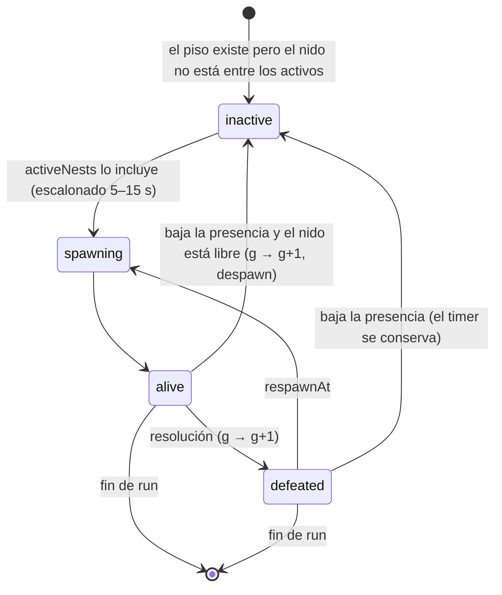

# CAVE ECOSYSTEM-1 — Nidos, respawn, tokens elementales y gacha

> Rama `design/cave-ecosystem-0.3`, base `2652a58`. Sólo diseño: no hay código, SQL ni balance productivo.
> Etiquetas: **FACT**, **INFERENCE**, **OPEN QUESTION**. Auditoría de partida: `SHARED_DUNGEON_ARCHITECTURE.md` §1.
> Todos los números de este documento son **parámetros de playtest**, no economía aprobada. §7 los simula con un script reproducible.

---

## 0. Resumen

- **Ejemplar ≠ Pokémon único.** Lo que aparece en un nido es un *ejemplar de encuentro* de una especie, no el Pokémon ownable (`slots`). Sin esta separación no puede existir el respawn por familias. Es la decisión **D-EC1**.
- **Nidos autoritativos.** Cada nido tiene id estable, familia, miembros por piso, peso, tope simultáneo, hogar y patrulla, estado, tiempos y **generación**. El miembro que reaparece se sortea con CSPRNG en el servidor, dentro de la familia y según el piso.
- **Respawn híbrido.** Temporizador individual por nido, cantidad de nidos activos según la presencia en el piso, suspensión sin jugadores y reset por run (Dungeon) o rotación horaria de la tabla de miembros (cueva permanente).
- **Tokens elementales.** Una moneda por cada uno de los 18 tipos, en una tabla propia con ledger. **Nunca** es `profiles.tokens`. Al derrotar un ejemplar, 1–3 tokens del tipo primario (+1 desde el piso 4) y un 25 % de probabilidad de 1 token del secundario. Intransferibles.
- **Gacha recomendado: "Huevo de hábitat".** Huevo temático por tipo de cueva, con probabilidades publicadas y pity. **Bloqueado** por la unicidad de especies: la simulación muestra que un banner de tipo que entrega especies únicas se agota en 0,1–4,5 días (§7.3).

---

## 1. Ejemplar de encuentro vs. Pokémon único (D-EC1)

**Hechos:**

- Cada especie es un único Pokémon con, a lo sumo, un dueño (`slots.pokemon_id`, INV-OWN-1, `docs/INVARIANTS.md:74`).
- El salvaje de superficie **es** esa entidad: id `wild:<área>:<época>:<pokemonId>`, excluida si tiene dueño (`wildPopulation.js:64-77,151`; `wildService.js:96`).

Un nido con respawn necesita el mismo tipo de Pokémon una y otra vez.

| Opción | Qué implica | Problema |
| --- | --- | --- |
| **A. Unicidad global** (cada especie a lo sumo una vez en todo el mundo a la vez) | Un servicio global asigna especies a superficie, cuevas y runs. | Con 30 jugadores y pools de ~15 especies por cueva, los nidos quedan vacíos. Choca con el roster horario de superficie, que puede tomar la misma especie. Además, derrotar al "Geodude único" una y otra vez no tiene sentido. |
| **B. Sólo especies sin dueño** | Los nidos filtran `ownedIds`, como la superficie. | A medida que la gente posee especies, las cuevas se vacían y las familias se rompen (Geodude con dueño → el nido de la familia pierde su base). |
| **C. Ejemplares de encuentro** *(recomendada)* | Un ejemplar es un encuentro de combate de una especie, sin identidad de propiedad. Puede haber varios en el tiempo y, con tope, a la vez. La propiedad sigue siendo global y única. Una **captura** futura tendrá que resolverse contra `slots` (y sólo si la especie no tiene dueño) o contra el modelo de instancias R32 si llega. | Hay que comunicar la diferencia en el producto ("Geodude salvaje" en cueva vs. "el Geodude de la plaza"). |

**Recomendación: C.**

- La unicidad protege la *propiedad*; no hace falta que proteja los *encuentros*.
- La captura queda fuera de alcance y se decide con su propio diseño (D-CB2).
- Hasta entonces, los ejemplares de cueva **no son capturables**, y el `pokemonId` de un ejemplar **nunca** se usa como id de propiedad.

---

## 2. Nidos

### 2.1 Campos

| Campo | Tipo | Origen | Público |
| --- | --- | --- | --- |
| `nestId` | `f<n>-nest<i>` (Dungeon) o `v-nest<i>` (vestíbulo) | generador puro o `CAVE_LAYOUTS` | ✓ |
| `scopeId` | `runId` o `caveId` | servidor | ✓ |
| `familyId` | id autorado de `caveFamilies.js` (hueco H1 de `CAVE_TYPES_AND_FAMILIES.md`) | definición | ✓ |
| `members` | `[{ speciesId, floors: [a,b], weight }]` según el piso | definición | ✓ (la **tabla**, no la próxima tirada) |
| `weight` | peso del nido dentro del pool del piso | definición | ✓ |
| `maxAlive` | tope de ejemplares simultáneos: 1 (v1); 2 sólo para "colonias" chicas (Zubat) en cámaras | definición | ✓ |
| `home` | casilla hogar | generador o layout, validada por guarda (§2.3) | ✓ |
| `homeRadius` | correa de patrulla: 2 (cámara) o 1 (nicho) | definición | ✓ |
| `patrol` | `buildPatrol({ key: encounterId, home, walkable, speed })` (`patrol.js:34`) | derivado, público por diseño | ✓ |
| `state` | `spawning \| alive \| reserved \| in_combat \| resolving \| defeated \| despawned` | servidor | ✓ (`spawning` y `defeated` se muestran como "reapareciendo") |
| `speciesId` | miembro actual | sorteo CSPRNG al aparecer | ✓ sólo desde `alive` |
| `spawnedAt`, `despawnedAt` | reloj del servidor | servidor | `spawnedAt` ✓ |
| `respawnAt` | reloj del servidor | servidor | **✗** (sólo "reapareciendo") |
| `generation` | entero monótono por nido: sube en cada resolución o despawn | Postgres (`dungeon_nests`) | ✓ (parte de `encounterId`) |
| Sorteo autoritativo | CSPRNG del servidor al pasar a `spawning → alive` (miembro, shiny cosmético) | servidor | ✗ (sólo el resultado) |

Sobre la "semilla autoritativa" del nido:

- No hay una semilla por nido que prediga el futuro. Cada aparición es **un sorteo nuevo** del CSPRNG del servidor (`battle/authority/seed.ts:35`), igual que las acciones de PROB-2.
- Lo único derivable y público es la patrulla, que depende de `encounterId`, así que cambia con cada generación.

### 2.2 Generación y ABA

Cada intent de combate lleva un `encounterId`, y en él va la `generation`. Sin generación, un `engage` retrasado del ejemplar anterior podría caer sobre el nuevo (problema ABA). Con ella, el servidor lo rechaza como `gone`. En Postgres, `dungeon_resolve_encounter` hace CAS contra `generation` (`SHARED_DUNGEON_ARCHITECTURE.md` §6.2), igual que el token de generación de YIELD-2 (`world/multi-yield-recovery-0.3:…/20260928120000_world_multi_yield.sql:15,49-55`).

### 2.3 Dónde **no** puede haber un hogar ni pasar una patrulla

Se verifica con una guarda derivada del layout, como `caves.test.js` hace con `CAVES`:

| Casilla prohibida | Radio |
| --- | --- |
| Portales (entrada, salida, puerta de Dungeon) | 2 |
| Escaleras | 2 |
| Llegadas | 3 |
| Pasillos estrechos (`openWidth < 3`, `tileKinds.ts:92`) | 0 (ninguna casilla del pasillo) |
| Obstáculos y su casilla de acercamiento | 1 |
| Nodos de recurso, sus stands y esperas (`workPlacement`) | 1 |
| Casillas de interacción (altar, sello, palanca) y de espera | 1 |
| Bocas de recoveco (`obstacles.ts` `alcove.mouth`) | 1 |
| Tamaño L/XL | hogar sólo donde `openWidth ≥ 5`, dentro de una cámara ≥ 9 (`MIN_CHAMBER`, `tileKinds.ts:39`) |

La patrulla usa un `walkable` que excluye todo lo anterior, igual que `sharedPopulace.walkable` excluye la reserva de la cueva en superficie (`game.ts:163-165`). Como las patrullas **no bloquean** al jugador (`rules.occupied` las ignora, CAVES-1 §2), la regla es visual y de legibilidad, no de colisión.

---

## 3. Spawn y respawn

### 3.1 Reglas

| Pregunta | Regla recomendada |
| --- | --- |
| ¿Cuándo reaparece? | `respawnAt = defeatedAt + cooldown(etapa) × (1 ± 0,2 CSPRNG)`, con cooldown de 60 s (etapa 1), 90 s (etapa 2) y 120 s (etapa 3). Los nidos "raros" (peso ≤ 6: Dunsparce, Onix, Lunatone/Solrock, Sableye, Mawile) usan **300 s**. |
| ¿La misma especie? | **No necesariamente:** se vuelve a sortear entre los `members` válidos del piso, con sus pesos. La familia se conserva; la etapa depende del piso. |
| ¿Qué cambia al profundizar? | La distribución de etapas (ver pools en `CAVE_TYPES_AND_FAMILIES.md` §6), +1 token desde el piso 4 (§5) y los nidos de tamaño L/XL. El cooldown **no** baja con la profundidad. |
| Límite de población | Por nido: `maxAlive` (1). Por área: `activeNests = min(12, 4 + ⌈jugadores_en_el_área / 2⌉)`, eligiendo entre los nidos del piso por peso, de forma estable durante la activación. Por run: 6 áreas × 12 = 72 ejemplares como máximo. |
| Camping | (1) El cooldown no se acorta con jugadores presentes. (2) `respawnAt` no se publica. (3) Rendimiento decreciente **por jugador y nido**: desde la 7.ª derrota elegible del mismo nido en 30 min, los tokens de ese nido rinden 50 % (las llaves no se afectan). (4) Los nidos raros tienen 300 s. (5) El tope diario blando (§5.4). |
| Sin jugadores | El área pasa a `dormant` a los 5 min (`SHARED_DUNGEON_ARCHITECTURE.md` §3.2): no se simulan patrullas ni timers. Al reactivarse, cada nido aparece escalonado entre 5 y 15 s para que el piso no "florezca" de golpe. |
| Limpieza | Filas de `dungeon_nests` con `scope = runId` de runs terminadas: se borran a las 24 h. `encounter_resolutions`: se retienen 30 días. El ledger de tokens nunca se borra. |
| Reinicio del servidor | Se cargan los nidos persistidos (`generation`, `state`, `respawnAt`). Un nido `alive`, `reserved` o `in_combat` en memoria se pierde **sin pago** y reaparece con la misma generación y un miembro nuevo. Nada resucita lo ya derrotado: la derrota es un commit. |
| Paridad entre instancias | Lease de la run + CAS por generación: una instancia vieja no paga (`SHARED_DUNGEON_ARCHITECTURE.md` §2.5). |
| Entrada tardía | El snapshot trae los ejemplares vivos (especie, patrulla) y los nidos en respawn como "reapareciendo", sin tiempo. |

### 3.2 Comparación de estrategias

| Estrategia | Ventajas | Desventajas | Veredicto |
| --- | --- | --- | --- |
| **Temporizador individual** por nido | Justa, legible ("éste volvió"); carga pareja | Sin techo ante muchos jugadores; invita a acampar un nido | Base del híbrido |
| **Oleadas** (el piso se repuebla entero cada X min) | Momentos sociales ("¡salió la oleada!"); fácil de balancear | Picos de carga y de mensajes; tiempos muertos entre oleadas; premia llegar justo al inicio | No |
| **Rotación horaria actual** (`wildPopulation.js:21-22`) | Ya existe, cero estado | No hay derrota ni respawn: no sirve para combate | Sólo como tabla de **qué miembros** ofrece el vestíbulo en cada hora |
| **Híbrido** *(recomendado)* | Individual + nidos activos según presencia + suspensión sin jugadores + reset por run (Dungeon) o rotación horaria de miembros (vestíbulo) | Más parámetros | **Sí** |

### 3.3 Máquina de estado del nido

Es la del encuentro (`SHARED_DUNGEON_ARCHITECTURE.md` §3.4), más la activación por presencia:



Un nido `reserved`, `in_combat` o `resolving` **nunca** se desactiva: se espera a que termine.

---

## 4. Pacing y carga (10/30/100 jugadores)

Modelo (script `load.mjs`, §7.5):

- 6 áreas (vestíbulo + 5 pisos de `caliza-d1`), jugadores repartidos de forma uniforme;
- `activeNests = min(12, 4 + ⌈p/2⌉)`;
- ciclo de nido = respawn 75 s + combate 40 s;
- cada jugador busca 30 derrotas elegibles por hora;
- 5 cambios públicos por derrota.

| Jugadores | Por área | Nidos activos | Capacidad (derrotas/h/área) | Derrotas/h/área | Elegibles por derrota | Derrotas elegibles/jugador/h | Commits a Postgres | Filas de ledger | Deltas públicos |
| --- | --- | --- | --- | --- | --- | --- | --- | --- | --- |
| 10 | 1,7 | 5 | 156,5 | 50 | 1,0 | 30 | 0,1/s | 0,1/s | 0,7 msg/s |
| 30 | 5 | 7 | 219,1 | 150 | 1,0 | 30 | 0,3/s | 0,3/s | 6,3 msg/s |
| 100 | 16,7 | 12 | 375,7 | 375,7 | 1,3 | 30 | 0,6/s | 1,0/s | 52,2 msg/s |

**Lectura.**

- A **100 jugadores** la oferta se satura (12 nidos por área) y el ritmo personal se sostiene porque se comparten derrotas (1,3 elegibles por derrota): la cooperación absorbe la escasez.
- La carga sobre Postgres (≤ 1 fila/s de ledger) y sobre el socket (~52 deltas/s repartidos entre 6 áreas) es menor que la de presencia. **No** es el cuello de botella.
- El límite real sigue siendo la sala única de 100 conexiones (`capacity.js:1`).

**Riesgos.**

1. Con más de 16 jugadores por área, los nidos saturados alargan la espera y crecen los conflictos por `engage`. Se mitiga con la unión a combates (hasta 4).
2. Si toda la población se concentra en un piso, `activeNests` topea en 12 y la espera crece. Una opción es que la cueva distribuya la entrada (el piso 1 es el único punto de entrada; hace falta bajar).
3. `encounter:action` de COMBAT-1 va a dominar el tráfico. Hay que medirlo en su fase.

---

## 5. Tokens elementales

### 5.1 Catálogo

**Hechos del catálogo local (`core.json`, formas por defecto de 493 especies):**

- 18 tipos;
- 235 especies de doble tipo;
- ninguna especie tiene `flying` como tipo primario (64 lo tienen como secundario);
- `dragon` es primario en 13 especies, y la mayoría son líneas pseudo-legendarias o legendarias excluidas.

| Opción | Pros | Contras |
| --- | --- | --- |
| **18 tokens, uno por tipo** *(recomendada)* | Ids estables que calzan con la tabla de tipos, sin mapeos; cada banner o huevo pide "su" tipo | Algunos tipos son escasos o inalcanzables al principio (`flying`, `dragon`, `ice`, `fire`) |
| 6 grupos (tierra-roca, agua-hielo, fuego, planta-bicho, mente-fantasma, metal-eléctrico…) | Menos monedas en la UI | Agrupaciones arbitrarias; ids inestables si el grupo cambia; mala lectura para doble tipo |

**Ids y nombres visibles.** Id = nombre del tipo del catálogo (`rock`, `ground`…), con un CHECK de las 18 en la tabla. Nombre visible:

- **"Esencia de <Tipo>"** con los nombres en español que el repo ya usa (`TYPE_ALIASES`, `wildPopulation.js:79-84`): Roca, Tierra, Veneno, Volador, Acero, Hada, Psíquico, Siniestro, Fantasma, Normal, Bicho, Planta, Agua, Hielo, Fuego, Eléctrico, Lucha, Dragón.
- **OPEN QUESTION D-TK1:** el producto los llama "tokens", pero "Tokens" ya es `profiles.tokens` en la UI y en el mercado. Se recomienda **"Esencias"** como nombre visible para que nadie confunda las dos monedas. Internamente: `elemental_token`.

### 5.2 Drops

| Regla | Valor v1 | Motivo |
| --- | --- | --- |
| Token primario, garantizado | Etapa 1 → 1; etapa 2 → 2; etapa 3 → 3 | Proporcional al esfuerzo, sin exponenciales |
| Bonus de profundidad | +1 desde el piso 4 | Aditivo, nunca multiplicativo |
| Token secundario (doble tipo) | 25 % de 1 token | Da acceso a `flying`, `ground`, `psychic`… sin duplicar el primario |
| Rareza del nido | **No** suma tokens | Evita acampar los raros (Dunsparce, Onix, Sableye) |
| Shiny | Cosmético, **no** suma | Idem |
| Bonus por contribución | **Ninguno** en v1: todos los elegibles reciben lo mismo | Un bonus al mayor contribuyente reintroduce la competencia que la elegibilidad quiere evitar. Un bonus por cooperación incentiva la multicuenta. Revisar con telemetría. |
| Vestíbulo permanente | Misma fórmula, piso 0 (sin bonus) | Siempre disponible: el tope diario lo acota |
| Decisión | 100 % servidor (CSPRNG en la resolución) | AGENTS §11 |

**Tipos sin fuente en las cuevas v1.**

- `dragon` no aparece en ningún pool, a propósito: sus familias válidas son pocas y casi todas pseudo o legendarias. Queda para zonas futuras y **no** debe tener banner hasta tener fuente.
- `fire`, `ice`, `water`, `grass`, `electric` y `fairy` salen de `volcanica`, `glacial`, `humeda`, `mina` y `cristalina` a medida que se abren.
- La conversión con pérdida (§5.6) evita que un tipo quede inalcanzable.

### 5.3 Liquidación y dedupe

Los tokens se escriben **dentro** de `dungeon_resolve_encounter` (`SHARED_DUNGEON_ARCHITECTURE.md` §6.2), en la misma transacción que la derrota:

```text
elemental_token_ledger(
  entry_id     uuid PK,
  user_id      uuid NOT NULL,
  token_type   text NOT NULL CHECK (token_type IN (<los 18 tipos>)),
  delta        integer NOT NULL CHECK (delta <> 0 AND abs(delta) <= 1000),
  reason       text NOT NULL CHECK (reason IN ('defeat','gacha_pull','conversion','admin_adjust')),
  source_id    text NOT NULL,          -- encounterId, pullId, conversionId
  rules_version text NOT NULL,
  created_at   timestamptz NOT NULL DEFAULT now(),
  UNIQUE (source_id, user_id, token_type)   -- un mismo jugador no cobra dos veces la misma derrota
)
elemental_token_balances(user_id, token_type, balance integer NOT NULL CHECK (balance >= 0), PK(user_id, token_type))
```

- Crédito: `INSERT … ON CONFLICT (source_id, user_id, token_type) DO NOTHING`; sólo si insertó, `balance += delta`.
- Débito (gacha, conversión): `UPDATE … SET balance = balance − cost WHERE balance >= cost` en la misma transacción que el resultado. Es el patrón de `spend_tokens_learn_move` (`20260907_005_token_economy_rpcs.sql:100`), pero con dedupe por `source_id`.
- RLS: `SELECT` de las filas propias para `authenticated`. Sin `INSERT`, `UPDATE` ni `DELETE` de cliente. Funciones sólo `service_role`.

### 5.4 Límites diarios

- **Tope blando por cuenta:** 300 tokens por día (UTC) a tasa completa y 50 % a partir de ahí (escenario "media", §7).
- Se mide en el ledger (suma de `delta > 0` de `reason = 'defeat'` del día) dentro de la resolución. Sin tope duro: nadie juega "gratis", pero la curva se aplana.
- Es independiente del tope de 3 000 `profiles.tokens` de la Dungeon legacy (`20260908_010_dungeon_reward.sql:29`), que es otra moneda.

### 5.5 Visualización

| Dónde | Qué |
| --- | --- |
| Al resolver (privado) | Toast "+2 Esencia de Roca" y, si aplica, "+1 Esencia de Tierra". Viene de `dungeon:self` / `dungeon:result`, nunca de un cálculo del cliente. |
| Inventario | Panel "Esencias": 18 contadores y los tipos en 0 atenuados. Fuente: `player:state` extendido. |
| Público | Nada: otros jugadores no ven saldos ni drops ajenos. |

### 5.6 Intercambio y sumideros

| Regla | Recomendación |
| --- | --- |
| Intercambio entre jugadores | **No**, ni en el mercado. Intransferibles: sin RMT, sin concentrar multicuentas, sin interacción con `profiles.tokens`. |
| Convertir a `profiles.tokens` | **Nunca**. |
| Sumidero principal | Gacha (§6). |
| Sumidero de nivelación | Conversión con pérdida **5 : 1** entre tipos (5 de cualquier tipo → 1 de otro), con un tope de 20 conversiones por día. Es un sumidero neto y resuelve los tipos escasos. |
| Sumideros futuros | Consumibles de Dungeon, cosméticos. Fuera de alcance: no se diseñan acá. |

---

## 6. Futuro gacha de Ciudad (sólo contrato y economía preliminar)

### 6.1 Contrato

| Requisito | Cómo se cumple |
| --- | --- |
| Sólo tokens ganados jugando | El único débito aceptado es `elemental_token_balances`. No hay SKU, precio en dinero, checkout ni webhook. `create-checkout` sigue desactivado (`create-checkout/index.ts:1,20`). |
| Sin dinero real | Ningún camino compra Esencias. Las Esencias son intransferibles y el gacha no acepta `profiles.tokens`. |
| Separado del mercado | Otra Edge Function (`city-gacha`) y otras tablas. El mercado no lee Esencias. Si un Pokémon del gacha se puede vender se decide aparte (D-GA3): si es vendible, las Esencias se convierten indirectamente en `profiles.tokens`. |
| Probabilidades visibles | Cada huevo publica su tabla (tier → probabilidad, especies posibles **en ese momento**, pity). La tabla es la del servidor, versionada (`rules_version`). |
| Protección contra mala suerte | Pity duro por huevo y usuario, persistido. Se evaluó conservar el contador al rotar de huevo, pero es un escalón de diseño: ver §6.4. |
| Propiedad y unicidad | La tirada sólo sortea entre especies **sin dueño** (`slots.owner_id IS NULL`, no bloqueadas, no excluidas) del pool. Se lee **bajo lock** en la misma transacción que asigna el dueño. |
| Sin duplicados imposibles | El `UPDATE slots SET owner_id = $user WHERE pokemon_id = $x AND owner_id IS NULL` es la condición de éxito (CAS). Si no afecta filas, se re-sortea dentro de la transacción. |
| Resultado con dueño | No puede pasar por construcción: el candidato se valida bajo lock. Si el pool del tier se vacía, la tirada baja al tier inferior. Si **todo** el huevo se vacía, el huevo se muestra "agotado" y no acepta tiradas: **nunca** se cobra una tirada sin resultado. |
| Server-side y exactly-once | `pullId` = idempotencia enviada por el cliente (UUID) + `user_id`. En una transacción: dedupe `pullId` → débito → pity → sorteo CSPRNG → CAS de `slots` → ledger (`reason = 'gacha_pull'`, `source_id = pullId`) → `gacha_pulls`. Un reintento devuelve el resultado guardado. |
| No se implementa ahora | GACHA-1 es auditoría y decisión (`CAVE_ECOSYSTEM_ROADMAP.md`). |

### 6.2 Comparación de formatos

| Formato | Qué es | Tema PokeSwap | Complejidad | Riesgo |
| --- | --- | --- | --- | --- |
| **Banner por tipo** | "Banner Roca": cuesta Esencias de Roca y sortea especies de tipo roca | Débil: genérico, de juego de móvil | Baja | Los banners con muchos tipos poseídos se vacían. `flying` y `dragon` no tienen fuente. |
| **Huevo por tipo** | Huevo "de Roca" que eclosiona tras un breve tiempo en la Ciudad | Medio | Baja + temporizador cosmético | Mismo problema de agotamiento |
| **Convocatoria por hábitat — "Huevo de hábitat"** *(recomendado)* | Un huevo por **tipo de cueva** (`Huevo de Caliza`, `Huevo de Mina`, `Huevo Cristalino`…). Cuesta una mezcla de las Esencias que da esa cueva (p. ej. Caliza: 60 Roca + 20 Tierra) y sortea entre las **familias de esa cueva** (formas base; intermedias como tier raro). | **Fuerte**: cierra el ciclo cueva → Esencias de la cueva → huevo de la cueva → Pokémon de la cueva. El huevo se entrega en un "Criadero" de Ciudad. | Media | El agotamiento sigue, pero los pools son curados y chicos, así que la escasez es explícita y comunicable. |
| **Elección entre siluetas** | Se muestran 3 siluetas y el jugador elige una | Divertido y con agencia | Alta: hay que reservar 3 especies únicas durante la elección | Reservar especies únicas mientras alguien decide bloquea a los demás. Con unicidad global es mala idea. |

**Recomendación: "Huevo de hábitat".**

- Es temático: la cueva es la fuente de Esencias y de familias.
- Reutiliza los pools de `CAVE_TYPES_AND_FAMILIES.md` §6.
- Pide 2–3 tipos de Esencia, lo que da sentido a los secundarios.
- La eclosión con tiempo es presentación: el resultado ya se decidió y se asignó en el servidor al pagar.

### 6.3 Tiers del huevo (propuesta)

| Tier | Qué sale | Probabilidad (escenario "media") |
| --- | --- | --- |
| Común | Forma base de una familia de la cueva (sin dueño) | 97 % |
| Raro | Forma intermedia de una familia de la cueva, o un "raro de la cueva" (Dunsparce, Onix, Sableye…) | 3 % (pity duro a las 35 tiradas) |
| — | Finales, legendarios, pseudos, starters, fósiles | **0 %**: nunca en huevos de cueva |

### 6.4 Pity

- Contador por (usuario, huevo) en `gacha_pity`. Sube en cada tirada sin raro y vuelve a 0 al obtenerlo. La tirada N-ésima sin raro lo garantiza.
- Si un huevo rota o se agota, el contador **se conserva** para ese huevo. Si se retira para siempre, se transfiere al huevo del mismo tipo de cueva que lo reemplace (OPEN QUESTION D-GA2).

---

## 7. Economía simulada

### 7.1 Supuestos y fórmulas

**Producción.** Por derrota elegible (reglas de §5.2):

```text
primario(pool) = Σ_etapa share_etapa × base_etapa   +   media_pisos(bonus_profundidad)
                 base = [1, 2, 3]                        bonus = 1 si piso ≥ 4, si no 0
secundario(pool) = share_doble_tipo × 0,25
```

| Pool (arquetipo que lo juega) | Mezcla de etapas (1/2/3) | Pisos | Doble tipo | Foco* |
| --- | --- | --- | --- | --- |
| inicial (casual) | 80 / 20 / 0 | 1–3 | 45 % | 50 % |
| intermedia (activo) | 50 / 40 / 10 | 1–5 | 55 % | 55 % |
| avanzada (avanzado) | 30 / 45 / 25 | 1–8 | 60 % | 60 % |

\* **Foco:** share de los tokens primarios que es del tipo que el jugador persigue (p. ej. Roca en `caliza`: 37 %; con la mezcla del huevo de hábitat, ~50 %).

**Consumo por arquetipo:**

- casual: 18 derrotas/h, 1 h/día;
- activo: 30 derrotas/h, 2 h/día;
- avanzado: 40 derrotas/h, 4 h/día.

Estas cifras son consistentes con la capacidad de §4.

**Tope blando:** tasa completa hasta `softCap`/día y 50 % después.

**Pity:**

```text
E[tiradas hasta raro] = Σ_{n=1..pity} n × P(n)
P(n) = (1−p)^(n−1) × p        para n < pity
P(pity) = (1−p)^(pity−1)
```

### 7.2 Resultados

| Economía | Costo por tirada | Pity | p(raro) | Tope blando | E[tiradas hasta raro] |
| --- | --- | --- | --- | --- | --- |
| **Accesible** | 40 | 25 | 5 % | 400/día | 14,5 |
| **Media** | 80 | 35 | 3 % | 300/día | 21,9 |
| **Lenta** | 150 | 50 | 2 % | 250/día | 31,8 |

| Economía | Arquetipo | Tokens/h | Del foco/h | Pagados/día | Del foco/día | Horas hasta 1 tirada | Días hasta 1 tirada | Días hasta pity | Tiradas/día |
| --- | --- | --- | --- | --- | --- | --- | --- | --- | --- |
| Accesible | casual | 23,6 | 10,8 | 23,6 | 10,8 | 3,7 | 3,7 | 92,6 | 0,3 |
| Accesible | activo | 64,1 | 33,0 | 128,3 | 66,0 | 1,2 | 0,6 | 15,2 | 1,7 |
| Accesible | avanzado | 109,0 | 61,8 | 418,0 | 237,0 | 0,6 | 0,2 | 4,2 | 5,9 |
| Media | casual | 23,6 | 10,8 | 23,6 | 10,8 | 7,4 | 7,4 | 259,3 | 0,1 |
| Media | activo | 64,1 | 33,0 | 128,3 | 66,0 | 2,4 | 1,2 | 42,4 | 0,8 |
| Media | avanzado | 109,0 | 61,8 | 368,0 | 208,6 | 1,3 | 0,4 | 13,4 | 2,6 |
| Lenta | casual | 23,6 | 10,8 | 23,6 | 10,8 | 13,9 | 13,9 | 694,4 | 0,1 |
| Lenta | activo | 64,1 | 33,0 | 128,3 | 66,0 | 4,5 | 2,3 | 113,6 | 0,4 |
| Lenta | avanzado | 109,0 | 61,8 | 343,0 | 194,5 | 2,4 | 0,8 | 38,6 | 1,3 |

**Lectura.**

- **Accesible:** un jugador activo tira casi 2 veces por día y un avanzado, 6. La economía de Esencias no se "infla" (no hay mercado ni precio), pero el **ritmo de adjudicación de especies** es altísimo (§7.3).
- **Media:** el activo tira ~1 vez por día y el avanzado ~2,6. El casual llega a una tirada por semana, y el pity le queda fuera de alcance (259 días). Aceptable **sólo** si el casual tiene otros objetivos (Pokédex de ejemplares derrotados, cosméticos).
- **Lenta:** el casual casi no participa (una tirada cada dos semanas). Frustrante.
- **Jugadores avanzados:** el tope blando les recorta 4 % en accesible, 16 % en media y 21 % en lenta (de 436 tokens brutos por día). La diferencia con el casual es de ~19× en tiradas por día en media (208,6 contra 10,8 tokens del foco por día). Bajar el tope achica esa brecha, pero castiga al activo. Se recomienda tope blando de 300 y rendimiento decreciente por nido (§3.1).
- **Sumideros:** el gacha y la conversión 5:1. Sin mercado, el saldo acumulado no pierde valor: el riesgo de "inflación" es una **acumulación** que se descarga de golpe cuando abre un huevo nuevo. Se mitiga con un tope de tiradas por día por huevo (p. ej. 10).

### 7.3 Presión de oferta (el hallazgo principal)

Con especies únicas, cada tirada común **consume** una especie del mundo. Tiradas por día (promedio de los tres arquetipos × jugadores) y días hasta agotar un pool de 27 especies (las de tipo primario Roca en todo el catálogo, dato FACT):

| Economía | 10 jugadores | 30 jugadores | 100 jugadores |
| --- | --- | --- | --- |
| Accesible | 26,1/día → **1,0 días** | 78,4/día → **0,3 días** | 261,5/día → **0,1 días** |
| Media | 11,9/día → **2,3 días** | 35,7/día → **0,8 días** | 118,9/día → **0,2 días** |
| Lenta | 6,0/día → **4,5 días** | 18,1/día → **1,5 días** | 60,3/día → **0,4 días** |

Un huevo de hábitat es todavía más chico: `caliza` tiene 8 familias y 15 especies en su pool.

**Conclusión:** mientras cada especie tenga un único dueño, **ninguna** economía conservadora sostiene un gacha que entregue especies. Hay tres salidas (decisión **D-GA1**, bloqueante para GACHA-1):

1. **Esperar al modelo de instancias** (R32, `docs/wildlands/POKEMON_SPECIES_INSTANCE_MODEL.md`). Si una especie puede tener varios individuos, el gacha entrega una **instancia** y no hay agotamiento. Es la opción recomendada si R32 está en el roadmap de producto.
2. **Stock global por huevo:** por ejemplo, una reposición de 5 especies por semana, con cola. La escasez es real y visible y el gacha pasa a ser un evento. Convierte las Esencias en fichas de una lotería con cupo.
3. **Premio no-Pokémon:** el gacha entrega cosméticos, ítems de Dungeon o "Ecos" (un Pokédex de ejemplares). Los Pokémon únicos siguen saliendo sólo de las vías actuales.

### 7.4 Recomendación económica preliminar

- Playtest con **"media"**, tope blando de 300, conversión 5:1 y rendimiento decreciente por nido.
- **Sin** gacha hasta resolver D-GA1: DROPS-1 puede lanzarse sin gacha. Las Esencias se acumulan y se muestran, y el playtest mide la producción real.
- Recalibrar con telemetría: derrotas elegibles por hora y por arquetipo, distribución del foco, efecto del tope.
- No fijar la economía final sin esa medición.

### 7.5 Scripts reproducibles

Los dos scripts son deterministas (sin azar) y se ejecutan con `node <archivo>.mjs` en Node ≥ 18. Las cifras de §4 y §7.2–§7.3 son su salida literal, redondeada a un decimal.

`econ.mjs`:

```js
const STAGE_BASE = [1, 2, 3]
const depthBonus = floor => (floor >= 4 ? 1 : 0)
const SECONDARY_CHANCE = 0.25
const POOLS = {
  inicial:    { stages: [0.8, 0.2, 0.0], floors: [1, 2, 3], dual: 0.45, focus: 0.50 },
  intermedia: { stages: [0.5, 0.4, 0.1], floors: [1, 2, 3, 4, 5], dual: 0.55, focus: 0.55 },
  avanzada:   { stages: [0.3, 0.45, 0.25], floors: [1, 2, 3, 4, 5, 6, 7, 8], dual: 0.60, focus: 0.60 },
}
const ARCHETYPES = {
  casual:   { perHour: 18, hours: 1, pool: 'inicial' },
  activo:   { perHour: 30, hours: 2, pool: 'intermedia' },
  avanzado: { perHour: 40, hours: 4, pool: 'avanzada' },
}
const ECONOMIES = {
  accesible: { pullCost: 40,  pity: 25, rare: 0.05, softCap: 400 },
  media:     { pullCost: 80,  pity: 35, rare: 0.03, softCap: 300 },
  lenta:     { pullCost: 150, pity: 50, rare: 0.02, softCap: 250 },
}
function perDefeat(pool) {
  const p = POOLS[pool]
  const stage = p.stages.reduce((s, share, i) => s + share * STAGE_BASE[i], 0)
  const depth = p.floors.reduce((s, f) => s + depthBonus(f), 0) / p.floors.length
  return { primary: stage + depth, secondary: p.dual * SECONDARY_CHANCE }
}
function day(arch, eco) {
  const a = ARCHETYPES[arch], e = ECONOMIES[eco], d = perDefeat(a.pool), p = POOLS[a.pool]
  const rawPerHour = a.perHour * (d.primary + d.secondary)
  const raw = rawPerHour * a.hours
  const paid = Math.min(raw, e.softCap) + Math.max(0, raw - e.softCap) * 0.5
  const focusPerHour = a.perHour * d.primary * p.focus
  const focusDay = paid * (d.primary * p.focus) / (d.primary + d.secondary)
  return { rawPerHour, focusPerHour, paid, focusDay, hoursToPull: e.pullCost / focusPerHour, daysToPull: e.pullCost / focusDay }
}
function expectedPullsToRare(rare, pity) {
  let e = 0, miss = 1
  for (let n = 1; n <= pity; n++) { const hit = n === pity ? 1 : rare; e += n * miss * hit; miss *= 1 - hit }
  return e
}
const r = x => Math.round(x * 10) / 10
for (const eco of Object.keys(ECONOMIES)) {
  const e = ECONOMIES[eco]
  console.log(eco, 'E[tiradas hasta raro] =', r(expectedPullsToRare(e.rare, e.pity)))
  for (const arch of Object.keys(ARCHETYPES)) {
    const x = day(arch, eco)
    console.log(arch, r(x.rawPerHour), r(x.focusPerHour), r(x.paid), r(x.focusDay), r(x.hoursToPull), r(x.daysToPull), r(x.daysToPull * e.pity), r(x.focusDay / e.pullCost))
  }
  for (const players of [10, 30, 100]) {
    const perDay = ['casual', 'activo', 'avanzado'].reduce((s, a) => s + day(a, eco).focusDay / e.pullCost, 0) / 3 * players
    console.log('oferta', players, r(perDay), 'tiradas/día → pool de 27 agotado en', r(27 / perDay), 'días')
  }
}
```

`load.mjs`:

```js
const AREAS = 6, MAX_NESTS = 12, RESPAWN_S = 75, COMBAT_S = 40, WANT_PER_H = 30, CHANGES_PER_DEFEAT = 5
const activeNests = p => Math.min(MAX_NESTS, 4 + Math.ceil(p / 2))
const r = x => Math.round(x * 10) / 10
for (const P of [10, 30, 100]) {
  const p = P / AREAS, n = activeNests(p)
  const capacity = n * 3600 / (RESPAWN_S + COMBAT_S)
  const demandSolo = p * WANT_PER_H
  const defeats = Math.min(capacity, demandSolo)
  const share = Math.min(4, Math.max(1, demandSolo / capacity))
  console.log(P, r(p), n, r(capacity), r(defeats), r(share), r(defeats * share / p),
    r(defeats * AREAS / 3600), r(defeats * share * AREAS * 1.25 / 3600), r(defeats * CHANGES_PER_DEFEAT * p * AREAS / 3600))
}
```
