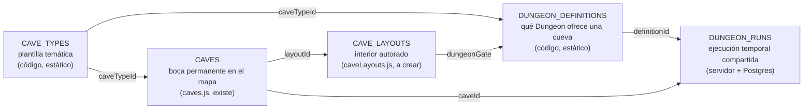

# CAVE ECOSYSTEM-1 — Tipos de cueva y familias de Pokémon

> Rama `design/cave-ecosystem-0.3`, base `2652a58`. Sólo diseño: no se modificó código, datos ni tests.
> Etiquetas: **FACT** (verificado en el repo), **INFERENCE** (deducido o conocimiento canónico que el repo no contiene), **OPEN QUESTION** (requiere decisión).
> Auditoría de partida: `SHARED_DUNGEON_ARCHITECTURE.md` §1.

---

## 0. Resumen

- **Cuatro conceptos, cuatro fuentes:**
  - `CAVE_TYPES` (plantilla temática);
  - `CAVES` (bocas permanentes, ya existe en `caves.js`);
  - `CAVE_LAYOUTS` (interiores autorados);
  - `DUNGEON_RUNS` (ejecución temporal compartida).

  Entre la plantilla y la run se agrega `DUNGEON_DEFINITIONS`, el concepto que el prototipo ya tiene (`dungeonSpawn.ts` `DungeonDefinition`).
- **Seis tipos recomendados** de diez evaluados: `caliza` (inicial), `mina` (fusiona la mina ferruginosa y la galería de carbón), `humeda` (absorbe la fúngica como cámaras), `volcanica`, `glacial` y `cristalina`. Quedan diferidos `ruinas` y `sima` (avanzada umbría). Los fósiles quedan para un evento especial.
- **Familias verificadas contra el catálogo local.** Ids, nombres, tipos y `catchRate` están comprobados contra `src/features/battle/catalog/generated/core.json` (493 especies, ORAS). El catálogo **no** tiene familias evolutivas, flags de legendario, mítico o pseudo, tamaño ni hábitat. Esos datos se marcan como huecos H1–H4 y requieren un archivo autorado con test.
- **Tres pools concretos:** cueva inicial (8 familias, sólo formas base e intermedias), intermedia (`mina`, 8 familias) y avanzada (`cristalina`, 8 familias).

---

## 1. Separación de conceptos

| Concepto | Qué es | Dónde vive | Quién lo cambia | Identidad |
| --- | --- | --- | --- | --- |
| `CAVE_TYPES` | La plantilla de un bioma subterráneo: paleta, luz, peligros, obstáculos, recursos, familias, rango de pisos y dificultad. No tiene coordenadas. | `services/realtime/src/world/caveTypes.js` (nuevo, sin dependencias, como `caves.js`) | Diseño, por PR | `caveTypeId` estable (`caliza`, `mina`…) |
| `CAVES` | Una boca concreta en un área anfitriona, con ancla, claro, interior y estado de entrada. | `services/realtime/src/world/caves.js` (FACT: `caves.js:71-80`), con un campo nuevo `caveTypeId` | Diseño, por PR, con guardas derivadas (CAVES-2) | `caveId` (`pradera-cueva-inicial`) |
| `CAVE_LAYOUTS` | El interior permanente de una cueva: casillas, portal de salida, llegada, nidos, puerta de Dungeon y obstáculos autorados permanentes. | `services/realtime/src/world/caveLayouts.js` (nuevo, propuesto en CAVES-1 §6.2) | Diseño, por PR | `layoutId` = `interiorAreaId` |
| `DUNGEON_DEFINITIONS` | Qué Dungeon ofrece una cueva: tier, cantidad de pisos, reglas de pool por piso, obstáculos por piso, regla de llave y calendario de runs. | `services/realtime/src/world/dungeonDefinitions.js` (nuevo) | Diseño, por PR | `definitionId` |
| `DUNGEON_RUNS` | Una ejecución: `runId`, semilla **secreta**, estado, reloj, pisos generados, obstáculos, nidos y jugadores. | Memoria del realtime + tabla `dungeon_runs` (§7 de `SHARED_DUNGEON_ARCHITECTURE.md`) | Sólo el servidor | `runId` (UUID de servidor) |

**Reglas de la separación:**

- Un `CAVE_TYPE` nunca conoce coordenadas.
- Una `CAVE` nunca conoce una run.
- Un `CAVE_LAYOUT` es permanente: la cueva caminable no se regenera. Los pisos de Dungeon sí se generan por run desde la semilla del servidor, con los generadores puros del prototipo (`floorPlan.ts`, `floorTiles.ts`).
- Nada de esto se deriva de una semilla del cliente ni del orden de montaje (lección de CAVES-1 §1.2).

---

## 2. Evaluación de los diez tipos candidatos

Criterios:

- **Identidad:** ¿se distingue a simple vista de los demás?
- **Profundidad de pool:** familias válidas en el catálogo local, sin excluidas.
- **Recursos:** ¿encaja con un nodo del catálogo de SKILLS?
- **Anfitrión:** ¿existe o existirá un área de presencia donde poner la boca?
- **Costo:** arte y sistemas nuevos.

| # | Candidato | Identidad | Familias válidas | Recursos del catálogo | Anfitrión | Veredicto |
| --- | --- | --- | --- | --- | --- | --- |
| 1 | Cueva inicial de roca/caliza | Media: la "cueva" por defecto | 8+ (Geodude, Zubat, Diglett, Bonsly, Sandshrew, Whismur, Paras, Dunsparce) | `stone_outcrop`, `coal_seam` (CAVES-1 §4.2) | Pradera `(-26,-74)` (FACT) | **Aprobar** como `caliza` |
| 2 | Mina ferruginosa | Alta: vigas, rieles, óxido | 7 (Aron, Nosepass, Magnemite, Machop, Makuhita, Onix, Geodude) | `iron_vein` (`habitat: 'cave'`, `resources.ts:105`) | Borde de `reserva-minerales` (CAVES-1 §7.3) | **Aprobar** fusionada con 3 como `mina` |
| 3 | Galería de carbón | Baja: se confunde con la mina | Las mismas que la mina: no hay fauna "de carbón" propia | `coal_seam` | Igual que la mina | **Fusionar** en `mina` (cámaras de carbón) |
| 4 | Caverna volcánica | Muy alta: lava, brillo rojo | 6 (Slugma, Numel, Torkoal, Houndour, Magby/Magmar, Geodude) | Ninguno propio hoy (obsidiana o azufre no existen) | Desierto, cuando tenga presencia | **Aprobar** (avanzada, fase posterior) |
| 5 | Gruta cristalina | Muy alta: cristales que emiten luz | 8 (Clefairy, Sableye, Mawile, Bronzor, Chingling, Lunatone, Solrock, Misdreavus) | `crystal_cluster` (`resources.ts:117`, D6 lo decidió como nodo) | `reserva-minerales` o Tundra | **Aprobar** (avanzada) |
| 6 | Caverna glacial | Muy alta: hielo, escarcha | 6 (Swinub, Snorunt, Spheal, Snover, Sneasel, Seel) | `iron_vein`/`gold_vein` en `icerock` (`resources.ts:105,111`) | Tundra, cuando tenga presencia | **Aprobar** (avanzada, fase posterior) |
| 7 | Cueva húmeda o salobre | Alta: agua, charcas, sal | 10+ (Wooper, Barboach, Slowpoke, Shellos, Krabby, Corphish, Tentacool, Shellder, Marill, Psyduck) | Ninguno propio; pesca futura (hoy no hay: `noFishing.test.js`) | Costa, o cámara húmeda de otra cueva | **Aprobar** como `humeda` (intermedia) |
| 8 | Cueva fúngica | Alta: hongos luminosos | 3–4 (Paras, Shroomish, Grimer, Budew/Roselia): pool corto | Ninguno | — | **Fusionar** como cámaras de `humeda` |
| 9 | Ruinas subterráneas | Muy alta: muros tallados | 8 (Unown, Baltoy, Natu, Cubone, Gastly, Duskull, Murkrow, Bronzor) | Ninguno | — | **Diferir**: pide narrativa (Unown) y arte de ruinas. Buena candidata a Dungeon especial. |
| 10 | Avanzada adecuada al catálogo: **sima umbría** (fantasma/siniestro, profunda). Se evaluó también un "cráter de meteorito", que se descartó porque su fauna emblemática (Beldum) es pseudo-legendaria y está excluida. | Alta | 7 (Sableye, Duskull, Misdreavus, Murkrow, Stunky, Skorupi, Houndour) | Ninguno | — | **Diferir** como `sima`: reserva para una Dungeon tier A/S |

**Recomendación:** seis tipos activos en el roadmap (`caliza`, `mina`, `humeda`, `volcanica`, `glacial`, `cristalina`). Sólo `caliza` entra en la primera implementación. Los otros cinco quedan especificados para no improvisarlos después.

---

## 3. Catálogo recomendado de `CAVE_TYPES`

Los pisos respetan la regla **aprobada** de 5–30 pisos por Dungeon (`src/features/dungeonPrototype/domain/tiers.ts:17`, "APPROVED"). Los rangos por tier de `TIER_CONFIG` son "PROTOTYPE ASSUMPTION" (`tiers.ts:31`) y no obligan.

### 3.1 `caliza` — Cueva inicial

| Campo | Propuesta |
| --- | --- |
| Identidad visual | Piedra gris-ocre, estratos horizontales, goteras, estalactitas cortas. Reutiliza el tono `stone` de `caveEntranceArt` y las texturas `cave` de `dungeonTerrain.ts`. |
| Bioma / terreno | Suelo de tierra y grava, pasillos ≥ 3, cámaras ≥ 9 (`MIN_CHAMBER`, `tileKinds.ts:39`). |
| Iluminación | Oscuridad media (`DUNGEON_DARKNESS = 0.62`, `dungeonArea.ts:27`), antorchas en llegadas y escaleras. |
| Peligros | Ninguno ambiental en la primera versión. |
| Obstáculos compartidos | Derrumbe de roca (Minería), muro agrietado (§5 de la arquitectura). |
| Recursos futuros | `stone_outcrop` en el vestíbulo, `coal_seam` a media profundidad (CAVES-1 §4.2). |
| Pisos (Dungeon) | **5**, cortos (1 cámara + 1–2 laterales por piso). |
| Dificultad | Tier D. |
| Familias | §6.1. |
| Entrada del mapa | `pradera-cueva-inicial` `(-26,-74)` (FACT). La boca lleva a la cueva permanente, y la Dungeon se abre desde una **puerta de Dungeon** dentro de ella. |
| Acceso | Libre (D10). |
| Llave de piso (sabor) | "Piedra guía" — ver §4 de la arquitectura. |
| Riesgos | Si la cueva inicial es tediosa, el jugador nuevo no entra más. Hay que evitar que Zubat domine visualmente (vuela, cruza cámaras). |

### 3.2 `mina` — Mina ferruginosa con galerías de carbón

| Campo | Propuesta |
| --- | --- |
| Identidad visual | Vigas de madera, rieles, vagonetas, vetas rojizas, faroles de minero. |
| Terreno | Túneles rectos de 3 y galerías de carbón laterales (cámaras bajas y oscuras). |
| Iluminación | Faroles en los rieles; galerías de carbón más oscuras. |
| Peligros | Derrumbes (obstáculo), aire viciado en galerías de carbón (sólo visual en v1). |
| Obstáculos | Derrumbe, puente de rieles roto (Tala para repararlo), compuerta de mina (puerta ambiental). |
| Recursos futuros | `coal_seam` (galerías), `iron_vein` (fondo). |
| Pisos | 6. |
| Dificultad | Tier C. |
| Familias | §6.2. |
| Entrada | Borde de `reserva-minerales` en Pradera (CAVES-1 §7.3), o Desierto. |
| Acceso | **OPEN QUESTION (D10):** nivel de Minería, valor sin decidir. |
| Llave (sabor) | "Ficha de capataz". |
| Riesgos | Onix (XL) no cabe en túneles de 3: sólo en cámaras. Solapa temáticamente con la cantera de superficie. |

### 3.3 `humeda` — Cueva húmeda/salobre con cámaras fúngicas

| Campo | Propuesta |
| --- | --- |
| Identidad visual | Charcas, costras de sal, algas; cámaras fúngicas con hongos bioluminiscentes. |
| Terreno | Agua no caminable con orillas (el prototipo ya tiene agua, puente y cornisa: `tileKinds.ts`). |
| Iluminación | Reflejos en el agua; los hongos son luz propia. |
| Peligros | Suelo resbaladizo (sólo visual en v1). |
| Obstáculos | Puente roto (reparable), compuerta de marea (puerta ambiental temporizada). |
| Recursos futuros | Pesca (cuando exista), sal/algas (no hay nodo hoy). |
| Pisos | 6. |
| Dificultad | Tier C. |
| Familias | Wooper, Barboach, Slowpoke, Shellos, Krabby, Corphish, Marill; cámaras fúngicas: Paras, Shroomish, Grimer. |
| Entrada | Costa (hoy sin presencia, `atlas.ts:13`) o una segunda boca en Pradera junto al agua. |
| Acceso | Libre o tras completar `caliza` (OPEN QUESTION). |
| Llave (sabor) | "Concha de marea". |
| Riesgos | Pokémon de agua fuera del agua: hace falta el hábitat `water` de los nidos (§3 de `CAVE_RESPAWN_AND_TOKENS.md`). |

### 3.4 `volcanica` — Caverna volcánica

| Campo | Propuesta |
| --- | --- |
| Identidad visual | Basalto negro, grietas con lava, humo. |
| Iluminación | La lava ilumina: menos oscuridad que las demás. |
| Peligros | Calor (visual); en fases futuras, casillas de lava no caminables. |
| Obstáculos | Muro de obsidiana agrietado, puerta ambiental de vapor (abre por ciclo). |
| Recursos futuros | Ninguno propio en el catálogo: **no inventar** hasta que SKILLS lo decida. |
| Pisos | 7. Dificultad tier B. |
| Familias | Slugma, Numel, Torkoal, Houndour (sólo profundo), Magby→Magmar (Magmortar excluido), Geodude (cruce). |
| Entrada | Desierto (cuando sea área de presencia). |
| Llave (sabor) | "Brasa sellada". |
| Riesgos | Pool de fuego chico: Growlithe/Arcanine es valioso y no es de cueva, así que queda fuera. |

### 3.5 `glacial` — Caverna glacial

| Campo | Propuesta |
| --- | --- |
| Identidad visual | Hielo azul, escarcha, estalactitas de hielo. |
| Iluminación | Luz fría difusa. |
| Peligros | Suelo de hielo (deslizamiento, **no en v1**: complica la autoridad de movimiento). |
| Obstáculos | Muro de hielo agrietado, puente de hielo roto. |
| Recursos futuros | `iron_vein`/`gold_vein` en `icerock` (`resources.ts:105,111`). |
| Pisos | 7. Dificultad tier B. |
| Familias | Swinub→Piloswine (Mamoswine excluido por tamaño), Snorunt→Glalie/Froslass, Spheal→Sealeo→Walrein, Snover→Abomasnow, Sneasel (profundo), Seel→Dewgong. |
| Entrada | Tundra. |
| Llave (sabor) | "Escarcha rúnica". |
| Riesgos | Walrein y Abomasnow son grandes: sólo en cámaras. |

### 3.6 `cristalina` — Gruta cristalina

| Campo | Propuesta |
| --- | --- |
| Identidad visual | Cristales violeta y cian que emiten luz, ecos. |
| Iluminación | Los cristales son la luz: la oscuridad baja cerca de ellos. |
| Peligros | Ninguno en v1. |
| Obstáculos | Cristal (Minería, `OBSTACLES.crystal`, `obstacles.ts:47`), sello resonante que requiere contribuciones (§5.5 de la arquitectura). |
| Recursos futuros | `crystal_cluster` como nodo de Minería (D6). |
| Pisos | 8. Dificultad tier B. |
| Familias | §6.3. |
| Entrada | Borde norte de `reserva-minerales` o Tundra. |
| Acceso | **OPEN QUESTION (D10)**: nivel de Minería. |
| Llave (sabor) | "Prisma". |
| Riesgos | Sableye y Mawile son "raros famosos": cuidar la tasa para que no se vuelvan un imán de camping (§4 de `CAVE_RESPAWN_AND_TOKENS.md`). |

---

## 4. Catálogo local, exclusiones y huecos

### 4.1 Qué hay en el repo

| Dato | Dónde | Etiqueta |
| --- | --- | --- |
| 493 especies (Gen I–IV), tipos Gen VI (ORAS), stats, `catchRate`, `growthRate` | `src/features/battle/catalog/generated/core.json`; forma en `catalog/types.ts:37` | FACT |
| 18 tipos: `normal, fighting, flying, poison, ground, rock, bug, ghost, steel, fire, water, grass, electric, psychic, ice, dragon, dark, fairy` | `core.json` `types` | FACT |
| En producción: `pokemon.is_legendary`, `base_aura`, `region`, `generation` | esquema en `scripts/integration/rc03-staging/01_prod_mirror.sql:6`; leído por `wildService.js:95` | FACT (esquema) / sin filas en el repo |
| "No hay datos de anatomía ni de evolución" | `src/features/skills/domain/aptitude/speciesFacts.ts:2` | FACT |
| Tags `starter`, `fossil`, `pseudoLegendary` sólo para 42 especies fixture | `src/features/dungeonPrototype/data/speciesFixtures.ts:61,69,76` | FACT |

### 4.2 Huecos

| Id | Falta | Uso | Propuesta |
| --- | --- | --- | --- |
| **H1** | Familias evolutivas | Agrupar nidos por familia y elegir etapa por piso | Archivo autorado `caveFamilies.js`, con un test que compruebe ids, nombres y tipos contra `core.json`. Las familias de este documento son **INFERENCE** (conocimiento canónico) sobre ids y tipos **FACT**. |
| **H2** | Tamaño (altura) | Riesgo espacial en pasillos | Clase de tamaño autorada por especie (`S/M/L/XL`) en el mismo archivo. Los valores de abajo son INFERENCE. |
| **H3** | Legendario / mítico / pseudo | Exclusión | Lista explícita autorada (§4.3). No sirve `catchRate ≤ 3`: deja pasar a Mew, Celebi, Rayquaza, Phione y Shaymin (verificado). `is_legendary` de producción no distingue míticos ni pseudos. |
| **H4** | Hábitat | Coherencia cueva-especie | La curación por tipo de cueva de este documento. **No** se deriva de `BIOME_TYPES`. |

### 4.3 Exclusiones (verificadas contra `core.json`)

| Grupo | Ids | Regla |
| --- | --- | --- |
| Legendarios y míticos (35) | 144–146, 150, 151, 243–245, 249–251, 377–386, 480–493 | Nunca en cuevas ni Dungeons. |
| Pseudo-legendarios (15) | 147–149, 246–248, 371–376, 443–445 | Nunca. Incluye a Beldum/Metang/Metagross (`catchRate 3`). |
| Starters (36) | 1–9, 152–160, 252–260, 387–395 | Excluidos por defecto (§7). |
| Fósiles (13) | 138–142, 345–348, 408–411 | Excluidos por defecto (§7). |
| Línea Eevee (8) | 133–136, 196, 197, 470, 471 | Excluida: valiosa y sin hábitat de cueva. |
| Valiosos puntuales | 442 Spiritomb, 447–448 Riolu/Lucario | Excluidos: rareza de evento o demanda desproporcionada. |
| Finales demasiado fuertes para el tier | Crobat 169, Magmortar 467, Magnezone 462, Rhyperior 464, Mamoswine 473, Weavile 461, Dusknoir 477, Steelix 208 | Fuera de los pools v1. Revisar sólo para tiers A/S. |

---

## 5. Tabla de familias candidatas

`cr` = `catchRate` del catálogo (FACT). **Rareza** propuesta:

- **C** común, cr ≥ 150;
- **PC** poco común, 60–149;
- **R** raro, < 60.

La rareza de aparición la fija el **peso del nido**, no el `cr` (el `cr` es un control de cordura).

**Tamaño:** S < 1 m, M 1–1,5 m, L 1,5–3 m, XL > 3 m (INFERENCE, hueco H2).

**Token posible:** tipo primario de la forma por defecto (FACT); entre paréntesis, el secundario.

### 5.1 Roca, tierra y cueva genérica

| Familia (ids → nombres) | Tipos por etapa | Etapas | Cuevas | cr | Tamaño | Token | Restricciones |
| --- | --- | --- | --- | --- | --- | --- | --- |
| 74 Geodude → 75 Graveler → 76 Golem | rock/ground (las tres) | 3 | caliza, mina, volcanica | 255 / 120 / 45 | S / M / M | rock (ground) | Golem sólo tier ≥ C, pisos finales |
| 41 Zubat → 42 Golbat → 169 Crobat | poison/flying | 3 | todas salvo volcanica | 255 / 90 / 90 | S / L / L | poison (flying) | Crobat excluido; Golbat ≥ piso 4 |
| 50 Diglett → 51 Dugtrio | ground | 2 | caliza, mina | 255 / 50 | S / S | ground | — |
| 438 Bonsly → 185 Sudowoodo | rock | 2 | caliza | 255 / 65 | S / M | rock | — |
| 27 Sandshrew → 28 Sandslash | ground | 2 | caliza, volcanica | 255 / 90 | S / M | ground | — |
| 293 Whismur → 294 Loudred → 295 Exploud | normal | 3 | caliza | 190 / 120 / 45 | S / M / M | normal | Exploud excluido de caliza |
| 206 Dunsparce | normal | 1 | caliza | 190 | L (largo) | normal | Sólo cámaras; peso bajo |
| 95 Onix → 208 Steelix | rock/ground → steel/ground | 2 | mina | 45 / 25 | XL / XL | rock (ground) | Onix sólo en cámaras ≥ 9 y pisos finales; Steelix excluido |
| 111 Rhyhorn → 112 Rhydon | ground/rock | 2 (+464 excluido) | volcanica (profundo) | 120 / 60 | M / L | ground (rock) | Tier ≥ B |
| 104 Cubone → 105 Marowak | ground | 2 | ruinas (diferida) | 190 / 75 | S / M | ground | — |

### 5.2 Mina: acero, lucha, eléctrico

| Familia | Tipos | Etapas | Cuevas | cr | Tamaño | Token | Restricciones |
| --- | --- | --- | --- | --- | --- | --- | --- |
| 304 Aron → 305 Lairon → 306 Aggron | steel/rock | 3 | mina, cristalina | 180 / 90 / 45 | S / M / L | steel (rock) | Aggron sólo tier ≥ B |
| 299 Nosepass → 476 Probopass | rock → rock/steel | 2 | mina, cristalina | 255 / 60 | M / L | rock (steel) | Probopass ≥ tier B |
| 81 Magnemite → 82 Magneton | electric/steel | 2 (+462 excluido) | mina | 190 / 60 | S / M | electric (steel) | — |
| 66 Machop → 67 Machoke → 68 Machamp | fighting | 3 | mina | 180 / 90 / 45 | S / L / L | fighting | Machamp excluido de mina v1 |
| 296 Makuhita → 297 Hariyama | fighting | 2 | mina | 180 / 200 | S / L | fighting | Hariyama pisos finales, cámaras |

### 5.3 Húmeda, salobre y fúngica

| Familia | Tipos | Etapas | cr | Tamaño | Token | Restricciones |
| --- | --- | --- | --- | --- | --- | --- |
| 194 Wooper → 195 Quagsire | water/ground | 2 | 255 / 90 | S / M | water (ground) | — |
| 339 Barboach → 340 Whiscash | water/ground | 2 | 190 / 75 | S / M | water (ground) | Nido de agua |
| 79 Slowpoke → 80 Slowbro \| 199 Slowking | water/psychic | 2 (ramifica) | 190 / 75 / 70 | M / L / L | water (psychic) | Rama elegida por el nido, no al azar por encuentro |
| 422 Shellos → 423 Gastrodon | water → water/ground | 2 | 190 / 75 | S / M | water | — |
| 98 Krabby → 99 Kingler | water | 2 | 225 / 60 | S / L | water | — |
| 341 Corphish → 342 Crawdaunt | water → water/dark | 2 | 205 / 155 | S / M | water | — |
| 298 Azurill → 183 Marill → 184 Azumarill | normal/fairy → water/fairy | 3 | 150 / 190 / 75 | S / S / S | normal→water (fairy) | Azurill es bebé: peso bajo |
| 72 Tentacool → 73 Tentacruel | water/poison | 2 | 190 / 60 | M / L | water (poison) | Nido de agua |
| 90 Shellder → 91 Cloyster | water → water/ice | 2 | 190 / 60 | S / L | water | Cloyster ≥ tier B |
| 46 Paras → 47 Parasect | bug/grass | 2 | 190 / 75 | S / M | bug (grass) | Cámaras fúngicas; también caliza |
| 285 Shroomish → 286 Breloom | grass → grass/fighting | 2 | 255 / 90 | S / M | grass | Cámaras fúngicas |
| 88 Grimer → 89 Muk | poison | 2 | 190 / 75 | S / M | poison | Cámaras fúngicas, profundo |

### 5.4 Volcánica

| Familia | Tipos | Etapas | cr | Tamaño | Token | Restricciones |
| --- | --- | --- | --- | --- | --- | --- |
| 218 Slugma → 219 Magcargo | fire → fire/rock | 2 | 190 / 75 | S / S | fire (rock) | — |
| 322 Numel → 323 Camerupt | fire/ground | 2 | 255 / 150 | S / L | fire (ground) | Camerupt sólo en cámaras |
| 324 Torkoal | fire | 1 | 90 | S | fire | — |
| 228 Houndour → 229 Houndoom | dark/fire | 2 | 120 / 45 | S / L | dark (fire) | Pisos ≥ 4 |
| 240 Magby → 126 Magmar | fire | 2 (+467 excluido) | 45 / 45 | S / L | fire | Raro, profundo |

### 5.5 Glacial

| Familia | Tipos | Etapas | cr | Tamaño | Token | Restricciones |
| --- | --- | --- | --- | --- | --- | --- |
| 220 Swinub → 221 Piloswine | ice/ground | 2 (+473 excluido) | 225 / 75 | S / M | ice (ground) | — |
| 361 Snorunt → 362 Glalie \| 478 Froslass | ice → ice / ice/ghost | 2 (ramifica) | 190 / 75 / 75 | S / L / L | ice | Rama fijada por el nido |
| 363 Spheal → 364 Sealeo → 365 Walrein | ice/water | 3 | 255 / 120 / 45 | S / M / L | ice (water) | Walrein sólo en cámaras |
| 459 Snover → 460 Abomasnow | grass/ice | 2 | 120 / 60 | M / L | grass (ice) | Abomasnow sólo en cámaras |
| 215 Sneasel | dark/ice | 1 (+461 excluido) | 60 | M | dark (ice) | Pisos ≥ 5 |
| 86 Seel → 87 Dewgong | water → water/ice | 2 | 190 / 75 | M / L | water | Nido de agua |

### 5.6 Cristalina, ruinas y sima

| Familia | Tipos | Etapas | Cuevas | cr | Tamaño | Token | Restricciones |
| --- | --- | --- | --- | --- | --- | --- | --- |
| 173 Cleffa → 35 Clefairy → 36 Clefable | fairy | 3 | cristalina | 150 / 150 / 25 | S / S / M | fairy | Cleffa no aparece (bebé); Clefable pisos finales |
| 302 Sableye | dark/ghost | 1 | cristalina, sima | 45 | S | dark (ghost) | Raro |
| 303 Mawile | steel/fairy | 1 | cristalina | 45 | S | steel (fairy) | Raro |
| 436 Bronzor → 437 Bronzong | steel/psychic | 2 | cristalina, ruinas | 255 / 90 | S / M | steel (psychic) | — |
| 433 Chingling → 358 Chimecho | psychic | 2 | cristalina | 120 / 45 | S / S | psychic | — |
| 337 Lunatone · 338 Solrock | rock/psychic | 1 + 1 | cristalina | 45 / 45 | M / M | rock (psychic) | Raros; un nido cada uno |
| 200 Misdreavus → 429 Mismagius | ghost | 2 | cristalina, sima | 45 / 45 | S / S | ghost | Mismagius sólo tier ≥ A |
| 201 Unown | psychic | 1 | ruinas | 225 | S | psychic | Diferida con `ruinas` |
| 343 Baltoy → 344 Claydol | ground/psychic | 2 | ruinas | 255 / 90 | S / L | ground (psychic) | — |
| 177 Natu → 178 Xatu | psychic/flying | 2 | ruinas | 190 / 75 | S / L | psychic (flying) | — |
| 92 Gastly → 93 Haunter → 94 Gengar | ghost/poison | 3 | ruinas, sima | 190 / 90 / 45 | M / L / L | ghost (poison) | Gengar sólo tier ≥ A |
| 355 Duskull → 356 Dusclops | ghost | 2 (+477 excluido) | sima | 190 / 90 | S / L | ghost | — |
| 198 Murkrow | dark/flying | 1 (+430 excluido v1) | sima, ruinas | 30 | S | dark (flying) | Raro |

Verificación: ids, nombres, tipos y `cr` de todas las filas se comprobaron con un script de lectura de `core.json` (formas por defecto). Las ramificaciones (Slowpoke, Snorunt) y el orden bebé → base (Cleffa, Azurill, Bonsly, Magby) son INFERENCE (H1).

---

## 6. Pools concretos

Reglas comunes:

1. Cada **nido** tiene una familia. El nido elige un **miembro** según el piso: formas base en los pisos tempranos y, con la profundidad, intermedias y finales.
2. Los pesos son relativos dentro del piso y suman 100 por pool.
3. `pisos` indica en qué pisos existe un nido de esa familia. `etapa/piso` indica qué miembro aparece.
4. "Cueva permanente" = el vestíbulo caminable de `CAVE_LAYOUTS`. Tiene nidos propios, sólo con formas base (CAVE WILD-1).

### 6.1 Pool 1 — `caliza` (cueva inicial + Dungeon tier D de 5 pisos)

| Familia | Peso | Pisos | Etapa/piso | Tamaño máx. | Token | Notas |
| --- | --- | --- | --- | --- | --- | --- |
| Geodude → Graveler | 27 | vestíbulo, 1–5 | Geodude 1–5; Graveler desde el 4 (30 % del nido) | M | rock (+ground) | Golem excluido |
| Zubat → Golbat | 23 | vestíbulo, 1–5 | Zubat 1–5; Golbat en el 5 (25 %) | L | poison (+flying) | Máx. 1 Golbat por piso |
| Diglett → Dugtrio | 14 | 1–5 | Diglett 1–5; Dugtrio en el 5 (20 %) | S | ground | — |
| Bonsly → Sudowoodo | 10 | vestíbulo, 1–4 | Bonsly 1–2; Sudowoodo desde el 3 | M | rock | — |
| Sandshrew → Sandslash | 10 | 2–5 | Sandshrew 2–5; Sandslash en el 5 (20 %) | M | ground | — |
| Whismur → Loudred | 6 | 1–4 | Whismur 1–3; Loudred en el 4 | M | normal | Exploud excluido |
| Paras → Parasect | 6 | 2–4 | Paras 2–4; Parasect en el 4 (20 %) | M | bug (+grass) | Cámara húmeda lateral |
| Dunsparce | 4 | 3–5 | — | L | normal | Sólo en cámaras; "raro de la cueva" |

Tokens del pool: `rock`, `ground`, `poison`, `normal`, `bug` como primarios; `flying` y `grass` sólo como secundarios.

### 6.2 Pool 2 — `mina` (intermedia, tier C, 6 pisos)

| Familia | Peso | Pisos | Etapa/piso | Tamaño máx. | Token |
| --- | --- | --- | --- | --- | --- |
| Geodude → Graveler → Golem | 18 | 1–6 | Geodude 1–3; Graveler 2–6; Golem en el 6 (15 %) | M | rock |
| Aron → Lairon | 16 | 1–6 | Aron 1–4; Lairon desde el 4 | M | steel |
| Magnemite → Magneton | 14 | 1–6 | Magnemite 1–5; Magneton desde el 5 | M | electric |
| Machop → Machoke | 14 | 1–6 | Machop 1–4; Machoke desde el 4 | L | fighting |
| Nosepass | 10 | 2–6 | — | M | rock |
| Makuhita → Hariyama | 10 | 2–6 | Makuhita 2–5; Hariyama en el 6 (25 %) | L | fighting |
| Zubat → Golbat | 12 | 1–6 | Zubat 1–3; Golbat desde el 3 | L | poison |
| Onix | 6 | 4–6 | — | **XL** | rock |

Onix: un solo nido por piso, sólo en una cámara ≥ 9×9, con radio de hogar 2. El nido no puede generarse si la cámara no cumple (guarda en §8 de la arquitectura).

### 6.3 Pool 3 — `cristalina` (avanzada, tier B, 8 pisos)

| Familia | Peso | Pisos | Etapa/piso | Tamaño máx. | Token |
| --- | --- | --- | --- | --- | --- |
| Clefairy → Clefable | 18 | 1–8 | Clefairy 1–6; Clefable en 7–8 (20 %) | M | fairy |
| Bronzor → Bronzong | 18 | 1–8 | Bronzor 1–4; Bronzong desde el 5 | M | steel |
| Chingling → Chimecho | 14 | 1–7 | Chingling 1–4; Chimecho desde el 4 | S | psychic |
| Aron → Lairon → Aggron | 12 | 2–8 | Aron 2–3; Lairon 3–7; Aggron en el 8 (15 %) | L | steel |
| Nosepass → Probopass | 10 | 2–8 | Nosepass 2–6; Probopass desde el 7 | L | rock |
| Sableye | 8 | 3–8 | — | S | dark |
| Mawile | 8 | 3–8 | — | S | steel |
| Lunatone / Solrock | 6 + 6 | 5–8 | un nido de cada uno, en pisos alternados | M | rock |

`cristalina` concentra `steel` (Bronzor, Aron, Mawile), `fairy`, `psychic` y `rock`: es la fuente principal de tokens `steel`/`fairy`/`psychic`, que no salen de las cuevas tempranas.

### 6.4 Resumen de tokens por pool

| Pool | Primarios (share aprox. por peso) | Secundarios |
| --- | --- | --- |
| caliza | rock 37 · ground 24 · poison 23 · normal 10 · bug 6 | ground, flying, grass |
| mina | rock 34 · fighting 24 · steel 16 · electric 14 · poison 12 | ground, steel, flying |
| cristalina | steel 38 · fairy 18 · rock 22 · psychic 14 · dark 8 | psychic, rock, ghost, fairy |

---

## 7. Starters y fósiles

| Grupo | Por qué excluirlos por defecto | Cuándo podrían entrar |
| --- | --- | --- |
| Starters (36) | En PokeSwap cada especie es un Pokémon único con dueño y valor de mercado (`slots`). Los starters son de alta demanda: meterlos en un nido que se derrota repetidamente banaliza la especie y, cuando haya captura, crea presión de camping. Además, ninguno es de hábitat de cueva. | Nunca en cuevas. Como mucho, un evento o una Dungeon especial "Legado", con decisión de producto explícita. |
| Fósiles (13) | Son de cueva por naturaleza, pero en la fantasía se *reviven*, no se encuentran vivos. El prototipo ya los agrupa en una Dungeon especial (`dungeonCatalog.ts:39`, `fossil-strata`). Aerodactyl es un "raro famoso". | Como **drop o hallazgo** (fragmento fósil) en `caliza`/`mina` profundas, que alimente un sistema de revivir futuro, o como Dungeon especial tier A. Nunca como nido en v1. |

---

## 8. Riesgos de diseño

| Riesgo | Impacto | Mitigación |
| --- | --- | --- |
| Las familias no están en el repo (H1) | Un error de familia pasaría sin detección | `caveFamilies.js` autorado + test contra `core.json` (ids, nombres, tipos) + revisión humana de las ramificaciones |
| Pokémon XL en pasillos | Bloqueo visual, patrulla que no cabe | Clase de tamaño (H2) + regla "XL/L sólo en cámaras" validada por guarda |
| Pools con un tipo dominante | Un token que no sale de ninguna cueva temprana (`steel`, `fairy`, `dragon`) | Tabla §6.4 + la simulación de `CAVE_RESPAWN_AND_TOKENS.md` §7. `dragon` no aparece en ningún pool: es intencional (§5.3 de ese documento) |
| Solapamiento con la superficie | El mismo Geodude arriba y abajo | D7 ya decidió pool propio por cueva. Con D-EC1 (ejemplares) no hay conflicto de unicidad. |
| Seis tipos a la vez | Arte y contenido inabordables | Sólo `caliza` en la primera ola; el resto con fase propia |
