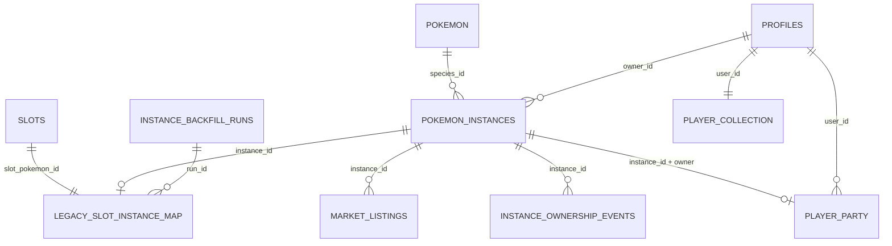
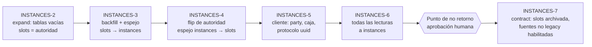

# INSTANCES-1 — Auditoría final del modelo de ejemplares Pokémon

> Rama `design/pokemon-instances-audit-0.3`, sobre `origin/integration/world-skills-0.3` = `0274d30` (`0274d3012696f243ae8f8b18517cd9e1b3fba042`, verificado con `git fetch` antes de empezar).
> **Sólo diseño.** No se modificó código, SQL, migraciones, datos, hosted, Playtest, `main` ni tags. Las cifras de §10 salen de un script temporal fuera del repo, que no se commitea.
> Etiquetas: **FACT** (verificado en `archivo:línea` sobre `0274d30`), **INFERENCE** (deducido, no ejecutado), **OPEN QUESTION** (requiere un dato que el repo no tiene o una decisión humana).

---

## 0. Resumen

- **Premisas firmes** (no se reabren): muchos ejemplares por especie, `pokemon` sigue siendo el catálogo, cada criatura poseída tiene un `instanceId` persistente, Swap no vuelve, legendarios y míticos sólo por eventos, y huevos e incubación llegan después.
- **El repositorio en `0274d30` sigue siendo "una especie = un Pokémon".** `slots` tiene `PRIMARY KEY (pokemon_id)` y todo cuelga de esa clave: ownership, lock de mercado, energía, XP (`pokemon_xp (user_id, pokemon_id)`), WORLD, companion, pool salvaje y plaza. Hay **52 hallazgos** en §3, de los que **12 no aparecían** en la auditoría previa (`MMO_SPAWN_RARITY_AND_INSTANCES.md` §2).
- **Hay seis bloqueantes** (§4.2). Ninguno impide diseñar, y algunos impiden desplegar ciertas fases:
  - escritores de ownership que viven sólo en hosted (`free-claim`, `claim_slot`, `confirm_payment`, vistas de leaderboard);
  - el historial de migraciones sin reconciliar;
  - tres RPC explotables que no deben portarse tal cual (`grant_pokemon_xp`, `spend_tokens_learn_move`, `register_pokemon`);
  - D-IN1 (ingreso pasivo) antes de abrir fuentes nuevas;
  - preguntas abiertas de M-1;
  - el número de versión del protocolo WORLD.
- **Modelo (§5–§7):**
  - `pokemon_instances` con UUID de Postgres y `UNIQUE (source, source_ref)` para exactly-once;
  - CAS de ownership por `(id, owner_id, status, version)`;
  - `player_party` con FK compuesta `(instance_id, user_id) → (id, owner_id)`, así la base impide que un ejemplar ajeno quede en una party;
  - `legacy_slot_instance_map` con **una fila por slot legacy** y una tabla de eventos de ownership.
- **Decisión de progresión:** XP, nivel, movimientos, energía y desgaste pasan a ser **del ejemplar**. La Pokédex, el catálogo, `base_aura`, el lock administrativo y la aptitud laboral siguen siendo **de la especie**.
- **La clave de la migración (§8): mientras sólo existan ejemplares `legacy_slot`, especie ↔ ejemplar es una biyección.** Una restricción temporal `CHECK (source = 'legacy_slot')` la garantiza en la base. Eso hace que el dual read/write, la compatibilidad con clientes viejos y el rollback sean triviales y seguros hasta INSTANCES-7.
- **El punto de no retorno es retirar esa restricción** (el primer ejemplar no legacy), junto con archivar `slots`. Exige aprobación humana explícita (§8.6).
- **Ingreso pasivo:** sumar todos los duplicados es un exploit claro: con el tope de captura propuesto, ~11 700 tokens/día por jugador a la semana, contra 3 000/día del tope de Dungeon (§7.4). Propuesta en dos pasos:
  1. Durante la migración, una regla **interina que preserva exactamente lo actual**: sólo cuentan los ejemplares `legacy_slot`.
  2. Antes del punto de no retorno, la regla final, que es una **decisión humana** (D-IN1, recomendado: sólo la party activa).

---

## 1. Alcance y método

| Ámbito | Qué se leyó |
| --- | --- |
| Base de datos | Las 19 migraciones de `supabase/migrations/` y el espejo de esquema de producción `scripts/integration/rc03-staging/01_prod_mirror.sql` y `02_prod_mirror_functions.sql` |
| Edge Functions | Las 15 de `supabase/functions/` (más `_shared`) |
| Realtime | `services/realtime/src/**` (WORLD, SKILLS policy, presence, auth, wild, persistence) |
| Cliente | `src/features/**` y `src/shared/types/database.ts` |
| Docs | `docs/INVARIANTS.md`, `docs/BACKEND_INVENTORY.md`, `docs/wildlands/POKEMON_SPECIES_INSTANCE_MODEL.md` (R32), `docs/wildlands/R32_INTEGRATION_AUDIT.md`, `docs/economy/PRE_R32_DESIGN_DECISIONS.md`, `docs/economy/INVENTORY_DESIGN.md`, y en la rama no integrada `design/cave-ecosystem-0.3` (`bfb21ed`): `MMO_SPAWN_RARITY_AND_INSTANCES.md`, `CAVE_RESPAWN_AND_TOKENS.md` y `SHARED_DUNGEON_ARCHITECTURE.md` |

**FACT:** `MMO_SPAWN_RARITY_AND_INSTANCES.md` **no está en `0274d30`**. Vive en `origin/design/cave-ecosystem-0.3`, que no es ancestro de la base (`git merge-base --is-ancestor` → falso). Sus citas eran sobre `2652a58`. Por eso cada una se re-verificó (§2).

---

## 2. Contraste con la auditoría previa (CAVE ECOSYSTEM-1 §2)

| Id previo | Afirmación | Estado en `0274d30` |
| --- | --- | --- |
| U1–U14 | `slots` por especie, mercado, XP, energía, `world_owns_pokemon`, Pokédex, RLS | **Confirmadas.** Líneas re-citadas en §3. |
| U15–U17 | `pokeswap-swap` sortea de todo el catálogo y reasigna con `upsert … onConflict 'pokemon_id'` | **Obsoletas.** `supabase/functions/pokeswap-swap/index.ts:1-20` es un stub que responde `410 swap_retired`. `skip_swap_cooldown` no es ejecutable por clientes (`20260930230308_retire_skip_swap_cooldown.sql:21-41`). D-SW1 **deja de ser una decisión**: Swap no tiene diseño con ejemplares. |
| U18 | `market-*` y `dungeon-*` reciben `pokemon_id` | **Confirmada** (§3.2). |
| U19–U22, U24–U26 | Pool salvaje, id salvaje, legendarios ambientales, `{ instanceId, speciesId: instanceId }`, `byPokemon`, companion, shiny | **Confirmadas** (§3.3). |
| U23 | "YIELD-2 ya subió `WORLD_PROTOCOL` a 3" | **Incorrecta para esta base.** En `0274d30`, `WORLD_PROTOCOL = 2` (`services/realtime/src/world/worldProtocol.js:16`). El 3 existe sólo en `world/multi-yield-recovery-0.3`, que no está integrada. Ver B6. |
| U27–U30 | Cliente, tests y docs con unicidad | **Confirmadas**, con más casos (§3.4, §3.5). |
| §2.6 | R32 ya define `PokemonInstance` | **Confirmada**, con dos matices nuevos: `AcquisitionSource` incluye `'swap'` y mezcla creación con transferencia (`instance.ts:46-54`). Ver H-46. |
| §4 M2 | "Backfill irreversible por diseño" | **Se corrige.** Con la restricción `source = 'legacy_slot'` y `slots` todavía como autoridad, el backfill es **reversible** hasta el flip, y el flip es reversible hasta INSTANCES-7 (§8.6). |

---

## 3. Auditoría: identificadores de especie usados como ejemplar

Leyenda: **R** = se retira, **I** = cambia de especie a ejemplar, **E** = sigue siendo de especie, **N** = hallazgo nuevo respecto de la auditoría previa.

Las columnas *compat* y *riesgo* asumen el plan de §8 y §11.

### 3.1 Base de datos y RPC

| # | Archivo y símbolo | Semántica actual | Semántica futura | Migración | Compatibilidad temporal | Riesgo si queda igual |
| --- | --- | --- | --- | --- | --- | --- |
| H-01 | `01_prod_mirror.sql:8,22` `slots` (`PRIMARY KEY (pokemon_id)`) | Una fila por especie = el Pokémon, con un dueño global | Archivo legacy. La autoridad pasa a `pokemon_instances` | Backfill a `pokemon_instances` + `legacy_slot_instance_map` (INSTANCES-3). Espejo hasta INSTANCES-7, después se archiva | Espejo `slots→instances` (fase 3) y `instances→slots` (fases 4–6) | **I/R.** Raíz de todo: imposible tener dos ejemplares |
| H-02 | `slots.is_locked` (`001502…:213-215,237`) | "En el mercado" (FACT: sólo el mercado lo escribe) | `pokemon_instances.status = 'listed'` | Backfill copia `is_locked` → `status` | Espejo bidireccional por fase | **I.** El lock seguiría por especie |
| H-03 | `slots.energy`, `energy_updated_at` (`011…:34-72`) | Energía de Dungeon por especie | Por ejemplar | Columnas en la instancia, copiadas tal cual | Espejo | **I.** Dos ejemplares compartirían energía |
| H-04 | `slots.aura`, `pokemon.base_aura` (`005…:53-63`) | Aura de slot (sin escritor en el repo: sólo `buy` la copia, `001502…:88`) + aura base de especie | `base_aura` sigue siendo de especie. El aura legacy se congela en el mapa (D-AURA) | `legacy_slot_instance_map.aura` | Sin cambios hasta D-IN1 | **E/I.** Sin un dueño claro del aura, el ingreso pasivo queda indefinido |
| H-05 | `slots.first_owner_id`, `owned_since`, `claim_count`, `current_price`, `link_url`, `link_text` | Metadatos del slot | `original_trainer_id` y `owned_since` pasan al ejemplar. `claim_count`, `current_price` y `link_*` quedan en el archivo legacy | Copiar los dos primeros. El resto, sin uso nuevo (`ownedSlots.ts:24` usa `current_price`, ver H-36) | — | Bajo |
| H-06 | `01_prod_mirror.sql:9,27` `market_listings.pokemon_id` | Se lista una especie | `instance_id uuid` NOT NULL tras el flip. `pokemon_id` queda como dato | Columna nullable (fase 2), backfill de listados activos (fase 3), NOT NULL (fase 7) | Funciones aceptan ambos por el mapa | **I** |
| H-07 | `001502…:177-241` `publish_market_listing(p_pokemon_id)` | Verifica y bloquea el slot de la especie. "Un listado activo por especie" (`:222-229`) | `publish_listing(p_instance_id, p_price)` con CAS `owned→listed`. Un listado activo **por ejemplar** | Nueva función. La vieja delega en ella resolviendo por el mapa | Firma vieja viva hasta INSTANCES-6 | **I.** Con duplicados, `active_listing_exists` impediría listar un segundo ejemplar de la especie |
| H-08 | `001502…:15-134` `buy_market_listing` | Transfiere con `INSERT INTO slots … ON CONFLICT (pokemon_id)` (`:82-102`) y **no verifica que el vendedor siga siendo dueño ni que el slot esté bloqueado** | Transferencia CAS `listed→owned` con `owner_id = seller`, la instancia sale de la party, evento de ownership | Nueva función | Ídem | **I + N.** Falta CAS. Hoy no es explotable porque nada más escribe `slots.owner_id` con un listado activo (Swap retirado), pero con ejemplares sí |
| H-09 | `001502…:136-175` `cancel_market_listing` | Desbloquea por especie (`:171`) | `listed→owned` por `instance_id` | Nueva función | Ídem | **I** |
| H-10 | `001502…:222-229` + `slots.is_locked` | Un listado vencido (`expires_at <= now`) no se compra, pero **el slot queda bloqueado** hasta que el vendedor cancela | Preservar (D-EXPIRE): `status` sigue en `listed` hasta cancelar | Ninguna | — | **N.** Relacionado con INV-OWN-4. No se cambia en esta migración |
| H-11 | `01_prod_mirror.sql:10,34` `transactions.pokemon_id` | Venta de una especie | + `instance_id` (FK) | Columna nullable y backfill de las ventas pasadas por el mapa (unívoco: sólo hay ejemplares legacy) | — | **I.** Sin trazabilidad por ejemplar |
| H-12 | `01_prod_mirror.sql:11,37` `token_ledger.pokemon_id` | Dato informativo | + `instance_id` nullable | Aditiva | — | **E** (informativo) |
| H-13 | `01_prod_mirror.sql:12,41-42` `activity_feed.pokemon_id` | Feed público por especie (tipos `claim`, `steal`…) | + `instance_id` nullable. El feed sigue mostrando la especie | Aditiva | — | **E** |
| H-14 | `008…:23-25` `pokemon_xp (user_id, pokemon_id)` | XP y nivel por **usuario × especie**: el XP no viaja con la venta | `pokemon_instances.experience`. El nivel se deriva y no se guarda | M-1: XP del dueño actual. Las filas de ex-dueños se archivan | Espejo `pokemon_xp→instance` (3) y `instance→pokemon_xp` (4–6) | **I.** Dos Geodude compartirían XP. Cambio de comportamiento: tras el flip, **la venta transfiere el XP** (D-XP1) |
| H-15 | `008…:37-102` `grant_pokemon_xp(p_pokemon_id, p_xp_amount)` + `GRANT … TO authenticated` (`:102`) | **Cualquier cliente autenticado puede sumarse hasta 2³¹ XP por llamada** a un Pokémon propio | `grant_instance_xp` **sólo `service_role`**, llamado por fuentes del servidor | Nueva función. La vieja se revoca | — | **I + N, seguridad (B4).** No portar el GRANT. OPEN QUESTION: ¿hosted tiene este GRANT? El repo dice que sí |
| H-16 | `005…:100-145` `spend_tokens_learn_move(p_pokemon_id, p_new_moves)` | Cobra 150 y escribe **el array de movimientos que manda el cliente**, sin validarlo | `learn_move(instance_id, move, replace_idx)`: el servidor valida contra el learnset | Nueva función, con validación | Vieja firma revocada en la fase 4 | **I + N, seguridad (B4).** Movimientos arbitrarios por 150 tokens |
| H-17 | `010…:14-108` `award_dungeon_reward(p_pokemon_id, xp, tokens)` | XP y tokens **declarados por el cliente**, recortados (10 000 / 3 000 por día). Brecha conocida INV-TOK-3 | Por `instance_id`. La brecha se mantiene, documentada (no la resuelve INSTANCES) | Nueva firma que delega | Firma vieja → mapa | **I.** Y no empeorarla: el tope sigue siendo por jugador, no por ejemplar |
| H-18 | `011…:14-80` `consume_dungeon_energy(p_pokemon_id)` | Energía y lock por especie | Por `instance_id`, con `FOR UPDATE` sobre la instancia | Nueva función | Firma vieja → mapa | **I** |
| H-19 | `005…:13-91` `collect_passive_tokens` | Suma el TPH de **todos** los slots del dueño (`:53-63`) | Regla interina: sólo ejemplares `legacy_slot` (idéntica a la actual). Regla final: D-IN1 | Reescritura en la fase 4 | — | **I + exploit** (§7.4) |
| H-20 | `009…:53-69` `register_pokemon(p_pokemon_id)`, GRANT a `authenticated` (`:79`) | **Registra cualquier especie como "obtenida" sin verificar ownership** | El registro lo hace el servidor dentro de cada creación o transferencia de un ejemplar. La RPC de cliente se revoca | Fase 4 | — | **E (Pokédex por especie) + N, integridad (B4)** |
| H-21 | `009…:16-48` `record_pokemon_seen`, `bulk_record_pokemon_seen` | "Visto" por especie, declarado por el cliente | Sin cambio (visto es cosmético) | — | — | **E** |
| H-22 | `002154…:213-232` `world_player_state` | Lista de **especies** trabajables, hasta 500 (`:225-230`) | `[{ instanceId (uuid), speciesId }]` de ejemplares `owned` (no `listed`). Con A-1, sólo la party (D-PARTY-WORK) | Nueva versión de la función | La v1 sigue para el protocolo viejo hasta la fase 6 | **I** |
| H-23 | `002154…:234-248` `world_owns_pokemon(uuid, integer)` | "a slot's pokemon_id is both the instance and its species" (`:235`) | `world_owns_instance(uuid, uuid)` → `{ instanceId, speciesId }` | Nueva función | v1 → mapa | **I** |
| H-24 | `001322…:15-18` `slots` sólo lectura para clientes | Escrituras sólo del servidor | Igual para `pokemon_instances` y `player_party` | Se replica el patrón | — | **E** (patrón correcto) |
| H-25 | `02_prod_mirror_functions.sql:97-115` `claim_slot`, `confirm_payment`. `BACKEND_INVENTORY.md` §6.1 `free-claim` (hosted v15, **no versionado**) | Escritores de ownership por especie fuera del repo. `claim_slot` hace upsert `ON CONFLICT (pokemon_id)` | Retirados. No son una fuente de ejemplares | Revocar o retirar antes de la fase 3 (B2) | — | **R + N, B2.** Un escritor fuera del espejo divergiría `slots` de `pokemon_instances` |
| H-26 | `BACKEND_INVENTORY.md` §3 `leaderboard_count`, `leaderboard_spent`, `global_stats`, `leaderboard_types` (vistas sólo en hosted) | Cuentan slots por dueño. "total available" = especies sin dueño | Contar ejemplares (o especies distintas, D-LB). "Disponibles" pierde sentido | Versionar en el repo (AGENTS §21) y luego reescribir | Siguen sobre el espejo `slots` hasta la fase 6 | **I + N, B2** |
| H-27 | `BACKEND_INVENTORY.md:235` `pokemon_xp`: política DELETE "own rows". `008…:29` sólo revoca INSERT/UPDATE | Un cliente puede **borrar** su propia fila de XP | El backfill toma una instantánea. Se revoca DELETE en la fase 3 | — | — | **N.** Una fila puede desaparecer entre el dry-run y el run, sin daño a terceros |
| H-28 | `pokemon.locked` (`001502…:217-220`) | Lock administrativo de especie para el mercado | Igual: sigue siendo de especie | — | — | **E** |
| H-29 | `20260930230308_retire_skip_swap_cooldown.sql:18-19` | "Cleanup … waits for INSTANCES-1 and its backfill" | Limpieza opcional en la fase 7 (D-SWAPCLEAN). `swap_history` se conserva como historia | — | — | **R.** Sin riesgo funcional |

### 3.2 Edge Functions

| # | Archivo y símbolo | Actual | Futura | Migración | Compatibilidad | Riesgo |
| --- | --- | --- | --- | --- | --- | --- |
| H-30 | `market-publish/index.ts:44-54` | Body `{ pokemon_id: int>0 }` | `{ instance_id: uuid }` | Aceptar ambos en las fases 4–5. Sólo uuid desde la fase 6 (`426 client_outdated`) | Mapa legacy (unívoco hasta la fase 7) | **I** |
| H-31 | `market-buy/index.ts:83`, `market-cancel/index.ts:59-60` | La respuesta devuelve `pokemon_id` | + `instance_id`, `species_id` | Aditiva | Se mantiene `pokemon_id` | **I** |
| H-32 | `dungeon-start/index.ts:23-29,71`, `dungeon-reward/index.ts:23-32,80` | `pokemon_id` entero | `instance_id` | Ídem H-30 | Ídem | **I** |
| H-33 | `world-authority/handler.ts:106-112` `owns_pokemon` | `instanceId` entero ≥ 1 → `world_owns_pokemon` | uuid → `world_owns_instance` | Nueva op `owns_instance`. La vieja sigue hasta la fase 6 | — | **I** |
| H-34 | `pokeswap-swap/index.ts:1-20` | 410 `swap_retired` | Igual, para siempre | — | — | **E.** Un test lo fija (T-SW) |

### 3.3 Realtime (`services/realtime/src`)

| # | Archivo y símbolo | Actual | Futura | Migración | Compatibilidad | Riesgo |
| --- | --- | --- | --- | --- | --- | --- |
| H-35 | `world/worldProtocol.js:16,53-58` `WORLD_PROTOCOL`, `workIntent` | `pokemonInstanceId` = entero seguro ≥ 1 | uuid string (regex) | Protocolo N+1 (§9.3) | Protocolo viejo → `client-outdated` (mecanismo existente) | **I** |
| H-36 | `world/worldProtocol.js:79` `publicNode.worker` | `{ playerId, pokemonInstanceId, speciesId }` públicos | `{ playerId, speciesId, shiny }`. El `instanceId` **no** se publica (D-VIS) | Protocolo N+1 | — | **I + N.** Publicar uuids de ejemplares ajenos facilita rastrearlos |
| H-37 | `world/persistence/playerData.js:9-11,55,80-83,130-132` `readState`, `ownsPokemon` | `{ instanceId: id, speciesId: id }` | uuid + especie real | Adaptadores v2 | — | **I** |
| H-38 | `world/pokemonOwnership.js:14,19-28,40` | Caché positiva de 30 s por `player:instanceId` entero | Clave por uuid. Se mantiene la tolerancia de 30 s (documentada en `:10-12`: "the reward goes to the player") | Cambio de tipo | — | **I** |
| H-39 | `world/resourceAuthority.js:79,309,339,368` `byPokemon` | Busy-map en memoria por `instanceId` | Igual, con uuid. Ya es por ejemplar | Tipo | — | **E** |
| H-40 | `world/worldConfig.js:43`, `world/persistence/dev/devPlayerData.js:45-47` | Benchmark/dev: ids 1..1000 y provisión con upsert de `slots` | Provisión dev de ejemplares | Fase 5 | — | **I** (sólo dev/test) |
| H-41 | `auth/supabaseAuth.js:27-35` `authorizedCompanion` | Valida el companion contra `slots` por especie con el JWT del jugador | Valida `companionInstanceId` (uuid) contra `pokemon_instances` (RLS propia, `status = 'owned'`) y publica sólo `{ speciesId, shiny }` | Fase 5 | Acepta el entero viejo vía mapa hasta la fase 6 | **I** |
| H-42 | `rooms/PresenceRoom.js:104,112-115`, `protocol/messages.js:64` | `companionId` = id de especie, broadcast | `companion: { speciesId, shiny }` | Fase 5 | — | **I + N** |
| H-43 | `world/wildPopulation.js:28,46-57,63-75,149`, `world/wildService.js:96` | Pool sin especies con dueño, una vez cada una. Id `wild:<area>:<epoch>:<pokemonId>`. Legendarios 2 %. Shiny 1/64 | Fuera de alcance de INSTANCES (WILD-SURFACE-1). **Pero** `wildService.js:96` lee `slots` | Hasta WILD-SURFACE-1 lee el espejo. En la fase 7, o WILD-SURFACE-1 ya quitó la exclusión, o se lee una vista de especies poseídas | Espejo | **R.** Dependencia de la fase 7 (§11) |

### 3.4 Cliente (`src/`)

| # | Archivo y símbolo | Actual | Futura | Migración | Compatibilidad | Riesgo |
| --- | --- | --- | --- | --- | --- | --- |
| H-44 | `shared/types/database.ts:47-48` (`Slot`), `:68-70` (`MarketListing`), `:81-83`, `:97-103`, `:117-119` (`PokemonXp`), `:126-128`, `:132-136` | Tipos con `pokemon_id` como identidad | `PokemonInstanceRow`, `PartyEntry` + `instance_id` en listados/ledger | Fase 5 | Tipos legacy conviven hasta la fase 7 | **I** |
| H-45 | `features/pokemon/api/pokemonApi.ts:28-74` `listSlots`, `getSlot`, `listOwnedSlots(WithPokemon)` | Caja = slots del dueño ordenados por especie, todos de una vez | `instancesApi.listBox(cursor)`, paginada por keyset (§10.4) | Fase 5 | — | **I.** Sin paginación, la caja no escala (§10) |
| H-46 | `features/pokemon/model/instance.ts:46-54` `AcquisitionSource` | Incluye `'swap'`, `'market'`, `'trade'`, `'adoption'` | Fuente de **creación** (`legacy_slot`, `starter`, `wild_capture`, `dungeon_capture`, `egg`, `event`, `admin_grant`). Las transferencias van a eventos. Sin `swap` | Fase 5 (tipo + tests) | — | **N.** Mantener `'swap'` invita a reintroducirlo |
| H-47 | `features/wildlands/lobby/api/plazaApi.ts:9-14`, `domain/ownedSlots.ts:21-32`, `usePlazaData.ts:49,58,61`, `usePlazaRealtime.ts:27-29` | La plaza carga **todos** los slots (≤ 493) y se suscribe a **todos** los cambios de `slots` | La plaza no puede cargar "todos los ejemplares". Propuesta: vitrina servida por el servidor (top N) y sin `postgres_changes` sobre `pokemon_instances` | Fase 6 | Sobre el espejo hasta la fase 6 | **I + rendimiento** (§10.3) |
| H-48 | `features/pokemon/domain/wildPool.ts:11-12` | Oculta salvajes cuya especie tiene dueño | Fuera de alcance (WILD-SURFACE-1) | — | Espejo | **R** |
| H-49 | `features/wildlands/identity/playerPreferences.ts:9,21,52`, `playerIdentity.ts:13-25`, `usePlayerIdentity.ts:40-49`, `components/PlayerIdentitySection.vue:46-52`, `multiplayer/api/colyseusPresence.ts:79` | Companion = `companionPokemonId: number` en localStorage (cosmético, validado por el servidor) | `companionInstanceId: string`. Preferencias v2: el companion v1 se descarta (cosmético) | Fase 5 | v1 se lee y se ignora el companion | **I** |
| H-50 | `features/world/render/workerActors.ts:69,92-93`, `world/state/sharedWorld.ts:197-198`, `wildlands/engine/game.ts:1029,1043` | `hidesCompanion` compara el **id de especie del companion** con el **`pokemonInstanceId` del worker**. Funciona sólo porque hoy son iguales | Comparar `instanceId` con `instanceId` (el companion propio) o, para remotos, `actionId`/actor | Fase 5 | — | **N.** Con uuids, el companion nunca se oculta mientras trabaja, o se oculta el equivocado |
| H-51 | `features/worldSkills/client/worldSkillsSession.ts:73,107`, `worldSkills/server/skillsWorldPolicy.ts:54,73,176`, `skills/service/skillsService.ts:38,104,131`, `skills/components/WorkCard.vue`, `FarmCard.vue`, `skills/ui/farmView.ts:34,50` | SKILLS ya usa `instanceId: string`. La sesión convierte `String(...)` / `Number(...)` para el protocolo entero | Se elimina la conversión. La aptitud sigue por `speciesId` (**E**) | Fase 5 | — | Bajo, pero `Number(uuid)` = `NaN` rompe el trabajo si el protocolo cambia sin el cliente |
| H-52 | `features/market/components/MarketView.vue:23-24,76-81,148-150`, `progression/components/MyBoxView.vue:27-85`, `market/api/marketApi.ts:34`, `progression/api/progressionApi.ts:56-95`, `dungeon/api/dungeonApi.ts:18`, `dungeon/composables/useDungeon.ts:27-60` | `:key` y acciones por `pokemon_id`. `getPokemonXp` filtra sólo por especie (depende de la RLS). `useProgression` no tiene consumidores en componentes | Todo por `instance_id`. `useProgression` se reescribe o se elimina (AGENTS §14) | Fase 5 | — | **I.** Claves Vue duplicadas con dos ejemplares de una especie |

### 3.5 Tests, fixtures y documentación que fijan la unicidad

| Archivo | Qué fija | Acción |
| --- | --- | --- |
| `services/realtime/src/world/wildPopulation.test.js:23-29` | "each wild Pokémon exists once, is unowned" | WILD-SURFACE-1 (no INSTANCES) |
| `src/features/pokemon/domain/wildPool.test.ts:10` | "immediately hides acquired pool members" | Ídem |
| `services/realtime/src/world/persistence/staging.test.js:57,97` | Fixtures sobre `slots` | Fase 5: fixtures de ejemplares |
| `src/features/wildlands/lobby/domain/ownedSlots.test.ts`, `usePlazaData.test.ts`, `MarketView.test.ts`, `MyBoxView.test.ts`, `dungeonApi.test.ts`, `progressionApi.test.ts` | Contratos por `pokemon_id` | Fase 5 |
| `src/features/pokemon/model/migration.test.ts` | M-1 y cardinalidad slot → 0/1 | **Se conserva:** es el contrato del backfill |
| `docs/INVARIANTS.md:74-116` INV-OWN-1..4 | El FACT cita `js/swap.js` y "una fila por Pokémon" | Se reescriben en la fase 7, leídos por ejemplar |
| `docs/economy/POKEMON_PROFESSION_SYSTEM.md:17`, `docs/wildlands/HANDOFF.md:264` | "un dueño global", "no duplica especies" | Fase 7 (docs) |
| `src/features/pokemon/model/legacy.ts:4-8` | "there is one Pikachu" | **OK:** describe el legacy |

---

## 4. Hallazgos transversales y bloqueantes

### 4.1 Hallazgos de seguridad previos a INSTANCES (no se arreglan aquí)

| Id | Hallazgo | Fuente | Por qué importa a INSTANCES |
| --- | --- | --- | --- |
| S1 | `grant_pokemon_xp` ejecutable por `authenticated` con cantidad libre | H-15 | Portarlo a ejemplares multiplicaría el abuso. Las instancias nacen con XP sólo del servidor |
| S2 | `spend_tokens_learn_move` acepta movimientos arbitrarios | H-16 | Ídem |
| S3 | `register_pokemon` sin verificar ownership | H-20 | La Pokédex "obtenido" debe derivarse de ejemplares reales |
| S4 | `buy_market_listing` sin CAS de vendedor | H-08 | Con varios escritores de ownership (captura, eventos) se vuelve explotable |
| S5 | Escritores y vistas de ownership sólo en hosted | H-25, H-26 | Romperían la paridad del espejo |
| S6 | `pokemon_xp` DELETE de filas propias | H-27 | Instantánea del backfill |

**OPEN QUESTION (verificable en hosted, sin cambiar nada):** si S1, S2, S3 y S6 tienen en hosted los mismos grants y políticas que el repo. El repo es la única fuente que se pudo leer aquí.

### 4.2 Bloqueantes

| Id | Bloqueante | Bloquea | Cómo se levanta |
| --- | --- | --- | --- |
| **B1** | D-IN1: regla final de ingreso pasivo | Fase 7 (fuentes no legacy). La regla interina permite avanzar de la 2 a la 6 | Decisión humana (§7.4) |
| **B2** | `free-claim`, `claim_slot`, `confirm_payment`, vistas de leaderboard y políticas de `pokemon_xp` no versionadas o vivas fuera del repo | Despliegue de la fase 3 (espejo y backfill) | Una tarea separada de inventario y versionado/retirada (AGENTS §21). Lo mínimo: revocar `free-claim` y versionar las vistas |
| **B3** | Historial de migraciones sin reconciliar: 8 versiones `20260907` y 3 `20260908` (`BACKEND_INVENTORY.md:12-17`) | Desplegar cualquier migración nueva con la CLI | Reconciliar el historial o aplicar con el procedimiento manual ya usado en RC-0.3 |
| **B4** | S1–S3 | Fase 4: las nuevas RPC no heredan esos grants | Diseño de §9.2. Revocar las viejas es una tarea de seguridad aparte, recomendada antes de la fase 4 |
| **B5** | M-1 §10.5: universo de slots, evidencia de shiny, filas de XP de ex-dueños | **Ejecución** del backfill en hosted (fase 3) | Decisión humana. Propuesta en §8.3. El backfill de movimientos **no** bloquea (§8.3) |
| **B6** | Versión del protocolo WORLD: 2 en la base, 3 en la rama YIELD-2 no integrada | Fase 5 | Coordinar: INSTANCES usa "la siguiente a la vigente al integrar" |

---

## 5. Modelo propuesto

### 5.1 Catálogo: `pokemon` (sin cambios de forma)

Sigue siendo de especie: nombres, tipos, región, `generation`, `sprite_url`, `is_legendary`, `is_popular`, `base_price`, `base_aura` y `locked` (lock administrativo de mercado). La **rareza MMO** (tiers `common` … `event_only`) no vive aquí: vive en las tablas de aparición (CAVE ECOSYSTEM-1 §5 y §9). `is_legendary` sólo sirve para filtrar el catálogo.

### 5.2 `pokemon_instances`

| Columna | Tipo / restricción | Pertenece a | Nota |
| --- | --- | --- | --- |
| `id` | uuid PK, `DEFAULT gen_random_uuid()` | ejemplar | Lo genera Postgres. Nunca lo propone el cliente ni el realtime |
| `species_id` | int NOT NULL, FK `pokemon(id)` | dato del ejemplar | Inmutable |
| `form_id` | int NULL | ejemplar | NULL = forma por defecto. El catálogo de formas de R32 todavía no está en la base |
| `owner_id` | uuid NULL, FK `profiles(id)` | ejemplar | NULL sólo con `status = 'pending'` |
| `original_trainer_id` | uuid NULL | ejemplar | Legacy: `slots.first_owner_id` |
| `status` | text NOT NULL, `CHECK IN ('owned','listed','pending')` | ejemplar | `listed` reemplaza `is_locked`. `pending` = captura de expedición (I-1). `released` se agrega con D-IN2 |
| `shiny` | bool NOT NULL DEFAULT false | ejemplar | Legacy: false (M-1). Nuevo: CSPRNG del servidor |
| `gender` | text NOT NULL, `CHECK IN ('male','female','genderless')` | ejemplar | M-1 o CSPRNG |
| `nature_id`, `ability_id` | smallint NOT NULL | ejemplar | Ídem. Nunca habilidad oculta en legacy |
| `iv_hp` … `iv_spe` | smallint NOT NULL, `CHECK 0..31` | ejemplar | Seis columnas, para poder validarlas en la base |
| `experience` | bigint NOT NULL, `CHECK >= 0` | ejemplar | El nivel se deriva (curva L³, tope 100). **Sin tope de XP**: el legacy acumula XP por encima del nivel 100 (`008…:67-73`) |
| `moves` | jsonb NOT NULL DEFAULT `'[]'` | ejemplar | **Formato legacy (slugs) durante la migración.** El paso a `MoveSlot` de R32 es posterior (§8.3) |
| `energy`, `energy_updated_at` | smallint `CHECK 0..100`, timestamptz | ejemplar | Copia de `slots` |
| `nickname` | text NULL, `CHECK char_length <= 20` | ejemplar | Se renderiza como texto (AGENTS §13) |
| `source` | text NOT NULL, `CHECK IN ('legacy_slot','starter','wild_capture','dungeon_capture','egg','event','admin_grant')` | ejemplar | **Sin `swap` y sin `market`** (transferir no es crear) |
| `source_ref` | text NOT NULL, `CHECK char_length BETWEEN 3 AND 128` | ejemplar | Legacy: `slot:<pokemon_id>` (sin versión, ver §8.2) |
| `rules_version` | text NOT NULL | ejemplar | Legacy: `M-1/v1/pokeswap-legacy-backfill`. Captura: versión de la tabla de aparición |
| `catalog_version` | text NOT NULL | ejemplar | Trazabilidad R32 |
| `account_bound_until` | timestamptz NULL | ejemplar | Gacha y captura (CAVE ECOSYSTEM-1 §12) |
| `version` | int NOT NULL DEFAULT 0 | ejemplar | Se incrementa en cada cambio de ownership o estado (CAS) |
| `owned_since`, `created_at`, `updated_at` | timestamptz | ejemplar | |

**Restricciones:**

1. `UNIQUE (source, source_ref)`: exactly-once de toda creación.
2. `UNIQUE (id, owner_id)`: destino de la FK compuesta de la party.
3. `CHECK ((status = 'pending') = (owner_id IS NULL))`.
4. **Temporal (fases 2–6):** `CHECK (source = 'legacy_slot')`, con nombre propio para poder retirarla en la fase 7 (§8.6).
5. Las filas **nunca se borran** (los eventos y las transacciones las referencian).

**Índices:**

- PK;
- `UNIQUE (source, source_ref)`;
- `(owner_id, created_at DESC, id) WHERE owner_id IS NOT NULL`, para la caja (keyset);
- `(owner_id, species_id) WHERE owner_id IS NOT NULL`, para el filtro por especie, los duplicados y la vitrina.

No hace falta un índice por `species_id` solo: la Pokédex no lee ejemplares.

**Qué no pertenece al ejemplar:**

- condición de combate (HP, PP, estado mayor): R32 la define, pero no se persiste hasta que exista combate persistente. Se agrega como columna aditiva;
- EVs: siempre 0 hoy;
- aura legacy: va al mapa (D-AURA);
- precio, `claim_count`, `link_*`: quedan en el archivo legacy.

### 5.3 Tablas de soporte

| Tabla | Clave | Columnas | Propósito |
| --- | --- | --- | --- |
| `legacy_slot_instance_map` | `slot_pokemon_id` PK (FK `pokemon`) | `outcome` (`migrated` \| `skipped_unowned`), `instance_id` UNIQUE NULL, con `CHECK ((outcome = 'migrated') = (instance_id IS NOT NULL))`; instantánea: `owner_id`, `slot_updated_at`, `is_locked`, `active_listing_id`, `energy`, `aura`, `xp_user_id`, `xp`, `stored_level`, `moves_raw`; `report` jsonb (`MigrationReport`); `run_id`, `migrated_at` | **Exactamente una fila por slot legacy.** Auditoría y resolución de ids viejos |
| `instance_backfill_runs` | `run_id` uuid PK | `rules_version`, `started_at`, `finished_at`, `status`, `counts` jsonb, `plan_sha256` | Auditoría de cada ejecución |
| `legacy_m1_attributes` | `slot_pokemon_id` PK | `nature_id`, `ability_id`, `gender`, `iv_*`, `rules_version`, `catalog_version` | Atributos M-1 **precalculados para las 493 especies** por `migration.ts`. Así existe una sola implementación (TS) y SQL sólo los lee (§8.2) |
| `pokemon_xp_legacy_archive` | igual que `pokemon_xp` | copia completa | Historia de ex-dueños (M-1 §10.2). El espejo de la fase 4 puede sobrescribir filas de `pokemon_xp` |
| `player_party` | PK `(user_id, position)`, `position CHECK 1..6` | `instance_id` UNIQUE; FK compuesta `(instance_id, user_id) → pokemon_instances(id, owner_id)` **ON UPDATE NO ACTION** | La party. La base impide que un ejemplar ajeno esté en ella. Una transferencia debe sacarlo de la party en la misma transacción, o falla |
| `player_collection` | `user_id` PK | `live_count` int, `box_limit` int | Fila que se bloquea al **crear** ejemplares, para serializar el límite de caja (§9.1) |
| `instance_ownership_events` | `id` bigserial PK | `instance_id`, `from_owner`, `to_owner`, `reason` (`created`, `legacy_backfill`, `market_sale`, `released`…), `ref`, `at` | Historial por ejemplar. Reemplaza lo que hoy infieren `transactions` y `activity_feed` |
| `market_listings` | (existente) | + `instance_id` uuid NULL → NOT NULL en la fase 7; índice único parcial `(instance_id) WHERE NOT is_purchased` | Un listado vivo por ejemplar (la cancelación borra la fila: `001502…:169`) |
| `transactions`, `token_ledger`, `activity_feed` | (existentes) | + `instance_id` NULL | Aditivas |

### 5.4 CAS de ownership

Toda transición de ownership o de estado es **un solo `UPDATE` condicionado**, dentro de la transacción de la operación:

| Transición | Condición (WHERE) | Efecto | Si afecta 0 filas |
| --- | --- | --- | --- |
| publicar | `id = $i AND owner_id = auth.uid() AND status = 'owned' AND (account_bound_until IS NULL OR account_bound_until <= now())` y no está en la party (D-PARTY-LIST) | `status = 'listed'`, `version + 1` | `not_listable` |
| cancelar | `id = listing.instance_id AND owner_id = listing.seller_id AND status = 'listed'` | `status = 'owned'` | `listing_inconsistent` → rollback |
| comprar | `id = listing.instance_id AND owner_id = listing.seller_id AND status = 'listed'` | `owner_id = comprador`, `status = 'owned'`, `owned_since = now()`, `version + 1` + evento + Pokédex `registered` del comprador | `listing_inconsistent` → rollback, **sin débito** |
| asegurar captura (I-1) | `id = $i AND status = 'pending' AND owner_id IS NULL` | `owner_id`, `status = 'owned'` | idempotente: si ya es del mismo dueño, devuelve lo guardado |

La compra conserva su orden actual de locks (`market_listings FOR UPDATE` → `profiles` → instancia), así no se agregan deadlocks nuevos.

---

## 6. Party, caja y companion

| Concepto | Diseño | Límite inicial |
| --- | --- | --- |
| **Party** | `player_party`, ordenada por `position` 1..6. Sólo ejemplares `owned` del usuario (FK compuesta + chequeo de `status` en la RPC). Se escribe con un intent `party_set(instance_ids uuid[])` atómico: reemplaza las seis posiciones en una transacción | 6 (A-1, `party.ts:10`) |
| **Caja** | Todo ejemplar `owned` o `listed` del usuario que no está en la party. No es una tabla: es una consulta paginada | D-BOX. Propuesta: 300 (§10). Los ejemplares legacy quedan **exentos** (grandfathered) |
| **Companion** | Hoy es una preferencia cosmética en localStorage, validada por el servidor. Se mantiene así: `companionInstanceId` en las preferencias v2, validado por realtime (`owned` y del jugador). Se publica sólo `{ speciesId, shiny }` | 1. Recomendado: debe estar en la party (D-COMP). Mientras no haya party poblada, cualquier `owned` |
| **Duplicados** | Permitidos sin restricción. La caja agrupa por especie en la UI (índice `(owner_id, species_id)`) | — |
| **Party inicial tras el backfill** | Recomendado: sembrar de forma determinista con los 6 de mayor `experience` (desempate por `species_id`). Si no, queda vacía (D-PARTY-SEED) | — |

**Integridad al operar:**

| Operación | Regla |
| --- | --- |
| Transferir (mercado) | La compra borra la fila de la party del vendedor **antes** del CAS. Si no, la FK compuesta hace fallar el `UPDATE` (defensa en profundidad) |
| Listar | Recomendado: un miembro de la party **no** se puede listar (D-PARTY-LIST). Hay que sacarlo primero, de forma explícita |
| Bloquear (Dungeon) | `consume_dungeon_energy` exige `status = 'owned'`. Hoy la Dungeon no deja un lock persistente; no se agrega uno |
| Trabajar (WORLD) | Busy-map en memoria (H-39). Ownership con caché de 30 s (H-38). Si el ejemplar se lista mientras trabaja, la acción en curso termina y la siguiente se rechaza (comportamiento actual, documentado) |
| Liberar | No existe hoy. Queda para D-IN2 (`status = 'released'`, `owner_id` NULL; la restricción 3 de §5.2 se amplía entonces) |

---

## 7. Progresión: ejemplar o especie (decisión explícita)

| Dato | Hoy | Futuro | Decisión |
| --- | --- | --- | --- |
| XP y nivel | `pokemon_xp (user, especie)`. El nivel se guarda | `pokemon_instances.experience`. El nivel se deriva | **Ejemplar** (D-XP1, recomendado y alineado con R32 §4). **Cambio de comportamiento:** desde el flip, vender un Pokémon vende su entrenamiento |
| Movimientos | `pokemon_xp.moves` (slugs) | `pokemon_instances.moves` | **Ejemplar** |
| Energía de Dungeon | `slots.energy` | Instancia | **Ejemplar** |
| Desgaste (HP, PP, estado) | No existe | Columna futura | **Ejemplar** (R32) |
| Estados de trabajo WORLD | En memoria, por `instanceId` | Igual | **Ejemplar**, efímero |
| XP de skills | `player_skill_xp (user, skill)` | Igual | **Jugador**: no cambia |
| Aptitud laboral | Derivada de la especie (`farmView.ts:50`) | Igual | **Especie** |
| Ingreso pasivo | Suma por slot | §7.4 | **Decisión humana** (D-IN1) |
| Mercado | Por especie | Por ejemplar | **Ejemplar** |
| Pokédex | `(user, especie)` visto / registrado | Igual. "Registrado" lo escribe el servidor al recibir un ejemplar | **Especie** |
| `base_aura`, `locked`, rareza de catálogo | Especie | Especie | **Especie** |

### 7.1 Migración de XP

M-1, tal cual (`migration.ts:397-429`):

- el XP preservado es el de la fila `(dueño actual, especie)`, o 0 si no existe;
- las filas de ex-dueños no producen nada y se archivan completas en `pokemon_xp_legacy_archive`;
- si el `level` guardado discrepa del XP, gana el XP (`migration.ts:300-303`).

### 7.2 Migración de energía

`energy` y `energy_updated_at` se copian. La regeneración sigue calculándose en la RPC, igual que hoy (`011…:49-59`).

### 7.3 Migración del mercado

- Cada listado con `is_purchased = false` recibe `instance_id` por el mapa.
- Su ejemplar nace en `status = 'listed'` si `slots.is_locked = true`.
- **OPEN QUESTION** a resolver en el dry-run: ¿existen slots con `is_locked = true` sin listado vivo, o al revés? `BACKEND_INVENTORY.md` §1.4 registraba 1 listado al 2026-09-07. El dry-run las cuenta y la regla es: **`status` refleja `is_locked`**, y cualquier inconsistencia se reporta y no se repara sola.

### 7.4 Ingreso pasivo y el exploit de duplicados

**FACT:** TPH por slot = `max(5, round(5 + (min(aura,200) + base_aura) / 50))`, sumado sobre todos los slots, por un máximo de 24 h (`005…:43-63`).

**INFERENCE (cifras de playtest, `base_aura` = 100, aura 0 → 7 TPH):**

| Escenario | Ejemplares | TPH | Tokens/día (24 h) |
| --- | --- | --- | --- |
| Jugador legacy promedio (172 slots / 6 perfiles, 2026-09-07) | ~29 | ~203 | ~4 870 |
| Captura con tope de 10/día, 1 semana, sumando todo | ~67 | ~470 | ~11 260 |
| Ídem, 1 año | ~3 480 | ~24 360 | ~584 600 |
| Sólo la party activa (6, máximo aura 200 → 11 TPH) | 6 | ≤ 66 | ≤ 1 584 |
| Referencia: tope diario de Dungeon | — | — | 3 000 (`010…:29`) |

Sumar duplicados es un exploit sin techo. Pero la recomendación inicial (sólo la party) **reduce a la cuarta parte o menos el ingreso de los jugadores legacy actuales**. Es una consecuencia económica que esta auditoría no decide. Propuesta:

1. **Regla interina (fases 4–6), sin cambio económico:** se suman sólo los ejemplares `source = 'legacy_slot'` que el jugador posee hoy, con el `aura` del mapa y el `base_aura` de la especie. Mientras existan sólo ejemplares legacy es **numéricamente idéntica** a la regla actual (test T-PAS1). Los ejemplares nuevos aportan 0 por construcción.
2. **Regla final (antes de la fase 7):** D-IN1. Opciones:
   - (a) sólo la party, recomendada;
   - (b) los legacy + la party para lo nuevo;
   - (c) tope global de TPH;
   - (d) máximo por especie.

   Las opciones (b)–(d) tienen menor impacto en los legacy. **Decisión humana.**

---

## 8. Backfill: expand → migrate → contract

### 8.1 Autoridad por fase

| Fase | Ownership / lock / energía | XP / movimientos | Espejo | Ejemplares permitidos | ¿Reversible? |
| --- | --- | --- | --- | --- | --- |
| 2 | `slots` | `pokemon_xp` | ninguno (tablas vacías) | ninguno | sí: borrar tablas vacías |
| 3 | `slots` | `pokemon_xp` | triggers `slots → instances`, `pokemon_xp → instances` | sólo `legacy_slot` | sí: borrar ejemplares `legacy_slot` + mapa (lo autoritativo no se tocó) |
| 4 | `pokemon_instances` | `pokemon_instances` | triggers `instances → slots`, `instances → pokemon_xp` | sólo `legacy_slot` | sí: invertir el espejo y restaurar los cuerpos viejos (`slots` está al día) |
| 5 | ídem | ídem | ídem | sólo `legacy_slot` | sí: apagar el flag del cliente |
| 6 | ídem | ídem | ídem (para clientes viejos y vistas) | sólo `legacy_slot` | sí |
| 7 | ídem | ídem | **ninguno**: `slots` y `pokemon_xp` se congelan y archivan | **todas** las fuentes de §5.2 | **no** (§8.6) |

**Nunca hay espejo en las dos direcciones a la vez.** La migración del flip borra uno e instala el otro en **una transacción**. Además, cada trigger sale si `pg_trigger_depth() > 1`, para impedir bucles.

### 8.2 Algoritmo (fase 3)

0. **Precondiciones:** B2, B3 y B5; una copia de seguridad o PITR confirmada; `pokemon_xp_legacy_archive` poblada. DELETE de `pokemon_xp` revocado (S6).
1. **Atributos M-1 fuera de SQL.** Un script del repo (fase 3) ejecuta `migration.ts` sobre el catálogo y genera `legacy_m1_attributes` para las 493 especies (sólo dependen de `(salt, version, slot_pokemon_id, catálogo)`; `migration.ts:139-143`). Se versiona como datos generados, con su SHA-256. **Una sola implementación del hash** (AGENTS §14).
2. **Instalar el espejo antes del recorrido.** Trigger `AFTER INSERT OR UPDATE` en `slots` y `pokemon_xp` que llama a `instances_sync_slot(slot_pokemon_id)`. Toda escritura concurrente al backfill queda cubierta.
3. **`instances_sync_slot(p_slot)`** (SECURITY DEFINER, sólo `service_role`), idempotente:
   - `SELECT … FROM slots WHERE pokemon_id = p_slot FOR UPDATE`, que serializa con los escritores;
   - sin dueño → mapa `skipped_unowned` (`ON CONFLICT DO UPDATE` sólo si sigue sin instancia);
   - con dueño → `INSERT INTO pokemon_instances (…, source 'legacy_slot', source_ref 'slot:'||p_slot) ON CONFLICT (source, source_ref) DO NOTHING`, y luego un `UPDATE` de los campos mutables (owner, status, energía, XP del dueño actual, moves) desde las filas autoritativas, y un evento `legacy_backfill` la primera vez;
   - mapa `migrated` con la instantánea.
4. **Recorrido** `instances_backfill_legacy(run_id, batch)`: todos los `slots` en orden de `pokemon_id`, en lotes (≤ 493 filas: alcanza un lote), y `sync` por cada uno. Registra los conteos en `instance_backfill_runs`.
5. **Verificación** (§8.4). Si falla, el run queda en `failed` y no se avanza.

**Propiedades:**

| Propiedad | Cómo |
| --- | --- |
| Idempotente | `ON CONFLICT` en `(source, source_ref)` y en el PK del mapa. Los campos mutables se recalculan desde la fuente |
| Reiniciable | El recorrido puede cortarse en cualquier lote. Re-ejecutarlo completa lo faltante |
| Auditable | `instance_backfill_runs` + instantánea y `MigrationReport` por slot + eventos |
| Sin pérdida de ownership | El dueño sale **sólo** de `slots.owner_id` (M-1 §10.2), leído bajo `FOR UPDATE` |
| Exactamente uno por slot | PK del mapa = `slot_pokemon_id`. `source_ref = 'slot:<id>'` **sin versión**: un M-1 v2 futuro no puede crear un segundo ejemplar del mismo slot |
| Estable | Atributos de la tabla generada, sin reloj ni azar |
| Reversible | Hasta el flip, borrar `legacy_slot` + mapa deja todo como antes |

### 8.3 Respuestas propuestas a M-1 §10.5 (B5, para aprobación)

| Pregunta | Propuesta |
| --- | --- |
| Universo | Todos los slots. Los que tienen dueño → `migrated`; sin dueño → `skipped_unowned` (M-1 §10.2.1). Un slot sin dueño que gana uno durante el espejo (sólo si B2 no lo impidió) pasa a `migrated` por el mismo `sync` |
| Shiny | Ninguna evidencia es inequívoca: `false` para todos (M-1, `migration.ts:200-206`) |
| Movimientos | **No bloquea.** El ejemplar guarda `moves` en el formato legacy de slugs, igual que hoy. La canonicalización a `MoveSlot` de R32 y el backfill de learnset (R32 §11) son parte de la integración del combate, no de esta migración |
| XP de ex-dueños | Archivar completo en `pokemon_xp_legacy_archive`. No borrar |

### 8.4 Verificación (consultas descritas, se implementan en la fase 3)

| Id | Comprobación | Esperado |
| --- | --- | --- |
| V1 | filas del mapa = filas de `slots` | igual |
| V2 | ejemplares `legacy_slot` = slots con `owner_id` no nulo = mapa `migrated` | igual |
| V3 | por cada `migrated`: dueño, `status ⇔ is_locked`, energía, XP de `(dueño, especie)` o 0, `moves` | 0 diferencias |
| V4 | ejemplares sin fila en el mapa | 0 |
| V5 | listados vivos sin `instance_id`, o con ejemplar distinto de `listed` | 0 (si no, se reporta: §7.3) |
| V6 | ejemplares con `source <> 'legacy_slot'` | 0 |
| V7 | atributos = `legacy_m1_attributes` y SHA del plan = el aprobado | igual |
| V8 | suma del ingreso pasivo interino = suma con la fórmula actual, por jugador | igual |

V1–V8 se repiten **a diario** mientras dure la fase 3 (deriva del espejo), y una vez justo antes del flip.

### 8.5 Dual read / dual write

- **Escritura:** nunca hay dos escritores autoritativos. En la fase 3 escribe el código viejo y el trigger copia. En las fases 4–6 escriben las funciones nuevas y el trigger copia hacia atrás. Las funciones viejas (firma `integer`) pasan a ser **adaptadores**: resuelven `pokemon_id → instance_id` por el mapa y delegan.
- **Lectura:** los lectores viejos (cliente en caché, realtime `wildService`, plaza, vistas) siguen leyendo `slots`, que está al día. Los nuevos leen `pokemon_instances`. La fase 6 mueve todos los lectores.
- **¿Por qué es seguro?** Por la restricción temporal `source = 'legacy_slot'`, cada especie tiene **como máximo un** ejemplar mientras exista el espejo. Así `slots` siempre puede representar el estado completo, y `pokemon_id → instance_id` es unívoco.

### 8.6 Punto de no retorno

**Definición:** la migración de la fase 7 que, **en una transacción**, hace tres cosas:

1. elimina los triggers del espejo;
2. renombra `slots` → `slots_legacy_archive` y `pokemon_xp` → `pokemon_xp_legacy`, en sólo lectura;
3. **retira `CHECK (source = 'legacy_slot')`**.

Desde el primer ejemplar no legacy (captura, huevo, evento), `slots` ya no puede representar el estado: volver atrás perdería ejemplares.

**Aprobación humana requerida (D-PNR)**, con esta evidencia:

- V1–V8 en verde durante la fase 6;
- telemetría de 0 llamadas con `pokemon_id` entero durante N días (propuesto: 7);
- D-IN1 resuelta;
- WILD-SURFACE-1 integrada, o la vista de especies poseídas lista (H-43);
- vistas de leaderboard versionadas y reescritas (H-26);
- copia de seguridad o PITR confirmada.

---

## 9. Seguridad y concurrencia

### 9.1 Invariantes

| Id | Invariante | Mecanismo |
| --- | --- | --- |
| INST-1 | Un ejemplar tiene a lo sumo un dueño | Columna única `owner_id`. Toda transferencia es un CAS (§5.4) |
| INST-2 | Ninguna fuente crea dos ejemplares por reintento | `UNIQUE (source, source_ref)`. El reintento devuelve el ejemplar existente |
| INST-3 | Sólo el servidor crea ejemplares | `create_instance(...)` sólo `service_role`. Ninguna RPC de cliente recibe especie, IVs, shiny ni dueño |
| INST-4 | Un ejemplar listado no trabaja, no entra a Dungeon, no está en la party ni es companion | `status = 'listed'` se verifica en cada RPC, en `world_owns_instance` y en la FK/RPC de la party |
| INST-5 | La party sólo contiene ejemplares propios | FK compuesta + RPC atómica |
| INST-6 | Captura y eclosión simultáneas no exceden la caja | `create_instance` bloquea `player_collection(user)` `FOR UPDATE`, verifica `live_count < box_limit` y lo incrementa en la misma transacción |
| INST-7 | Compra y cancelación concurrentes → una sola gana | `market_listings FOR UPDATE` (ya existe) + CAS sobre la instancia |
| INST-8 | Swap no existe | Sin `swap` en el `CHECK` de `source`. `pokeswap-swap` = 410. Tests T-SW |
| INST-9 | Mientras dure la migración, sólo hay ejemplares legacy | `CHECK` temporal (§5.2) |
| INST-10 | Un cliente viejo nunca escribe ownership por especie | Funciones viejas = adaptadores al mapa. `slots` sin grants de escritura (`001322…`) |

### 9.2 Funciones

| Clase | Ejemplos | `EXECUTE` | Identidad |
| --- | --- | --- | --- |
| Intent de cliente | `publish_listing`, `cancel_listing`, `buy_listing`, `party_set`, `consume_instance_energy`, `learn_move`, `collect_passive_tokens` | `authenticated`, revocado de `PUBLIC` y `anon` | `auth.uid()`, nunca un parámetro. `not_authenticated` primero (patrón `001502…:31-35`) |
| Servidor | `create_instance`, `grant_instance_xp`, `secure_capture`, `instances_sync_slot`, `instances_backfill_legacy` | **sólo `service_role`** | Parámetro explícito, llamado por Edge Functions o realtime con secreto |
| WORLD | `world_owns_instance`, `world_player_state` v2 | sólo `service_role` (como hoy, `002154…:265-273`) | `user_id` autenticado por la sala |

Todas `SECURITY DEFINER` con `SET search_path = public` (o `INVOKER` si las llama `service_role`, como WORLD hoy).

### 9.3 RLS y visibilidad

| Tabla | SELECT | INSERT / UPDATE / DELETE |
| --- | --- | --- |
| `pokemon_instances` | `authenticated`: `owner_id = auth.uid()` | nadie (sólo funciones) |
| `player_party`, `player_collection` | propias | nadie |
| `legacy_slot_instance_map` | propias (`owner_id` de la instantánea = `auth.uid()`), para que el cliente resuelva su companion v1 si se quisiera | nadie |
| `instance_ownership_events` | filas con `from_owner` o `to_owner` = `auth.uid()` | nadie |
| `legacy_m1_attributes`, `instance_backfill_runs`, `pokemon_xp_legacy_archive` | nadie (`service_role`) | nadie |

**Pregunta abierta (D-VIS):** hoy `slots` es pública (quién posee cada especie). ¿Qué ven los demás de mis ejemplares? Propuesta: una proyección pública mínima por RPC (`species_id`, `shiny`, nivel derivado, `owner username`) sólo para ejemplares listados o del companion. Nunca `nickname` sin escapar ni el uuid en broadcast (H-36, H-42).

### 9.4 Reconexión y reinicio

- **Realtime:** nada nuevo es estado persistente en memoria. El busy-map se pierde en un reinicio, como hoy, y los settlements son exactly-once por `action_id` (`002154…:158-169`). Al reconectar, `player:state` v2 trae los uuids.
- **Cliente:** las preferencias v2 se re-validan contra el servidor en cada join.
- **Backfill:** reiniciable (§8.2).

### 9.5 Clientes antiguos

| Cliente | Hasta la fase 6 | Desde la fase 6 |
| --- | --- | --- |
| Bundle viejo leyendo `slots`/`pokemon_xp` | Funciona (espejo) | Funciona hasta la fase 7 |
| Bundle viejo llamando Edge con `pokemon_id` | Adaptador por mapa | `426 client_outdated` |
| Protocolo WORLD viejo | — | `client-outdated` (mecanismo existente, `worldProtocol.js` cabecera) |
| Preferencias v1 (companion numérico) | El companion se descarta (cosmético) | — |

**Riesgo:** después de la fase 7, un bundle cacheado que lea `slots` recibe un error. Mitigación: la fase 7 sólo se despliega N días después de la 6 y con un aviso de recarga. OPEN QUESTION: ¿hace falta un `client_min_version` servido (patrón `playtest_gate`)?

### 9.6 Rollback por fase

Ver §11. La regla es: **cada fase hasta la 6 tiene un rollback sin pérdida**, porque la fuente vieja se mantiene exacta. La 7 no tiene rollback. Por eso se aprueba aparte.

---

## 10. Rendimiento

### 10.1 Filas

**FACT:** el backfill está acotado por el catálogo. `slots` tiene como máximo una fila por especie: **≤ 493 ejemplares legacy** (172 slots el 2026-09-07, `BACKEND_INVENTORY.md:81`), sin importar la cantidad de jugadores.

**INFERENCE:** el crecimiento posterior depende de fuentes que **no existen todavía**. Se usa la tasa de CAVE ECOSYSTEM-1 §10.5: captura con tope de 10/día + gacha "media" ≈ 66,9 ejemplares por jugador y semana; sin tope, 83,8. Supuesto: ~390 bytes por fila (heap ~230 + 3 índices ~160).

| Jugadores | Ejemplares legacy | Party (filas) | 1 año, con tope | Tamaño | 1 año, sin tope | Tamaño |
| --- | --- | --- | --- | --- | --- | --- |
| 100 | ≤ 493 | 600 | 347 984 | ~136 MB | 435 760 | ~170 MB |
| 1 000 | ≤ 493 | 6 000 | 3 479 840 | ~1,36 GB | 4 357 600 | ~1,70 GB |
| 10 000 | ≤ 493 | 60 000 | 34 798 400 | ~13,6 GB | 43 576 000 | ~17,0 GB |

Con un límite de caja de 300 + 6 ejemplares vivos por jugador, el máximo vivo a 10 000 jugadores es de ~3,06 M filas (~1,2 GB). **El límite de caja (D-BOX) es la palanca de almacenamiento**, no el índice. Los ejemplares liberados (D-IN2) pueden purgarse o archivarse, porque la historia queda en los eventos.

### 10.2 Consultas críticas

| Consulta | Índice | Coste |
| --- | --- | --- |
| Página de la caja | `(owner_id, created_at DESC, id)` | O(página) |
| Filtro por especie y duplicados | `(owner_id, species_id)` | O(resultado) |
| Ownership (WORLD, Edge, CAS) | PK | O(1) |
| Party y companion | PK de `player_party` + PK de la instancia | ≤ 6 lecturas |
| Ingreso pasivo (interino) | `(owner_id, …)` filtrado por `source` | ≤ 493 filas globales |
| Ingreso pasivo (party) | PK | 6 lecturas |
| Listado vivo por ejemplar | único parcial `market_listings(instance_id) WHERE NOT is_purchased` | O(1) |
| Pokédex | sin cambios `(user, especie)` | — |

### 10.3 Scans, N+1 y realtime

| Problema | Dónde | Propuesta |
| --- | --- | --- |
| Scan global de dueños | `wildService.js:96` (`slots?owner_id=not.is.null`), plaza `plazaApi.ts:9-14` (todos los slots) | Hoy cuestan ≤ 493 filas. Sobre ejemplares, millones. Se retiran (WILD-SURFACE-1) o se reemplazan por vitrina y conteos servidos por el servidor (fase 6) |
| `postgres_changes` sobre toda la tabla | `usePlazaRealtime.ts:27-29` sobre `slots` | **No** suscribirse a `pokemon_instances` entera: Supabase evalúa la RLS por suscriptor y por cambio. Si hace falta, filtro `owner_id=eq.<yo>` o eventos del realtime propio |
| Leaderboards | vistas hosted (H-26) | `count(*)` por dueño sobre millones = scan. Usar `player_collection.live_count` (mantenido en la misma transacción) |
| N+1 | `listOwnedSlotsWithPokemon` (`pokemonApi.ts:57-74`): 2 consultas, no N+1 | La caja v2 hace 1 consulta + catálogo cacheado (≤ 493 especies) |
| `player:state` | hasta 500 enteros (`002154…:229`) | v2: sólo la party (≤ 6) o los trabajables con tope, nunca la caja entera |

### 10.4 Paginación de la caja

Keyset por `(created_at DESC, id)`. El cursor es opaco (base64 de ambos). Página de 50. Filtros: especie, shiny, `listed`. **Sin OFFSET.** Cada entrada mínima de la caja (`{ id, species, level, shiny, listed }`) pesa ~72 bytes en JSON: una página son ~3,6 KB, y una caja de 3 484 ejemplares completa serían ~250 KB. Por eso se pagina.

### 10.5 Protocolo

| Mensaje | Hoy | Con uuid | Nota |
| --- | --- | --- | --- |
| `world:work` (intent) | 74 B | 109 B | +35 B por intent, una vez por acción |
| `worker` en `publicNode` | 91 B | 91 B con `{ playerId, speciesId, shiny }` (126 B si se publicara el uuid) | H-36: no se publica el uuid |
| `player:state.pokemon` | ≤ 500 × ~4 B | ≤ 6 × ~60 B | Más chico si se limita a la party |

---

## 11. Plan de implementación por fases

Cada fase es una rama y un PR, con commits pequeños. **Ninguna fase mezcla autoridad con cambios de UI**, salvo la 5, que es sólo cliente.

### INSTANCES-2 — Esquema expandible

| | |
| --- | --- |
| Archivos | `supabase/migrations/<ts>_pokemon_instances_expand.sql` (tablas de §5.2–§5.3 vacías, columnas `instance_id` nullable, RLS, grants, `CHECK` temporal); `services/realtime/src/migrations/instancesExpand.test.js` (PGlite, patrón `skipSwapCooldownRetire.test.js`); `docs/design/INSTANCES_2_REPORT.md` |
| Commits | (1) tablas + restricciones; (2) RLS + grants; (3) columnas aditivas; (4) tests; (5) reporte |
| Gates | B3. Revisión de RLS. Tests PGlite en verde. `npm run build`/lint/typecheck |
| Rollback | `DROP` de tablas y columnas nuevas (vacías) |
| Aceptación | T-SCH1..5 |
| Dependencias | ninguna |
| **No desplegar** | triggers, funciones de escritura, ningún cambio de cliente |

### INSTANCES-3 — Backfill y verificación

| | |
| --- | --- |
| Archivos | `scripts/instances/generate-m1-attributes.ts` (usa `migration.ts`), datos generados + SHA; migración `<ts>_instances_backfill.sql` (`legacy_m1_attributes`, `instances_sync_slot`, `instances_backfill_legacy`, triggers del espejo, archivo de `pokemon_xp`, revocar DELETE de `pokemon_xp`); `scripts/instances/verify.sql`-equivalente como función de sólo lectura `instances_verify()`; tests; reporte de dry-run |
| Gates | B2, B3, B5. **Dry-run sobre una copia** (staging RC-0.3) con el reporte revisado por un humano. Copia de seguridad o PITR. V1–V8 en verde |
| Rollback | Quitar triggers; borrar `legacy_slot` + mapa + runs. `slots`/`pokemon_xp` intactos |
| Aceptación | T-BF1..8, V1–V8 a diario sin deriva durante ≥ 7 días |
| Dependencias | INSTANCES-2 |
| **No desplegar** | ningún lector ni escritor nuevo. Ningún cambio de Edge ni de cliente |

### INSTANCES-4 — Servicios y autoridad (flip)

| | |
| --- | --- |
| Archivos | migración `<ts>_instances_authority.sql`: funciones nuevas (§9.2), cuerpos viejos convertidos en adaptadores, espejo invertido en **una** transacción, `collect_passive_tokens` interina, `grant_pokemon_xp`/`spend_tokens_learn_move`/`register_pokemon` revocados de clientes; Edge `market-*`, `dungeon-*`, `world-authority` (`owns_instance`, `player_state` v2) que aceptan ambos ids; tests de concurrencia en **Postgres real** (PGlite no ejecuta transacciones paralelas) |
| Gates | B1 (regla interina aprobada), B4, fase 3 estable, aprobación humana del flip |
| Rollback | Migración inversa preparada y probada en staging: restaura cuerpos y espejo `slots → instances`. Sin pérdida (sólo hay ejemplares legacy) |
| Aceptación | T-OWN, T-MKT, T-XP, T-EN, T-PAS1, T-RLS, T-OLD1..3 |
| Dependencias | INSTANCES-3 |
| **No desplegar** | cliente nuevo, protocolo WORLD nuevo, fuentes no legacy |

### INSTANCES-5 — Cliente, party y caja

| | |
| --- | --- |
| Archivos | `src/features/pokemon/api/instancesApi.ts`, `state/` (party, caja paginada), componentes de caja y party (MyBox pasa a Caja), `market` y `dungeon` por `instance_id`, `playerPreferences` v2, `hidesCompanion` (H-50), `AcquisitionSource` sin `swap` (H-46), tipos (H-44); realtime: protocolo N+1 con uuid, `authorizedCompanion` v2, broadcast `{ speciesId, shiny }`, adaptadores `playerData` v2, dev/benchmark |
| Gates | INSTANCES-4 en producción. B6 resuelto. Build, lint, typecheck y tests. Prueba humana en Playtest con flag |
| Rollback | Flag de cliente apagado o bundle anterior (el servidor acepta ambos ids) |
| Aceptación | T-PTY, T-CMP, T-BOX, T-WLD, T-SW |
| Dependencias | INSTANCES-4 |
| **No desplegar** | rechazo de ids viejos, retiro del espejo |

### INSTANCES-6 — Cambio de lectura

| | |
| --- | --- |
| Archivos | plaza y vitrina servidas, vistas de leaderboard versionadas y reescritas, `wildService` (o dependencia WILD-SURFACE-1), Edge sin `pokemon_id` (`426`), WORLD sin el protocolo viejo, telemetría de llamadas legacy |
| Gates | telemetría: 0 llamadas legacy durante 7 días |
| Rollback | Re-habilitar la aceptación legacy (el espejo sigue) |
| Aceptación | T-OLD4, T-PERF, grep: ningún lector de `slots` fuera del archivo |
| Dependencias | INSTANCES-5, WILD-SURFACE-1 (o una vista puente) |
| **No desplegar** | la fase 7 |

### INSTANCES-7 — Contract (punto de no retorno)

| | |
| --- | --- |
| Archivos | migración de contract (§8.6), `market_listings.instance_id` NOT NULL, retiro de funciones de firma `integer`, eliminación de código legacy del cliente (`ownedSlots`, `wildPool`, `plazaApi`, tipos `Slot`), `docs/INVARIANTS.md` (INV-OWN por ejemplar), `BACKEND_INVENTORY.md`, `POKEMON_PROFESSION_SYSTEM.md`, `HANDOFF.md`. Opcional, con D-SWAPCLEAN: retirar `skip_swap_cooldown` y `swap_cooldown_until` |
| Gates | **D-PNR** con la evidencia de §8.6. D-IN1 final aplicada |
| Rollback | **Ninguno lógico.** Sólo restaurar la copia de seguridad, con pérdida de lo creado después |
| Aceptación | T-CON1..3, AGENTS §25 completo |
| Dependencias | INSTANCES-6, D-IN1, D-BOX |
| **No desplegar** | captura, huevos ni eventos: son fases propias (CAPTURE-1, GACHA-2…). INSTANCES-7 sólo los **habilita** |

---

## 12. Matriz de pruebas

| Id | Caso | Tipo | Fase |
| --- | --- | --- | --- |
| T-SCH1 | `pokemon_instances` rechaza `source = 'swap'` y `'market'` | PGlite | 2 |
| T-SCH2 | `CHECK` temporal: insertar `wild_capture` falla en las fases 2–6 | PGlite | 2 |
| T-SCH3 | `status = 'pending'` ⇔ `owner_id IS NULL` | PGlite | 2 |
| T-SCH4 | `anon`/`authenticated` no pueden INSERT/UPDATE/DELETE/TRUNCATE ninguna tabla nueva; SELECT sólo filas propias | PGlite (roles) | 2 |
| T-SCH5 | Party: FK compuesta rechaza un ejemplar ajeno; máximo 6 posiciones; un ejemplar en dos posiciones falla | PGlite | 2 |
| T-BF1 | Cada slot con dueño → exactamente 1 ejemplar; sin dueño → `skipped_unowned`; filas del mapa = filas de `slots` | PGlite | 3 |
| T-BF2 | Re-ejecutar el backfill completo: 0 filas nuevas, mismos atributos byte a byte | PGlite | 3 |
| T-BF3 | Cortar el recorrido a mitad y reanudar: mismo resultado que una ejecución completa | PGlite | 3 |
| T-BF4 | Atributos = `legacy_m1_attributes` = `migrateLegacySlot` (paridad TS ↔ SQL) | unidad + PGlite | 3 |
| T-BF5 | XP = fila del dueño actual o 0; las filas de ex-dueños están en el archivo y no producen ejemplares | PGlite | 3 |
| T-BF6 | Escritura concurrente a `slots` durante el backfill (compra vieja) → el ejemplar refleja al comprador | Postgres real | 3 |
| T-BF7 | Listado vivo → ejemplar `listed` con `instance_id` en el listado | PGlite | 3 |
| T-BF8 | Rollback de la fase 3 deja `slots`/`pokemon_xp` idénticos al estado previo (hash de tablas) | PGlite | 3 |
| T-OWN1 | Dos jugadores poseen ejemplares distintos de la misma especie (con el `CHECK` temporal desactivado en el test) | PGlite | 4 |
| T-OWN2 | Transferencia CAS con `version` o dueño obsoleto → 0 filas → rollback sin débito | PGlite | 4 |
| T-MKT1 | Doble compra concurrente del mismo listado → una gana, un débito | Postgres real | 4 |
| T-MKT2 | Compra y cancelación simultáneas → exactamente una aplica | Postgres real | 4 |
| T-MKT3 | Listar un miembro de la party → rechazado (si D-PARTY-LIST = no) | PGlite | 4 |
| T-MKT4 | Dos ejemplares de una especie pueden tener cada uno su listado vivo | PGlite | 4/7 |
| T-XP1 | XP de dos ejemplares de la misma especie y dueño es independiente | PGlite | 4/7 |
| T-XP2 | `grant_pokemon_xp` y `grant_instance_xp` no son ejecutables por `authenticated` | PGlite | 4 |
| T-XP3 | Tras una compra, el comprador ve el XP del ejemplar (D-XP1) | PGlite | 4 |
| T-EN1 | Energía por ejemplar: gastar en uno no toca al otro | PGlite | 4/7 |
| T-PAS1 | Ingreso pasivo interino = fórmula legacy, por jugador, sobre los mismos datos | PGlite | 4 |
| T-PAS2 | Un ejemplar no legacy aporta 0 al ingreso pasivo interino | PGlite | 7 |
| T-PDX1 | `register_pokemon` de cliente revocado. Recibir un ejemplar registra la especie | PGlite | 4 |
| T-RLS1 | Un jugador no lee los ejemplares, la party ni los eventos de otro | PGlite (roles) | 4 |
| T-OLD1 | Edge con `pokemon_id` entero resuelve el ejemplar legacy correcto | unidad Edge | 4 |
| T-OLD2 | Bundle viejo leyendo `slots` ve el dueño correcto tras una compra nueva (espejo inverso) | PGlite | 4 |
| T-OLD3 | Rollback del flip: los adaptadores viejos vuelven a funcionar sin diferencias (V1–V8) | staging | 4 |
| T-OLD4 | Desde la fase 6: `pokemon_id` → `426 client_outdated`; protocolo WORLD viejo → `client-outdated` | unidad + sala | 6 |
| T-PTY1 | `party_set` atómico: 7 ids, ids ajenos, `listed` o duplicados → rechazo sin cambios | PGlite | 4/5 |
| T-CMP1 | Companion uuid validado; uno ajeno o `listed` → ignorado; el broadcast no contiene el uuid | sala | 5 |
| T-CMP2 | `hidesCompanion` oculta el companion propio sólo cuando ese ejemplar trabaja (H-50) | unidad | 5 |
| T-BOX1 | Paginación keyset estable con inserciones concurrentes: sin repetidos ni saltos | PGlite | 5 |
| T-BOX2 | Caja llena: `create_instance` rechaza; dos creaciones simultáneas con 1 hueco → una | Postgres real | 7 |
| T-WLD1 | `world:work` con uuid propio funciona; uuid ajeno o `listed` → rechazo; entero → `client-outdated` | sala | 5 |
| T-WLD2 | Reinicio del realtime: settlements exactly-once por `action_id` con ejemplares uuid | integración | 5 |
| T-IDM1 | `create_instance` con el mismo `(source, source_ref)` dos veces → mismo `id` | PGlite | 4 (servicio), 7 (uso) |
| T-IDM2 | Captura y eclosión simultáneas para el mismo jugador → dos ejemplares distintos, límite respetado | Postgres real | 7 |
| T-PERF1 | 3,5 M filas sintéticas: página de caja < 10 ms, CAS < 5 ms (`EXPLAIN` sin seq scan) | benchmark local | 6 |
| T-PERF2 | Ningún lector de producción hace `count(*)` o un scan global de ejemplares | grep + `EXPLAIN` | 6 |
| T-SW1 | `pokeswap-swap` responde 410; no existe ruta, función ni fuente `swap` que cree o mueva ejemplares | Edge + grep | 2–7 |
| T-SW2 | `skip_swap_cooldown` sigue sin `EXECUTE` para clientes | PGlite (existente) | 2–7 |
| T-CON1 | Tras el contract: `slots`/`pokemon_xp` sólo lectura; ningún trigger de espejo; `CHECK` temporal ausente | PGlite | 7 |
| T-CON2 | `market_listings.instance_id` NOT NULL | PGlite | 7 |
| T-CON3 | Código legacy eliminado (grep de `from('slots')` fuera del archivo = 0) | grep | 7 |

---

## 13. Decisiones humanas pendientes

| Id | Decisión | Recomendación | Bloquea |
| --- | --- | --- | --- |
| **D-IN1** | Regla final del ingreso pasivo | Sólo la party activa. Antes, medir el impacto en los legacy. La interina preserva lo actual | Fase 7 |
| **D-PNR** | Aprobar el punto de no retorno | Con la evidencia de §8.6 | Fase 7 |
| **D-FLIP** | Aprobar el flip de autoridad | Tras ≥ 7 días de V1–V8 sin deriva | Fase 4 |
| D-XP1 | XP, nivel y movimientos por ejemplar (la venta transfiere el entrenamiento) | Sí | Fase 4 |
| D-M1 | Respuestas de §8.3 (universo, shiny, movimientos, ex-dueños) | Las de §8.3 | Ejecución de la fase 3 |
| D-BOX | Límite de caja | 300 + party de 6. Los legacy, exentos | Fase 7 |
| D-PARTY-SEED | Party inicial tras el backfill | Top 6 por XP, determinista | Fase 4 |
| D-PARTY-WORK | ¿Exigir A-1 (worker ∈ party) en WORLD? | Sí, desde la fase 5, con aviso | Fase 5 |
| D-PARTY-LIST | ¿Se puede listar un miembro de la party? | No | Fase 4 |
| D-COMP | ¿El companion debe estar en la party? | Sí, cuando haya party poblada | Fase 5 |
| D-VIS | Qué se ve de los ejemplares ajenos | Proyección mínima, sin uuid ni broadcast del id | Fase 5 |
| D-LB | Leaderboard "por cantidad": ¿ejemplares o especies distintas? | Especies distintas (colección), para no premiar la acumulación | Fase 6 |
| D-AURA | El aura legacy queda congelada en el mapa | Sí. Sin aura por ejemplar hasta un diseño propio | Fase 4 |
| D-EXPIRE | ¿Los listados vencidos se desbloquean solos? | Preservar lo actual en INSTANCES. Corregirlo después, aparte | — |
| D-SWAPCLEAN | Retirar `skip_swap_cooldown`, `swap_cooldown_until` | En la fase 7, con aprobación. `swap_history` se conserva | Fase 7 (opcional) |
| D-IN2 | Destino de duplicados / liberar | Sigue abierta (CAVE ECOSYSTEM-1) | CAPTURE-1 / GACHA-2 |

---

## 14. Riesgos

| Riesgo | Impacto | Mitigación |
| --- | --- | --- |
| Escritor de ownership no versionado (B2) escribe `slots` durante el espejo | Divergencia | Revocar antes de la fase 3. El `sync` reconcilia igual. V3 diaria |
| Bucle de triggers en el espejo | Recursión, deadlock | Una sola dirección por fase, cambio atómico, `pg_trigger_depth()` |
| Deriva de M-1 entre TS y SQL | Pokémon distintos según el camino | Una sola implementación: tabla generada + SHA + T-BF4 |
| Regla de ingreso pasivo mal elegida | Inflación o pérdida para los legacy | Interina idéntica (T-PAS1). D-IN1 con números (§7.4) |
| Clientes cacheados tras la fase 7 | Errores de lectura | 7 días entre las fases 6 y 7, aviso de recarga, OPEN QUESTION `client_min_version` |
| Protocolo WORLD en conflicto con YIELD-2 | Clientes `client-outdated` por error | B6: "siguiente versión vigente" |
| Crecimiento de filas | Coste de almacenamiento | D-BOX, purga de liberados, sin scans globales |
| Reaparición de Swap por la puerta de R32 (`AcquisitionSource 'swap'`) | Mecánica retirada que vuelve | H-46, INST-8, T-SW1 |
