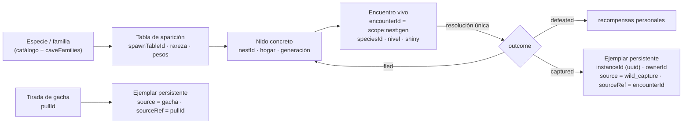
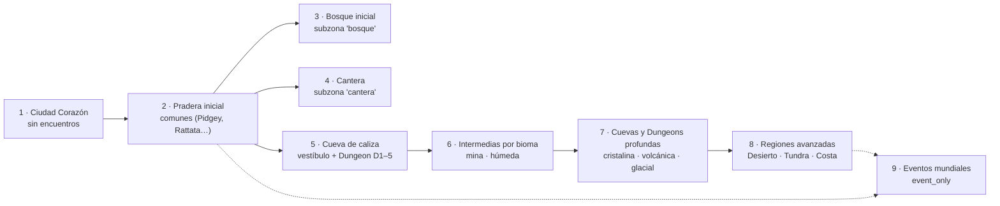

# CAVE ECOSYSTEM-1 — Múltiples ejemplares, rareza y ecología MMO

> Rama `design/cave-ecosystem-0.3`, sobre `4196555` (HEAD verificado: `41965550`). Sólo diseño: no se modificó código, SQL, tests ni assets.
> Etiquetas: **FACT** (verificado en `archivo:línea` sobre `2652a58`), **INFERENCE** (deducido, no ejecutado), **OPEN QUESTION** (requiere decisión).
> Este documento **corrige la premisa** de la serie. Donde contradiga a `SHARED_DUNGEON_ARCHITECTURE.md`, `CAVE_TYPES_AND_FAMILIES.md`, `CAVE_RESPAWN_AND_TOKENS.md` o `CAVE_ECOSYSTEM_ROADMAP.md`, prevalece este. Esos cuatro se actualizaron en consecuencia.

---

## 0. Resumen

- **Decisión de producto vigente.** Toda especie puede tener muchos ejemplares; cada ejemplar tiene un `instanceId` único y como máximo un dueño; no hay unicidad global por `speciesId`. La disponibilidad se regula con tablas de aparición, rareza y contenido. Legendarios y míticos quedan para eventos.
- **El repositorio todavía implementa la regla vieja.** `slots` tiene `PRIMARY KEY (pokemon_id)`. Mercado, swap, XP, ownership del realtime, pool salvaje, companion y varios tests tratan la especie como si fuera el individuo. Hay 30 supuestos inventariados en §2.
  - El modelo R32 (`PokemonInstance`, `instanceId: string`) ya existe como dominio puro y **no** está conectado a producción.
  - La corrección necesita una migración propia, **INSTANCES-1**, antes de cualquier captura o gacha.
- **D-EC1 y D-GA1 quedan resueltos.** CAVE WILD-1 deja de estar bloqueado, porque no crea ejemplares. GACHA-1 ya no depende del stock: su dependencia real es INSTANCES-1.
- **Rareza MMO de seis tiers** (`common` … `event_only`), autorada por tabla de aparición e independiente de `catchRate`, poder, valor y etapa.
- **Mapa inicial por capas:** Ciudad → Pradera → Bosque → Cantera → Cueva de caliza → intermedias → profundas → regiones → eventos. Pradera y Bosque usan subzonas que ya existen en `resourceZones.js`.
- **Captura futura recomendada:** intención de captura declarada, sorteo ponderado por contribución entre los elegibles que la declararon, y resultado único `defeated | captured | fled`. El ejemplar persistente se crea en la misma transacción que la resolución.
- **El riesgo económico cambió de lugar.** El stock ya no se agota. Ahora el problema es la **sobreoferta**: sin límites, la captura futura produciría ~84 ejemplares por jugador y por semana (§10). Hacen falta Balls consumibles, un tope diario y ligar los ejemplares a la cuenta antes de abrir el mercado.

---

## 1. Decisión de múltiples ejemplares

| Regla | Consecuencia de diseño |
| --- | --- |
| Toda especie puede tener múltiples ejemplares | `speciesId` es un **dato** del ejemplar, nunca su identidad. |
| Cada Pokémon individual tiene un `instanceId` único | Toda operación de ownership, bloqueo, XP, trabajo, mercado o party se indexa por `instanceId`. |
| Cada ejemplar tiene como máximo un dueño | INV-OWN-1 (`docs/INVARIANTS.md:74-80`) sigue vigente **leída por ejemplar**. Su FACT histórico ("`slots` tiene una fila por Pokémon") queda obsoleto. |
| Varios jugadores pueden poseer la misma especie | Desaparece toda exclusión "especie con dueño". |
| Encuentros salvajes y de Dungeon = ejemplares individuales | Cada encuentro es un candidato a ejemplar (`encounterId` + generación) y se resuelve una sola vez. |
| Tras un respawn aparece un encuentro nuevo | Otro `encounterId`, aunque sea de la misma especie. |
| La disponibilidad la regula el contenido | Tablas de aparición, rareza, profundidad, horario y eventos (§6–§8). |
| Legendarios y míticos: sólo eventos | Tier `event_only`: nunca ambientales ni en el gacha ordinario. |

---

## 2. Auditoría: supuestos de unicidad por especie todavía presentes

Leyenda de veredicto:

- **R** = se retira, porque es una restricción global por especie;
- **I** = usa `speciesId` donde debería usar `instanceId`;
- **OK** = restricción por ejemplar o por especie que sigue siendo correcta.

### 2.1 Base de datos y RPCs

| # | Supuesto | Evidencia | Veredicto |
| --- | --- | --- | --- |
| U1 | `slots` indexada por especie: `PRIMARY KEY (pokemon_id)`, con un único `owner_id` | `scripts/integration/rc03-staging/01_prod_mirror.sql:8,22` | **R** — es la raíz de todo lo demás |
| U2 | `market_listings.pokemon_id` → FK a `pokemon(id)`: se lista una **especie** | `01_prod_mirror.sql:9,27` | **I** |
| U3 | `publish_market_listing(p_pokemon_id)` verifica y bloquea el slot por especie | `supabase/migrations/20260926001502_market_require_session.sql:177-237` | **I** |
| U4 | `buy_market_listing` transfiere con `INSERT INTO slots … ON CONFLICT (pokemon_id)` | `20260926001502_market_require_session.sql:82-95` | **I** |
| U5 | `cancel_market_listing` desbloquea por especie | `20260926001502_market_require_session.sql:171` | **I** |
| U6 | `transactions`, `token_ledger`, `activity_feed` referencian la especie | `01_prod_mirror.sql:10-12,34,37,41` | **I** para `transactions`; **OK** como dato informativo en ledger y feed (se agrega `instance_id`) |
| U7 | `pokemon_xp` con clave `(user_id, pokemon_id)`: XP por usuario × especie | `20260907_008_progression_xp_authority.sql:67-69`; `20260907_005_token_economy_rpcs.sql:133-135` | **I** — dos Geodude del mismo jugador compartirían XP y movimientos |
| U8 | `grant_pokemon_xp`, `spend_tokens_learn_move`, `award_dungeon_reward`, `consume_dungeon_energy` verifican `slots.pokemon_id` | `…008:60-61`; `…005:115-116`; `20260908_010_dungeon_reward.sql:39-40`; `20260908_011_dungeon_start_authority.sql:36-37,69-72` | **I** (energía y lock por ejemplar) |
| U9 | `collect_passive_tokens` suma sobre los slots del dueño | `…005:53-58` | **OK** en su forma (sumar por ejemplar), pero **R** en economía: con muchos ejemplares el ingreso pasivo escala sin techo — ver §11 |
| U10 | `world_owns_pokemon(user, pokemon_id)`: "a slot's pokemon_id is both the instance and its species" | `20260926002154_world_skills_authority.sql:235-248` | **I** |
| U11 | `world_player_state` devuelve la lista de **especies** trabajables | `…world_skills_authority.sql:225-230` | **I** |
| U12 | Pokédex: `(user_id, pokemon_id)` visto/registrado | `20260908_009_pokedex_authority.sql:28-29,65-66` | **OK** — la Pokédex **es** por especie |
| U13 | `slots` sólo lectura para clientes, escrituras sólo servidor | `20260926001322_slots_client_write_revoke.sql:16-18` | **OK** — se conserva para la tabla de ejemplares |
| U14 | `is_locked` y exclusión del mercado para Dungeon/trabajo | `…world_skills_authority.sql:228,246`; `…011:44-46` | **OK** por ejemplar |

### 2.2 Edge Functions

| # | Supuesto | Evidencia | Veredicto |
| --- | --- | --- | --- |
| U15 | `pokeswap-swap` sortea el Pokémon recibido de **todo** `pokemon` sin dueño filtrado: sólo excluye los propios | `supabase/functions/pokeswap-swap/index.ts:97-103` | **R** |
| U16 | …y lo asigna con `upsert({ pokemon_id, owner_id }, { onConflict: 'pokemon_id' })`: si la especie tenía dueño, el swap **se la quita** (INFERENCE de lectura; es la mecánica legacy que INV-PAY-3 intenta acotar) | `pokeswap-swap/index.ts:122-126`; `docs/INVARIANTS.md` INV-PAY-3 | **R** — con ejemplares, un swap crea o intercambia ejemplares, nunca reasigna el de otro (D-SW1) |
| U17 | La tabla de rareza del swap incluye `legendario` y usa `Math.random()` | `pokeswap-swap/index.ts:8-14,18,23,110` | **R** para legendarios (pasan a `event_only`); el RNG debe ser CSPRNG |
| U18 | Los flujos `market-*` y `dungeon-*` reciben `pokemon_id` | `supabase/functions/dungeon-start/index.ts:70`; `src/features/dungeon/api/dungeonApi.ts:18` | **I** |

### 2.3 Realtime

| # | Supuesto | Evidencia | Veredicto |
| --- | --- | --- | --- |
| U19 | Pool salvaje: excluye especies con dueño y no repite especie | `services/realtime/src/world/wildPopulation.js:64-77`; `wildService.js:96` | **R** |
| U20 | Id del salvaje por especie y época: `wild:<área>:<época>:<pokemonId>` | `wildPopulation.js:151` | **R** → `encounterId` con generación |
| U21 | Categoría ambiental `legendary` 2 % en superficie | `wildPopulation.js:47-57` | **R** → `event_only` |
| U22 | Ownership del worker: `{ instanceId, speciesId: instanceId }` | `world/persistence/playerData.js:83,132`; `world/pokemonOwnership.js:40`; `world/worldConfig.js:43` | **I** |
| U23 | `pokemonInstanceId` del protocolo WORLD es un **entero ≥ 1** (el id de especie) | `world/worldProtocol.js:55` | **I** — el `instanceId` de R32 es `string` (`src/features/pokemon/model/instance.ts:128`) |
| U24 | `byPokemon` bloquea por `instanceId` | `world/resourceAuthority.js:79,309,339` | **OK** — ya es por ejemplar; sólo cambia el tipo del id |
| U25 | Companion validado contra `slots` por especie | `services/realtime/src/auth/supabaseAuth.js:30-34` | **I** |
| U26 | Shiny ambiental 1/64, derivado del hash (especie, época) | `wildPopulation.js:29,152` | **I** — el shiny pasa a ser un atributo del ejemplar sorteado con CSPRNG (§7.10) |

### 2.4 Cliente

| # | Supuesto | Evidencia | Veredicto |
| --- | --- | --- | --- |
| U27 | Mapa `Record<number, Slot>` por especie, e identidad y caja por `pokemon_id` | `src/features/wildlands/lobby/api/plazaApi.ts:9-13`; `src/features/pokemon/api/pokemonApi.ts:39-41`; `src/features/wildlands/identity/playerIdentity.ts:22-23`; `src/features/market/components/MarketView.vue:23-24` | **I** |
| U28 | Oculta salvajes cuya especie tiene dueño | `src/features/pokemon/domain/wildPool.ts:11-12`; `wildlands/lobby/usePlazaData.ts:61`; `wildlands/engine/population.ts:66-72` | **R** |

### 2.5 Tests, fixtures y documentación

| # | Supuesto | Evidencia | Veredicto |
| --- | --- | --- | --- |
| U29 | Tests que **exigen** unicidad: *"each wild Pokémon exists once, is unowned"*; *"immediately hides acquired pool members"* | `services/realtime/src/world/wildPopulation.test.js:23-29`; `src/features/pokemon/domain/wildPool.test.ts:10` | **R** (se reemplazan por tests de tablas de aparición) |
| U30 | Documentación que afirma la unicidad: `legacy.ts` ("there is one Pikachu"), `POKEMON_PROFESSION_SYSTEM.md` ("un dueño global"), `HANDOFF.md` (población sin duplicar especies) y esta serie (D-EC1/D-GA1, agotamiento) | `src/features/pokemon/model/legacy.ts:4-8`; `docs/economy/POKEMON_PROFESSION_SYSTEM.md:17`; `docs/wildlands/HANDOFF.md:264` | `legacy.ts` es **OK** como descripción del legacy. Los docs de producto quedan **desactualizados** (se corrigen en su fase). Esta serie se corrige **aquí**. |

Fuera de esta serie no se modificó ningún documento (alcance: sólo `docs/design/`). `POKEMON_PROFESSION_SYSTEM.md` y `HANDOFF.md` quedan anotados para INSTANCES-1.

### 2.6 Qué ya está bien

- **R32 ya define el individuo:** `PokemonInstance.instanceId: string`, `speciesId` como dato, `Ownership { ownerId, originalTrainerId }`, `acquisition.source`, `shiny`, `state: 'owned' | 'expeditionPending'` y la transición `secureCapture` (`src/features/pokemon/model/instance.ts:108-129,124,259`).
- **Migración legacy aprobada:** un backfill determinista por hash (M-1, `src/features/pokemon/model/migration.ts` cabecera).
- **`AcquisitionSource`** tiene `starter`, `adoption`, `market`, `trade`, `swap`, `dungeon_capture`, `event` y `legacy_migration` (`instance.ts:46-54`). Faltan `wild_capture` y `gacha` (extensión aditiva, prevista: "new sources are new strings").

---

## 3. Modelo de instancia



| Capa | Identidad | Vive en | Persistencia | Mutabilidad |
| --- | --- | --- | --- | --- |
| Especie / familia | `speciesId`, `familyId` | catálogo (`core.json`) + `caveFamilies.js` | código | inmutable |
| Tabla de aparición | `spawnTableId` + `rulesVersion` | código (`spawnTables.js`) | código versionado | por PR |
| Nido | `(scopeId, nestId)` | realtime + `dungeon_nests` | generación y `respawnAt` | servidor |
| Encuentro | `encounterId` | realtime | resolución en `encounter_resolutions` | una vez |
| Ejemplar | `instanceId` (uuid) | `pokemon_instances` (a crear) | Postgres | servidor (XP, desgaste, dueño) |

**Reglas del ejemplar:**

1. `instanceId` es un UUID generado **en Postgres**, dentro de la transacción que lo crea. Nunca lo elige el cliente ni el realtime.
2. `UNIQUE (acquisition_source, source_ref)`: un mismo encuentro o una misma tirada no pueden crear dos ejemplares.
3. `owner_id` tiene a lo sumo un valor. Transferirlo es un `UPDATE … WHERE instance_id = $1 AND owner_id = $old AND NOT is_locked` (CAS).
4. `speciesId`, `formId`, `natureId`, IVs, `shiny` y `gender` se sortean al **crear**, con CSPRNG del servidor. Para ejemplares migrados, con el hash M-1.
5. Estados: `owned`, `expeditionPending` (R32), y `account_bound_until` como campo para el período sin venta.

---

## 4. Migraciones futuras necesarias (sólo enumeradas)

| Orden | Migración | Qué cambia | Riesgo |
| --- | --- | --- | --- |
| M1 | `pokemon_instances` (R32) | Tabla nueva por ejemplar, RLS de lectura propia y escritura sólo servidor | Aditiva |
| M2 | Backfill `slots` → `pokemon_instances` | Un ejemplar por fila de `slots` con dueño, con el hash M-1 y `source = legacy_migration` | Irreversible por diseño: sólo con aprobación humana |
| M3 | `pokemon_xp` → por `instance_id` | La XP de (usuario, especie) pasa a su ejemplar migrado | Dos claves conviven durante la transición |
| M4 | Mercado por `instance_id` | `market_listings.instance_id`, y RPCs publish, cancel y buy con CAS por ejemplar | Listados abiertos al migrar |
| M5 | `transactions`, `token_ledger`, `activity_feed` + `instance_id` | Aditiva (se conserva `pokemon_id` como dato) | — |
| M6 | Ownership WORLD | `world_owns_pokemon(user, instance uuid)`, `world_player_state` con ejemplares, `pokemonInstanceId` string en el protocolo (nueva versión de protocolo) | Clientes viejos: `client-outdated` |
| M7 | Swap | Rediseño (D-SW1): crear o intercambiar ejemplares, nunca `upsert` por especie | Mecánica de producto |
| M8 | Retiro de `slots` como autoridad | `slots` queda como vista o se elimina cuando nada la lea (AGENTS §14) | Último paso |
| M9 | Energía, locks y companion por ejemplar | `consume_dungeon_energy`, `supabaseAuth` companion | — |

Ninguna se implementa en esta serie. Es la fase **INSTANCES-1** del roadmap.

---

## 5. Jerarquía de rareza

### 5.1 Cinco dimensiones distintas

| Dimensión | Qué mide | Dónde se define | Ejemplo |
| --- | --- | --- | --- |
| **Rareza de aparición** | Con qué frecuencia aparece en **esta** tabla | Entrada de la tabla de aparición (`rarityTier` + `weight`) | Geodude es `common` en la Cantera y `rare` en una tabla de Pradera |
| Dificultad de captura | Probabilidad de éxito de una captura | Fórmula de captura (`catchRate` del catálogo, `capture.ts`) + modificadores | Onix: `catchRate` 45 |
| Poder de combate | Cuánto cuesta derrotarlo | Nivel de la entrada + stats del catálogo | Graveler nivel 12 |
| Valor económico | Qué vale para el jugador o el mercado | Mercado (cuando se abra) | — |
| Etapa evolutiva | Base, intermedia, final | Familia (`caveFamilies.js`, hueco H1) | Golem = final |

Pueden correlacionarse (una final suele ser rara y fuerte), pero **ninguna se infiere de otra**. La rareza es un dato autorado de la tabla. `catchRate` sirve sólo como control de cordura en revisión.

### 5.2 Tiers

| Tier | Peso orientativo (share de la tabla) | Frecuencia esperada por aparición | Zonas permitidas | Profundidad mínima | Evolución permitida | Tiempo medio hasta verlo* | Captura | Drops | Gacha |
| --- | --- | --- | --- | --- | --- | --- | --- | --- | --- |
| `common` | 50–70 % | 1 de cada 1,5–2 | todas | — | base (intermedias sólo por excepción autorada) | < 1 min | éxito alto | fórmula normal | huevo ordinario |
| `uncommon` | 20–32 % | 1 de cada 3–5 | todas salvo Ciudad | — | base e intermedia | 1–2 min | éxito medio | normal | huevo ordinario |
| `rare` | 5–20 % | 1 de cada 5–20 | desde Pradera | intermedias: piso ≥ 3 en Dungeons | base e intermedia; final de 2 etapas | 1,5–7 min | éxito bajo | normal | huevo ordinario, con pity |
| `very_rare` | 0,5–6 % | 1 de cada 17–200 | desde Pradera (sólo intermedias), finales en pisos profundos | finales: piso ≥ 5 en Dungeons tier ≥ C | intermedia y final | 3–80 min | éxito muy bajo | normal | huevo ordinario, muy bajo |
| `special` | 0–2 % | 1 de cada ≥ 50 | sólo contenido avanzado (Dungeons tier ≥ B, pisos finales) o configuración explícita | piso ≥ 7 | formas base de pseudos; finales como jefe | ≥ 8 min en la zona | éxito mínimo o sólo por jefe | normal | **sólo banners especiales** |
| `event_only` | 0 en tablas ambientales | — | sólo tablas con `eventId` y ventana | — | según el evento | — | lo define el evento | lo define el evento | **nunca** en gacha ordinario; banner de evento sólo por configuración server-side |

\* Minutos hasta que **aparece** un ejemplar de ese tier en la zona con 30 jugadores (simulación §10.1). "Verlo" depende de dónde esté el jugador; capturarlo, de la contención.

**Reglas:**

1. **La rareza es por entrada de tabla, no por especie.** Una especie puede ser `common` en su hábitat y `rare` fuera de él.
2. **La rareza no suma tokens** (se mantiene `CAVE_RESPAWN_AND_TOKENS.md` §5.2). Rareza es acceso, no multiplicador.
3. **No se puede acampar un nido para buscar raros.** El tier se sortea en cada aparición sobre la tabla de la zona, no en un nido fijo. Los nidos autorados "de firma" (p. ej. la cámara de Onix) son la excepción explícita.

---

## 6. Categorías especiales

El catálogo local es Gen I–IV, 493 especies (`core.json`). **No contiene** Ultraentes ni formas regionales: tiene 69 formas no por defecto y ninguna es regional; las no-Mega son Deoxys, Wormadam, Shaymin, Giratina, Rotom, Castform, las primales y los Pikachu con disfraz. Esas reglas quedan **prospectivas**.

| Categoría | Ids (verificados) | Regla |
| --- | --- | --- |
| Legendarios | 144–146, 150, 243–245, 249, 250, 377–384, 480–488 | `event_only`. Nunca ambientales ni en gacha ordinario. |
| Míticos | 151, 251, 385, 386, 489–493 | `event_only`. |
| Ultraentes | — (fuera del catálogo) | Si el catálogo se amplía: `event_only` o contenido especial autorado, nunca ambiental ordinario. |
| Pseudo-legendarios | 147–149, 246–248, 371–376, 443–445 | Forma base: `special` en contenido avanzado (Beldum y Bagon en `cristalina` pisos 7–8; Larvitar y Gible en `volcanica` pisos 6–7; Dratini en `humeda` piso 6). Intermedias y finales: no ambientales; sólo evento o jefe. Gacha: sólo banner especial. |
| Starters | 1–9, 152–160, 252–260, 387–395 | Nunca ambientales. Sólo recompensas, elección inicial, misión o banner especial. |
| Fósiles | 138–142, 345–348, 408–411 | Por restauración (fragmento fósil como drop `rare`/`very_rare` en `caliza`/`mina` profundas) o evento. Nunca nidos. |
| Eevee y demandadas | 133–136, 196, 197, 470, 471; y Pikachu (25) como demandada ambiental | Eevee: `special`, sin tabla ambiental v1, sólo evento o banner especial. Pikachu: `rare` en Pradera; Raichu no ambiental. |
| Formas regionales | — (fuera del catálogo) | Una entrada de tabla propia (`formId`) en su región. Las comunes regionales, desde el inicio. |
| Exclusivas de evento | cualquier especie marcada por evento | Sólo tablas con `eventId` y `enabledFrom`/`enabledUntil`. |
| Evoluciones finales | — | `very_rare` en pisos ≥ 5 de Dungeons tier ≥ C, o jefes. En superficie inicial, no. Excepción: especies de una sola etapa (Dunsparce, Torkoal, Sableye…), que no cuentan como "finales". |
| Bebés | 172, 173, 174, 175, 236, 238–240, 298, 360, 406, 433, 438–440, 446, 447, 458 | No ambientales salvo excepción autorada (Bonsly en `caliza`, Chingling en `cristalina`, ya aprobadas en los pools). |
| Shiny | — | El repo ya lo contempla: 1/64 en salvajes (`wildPopulation.js:29`), 1/128 en swap (`pokeswap-swap/index.ts:4`) y `PokemonInstance.shiny`. Con ejemplares capturables, un shiny es un **atributo del ejemplar**, sorteado con CSPRNG al aparecer, independiente del tier, y lo hereda la captura. Playtest: **1/512** (1/64 es alto para un MMO con captura). OPEN QUESTION D-SH1. |

Verificación: todos los ids se comprobaron en `core.json`. Los bebés se listan por conocimiento canónico (hueco H1: el catálogo no tiene familias).

---

## 7. Mapa MMO por capas



Anclas existentes (FACT):

- Pradera, seed 208, llegada `(-5,-69)` (`protocol/arrival.js:16`).
- Subzona `bosque`, caja `(-19,-54)–(2,-37)` (`resourceZones.js:37`).
- Subzona `cantera`, caja `(3,-76)–(18,-63)` (`resourceZones.js:42`).
- Rutas `al-bosque` y `a-la-cantera` (`resourceZones.js:59-60`).
- Cueva `(-26,-74)` (`caves.js:71-80`).
- Ciudad sin mundo dinámico (`areas.js:13`).
- Los otros cuatro mundos existen en el Atlas sin presencia (`atlas.ts:13`).

Reglas comunes a todas las zonas de superficie:

- Nada en la reserva de la llegada, en rutas, stands o esperas de trabajo, portales o la reserva de la cueva (misma lista que `CAVE_RESPAWN_AND_TOKENS.md` §2.3).
- Respawn por nido de 75 s ± 20 %; nidos activos `min(12, 4 + ⌈p/2⌉)`.
- El tier se sortea por aparición.

### 7.1 Capa 1 — Ciudad Corazón y aproximación segura

Sin encuentros. En Pradera, la aproximación a la llegada (radio 6 alrededor de `(-5,-69)`) no admite nidos: el jugador nuevo nunca aparece junto a un encuentro.

### 7.2 Capa 2 — Pradera inicial (`pradera`, fuera de subzonas)

Nivel 2–5. Densidad baja. Horario según §9.3.

| Familia | Miembro | Tier | Peso | Horario | Motivo |
| --- | --- | --- | --- | --- | --- |
| Pidgey | 16 Pidgey | common | 24 | siempre | Ave inicial reconocible |
| Rattata | 19 Rattata | common | 24 | siempre | Roedor inicial |
| Sentret | 161 Sentret | common | 12 | siempre | Roedor de pradera |
| Bidoof | 399 Bidoof | common | 10 | siempre | Roedor Sinnoh (la región del proyecto) |
| Hoppip | 187 Hoppip | uncommon | 8 | día | Planta ligera, sólo con viento/día |
| Hoothoot | 163 Hoothoot | uncommon | (8) | noche | Reemplaza a Hoppip de noche (mismo peso) |
| Nidoran♀ | 29 Nidoran♀ | uncommon | 5 | siempre | Clásico de pradera |
| Nidoran♂ | 32 Nidoran♂ | uncommon | 5 | siempre | Idem |
| Shinx | 403 Shinx | uncommon | 6 | siempre | Eléctrico de pradera Sinnoh |
| Pikachu | 25 Pikachu | rare | 2 | siempre | Demandado: raro, no común |
| Pidgey | 17 Pidgeotto | rare | 1,5 | siempre | Intermedia |
| Rattata | 20 Raticate | rare | 1,5 | siempre | Final de 2 etapas, bajo peso |
| Sentret | 162 Furret | rare | 0,5 | siempre | Idem |
| Nidoran | 30 Nidorina · 33 Nidorino | very_rare | 0,25 + 0,25 | siempre | Intermedias |

- **Shares:** common 70 · uncommon 24 · rare 5,5 · very_rare 0,5 = 100. Los pesos de día y de noche suman lo mismo porque Hoppip y Hoothoot se reemplazan.
- **Excluidos de la Pradera:** Pidgeot, Nidoqueen/Nidoking, Luxray, Raichu, Pichu, Staraptor, bebés, starters y Eevee.
- Se auditaron Starly, Zigzagoon, Poochyena, Spearow, Mareep, Kricketot y Skitty (existen en el catálogo). Quedan **fuera** para mantener un pool chico y reconocible. Starly y Kricketot se pueden rotar por temporada.

### 7.3 Capa 3 — Bosque inicial (subzona `bosque`)

Nivel 3–7.

| Familia | Miembro | Tier | Peso | Horario |
| --- | --- | --- | --- | --- |
| Caterpie | 10 Caterpie | common | 24 | siempre |
| Weedle | 13 Weedle | common | 24 | siempre |
| Oddish | 43 Oddish | common | 12 de día · 22 de noche (ocupa el peso de Pidgey) | siempre |
| Pidgey | 16 Pidgey | common | 10 | día |
| Caterpie | 11 Metapod | uncommon | 6 | siempre |
| Weedle | 14 Kakuna | uncommon | 6 | siempre |
| Pineco | 204 Pineco | uncommon | 6 | siempre |
| Ledyba / Spinarak | 165 Ledyba (día) · 167 Spinarak (noche) | uncommon | 6 | alterna |
| Caterpie | 12 Butterfree | rare | 1,5 | día |
| Weedle | 15 Beedrill | rare | 1,5 | siempre |
| Oddish | 44 Gloom | rare | 1 de día · 4 de noche (ocupa Butterfree y Pidgeotto) | siempre |
| Pidgey | 17 Pidgeotto | rare | 1,5 | día |
| Pineco | 205 Forretress | very_rare | 0,5 | siempre |

- **Shares:** 70 · 24 · 5,5 · 0,5, iguales de día y de noche (las entradas de noche ocupan los pesos de las de día).
- **Exclusiones:** ningún hogar en stands o esperas de los árboles del bosque (WORLD VISUAL-2). Vileplume, Bellossom y Ariados/Ledian quedan para capas posteriores. Hoothoot, Venonat y Seedot se evaluaron y quedaron fuera por tamaño del pool.

### 7.4 Capa 4 — Cantera (subzona `cantera`)

Nivel 4–8.

| Familia | Miembro | Tier | Peso |
| --- | --- | --- | --- |
| Geodude | 74 Geodude | common | 34 |
| Sandshrew | 27 Sandshrew | common | 20 |
| Diglett | 50 Diglett | common | 16 |
| Machop | 66 Machop | uncommon | 10 |
| Cubone | 104 Cubone | uncommon | 8 |
| Phanpy | 231 Phanpy | uncommon | 6 |
| Geodude | 75 Graveler | rare | 2,5 |
| Sandshrew | 28 Sandslash | rare | 1,5 |
| Diglett | 51 Dugtrio | rare | 1 |
| Machop | 67 Machoke | rare | 0,5 |
| Onix | 95 Onix | very_rare | 0,5 |

- **Shares:** 70 · 24 · 5,5 · 0,5.
- **Onix:** sólo en casillas con `openWidth ≥ 5` de la cantera abierta, y nunca a menos de 3 casillas de un nodo de roca o de su stand.
- Temáticamente es la "cueva a cielo abierto". La cueva de caliza cambia el énfasis para no repetir el mismo pool.

### 7.5 Capa 5 — Cueva de caliza (vestíbulo + `caliza-d1`)

Reemplaza el pool de `CAVE_TYPES_AND_FAMILIES.md` §6.1. Nivel: vestíbulo 5–8; pisos 6–14.

| Familia | Miembro | Tier | Peso | Pisos (0 = vestíbulo) |
| --- | --- | --- | --- | --- |
| Zubat | 41 Zubat | common | 25 | 0–5 |
| Geodude | 74 Geodude | common | 20 | 0–5 |
| Whismur | 293 Whismur | common | 10 | 0–4 |
| Diglett | 50 Diglett | uncommon | 8 | 0–5 |
| Bonsly | 438 Bonsly (bebé, excepción autorada) | uncommon | 8 | 0–3 |
| Paras | 46 Paras | uncommon | 7 | 2–4 |
| Sandshrew | 27 Sandshrew | uncommon | 7 | 2–5 |
| Geodude | 75 Graveler | rare | 4 | 3–5 |
| Zubat | 42 Golbat | rare | 3 | 4–5 |
| Bonsly | 185 Sudowoodo | rare | 2 | 3–5 |
| Whismur | 294 Loudred | rare | 1,5 | 4–5 |
| Diglett | 51 Dugtrio | rare | 1,5 | 5 |
| Dunsparce | 206 Dunsparce | very_rare | 1,5 | 3–5, sólo cámaras |
| Paras | 47 Parasect | very_rare | 0,75 | 4 |
| Onix | 95 Onix | very_rare | 0,75 | 5, cámara ≥ 9 |

- **Shares:** common 55 · uncommon 30 · rare 12 · very_rare 3 · special 0, sobre la tabla completa. En cada piso se renormaliza entre las entradas disponibles, así que los pisos profundos tienen más share de raros. Lo mismo vale para `mina` y `cristalina`.
- El **vestíbulo** usa sólo las entradas `common` y `uncommon` con piso 0.
- Golem, Crobat y Exploud no son ambientales: quedan como jefe o evento futuro.

### 7.6 Capas 6–9 (resumen)

| Capa | Zonas | Rareza | Especiales | Nivel |
| --- | --- | --- | --- | --- |
| 6 · Intermedias | `mina` (tier C), `humeda` (tier C) | 55 · 30 · 12 · 3 · 0 | Dratini `special` sólo en `humeda` piso 6 | 12–25 |
| 7 · Profundas | `cristalina` (§7.7), `volcanica`, `glacial` (tier B) | 40 · 32 · 20 · 6 · 2 | Beldum, Bagon (`cristalina`); Larvitar, Gible (`volcanica`) | 25–40 |
| 8 · Regiones avanzadas | Desierto, Tundra, Costa (hoy en el Atlas sin presencia, `atlas.ts:13`) | tablas propias con comunes regionales desde el inicio | según región | 30+ |
| 9 · Eventos mundiales | cualquier área, con `eventId` y ventana | `event_only` + las comunes del evento | legendarios y míticos por configuración | según evento |

**`mina` (reemplaza a `CAVE_TYPES_AND_FAMILIES.md` §6.2):**
- common: Geodude 18 · Aron 14 · Magnemite 12 · Machop 11;
- uncommon: Zubat 8 · Nosepass 8 · Makuhita 8 · Graveler 6;
- rare: Lairon 4 · Magneton 3 · Machoke 3 · Golbat 2;
- very_rare: Onix 1,5 (cámaras) · Hariyama 1 · Golem 0,5 (piso 6).

Suma 100.

### 7.7 `cristalina` (reemplaza a `CAVE_TYPES_AND_FAMILIES.md` §6.3)

| Tier | Entradas (peso, pisos) |
| --- | --- |
| common (40) | Bronzor 16 (1–8) · Clefairy 14 (1–8) · Chingling 10 (1–6) |
| uncommon (32) | Aron 10 (2–6) · Nosepass 10 (2–8) · Lairon 6 (4–8) · Chimecho 6 (4–8) |
| rare (20) | Bronzong 6 (5–8) · Sableye 5 (3–8) · Mawile 5 (3–8) · Lunatone 2 (5–8) · Solrock 2 (5–8) |
| very_rare (6) | Clefable 2,5 (7–8) · Probopass 2 (7–8) · Aggron 1,5 (8) |
| special (2) | Beldum 1 (7–8) · Bagon 1 (8) |

---

## 8. Familias y evolución

| Regla | Detalle |
| --- | --- |
| La familia es la unidad de diseño | Una tabla lista **miembros de familias**, no especies sueltas. Toda especie pertenece a una familia en `caveFamilies.js` (hueco H1, con test contra `core.json`). |
| Base en regiones tempranas | Capas 2–5: formas base como `common`/`uncommon`. |
| Intermedia después | `rare` en capas 2–4. `uncommon` desde la capa 6 o desde el piso 3 de una Dungeon. |
| Final en contenido profundo | `very_rare` desde el piso 5 de Dungeons tier ≥ C. En superficie sólo las finales de 2 etapas (Raticate, Furret) y con peso ≤ 1,5. Finales de 3 etapas: nunca en capas 2–5. |
| Excepciones autoradas | Se declaran en la entrada con `exception: '<motivo>'` y exigen revisión (p. ej. Bonsly en caliza, Butterfree de día en el bosque). |
| Sin evolución | Una especie de una etapa (Dunsparce, Torkoal, Sableye, Mawile, Lunatone…) no es "final": su tier lo fija su rareza temática. |
| Ramificaciones | Cada rama es una entrada con su propio peso (Slowbro/Slowking, Glalie/Froslass, Vileplume/Bellossom, Beautifly/Dustox). Nunca se sortea la rama al evolucionar un salvaje. |
| Bebés | No ambientales salvo excepción autorada (§6). |
| Tamaño y pasillos | L/XL sólo en cámaras (`openWidth ≥ 5`). XL también en superficie abierta. Guarda de CAVE WILD-1. |
| Variantes regionales | Entradas propias por `formId`, cuando el catálogo las tenga. |

---

## 9. Esquema de tablas de aparición

### 9.1 Separación de conceptos

| Concepto | Identidad | Contiene | Autoridad |
| --- | --- | --- | --- |
| Especie / familia | `speciesId`, `familyId` | tipos, stats, `catchRate` (catálogo), miembros y etapas, tamaño, categoría especial | código (catálogo + `caveFamilies.js`) |
| Tabla de aparición | `spawnTableId` + `rulesVersion` | entradas con rareza, peso, pisos, nivel, horario, clima, condiciones y evento | código versionado (`spawnTables.js`) |
| Nido concreto | `(scopeId, nestId)` | hogar, radio, etiquetas (agua, cámara, tamaño máximo), generación, estado | realtime + `dungeon_nests` |
| Encuentro vivo | `encounterId` = `scope:nest:gen` | entrada sorteada, especie, nivel, shiny, patrulla, participantes | realtime |
| Ejemplar capturado | `instanceId` (uuid) | especie, forma, IVs, naturaleza, dueño, `source`, `sourceRef` | Postgres |

### 9.2 Campos

```text
SpawnTable {
  spawnTableId: 'pradera.base' | 'pradera.bosque' | 'caliza.d1' | …   // estable
  rulesVersion: 'spawn-2026.10.1'                                        // viaja en cada resolución
  areaId: 'pradera' | 'cueva-inicial' | 'dg:caliza-d1:*'
  subzoneId: 'bosque' | 'cantera' | null          // resourceZones.js
  biome: 'grassland' | 'forest' | … | null        // filtro opcional del hogar
  caveType: 'caliza' | … | null
  floorMin, floorMax                              // 0 = vestíbulo; null en superficie
  eventId: null | 'evt-…'
  enabledFrom, enabledUntil                       // epoch ms del servidor; null = permanente
  entries: SpawnEntry[]
}
SpawnEntry {
  familyId, members: [speciesId…]                 // miembros permitidos (normalmente 1 por entrada)
  rarityTier: 'common'|'uncommon'|'rare'|'very_rare'|'special'|'event_only'
  weight                                          // relativo dentro de la tabla, >0
  level: [min, max]
  floorMin, floorMax
  hours: 'any'|'day'|'night'|'dawn_dusk'
  weather: 'any'|'clear'|'rain'|'snow'
  maxAlive                                        // simultáneos de ESTA entrada en el scope (1 para raros)
  respawnSec                                      // cooldown del nido tras resolverse
  homeRadius, homeTags: ['chamber','water','open'], maxSize: 'S'|'M'|'L'|'XL'
  conditions: []                                  // p. ej. 'quest:x', 'weather:rain'
  exception: null | '<motivo>'
}
```

**Validaciones (test de CAVE WILD-1):**

- Una entrada `event_only` sólo existe en tablas con `eventId`.
- `special` sólo en tablas de tier ≥ B, o con `eventId`.
- Legendarios, míticos y starters no aparecen en ninguna tabla sin `eventId`.
- Las finales de 3 etapas no aparecen en capas 2–5.
- La suma de pesos es > 0 en cada combinación horario × clima.
- Todo `speciesId` existe en `core.json`.

### 9.3 Horario y clima

**Horario:**
- El día dura 240 s (`src/features/wildlands/engine/atmosphere.ts:9`).
- Cada cliente lo desplaza con `clockShift` (`engine/game.ts:210,822,905`): la fase del día **no** es igual para todos los jugadores.
- Por eso las condiciones de aparición no pueden usar la fase que muestra el cliente. Se recomienda un **reloj de aparición del servidor** con bandas de 20 min reales (día, noche, amanecer/atardecer), independiente del ciclo visual de 4 min. OPEN QUESTION D-TM1: alinear el ciclo visual con esas bandas.

**Clima:**
- `weatherAt` es una función pura del cliente (`atmosphere.ts:68`).
- Para usarla como condición de aparición hay que portarla a JS compartido, como `patrol.js`.
- Hasta entonces, `weather: 'any'`.

### 9.4 Selección en el servidor

```text
al activarse un nido (scopeId, nestId, generación g):
  candidatas = entradas de la tabla del scope que cumplen piso, horario, clima, ventana,
               etiquetas del hogar, tamaño y maxAlive
  entrada = sorteo ponderado CSPRNG sobre candidatas
  especie = entrada.members (uno, o sorteo si hay varios)
  nivel   = uniforme [level] · shiny = CSPRNG < 1/512
  encuentro = { encounterId: scope:nest:g, entrada, especie, nivel, shiny, rulesVersion }
```

---

## 10. Simulación (valores de playtest, no balance)

Script `mmo_sim.mjs` (§10.7): determinista, calcula valores esperados. Supuestos:

- 6 áreas con jugadores repartidos;
- nidos activos `min(12, 4 + ⌈p/2⌉)`;
- ciclo del nido = 75 s de respawn + 45 s vivo;
- un jugador activo busca 30 encuentros por hora;
- shares de tier de §7.

### 10.1 Tiempo hasta que aparece cada tier en la zona (minutos)

| Jugadores | Zona | Apariciones/h | common | uncommon | rare | very_rare | special |
| --- | --- | --- | --- | --- | --- | --- | --- |
| 1–10 | Pradera | 150 | 0,6 | 1,7 | 7,3 | 80 | — |
| 1–10 | Caliza | 150 | 0,7 | 1,3 | 3,3 | 13,3 | — |
| 1–10 | Cristalina | 150 | 1,0 | 1,3 | 2,0 | 6,7 | 20 |
| 30 | Pradera | 210 | 0,4 | 1,2 | 5,2 | 57,1 | — |
| 30 | Caliza | 210 | 0,5 | 1,0 | 2,4 | 9,5 | — |
| 30 | Cristalina | 210 | 0,7 | 0,9 | 1,4 | 4,8 | 14,3 |
| 100 | Pradera | 360 | 0,2 | 0,7 | 3,0 | 33,3 | — |
| 100 | Caliza | 360 | 0,3 | 0,6 | 1,4 | 5,6 | — |
| 100 | Cristalina | 360 | 0,4 | 0,5 | 0,8 | 2,8 | 8,3 |

Fórmula: `t(tier) = 60 / (apariciones_h × share(tier))`, con `apariciones_h = nidos × 3600 / 120`.

**Lectura.**

- Más jugadores implica más nidos activos, y los raros aparecen antes en la zona. Pero hay más gente para cada uno.
- Un `very_rare` de Pradera aparece ~1 vez por hora con 30 jugadores: raro, pero visible.
- Un `special` de `cristalina` aparece cada 8–20 minutos en la zona. Como está limitado a los pisos 7–8 (renormalización), lo que ve cada jugador depende de su piso.

### 10.2 Encuentros por jugador

| Jugadores | Oferta por área (encuentros/h) | Demanda (encuentros/h) | Encuentros propios por jugador/h | Como elegible (hasta 4 por combate) |
| --- | --- | --- | --- | --- |
| 10 | 150 | 50 | 30 | 30 |
| 30 | 210 | 150 | 30 | 30 |
| 100 | 360 | 500 | 21,6 | 30 |

Con 100 jugadores la oferta se satura. La participación compartida mantiene el ritmo de recompensas, pero **no** el de capturas: una captura es un solo ganador por encuentro (§11).

### 10.3 Ejemplares por captura (futura, 30 jugadores, sin tope)

Supuestos: intento de captura en 40 % de los encuentros propios; éxito por tier 50 / 35 / 20 / 10 / 5 %. Horas por día: casual 1, activo 2, avanzado 4.

| Arquetipo (zona) | Por semana | common | uncommon | rare | very_rare | special |
| --- | --- | --- | --- | --- | --- | --- |
| casual (Pradera) | 37,4 | 29,4 | 7,1 | 0,9 | 0,0 | — |
| activo (Caliza) | 68,4 | 46,2 | 17,6 | 4,0 | 0,5 | — |
| avanzado (Cristalina) | 121 | 67,2 | 37,6 | 13,4 | 2,0 | 0,3 |

Con tope de **10 capturas exitosas por día**: el avanzado baja a 70 por semana; el casual y el activo no cambian.

### 10.4 Gacha sin stock global

Tokens del foco por día: salida de `econ.mjs` (`CAVE_RESPAWN_AND_TOKENS.md` §7.2). Tiers ordinarios del huevo (§12.3).

| Economía | Costo | Pity (raro+) | E[tiradas hasta raro+] | Casual: tiradas/sem · semanas hasta raro+ | Activo | Avanzado |
| --- | --- | --- | --- | --- | --- | --- |
| Accesible | 40 | 25 | 14,5 | 1,9 · 7,6 | 11,6 · 1,3 | 41,5 · 0,3 |
| Media | 80 | 35 | 20,4 | 0,9 · 21,5 | 5,8 · 3,5 | 18,3 · 1,1 |
| Lenta | 150 | 50 | 28,7 | 0,5 · 57 | 3,1 · 9,3 | 9,1 · 3,2 |

Cada tirada = **1 ejemplar nuevo**. No hay agotamiento: la conclusión anterior ("un banner se agota en 0,1–4,5 días") **queda invalidada**, porque dependía de una unidad global por especie. Se conserva en `CAVE_RESPAWN_AND_TOKENS.md` §7.3, marcada como histórica.

### 10.5 Inflación por especie y familia, duplicados y almacenamiento

Ejemplares nuevos por semana (captura sin tope + gacha "media"):

| Jugadores | Ejemplares/semana | Por jugador | Especie común de Pradera* | Con tope de 10 capturas/día | Filas/año (con tope) |
| --- | --- | --- | --- | --- | --- |
| 10 | 838 | 83,8 | 30,2 | 669 | 34 800 |
| 30 | 2 514 | 83,8 | 90,7 | 2 008 | 104 401 |
| 100 | 8 380 | 83,8 | 302 | 6 692 | 348 002 |

\* Ejemplares de **una** especie común de Pradera: 24 % de las capturas de los casuales + su parte del tier común de un huevo de 8 especies comunes.

Duplicados dentro de un huevo (tier común, sorteo uniforme):

| Especies del tier (K) | 5 tiradas | 10 | 20 | 40 |
| --- | --- | --- | --- | --- |
| 8 | 22 % | 41 % | 63 % | 80 % |
| 15 | 13 % | 25 % | 44 % | 65 % |

Fórmula: distintas = `K × (1 − (1 − 1/K)^n)`; duplicados = `n − distintas`.

**Lectura.**

1. **La inflación ya no es de especies sino de ejemplares.** Una especie común acumula cientos de ejemplares por semana con 100 jugadores. Su valor de mercado tiende a 0 si se vende libremente. Por eso: ligado a la cuenta y **sin venta** hasta medir (D-GA3).
2. **Los duplicados son la norma** a partir de ~10 tiradas en huevos chicos. Hace falta un destino para ellos: liberar a cambio de 1 Esencia del tipo primario (un sumidero chico con tope diario) o una futura "transferencia". OPEN QUESTION D-IN2.
3. **Almacenamiento:** ~350 000 filas por año con 100 jugadores es trivial para Postgres. El problema es la **UX de la caja**, no la base: hace falta un límite de caja y filtros.
4. **Ingreso pasivo (U9):** `collect_passive_tokens` suma tokens por cada ejemplar con dueño. Con cientos de ejemplares por jugador, el ingreso pasivo explota. Hay que decidir antes de INSTANCES-1: contar sólo la party activa (6) o poner un tope por especie. D-IN1, **bloquea INSTANCES-1**.

### 10.6 Valores de playtest propuestos

- Pesos de tier de §7.
- Respawn de 75 s ± 20 %.
- Shiny 1/512.
- Captura con **Ball consumible** (D-CP2) y tope de 10 capturas exitosas por día.
- Gacha "media".
- Ejemplares ligados a la cuenta 30 días.
- Mercado cerrado para ejemplares nuevos hasta tener telemetría.

### 10.7 Script reproducible

`node mmo_sim.mjs` (Node ≥ 18). Las tablas de §10 son su salida literal.

`mmo_sim.mjs`:

```js
// CAVE ECOSYSTEM-1 · simulación MMO con múltiples ejemplares. Determinista (valores esperados).
const r = x => (x >= 100 ? Math.round(x) : Math.round(x * 10) / 10)
// 1 · Rareza: share de cada tier en la tabla de una zona (pesos de playtest, §5).
const ZONES = {
  pradera: { common: 70, uncommon: 24, rare: 5.5, very_rare: 0.5, special: 0 },
  caliza:  { common: 55, uncommon: 30, rare: 12, very_rare: 3, special: 0 },
  cristalina: { common: 40, uncommon: 32, rare: 20, very_rare: 6, special: 2 },
}
// 2 · Oferta de una zona: nidos activos según jugadores, ciclo = respawn + estancia viva media.
const MAX_NESTS = 12, CYCLE_S = 75 + 45
const nests = p => Math.min(MAX_NESTS, 4 + Math.ceil(p / 2))
const ENGAGE_PER_H = 30                                  // encuentros que un jugador activo quiere combatir por hora
console.log('## Tiempo esperado hasta que APAREZCA un ejemplar de cada tier en la zona (min)')
for (const players of [1, 10, 30, 100]) {
  const p = players / 6                                   // 6 áreas con jugadores repartidos
  const appearancesH = nests(Math.max(p, 1)) * 3600 / CYCLE_S
  for (const [zone, w] of Object.entries(ZONES)) {
    const total = Object.values(w).reduce((a, b) => a + b, 0)
    const cells = Object.entries(w).filter(([, x]) => x > 0).map(([t, x]) => `${t} ${r(60 / (appearancesH * x / total))}`)
    console.log(`${String(players).padStart(3)} jug · ${zone.padEnd(10)} apariciones/h ${r(appearancesH)} · ${cells.join(' · ')}`)
  }
}
// 3 · Encuentros por jugador por hora con contención (oferta compartida).
console.log('\n## Encuentros combatidos por jugador y hora (área con p jugadores)')
for (const players of [10, 30, 100]) {
  const p = players / 6, supply = nests(p) * 3600 / CYCLE_S, demand = p * ENGAGE_PER_H
  const perPlayerSolo = Math.min(ENGAGE_PER_H, supply / p)
  console.log(`${players} jug: oferta ${r(supply)}/h/área · demanda ${r(demand)}/h · encuentros propios ${r(perPlayerSolo)}/h · como elegible (hasta 4 por combate) ${r(Math.min(ENGAGE_PER_H, supply * Math.min(4, Math.max(1, demand / supply)) / p))}/h`)
}
// 4 · Ejemplares creados por captura (futura): intento en 40 % de los encuentros propios, éxito por tier.
const CAPTURE_TRY = 0.4
const CAPTURE_OK = { common: 0.5, uncommon: 0.35, rare: 0.2, very_rare: 0.1, special: 0.05 }
const ARCH = { casual: { h: 1, zone: 'pradera' }, activo: { h: 2, zone: 'caliza' }, avanzado: { h: 4, zone: 'cristalina' } }
console.log('\n## Ejemplares por captura por jugador y semana (30 jugadores, 7 días)')
const perPlayerEnc = Math.min(ENGAGE_PER_H, nests(5) * 3600 / CYCLE_S / 5)
for (const [a, { h, zone }] of Object.entries(ARCH)) {
  const w = ZONES[zone], total = Object.values(w).reduce((x, y) => x + y, 0)
  let week = 0; const byTier = {}
  for (const [t, x] of Object.entries(w)) { const v = perPlayerEnc * h * 7 * CAPTURE_TRY * (x / total) * CAPTURE_OK[t]; byTier[t] = v; week += v }
  console.log(`${a.padEnd(9)} ${r(week)}/semana · ${Object.entries(byTier).filter(([, v]) => v > 0).map(([t, v]) => `${t} ${r(v)}`).join(' · ')}`)
}
// 5 · Gacha sin stock global: tokens/día del foco (de econ.mjs, §7.2 de CAVE_RESPAWN_AND_TOKENS) y tabla de tiers.
const FOCUS_DAY = { casual: 10.8, activo: 66, avanzado: { accesible: 237, media: 208.6, lenta: 194.5 } }
const ECO = {
  accesible: { cost: 40, pity: 25, tiers: { common: 0.75, uncommon: 0.2, rare: 0.045, very_rare: 0.005 } },
  media:     { cost: 80, pity: 35, tiers: { common: 0.78, uncommon: 0.185, rare: 0.03, very_rare: 0.005 } },
  lenta:     { cost: 150, pity: 50, tiers: { common: 0.8, uncommon: 0.175, rare: 0.02, very_rare: 0.005 } },
}
const pRarePlus = t => t.rare + t.very_rare
function expectedToRarePlus(p, pity) { let e = 0, miss = 1; for (let n = 1; n <= pity; n++) { const hit = n === pity ? 1 : p; e += n * miss * hit; miss *= 1 - hit } return e }
console.log('\n## Gacha: tiradas por semana, ejemplares, pity')
for (const [eco, e] of Object.entries(ECO)) {
  const eRare = expectedToRarePlus(pRarePlus(e.tiers), e.pity)
  const rows = ['casual', 'activo', 'avanzado'].map(a => {
    const fd = typeof FOCUS_DAY[a] === 'number' ? FOCUS_DAY[a] : FOCUS_DAY[a][eco]
    const week = fd * 7 / e.cost
    return `${a} ${r(week)} tiradas/sem (≈ ${r(week)} ejemplares) · semanas hasta raro+ ${r(eRare / week)}`
  })
  console.log(`${eco}: E[tiradas hasta raro+] = ${r(eRare)} · ${rows.join(' | ')}`)
}
// 6 · Inflación por especie y familia: ejemplares nuevos por semana en toda la población.
console.log('\n## Ejemplares nuevos por semana (captura + gacha "media") y por especie')
const CAPTURE_WEEK = { casual: 0, activo: 0, avanzado: 0 }
for (const [a, { h, zone }] of Object.entries(ARCH)) {
  const w = ZONES[zone], total = Object.values(w).reduce((x, y) => x + y, 0)
  for (const [t, x] of Object.entries(w)) CAPTURE_WEEK[a] += perPlayerEnc * h * 7 * CAPTURE_TRY * (x / total) * CAPTURE_OK[t]
}
const GACHA_WEEK = { casual: 10.8 * 7 / 80, activo: 66 * 7 / 80, avanzado: 208.6 * 7 / 80 }
for (const players of [10, 30, 100]) {
  const perArch = players / 3
  const total = ['casual', 'activo', 'avanzado'].reduce((s, a) => s + perArch * (CAPTURE_WEEK[a] + GACHA_WEEK[a]), 0)
  // Una especie común que ocupa el 24 % de la tabla de Pradera y la mitad de las capturas de casuales,
  // frente a una muy rara (0,5 % de su tabla).
  const commonSpecies = perArch * (CAPTURE_WEEK.casual * 0.24 + GACHA_WEEK.casual * 0.78 / 8)
  console.log(`${players} jug: ${r(total)} ejemplares/sem en total · ${r(total / players)} por jugador · especie común de Pradera ≈ ${r(commonSpecies)}/sem`)
}
// 7 · Duplicados en un huevo de K especies tras n tiradas (sorteo uniforme dentro del tier común).
console.log('\n## Especies distintas esperadas en n tiradas sobre K especies (duplicados = n − distintas)')
for (const K of [8, 15]) for (const n of [5, 10, 20, 40]) {
  const distinct = K * (1 - (1 - 1 / K) ** n)
  console.log(`K=${K} n=${n}: distintas ${r(distinct)} · duplicados ${r(n - distinct)} (${r(100 * (n - distinct) / n)} %)`)
}
// 8 · Con tope de 10 capturas exitosas por día (70/semana) y almacenamiento anual.
console.log('\n## Con tope de 10 capturas/día')
const CAP_WEEK = 70
let capped = 0
for (const a of ['casual', 'activo', 'avanzado']) { const v = Math.min(CAP_WEEK, CAPTURE_WEEK[a]); capped += v; console.log(`${a}: ${r(CAPTURE_WEEK[a])} → ${r(v)} capturas/sem`) }
for (const players of [10, 30, 100]) {
  const perArch = players / 3
  const week = ['casual', 'activo', 'avanzado'].reduce((s, a) => s + perArch * (Math.min(CAP_WEEK, CAPTURE_WEEK[a]) + GACHA_WEEK[a]), 0)
  console.log(`${players} jug: ${r(week)} ejemplares/sem · ${r(week * 52)} filas/año`)
}
```

---

## 11. Captura compartida futura (contrato)

### 11.1 Invariantes

1. Un encuentro (`encounterId` = `scope:nest:generación`) tiene **un solo resultado mundial**: `defeated`, `captured` o `fled`. Son mutuamente excluyentes y se escriben una vez (`encounter_resolutions` PK, CAS de generación: `SHARED_DUNGEON_ARCHITECTURE.md` §6.2).
2. Si hay captura, hay **un único ganador**. El ejemplar se crea con `INSERT INTO pokemon_instances … (source 'wild_capture', source_ref = encounterId)` con `UNIQUE (source, source_ref)`, **en la misma transacción** que la resolución, el consumo de la Ball y las recompensas de los demás elegibles.
3. El `instanceId` lo genera Postgres. El cliente nunca propone especie, IVs, shiny, nivel ni resultado.
4. Tras la resolución, el nido pasa a `g+1` y un respawn posterior es **otro** encuentro, aunque sea la misma especie.

### 11.2 ¿Quién obtiene el derecho a capturar?

| Opción | Cómo funciona | Kill stealing | Frustración | Complejidad |
| --- | --- | --- | --- | --- |
| Iniciador | Sólo quien hizo `engage` puede capturar | Bajo | Alta para los que ayudan: la carrera pasa al `engage` | Baja |
| Contribución | Captura quien más contribuyó | Bajo | Media: el que más daña siempre gana, y los que dan soporte nunca | Media |
| Sorteo entre elegibles | Al llegar a 0 HP, sorteo uniforme | Bajo | Media: gana quien casi no hizo nada (dentro del mínimo) | Media |
| Objeto personal de captura | El primero que lanza una Ball válida | **Alto**: carrera de latencia en el último golpe | Alta | Baja |
| Decisión individual en combate | Cada uno decide lanzar en su turno; el primero que acierta gana | Medio-alto (latencia) | Media | Media |

**Recomendación: intención de captura + sorteo ponderado por contribución.**

1. Durante el combate, cada participante puede marcar **"Quiero capturarlo"**. Requiere tener una Ball y ser elegible.
2. Al llegar a 0 HP (o bajo umbral, según COMBAT-1), el servidor pasa el encuentro a `resolving`. Entre los elegibles que declararon intención sortea un **candidato**, ponderado por contribución y con piso: nadie tiene menos del 15 %.
3. Con el `catchRate` del catálogo sortea el **éxito**:
   - éxito → `captured` para el candidato, que pierde su Ball; el resto recibe la recompensa de derrota (D-CB2);
   - fallo → `fled`: el ejemplar huye, se consume la Ball del candidato y todos los elegibles reciben la recompensa de derrota.
4. Si nadie declaró intención, el resultado es `defeated`.
5. Todo en **una** resolución exactly-once.

Por qué ésta:

- **Sin carrera de latencia:** la intención se declara durante el combate, no en el último tick.
- **Premia la ayuda:** ponderado, no "el que más daña gana siempre".
- **Una persona sola siempre es el candidato.**
- **Sin incentivo a matar el ejemplar antes que otro:** el resultado lo decide el servidor.

### 11.3 Casos límite

| Caso | Resultado |
| --- | --- |
| Dos jugadores declaran a la vez | Ambos entran al sorteo. El servidor serializa la resolución: no hay "primero". |
| El candidato se desconecta en `resolving` | La resolución sigue: el ejemplar se crea igual a su nombre (ya fue elegido). Si se desconectó **antes** de la resolución y está fuera de la gracia, no es elegible y no entra al sorteo. |
| Falla la persistencia | Nada se aplica (transacción). El encuentro vuelve a `alive` con la misma generación, y nadie pierde su Ball ni cobra. Los reintentos usan el mismo `encounterId`. Si el primer intento sí se aplicó pero la respuesta se perdió, el reintento devuelve lo guardado. |
| Cliente modificado declara intención sin Ball, o sin ser elegible | El servidor filtra: sólo cuentan intenciones válidas en el momento de resolver. |
| Captura durante el fin de la run | `ending` aborta los combates en curso: ningún resultado, ninguna Ball consumida. |
| Caja llena | La captura se rechaza **antes** de sortear (no entra al sorteo). El ejemplar nunca se destruye después de creado. |
| Encuentro `special` | Mismo contrato, con éxito mínimo y opcionalmente "sólo como jefe". |

---

## 12. Gacha con múltiples ejemplares

### 12.1 Contrato (reemplaza a `CAVE_RESPAWN_AND_TOKENS.md` §6.1 en lo que dependía de la unicidad)

| Requisito | Cómo se cumple |
| --- | --- |
| Crea un ejemplar persistente | `INSERT INTO pokemon_instances (source 'gacha', source_ref = pullId)` con `UNIQUE (source, source_ref)`. `instanceId` nuevo, generado por Postgres. |
| Selección en el servidor | Tier con CSPRNG + pity; entrada dentro del tier sobre las tablas del hábitat; especie, IVs, naturaleza y shiny con CSPRNG. |
| Probabilidades publicadas | Tabla por huevo y `rulesVersion`: tier → probabilidad → especies posibles. Test estadístico con semilla fija: aplicadas = publicadas. |
| Pity | Por (usuario, huevo), persistido, en la misma transacción que la tirada. Se conserva si el huevo rota (D-GA2). |
| Pools | Las entradas de las tablas de aparición del hábitat, con tier ≤ `very_rare`. Sin finales de 3 etapas (los huevos dan ejemplares jóvenes). |
| Exclusiones | Nunca `special` ni `event_only`. Nunca legendarios, míticos, starters, pseudos, fósiles ni Eevee en el gacha ordinario. |
| Reintentos y doble cobro | `pullId` = clave de idempotencia del cliente (UUID) + `user_id`. Una transacción: dedupe → débito de Esencias → pity → sorteo → ejemplar → ledger → registro de la tirada. Un reintento devuelve el mismo ejemplar. |
| Ligado a la cuenta | `account_bound_until = now + 30 días`: no se puede listar ni intercambiar. |
| Sin venta inmediata | El mercado no acepta ejemplares con `source = gacha` hasta medir la economía (D-GA3). |
| Banner de evento | Sólo con una configuración server-side explícita (`eventId`, ventana, tabla propia). Nunca por un cambio de datos del cliente. |

### 12.2 Formato: comparación

| Formato | Pros | Contras |
| --- | --- | --- |
| Huevo por hábitat | Temático: cierra el ciclo cueva → Esencias → huevo → Pokémon de esa cueva; usa las tablas existentes | Pools chicos → muchos duplicados (§10.5) |
| Huevo por tipo | Sumidero por tipo; claridad | Genérico; mezcla hábitats sin sentido temático |
| Banner regional | Variedad y rotación (p. ej. "Semana Sinnoh") | Requiere curación; riesgo de FOMO |
| **Mezcla** *(recomendada)* | Huevos de hábitat permanentes (Pradera, Bosque, Cantera, Caliza…) como base. Más adelante, un banner regional rotativo, sólo con tiers ordinarios. El huevo por tipo no se hace (lo cubre la conversión 5:1) | Dos contenidos que mantener |

### 12.3 Tiers ordinarios del huevo (playtest)

| Economía | common | uncommon | rare | very_rare | Pity raro+ |
| --- | --- | --- | --- | --- | --- |
| Accesible | 75 % | 20 % | 4,5 % | 0,5 % | 25 |
| Media | 78 % | 18,5 % | 3 % | 0,5 % | 35 |
| Lenta | 80 % | 17,5 % | 2 % | 0,5 % | 50 |

**Recomendación:** "media". Da un raro+ cada ~3,5 semanas al activo y ~1 semana al avanzado. El casual necesita ~21 semanas, así que su vía principal de raros es la **captura**, no el gacha.

---

## 13. Riesgos

| Riesgo | Impacto | Mitigación |
| --- | --- | --- |
| INSTANCES-1 es una migración de ownership irreversible (M2) | Pérdida o duplicación de propiedad | Backfill M-1 determinista, en seco, con conteos antes y después; aprobación humana; `slots` como vista mientras dure la transición |
| Swap legacy reasigna especies de otros (U16) | Mecánica incompatible con ejemplares | D-SW1 antes de INSTANCES-1 |
| Ingreso pasivo por ejemplar (U9) | Inflación de `profiles.tokens` | D-IN1 antes de INSTANCES-1 |
| Sobreoferta de ejemplares comunes | Mercado sin valor, caja saturada | Ball consumible, tope diario, ligado a la cuenta, liberar con sumidero chico, límite de caja |
| Horario inconsistente entre clientes (`clockShift`) | Condiciones de aparición distintas por jugador | Reloj de aparición del servidor (§9.3) |
| Tablas mal curadas | Especies fuera de tema o finales en la zona inicial | Validaciones §9.2 + revisión humana |
| Protocolo WORLD con `pokemonInstanceId` entero (U23) | Incompatible con uuid | Nueva versión de protocolo en INSTANCES-1 (YIELD-2 ya subió `WORLD_PROTOCOL` a 3) |
| Legendarios de superficie hoy (U21) | Contradicen `event_only` | Retirar la categoría en WILD-SURFACE-1 |

---

## 14. Matriz de pruebas

| # | Caso | Tipo | Fase |
| --- | --- | --- | --- |
| I1 | Dos jugadores poseen ejemplares distintos de la misma especie; ownership, lock y mercado operan por `instanceId` | base de datos | INSTANCES-1 |
| I2 | Backfill M-1: cada fila de `slots` con dueño produce exactamente un ejemplar, determinista y repetible (mismo hash) | base de datos | INSTANCES-1 |
| I3 | Transferencia CAS: dos compras concurrentes del mismo ejemplar → una | base de datos | INSTANCES-1 |
| I4 | `pokemonInstanceId` uuid en WORLD; un cliente viejo con entero → `client-outdated` | sala | INSTANCES-1 |
| S1 | Ninguna tabla sin `eventId` contiene legendarios, míticos o starters; `special` sólo tier ≥ B; `event_only` sólo con evento | unidad | CAVE WILD-1 |
| S2 | Distribución empírica de tiers (semilla fija, 10⁵ sorteos) dentro de ±1 % de los shares | unidad | CAVE WILD-1 |
| S3 | Finales de 3 etapas ausentes de las capas 2–5; L/XL sólo en cámaras o superficie abierta | unidad | CAVE WILD-1 |
| S4 | Mismo nido, respawn: `encounterId` nuevo (g+1) aunque la especie se repita | unidad | CAVE WILD-1 |
| S5 | Condición horaria evaluada con el reloj del servidor: dos clientes con `clockShift` distinto ven el mismo encuentro | sala | WILD-SURFACE-1 |
| S6 | Pool de superficie ya no excluye especies con dueño ni exige unicidad (reemplazo de U29) | unidad | WILD-SURFACE-1 |
| C1 | Un encuentro → un solo resultado entre `defeated`, `captured` y `fled`, aun con reintentos y dos instancias | base de datos | CAPTURE-1 |
| C2 | Dos intenciones de captura → un candidato; la Ball se consume sólo al candidato | sala + base de datos | CAPTURE-1 |
| C3 | Captura exitosa crea exactamente un ejemplar (`UNIQUE source_ref`) y otorga las recompensas de derrota a los demás elegibles | base de datos | CAPTURE-1 |
| C4 | Fallo de persistencia: nada aplicado, el encuentro vuelve con la misma generación y ninguna Ball se consume | integración | CAPTURE-1 |
| C5 | Cliente modificado (intención sin Ball, no elegible, especie o IVs en el payload) → ignorado | malicioso | CAPTURE-1 |
| C6 | Caja llena → rechazo antes del sorteo | sala | CAPTURE-1 |
| G1 | Tirada exactly-once: mismo `pullId` → mismo ejemplar, un solo débito | base de datos | GACHA-2 |
| G2 | Nunca `special` ni `event_only` en huevo ordinario (10⁵ tiradas) | unidad | GACHA-2 |
| G3 | Pity: la tirada N sin raro+ lo garantiza; el contador se persiste con la tirada | base de datos | GACHA-2 |
| G4 | Ejemplar de gacha no listable en el mercado mientras `account_bound_until > now` | base de datos | GACHA-2 |

---

## 15. Decisiones abiertas

| Id | Decisión | Recomendación | Bloquea |
| --- | --- | --- | --- |
| D-IN1 | Ingreso pasivo con muchos ejemplares | Contar sólo la party activa (6) | INSTANCES-1 |
| D-IN2 | Destino de duplicados | Liberar → 1 Esencia (tope diario) | GACHA-2 / CAPTURE-1 |
| D-SW1 | Swap con ejemplares | Crear un ejemplar nuevo desde una tabla del swap sin legendarios (no reasignar el de otro) | INSTANCES-1 |
| D-CP1 | Derecho de captura | Intención + sorteo ponderado (§11.2) | CAPTURE-1 |
| D-CP2 | Ball consumible y tope diario | Sí: Ball craftable o comprable con Esencias; 10 capturas/día | CAPTURE-1 |
| D-CP3 | ¿Captura en Dungeons, o sólo en superficie y cuevas permanentes? | Ambas, con el mismo contrato | CAPTURE-1 |
| D-SH1 | Tasa de shiny | 1/512 | CAVE WILD-1 |
| D-TM1 | Reloj de aparición vs. ciclo visual de 240 s | Bandas de 20 min del servidor | WILD-SURFACE-1 |
| D-GA2 | Pity al rotar huevos | Se conserva | GACHA-2 |
| D-GA3 | Venta de ejemplares del gacha | No hasta medir; ligado a la cuenta 30 días | GACHA-2 |
| D-BOX | Límite de caja | Definir con UX | CAPTURE-1 |
