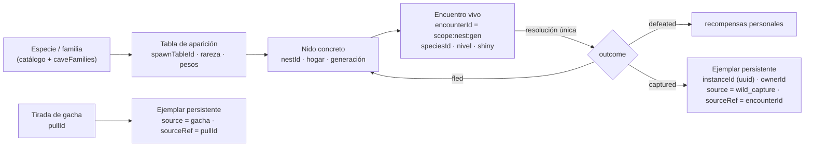

# CAVE ECOSYSTEM-1 — Múltiples ejemplares, rareza y ecología MMO

> Rama `design/cave-ecosystem-0.3`, sobre `4196555` (HEAD verificado: `41965550`). Sólo diseño: no se modificó código, SQL, tests ni assets.
> Etiquetas: **FACT** (verificado en `archivo:línea` sobre `2652a58`), **INFERENCE** (deducido, no ejecutado), **OPEN QUESTION** (requiere decisión).
> Este documento **corrige la premisa** de la serie. Donde contradiga a `SHARED_DUNGEON_ARCHITECTURE.md`, `CAVE_TYPES_AND_FAMILIES.md`, `CAVE_RESPAWN_AND_TOKENS.md` o `CAVE_ECOSYSTEM_ROADMAP.md`, prevalece este. Esos cuatro se actualizaron en consecuencia.

---

## 0. Resumen

- **Decisión de producto vigente.** Toda especie puede tener muchos ejemplares; cada ejemplar tiene un `instanceId` único y como máximo un dueño; no hay unicidad global por `speciesId`. La disponibilidad se regula con tablas de aparición, rareza y contenido. Legendarios y míticos quedan para eventos.
- **El repositorio todavía implementa la regla vieja.** `slots` tiene `PRIMARY KEY (pokemon_id)`. Mercado, swap, XP, ownership del realtime, pool salvaje, companion y varios tests tratan la especie como si fuera el individuo. Hay 30 supuestos inventariados en §2.
  - El modelo R32 (`PokemonInstance`, `instanceId: string`) ya existe como dominio puro y **no** está conectado a producción.
  - La corrección necesita una migración propia, **INSTANCES-1**, antes de cualquier captura o gacha.
- **D-EC1 y D-GA1 quedan resueltos.** CAVE WILD-1 deja de estar bloqueado, porque no crea ejemplares. GACHA-1 ya no depende del stock: su dependencia real es INSTANCES-1.
- **Rareza MMO de seis tiers** (`common` … `event_only`), autorada por tabla de aparición e independiente de `catchRate`, poder, valor y etapa.
- **Mapa inicial por capas:** Ciudad → Pradera → Bosque → Cantera → Cueva de caliza → intermedias → profundas → regiones → eventos. Pradera y Bosque usan subzonas que ya existen en `resourceZones.js`.
- **Captura futura recomendada:** intención de captura declarada, sorteo ponderado por contribución entre los elegibles que la declararon, y resultado único `defeated | captured | fled`. El ejemplar persistente se crea en la misma transacción que la resolución.
- **El riesgo económico cambió de lugar.** El stock ya no se agota. Ahora el problema es la **sobreoferta**: sin límites, la captura futura produciría ~84 ejemplares por jugador y por semana (§10). Hacen falta Balls consumibles, un tope diario y ligar los ejemplares a la cuenta antes de abrir el mercado.

---

## 1. Decisión de múltiples ejemplares

| Regla | Consecuencia de diseño |
| --- | --- |
| Toda especie puede tener múltiples ejemplares | `speciesId` es un **dato** del ejemplar, nunca su identidad. |
| Cada Pokémon individual tiene un `instanceId` único | Toda operación de ownership, bloqueo, XP, trabajo, mercado o party se indexa por `instanceId`. |
| Cada ejemplar tiene como máximo un dueño | INV-OWN-1 (`docs/INVARIANTS.md:74-80`) sigue vigente **leída por ejemplar**. Su FACT histórico ("`slots` tiene una fila por Pokémon") queda obsoleto. |
| Varios jugadores pueden poseer la misma especie | Desaparece toda exclusión "especie con dueño". |
| Encuentros salvajes y de Dungeon = ejemplares individuales | Cada encuentro es un candidato a ejemplar (`encounterId` + generación) y se resuelve una sola vez. |
| Tras un respawn aparece un encuentro nuevo | Otro `encounterId`, aunque sea de la misma especie. |
| La disponibilidad la regula el contenido | Tablas de aparición, rareza, profundidad, horario y eventos (§6–§8). |
| Legendarios y míticos: sólo eventos | Tier `event_only`: nunca ambientales ni en el gacha ordinario. |

---

## 2. Auditoría: supuestos de unicidad por especie todavía presentes

Leyenda de veredicto:

- **R** = se retira, porque es una restricción global por especie;
- **I** = usa `speciesId` donde debería usar `instanceId`;
- **OK** = restricción por ejemplar o por especie que sigue siendo correcta.

### 2.1 Base de datos y RPCs

| # | Supuesto | Evidencia | Veredicto |
| --- | --- | --- | --- |
| U1 | `slots` indexada por especie: `PRIMARY KEY (pokemon_id)`, con un único `owner_id` | `scripts/integration/rc03-staging/01_prod_mirror.sql:8,22` | **R** — es la raíz de todo lo demás |
| U2 | `market_listings.pokemon_id` → FK a `pokemon(id)`: se lista una **especie** | `01_prod_mirror.sql:9,27` | **I** |
| U3 | `publish_market_listing(p_pokemon_id)` verifica y bloquea el slot por especie | `supabase/migrations/20260926001502_market_require_session.sql:177-237` | **I** |
| U4 | `buy_market_listing` transfiere con `INSERT INTO slots … ON CONFLICT (pokemon_id)` | `20260926001502_market_require_session.sql:82-95` | **I** |
| U5 | `cancel_market_listing` desbloquea por especie | `20260926001502_market_require_session.sql:171` | **I** |
| U6 | `transactions`, `token_ledger`, `activity_feed` referencian la especie | `01_prod_mirror.sql:10-12,34,37,41` | **I** para `transactions`; **OK** como dato informativo en ledger y feed (se agrega `instance_id`) |
| U7 | `pokemon_xp` con clave `(user_id, pokemon_id)`: XP por usuario × especie | `20260907_008_progression_xp_authority.sql:67-69`; `20260907_005_token_economy_rpcs.sql:133-135` | **I** — dos Geodude del mismo jugador compartirían XP y movimientos |
| U8 | `grant_pokemon_xp`, `spend_tokens_learn_move`, `award_dungeon_reward`, `consume_dungeon_energy` verifican `slots.pokemon_id` | `…008:60-61`; `…005:115-116`; `20260908_010_dungeon_reward.sql:39-40`; `20260908_011_dungeon_start_authority.sql:36-37,69-72` | **I** (energía y lock por ejemplar) |
| U9 | `collect_passive_tokens` suma sobre los slots del dueño | `…005:53-58` | **OK** en su forma (sumar por ejemplar), pero **R** en economía: con muchos ejemplares el ingreso pasivo escala sin techo — ver §11 |
| U10 | `world_owns_pokemon(user, pokemon_id)`: "a slot's pokemon_id is both the instance and its species" | `20260926002154_world_skills_authority.sql:235-248` | **I** |
| U11 | `world_player_state` devuelve la lista de **especies** trabajables | `…world_skills_authority.sql:225-230` | **I** |
| U12 | Pokédex: `(user_id, pokemon_id)` visto/registrado | `20260908_009_pokedex_authority.sql:28-29,65-66` | **OK** — la Pokédex **es** por especie |
| U13 | `slots` sólo lectura para clientes, escrituras sólo servidor | `20260926001322_slots_client_write_revoke.sql:16-18` | **OK** — se conserva para la tabla de ejemplares |
| U14 | `is_locked` y exclusión del mercado para Dungeon/trabajo | `…world_skills_authority.sql:228,246`; `…011:44-46` | **OK** por ejemplar |

### 2.2 Edge Functions

| # | Supuesto | Evidencia | Veredicto |
| --- | --- | --- | --- |
| U15 | `pokeswap-swap` sortea el Pokémon recibido de **todo** `pokemon` sin dueño filtrado: sólo excluye los propios | `supabase/functions/pokeswap-swap/index.ts:97-103` | **R** |
| U16 | …y lo asigna con `upsert({ pokemon_id, owner_id }, { onConflict: 'pokemon_id' })`: si la especie tenía dueño, el swap **se la quita** (INFERENCE de lectura; es la mecánica legacy que INV-PAY-3 intenta acotar) | `pokeswap-swap/index.ts:122-126`; `docs/INVARIANTS.md` INV-PAY-3 | **R** — con ejemplares, un swap crea o intercambia ejemplares, nunca reasigna el de otro (D-SW1) |
| U17 | La tabla de rareza del swap incluye `legendario` y usa `Math.random()` | `pokeswap-swap/index.ts:8-14,18,23,110` | **R** para legendarios (pasan a `event_only`); el RNG debe ser CSPRNG |
| U18 | Los flujos `market-*` y `dungeon-*` reciben `pokemon_id` | `supabase/functions/dungeon-start/index.ts:70`; `src/features/dungeon/api/dungeonApi.ts:18` | **I** |

### 2.3 Realtime

| # | Supuesto | Evidencia | Veredicto |
| --- | --- | --- | --- |
| U19 | Pool salvaje: excluye especies con dueño y no repite especie | `services/realtime/src/world/wildPopulation.js:64-77`; `wildService.js:96` | **R** |
| U20 | Id del salvaje por especie y época: `wild:<área>:<época>:<pokemonId>` | `wildPopulation.js:151` | **R** → `encounterId` con generación |
| U21 | Categoría ambiental `legendary` 2 % en superficie | `wildPopulation.js:47-57` | **R** → `event_only` |
| U22 | Ownership del worker: `{ instanceId, speciesId: instanceId }` | `world/persistence/playerData.js:83,132`; `world/pokemonOwnership.js:40`; `world/worldConfig.js:43` | **I** |
| U23 | `pokemonInstanceId` del protocolo WORLD es un **entero ≥ 1** (el id de especie) | `world/worldProtocol.js:55` | **I** — el `instanceId` de R32 es `string` (`src/features/pokemon/model/instance.ts:128`) |
| U24 | `byPokemon` bloquea por `instanceId` | `world/resourceAuthority.js:79,309,339` | **OK** — ya es por ejemplar; sólo cambia el tipo del id |
| U25 | Companion validado contra `slots` por especie | `services/realtime/src/auth/supabaseAuth.js:30-34` | **I** |
| U26 | Shiny ambiental 1/64, derivado del hash (especie, época) | `wildPopulation.js:29,152` | **I** — el shiny pasa a ser un atributo del ejemplar sorteado con CSPRNG (§7.10) |

### 2.4 Cliente

| # | Supuesto | Evidencia | Veredicto |
| --- | --- | --- | --- |
| U27 | Mapa `Record<number, Slot>` por especie, e identidad y caja por `pokemon_id` | `src/features/wildlands/lobby/api/plazaApi.ts:9-13`; `src/features/pokemon/api/pokemonApi.ts:39-41`; `src/features/wildlands/identity/playerIdentity.ts:22-23`; `src/features/market/components/MarketView.vue:23-24` | **I** |
| U28 | Oculta salvajes cuya especie tiene dueño | `src/features/pokemon/domain/wildPool.ts:11-12`; `wildlands/lobby/usePlazaData.ts:61`; `wildlands/engine/population.ts:66-72` | **R** |

### 2.5 Tests, fixtures y documentación

| # | Supuesto | Evidencia | Veredicto |
| --- | --- | --- | --- |
| U29 | Tests que **exigen** unicidad: *"each wild Pokémon exists once, is unowned"*; *"immediately hides acquired pool members"* | `services/realtime/src/world/wildPopulation.test.js:23-29`; `src/features/pokemon/domain/wildPool.test.ts:10` | **R** (se reemplazan por tests de tablas de aparición) |
| U30 | Documentación que afirma la unicidad: `legacy.ts` ("there is one Pikachu"), `POKEMON_PROFESSION_SYSTEM.md` ("un dueño global"), `HANDOFF.md` (población sin duplicar especies) y esta serie (D-EC1/D-GA1, agotamiento) | `src/features/pokemon/model/legacy.ts:4-8`; `docs/economy/POKEMON_PROFESSION_SYSTEM.md:17`; `docs/wildlands/HANDOFF.md:264` | `legacy.ts` es **OK** como descripción del legacy. Los docs de producto quedan **desactualizados** (se corrigen en su fase). Esta serie se corrige **aquí**. |

Fuera de esta serie no se modificó ningún documento (alcance: sólo `docs/design/`). `POKEMON_PROFESSION_SYSTEM.md` y `HANDOFF.md` quedan anotados para INSTANCES-1.

### 2.6 Qué ya está bien

- **R32 ya define el individuo:** `PokemonInstance.instanceId: string`, `speciesId` como dato, `Ownership { ownerId, originalTrainerId }`, `acquisition.source`, `shiny`, `state: 'owned' | 'expeditionPending'` y la transición `secureCapture` (`src/features/pokemon/model/instance.ts:108-129,124,259`).
- **Migración legacy aprobada:** un backfill determinista por hash (M-1, `src/features/pokemon/model/migration.ts` cabecera).
- **`AcquisitionSource`** tiene `starter`, `adoption`, `market`, `trade`, `swap`, `dungeon_capture`, `event` y `legacy_migration` (`instance.ts:46-54`). Faltan `wild_capture` y `gacha` (extensión aditiva, prevista: "new sources are new strings").

---

## 3. Modelo de instancia

| Capa | Identidad | Vive en | Persistencia | Mutabilidad |
| --- | --- | --- | --- | --- |
| Especie / familia | `speciesId`, `familyId` | catálogo (`core.json`) + `caveFamilies.js` | código | inmutable |
| Tabla de aparición | `spawnTableId` + `rulesVersion` | código (`spawnTables.js`) | código versionado | por PR |
| Nido | `(scopeId, nestId)` | realtime + `dungeon_nests` | generación y `respawnAt` | servidor |
| Encuentro | `encounterId` | realtime | resolución en `encounter_resolutions` | una vez |
| Ejemplar | `instanceId` (uuid) | `pokemon_instances` (a crear) | Postgres | servidor (XP, desgaste, dueño) |

**Reglas del ejemplar:**

1. `instanceId` es un UUID generado **en Postgres**, dentro de la transacción que lo crea. Nunca lo elige el cliente ni el realtime.
2. `UNIQUE (acquisition_source, source_ref)`: un mismo encuentro o una misma tirada no pueden crear dos ejemplares.
3. `owner_id` tiene a lo sumo un valor. Transferirlo es un `UPDATE … WHERE instance_id = $1 AND owner_id = $old AND NOT is_locked` (CAS).
4. `speciesId`, `formId`, `natureId`, IVs, `shiny` y `gender` se sortean al **crear**, con CSPRNG del servidor. Para ejemplares migrados, con el hash M-1.
5. Estados: `owned`, `expeditionPending` (R32), y `account_bound_until` como campo para el período sin venta.

---

## 4. Migraciones futuras necesarias (sólo enumeradas)

| Orden | Migración | Qué cambia | Riesgo |
| --- | --- | --- | --- |
| M1 | `pokemon_instances` (R32) | Tabla nueva por ejemplar, RLS de lectura propia y escritura sólo servidor | Aditiva |
| M2 | Backfill `slots` → `pokemon_instances` | Un ejemplar por fila de `slots` con dueño, con el hash M-1 y `source = legacy_migration` | Irreversible por diseño: sólo con aprobación humana |
| M3 | `pokemon_xp` → por `instance_id` | La XP de (usuario, especie) pasa a su ejemplar migrado | Dos claves conviven durante la transición |
| M4 | Mercado por `instance_id` | `market_listings.instance_id`, y RPCs publish, cancel y buy con CAS por ejemplar | Listados abiertos al migrar |
| M5 | `transactions`, `token_ledger`, `activity_feed` + `instance_id` | Aditiva (se conserva `pokemon_id` como dato) | — |
| M6 | Ownership WORLD | `world_owns_pokemon(user, instance uuid)`, `world_player_state` con ejemplares, `pokemonInstanceId` string en el protocolo (nueva versión de protocolo) | Clientes viejos: `client-outdated` |
| M7 | Swap | Rediseño (D-SW1): crear o intercambiar ejemplares, nunca `upsert` por especie | Mecánica de producto |
| M8 | Retiro de `slots` como autoridad | `slots` queda como vista o se elimina cuando nada la lea (AGENTS §14) | Último paso |
| M9 | Energía, locks y companion por ejemplar | `consume_dungeon_energy`, `supabaseAuth` companion | — |

Ninguna se implementa en esta serie. Es la fase **INSTANCES-1** del roadmap.
