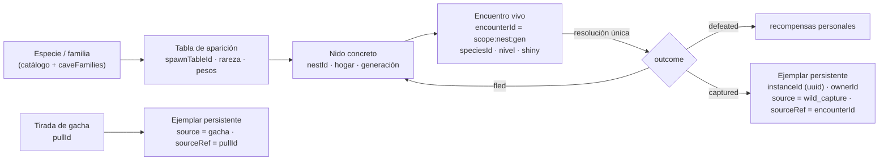
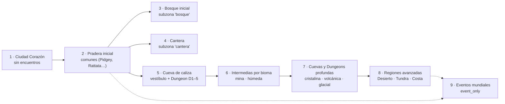

# CAVE ECOSYSTEM-1 — Múltiples ejemplares, rareza y ecología MMO

> Rama `design/cave-ecosystem-0.3`, sobre `4196555` (HEAD verificado: `41965550`). Sólo diseño: no se modificó código, SQL, tests ni assets.
> Etiquetas: **FACT** (verificado en `archivo:línea` sobre `2652a58`), **INFERENCE** (deducido, no ejecutado), **OPEN QUESTION** (requiere decisión).
> Este documento **corrige la premisa** de la serie. Donde contradiga a `SHARED_DUNGEON_ARCHITECTURE.md`, `CAVE_TYPES_AND_FAMILIES.md`, `CAVE_RESPAWN_AND_TOKENS.md` o `CAVE_ECOSYSTEM_ROADMAP.md`, prevalece este. Esos cuatro se actualizaron en consecuencia.

---

## 0. Resumen

- **Decisión de producto vigente.** Toda especie puede tener muchos ejemplares; cada ejemplar tiene un `instanceId` único y como máximo un dueño; no hay unicidad global por `speciesId`. La disponibilidad se regula con tablas de aparición, rareza y contenido. Legendarios y míticos quedan para eventos.
- **El repositorio todavía implementa la regla vieja.** `slots` tiene `PRIMARY KEY (pokemon_id)`. Mercado, swap, XP, ownership del realtime, pool salvaje, companion y varios tests tratan la especie como si fuera el individuo. Hay 30 supuestos inventariados en §2.
  - El modelo R32 (`PokemonInstance`, `instanceId: string`) ya existe como dominio puro y **no** está conectado a producción.
  - La corrección necesita una migración propia, **INSTANCES-1**, antes de cualquier captura o gacha.
- **D-EC1 y D-GA1 quedan resueltos.** CAVE WILD-1 deja de estar bloqueado, porque no crea ejemplares. GACHA-1 ya no depende del stock: su dependencia real es INSTANCES-1.
- **Rareza MMO de seis tiers** (`common` … `event_only`), autorada por tabla de aparición e independiente de `catchRate`, poder, valor y etapa.
- **Mapa inicial por capas:** Ciudad → Pradera → Bosque → Cantera → Cueva de caliza → intermedias → profundas → regiones → eventos. Pradera y Bosque usan subzonas que ya existen en `resourceZones.js`.
- **Captura futura recomendada:** intención de captura declarada, sorteo ponderado por contribución entre los elegibles que la declararon, y resultado único `defeated | captured | fled`. El ejemplar persistente se crea en la misma transacción que la resolución.
- **El riesgo económico cambió de lugar.** El stock ya no se agota. Ahora el problema es la **sobreoferta**: sin límites, la captura futura produciría ~84 ejemplares por jugador y por semana (§10). Hacen falta Balls consumibles, un tope diario y ligar los ejemplares a la cuenta antes de abrir el mercado.

---

## 1. Decisión de múltiples ejemplares

| Regla | Consecuencia de diseño |
| --- | --- |
| Toda especie puede tener múltiples ejemplares | `speciesId` es un **dato** del ejemplar, nunca su identidad. |
| Cada Pokémon individual tiene un `instanceId` único | Toda operación de ownership, bloqueo, XP, trabajo, mercado o party se indexa por `instanceId`. |
| Cada ejemplar tiene como máximo un dueño | INV-OWN-1 (`docs/INVARIANTS.md:74-80`) sigue vigente **leída por ejemplar**. Su FACT histórico ("`slots` tiene una fila por Pokémon") queda obsoleto. |
| Varios jugadores pueden poseer la misma especie | Desaparece toda exclusión "especie con dueño". |
| Encuentros salvajes y de Dungeon = ejemplares individuales | Cada encuentro es un candidato a ejemplar (`encounterId` + generación) y se resuelve una sola vez. |
| Tras un respawn aparece un encuentro nuevo | Otro `encounterId`, aunque sea de la misma especie. |
| La disponibilidad la regula el contenido | Tablas de aparición, rareza, profundidad, horario y eventos (§6–§8). |
| Legendarios y míticos: sólo eventos | Tier `event_only`: nunca ambientales ni en el gacha ordinario. |

---

## 2. Auditoría: supuestos de unicidad por especie todavía presentes

Leyenda de veredicto:

- **R** = se retira, porque es una restricción global por especie;
- **I** = usa `speciesId` donde debería usar `instanceId`;
- **OK** = restricción por ejemplar o por especie que sigue siendo correcta.

### 2.1 Base de datos y RPCs

| # | Supuesto | Evidencia | Veredicto |
| --- | --- | --- | --- |
| U1 | `slots` indexada por especie: `PRIMARY KEY (pokemon_id)`, con un único `owner_id` | `scripts/integration/rc03-staging/01_prod_mirror.sql:8,22` | **R** — es la raíz de todo lo demás |
| U2 | `market_listings.pokemon_id` → FK a `pokemon(id)`: se lista una **especie** | `01_prod_mirror.sql:9,27` | **I** |
| U3 | `publish_market_listing(p_pokemon_id)` verifica y bloquea el slot por especie | `supabase/migrations/20260926001502_market_require_session.sql:177-237` | **I** |
| U4 | `buy_market_listing` transfiere con `INSERT INTO slots … ON CONFLICT (pokemon_id)` | `20260926001502_market_require_session.sql:82-95` | **I** |
| U5 | `cancel_market_listing` desbloquea por especie | `20260926001502_market_require_session.sql:171` | **I** |
| U6 | `transactions`, `token_ledger`, `activity_feed` referencian la especie | `01_prod_mirror.sql:10-12,34,37,41` | **I** para `transactions`; **OK** como dato informativo en ledger y feed (se agrega `instance_id`) |
| U7 | `pokemon_xp` con clave `(user_id, pokemon_id)`: XP por usuario × especie | `20260907_008_progression_xp_authority.sql:67-69`; `20260907_005_token_economy_rpcs.sql:133-135` | **I** — dos Geodude del mismo jugador compartirían XP y movimientos |
| U8 | `grant_pokemon_xp`, `spend_tokens_learn_move`, `award_dungeon_reward`, `consume_dungeon_energy` verifican `slots.pokemon_id` | `…008:60-61`; `…005:115-116`; `20260908_010_dungeon_reward.sql:39-40`; `20260908_011_dungeon_start_authority.sql:36-37,69-72` | **I** (energía y lock por ejemplar) |
| U9 | `collect_passive_tokens` suma sobre los slots del dueño | `…005:53-58` | **OK** en su forma (sumar por ejemplar), pero **R** en economía: con muchos ejemplares el ingreso pasivo escala sin techo — ver §11 |
| U10 | `world_owns_pokemon(user, pokemon_id)`: "a slot's pokemon_id is both the instance and its species" | `20260926002154_world_skills_authority.sql:235-248` | **I** |
| U11 | `world_player_state` devuelve la lista de **especies** trabajables | `…world_skills_authority.sql:225-230` | **I** |
| U12 | Pokédex: `(user_id, pokemon_id)` visto/registrado | `20260908_009_pokedex_authority.sql:28-29,65-66` | **OK** — la Pokédex **es** por especie |
| U13 | `slots` sólo lectura para clientes, escrituras sólo servidor | `20260926001322_slots_client_write_revoke.sql:16-18` | **OK** — se conserva para la tabla de ejemplares |
| U14 | `is_locked` y exclusión del mercado para Dungeon/trabajo | `…world_skills_authority.sql:228,246`; `…011:44-46` | **OK** por ejemplar |

### 2.2 Edge Functions

| # | Supuesto | Evidencia | Veredicto |
| --- | --- | --- | --- |
| U15 | `pokeswap-swap` sortea el Pokémon recibido de **todo** `pokemon` sin dueño filtrado: sólo excluye los propios | `supabase/functions/pokeswap-swap/index.ts:97-103` | **R** |
| U16 | …y lo asigna con `upsert({ pokemon_id, owner_id }, { onConflict: 'pokemon_id' })`: si la especie tenía dueño, el swap **se la quita** (INFERENCE de lectura; es la mecánica legacy que INV-PAY-3 intenta acotar) | `pokeswap-swap/index.ts:122-126`; `docs/INVARIANTS.md` INV-PAY-3 | **R** — con ejemplares, un swap crea o intercambia ejemplares, nunca reasigna el de otro (D-SW1) |
| U17 | La tabla de rareza del swap incluye `legendario` y usa `Math.random()` | `pokeswap-swap/index.ts:8-14,18,23,110` | **R** para legendarios (pasan a `event_only`); el RNG debe ser CSPRNG |
| U18 | Los flujos `market-*` y `dungeon-*` reciben `pokemon_id` | `supabase/functions/dungeon-start/index.ts:70`; `src/features/dungeon/api/dungeonApi.ts:18` | **I** |

### 2.3 Realtime

| # | Supuesto | Evidencia | Veredicto |
| --- | --- | --- | --- |
| U19 | Pool salvaje: excluye especies con dueño y no repite especie | `services/realtime/src/world/wildPopulation.js:64-77`; `wildService.js:96` | **R** |
| U20 | Id del salvaje por especie y época: `wild:<área>:<época>:<pokemonId>` | `wildPopulation.js:151` | **R** → `encounterId` con generación |
| U21 | Categoría ambiental `legendary` 2 % en superficie | `wildPopulation.js:47-57` | **R** → `event_only` |
| U22 | Ownership del worker: `{ instanceId, speciesId: instanceId }` | `world/persistence/playerData.js:83,132`; `world/pokemonOwnership.js:40`; `world/worldConfig.js:43` | **I** |
| U23 | `pokemonInstanceId` del protocolo WORLD es un **entero ≥ 1** (el id de especie) | `world/worldProtocol.js:55` | **I** — el `instanceId` de R32 es `string` (`src/features/pokemon/model/instance.ts:128`) |
| U24 | `byPokemon` bloquea por `instanceId` | `world/resourceAuthority.js:79,309,339` | **OK** — ya es por ejemplar; sólo cambia el tipo del id |
| U25 | Companion validado contra `slots` por especie | `services/realtime/src/auth/supabaseAuth.js:30-34` | **I** |
| U26 | Shiny ambiental 1/64, derivado del hash (especie, época) | `wildPopulation.js:29,152` | **I** — el shiny pasa a ser un atributo del ejemplar sorteado con CSPRNG (§7.10) |

### 2.4 Cliente

| # | Supuesto | Evidencia | Veredicto |
| --- | --- | --- | --- |
| U27 | Mapa `Record<number, Slot>` por especie, e identidad y caja por `pokemon_id` | `src/features/wildlands/lobby/api/plazaApi.ts:9-13`; `src/features/pokemon/api/pokemonApi.ts:39-41`; `src/features/wildlands/identity/playerIdentity.ts:22-23`; `src/features/market/components/MarketView.vue:23-24` | **I** |
| U28 | Oculta salvajes cuya especie tiene dueño | `src/features/pokemon/domain/wildPool.ts:11-12`; `wildlands/lobby/usePlazaData.ts:61`; `wildlands/engine/population.ts:66-72` | **R** |

### 2.5 Tests, fixtures y documentación

| # | Supuesto | Evidencia | Veredicto |
| --- | --- | --- | --- |
| U29 | Tests que **exigen** unicidad: *"each wild Pokémon exists once, is unowned"*; *"immediately hides acquired pool members"* | `services/realtime/src/world/wildPopulation.test.js:23-29`; `src/features/pokemon/domain/wildPool.test.ts:10` | **R** (se reemplazan por tests de tablas de aparición) |
| U30 | Documentación que afirma la unicidad: `legacy.ts` ("there is one Pikachu"), `POKEMON_PROFESSION_SYSTEM.md` ("un dueño global"), `HANDOFF.md` (población sin duplicar especies) y esta serie (D-EC1/D-GA1, agotamiento) | `src/features/pokemon/model/legacy.ts:4-8`; `docs/economy/POKEMON_PROFESSION_SYSTEM.md:17`; `docs/wildlands/HANDOFF.md:264` | `legacy.ts` es **OK** como descripción del legacy. Los docs de producto quedan **desactualizados** (se corrigen en su fase). Esta serie se corrige **aquí**. |

Fuera de esta serie no se modificó ningún documento (alcance: sólo `docs/design/`). `POKEMON_PROFESSION_SYSTEM.md` y `HANDOFF.md` quedan anotados para INSTANCES-1.

### 2.6 Qué ya está bien

- **R32 ya define el individuo:** `PokemonInstance.instanceId: string`, `speciesId` como dato, `Ownership { ownerId, originalTrainerId }`, `acquisition.source`, `shiny`, `state: 'owned' | 'expeditionPending'` y la transición `secureCapture` (`src/features/pokemon/model/instance.ts:108-129,124,259`).
- **Migración legacy aprobada:** un backfill determinista por hash (M-1, `src/features/pokemon/model/migration.ts` cabecera).
- **`AcquisitionSource`** tiene `starter`, `adoption`, `market`, `trade`, `swap`, `dungeon_capture`, `event` y `legacy_migration` (`instance.ts:46-54`). Faltan `wild_capture` y `gacha` (extensión aditiva, prevista: "new sources are new strings").

---

## 3. Modelo de instancia



| Capa | Identidad | Vive en | Persistencia | Mutabilidad |
| --- | --- | --- | --- | --- |
| Especie / familia | `speciesId`, `familyId` | catálogo (`core.json`) + `caveFamilies.js` | código | inmutable |
| Tabla de aparición | `spawnTableId` + `rulesVersion` | código (`spawnTables.js`) | código versionado | por PR |
| Nido | `(scopeId, nestId)` | realtime + `dungeon_nests` | generación y `respawnAt` | servidor |
| Encuentro | `encounterId` | realtime | resolución en `encounter_resolutions` | una vez |
| Ejemplar | `instanceId` (uuid) | `pokemon_instances` (a crear) | Postgres | servidor (XP, desgaste, dueño) |

**Reglas del ejemplar:**

1. `instanceId` es un UUID generado **en Postgres**, dentro de la transacción que lo crea. Nunca lo elige el cliente ni el realtime.
2. `UNIQUE (acquisition_source, source_ref)`: un mismo encuentro o una misma tirada no pueden crear dos ejemplares.
3. `owner_id` tiene a lo sumo un valor. Transferirlo es un `UPDATE … WHERE instance_id = $1 AND owner_id = $old AND NOT is_locked` (CAS).
4. `speciesId`, `formId`, `natureId`, IVs, `shiny` y `gender` se sortean al **crear**, con CSPRNG del servidor. Para ejemplares migrados, con el hash M-1.
5. Estados: `owned`, `expeditionPending` (R32), y `account_bound_until` como campo para el período sin venta.

---

## 4. Migraciones futuras necesarias (sólo enumeradas)

| Orden | Migración | Qué cambia | Riesgo |
| --- | --- | --- | --- |
| M1 | `pokemon_instances` (R32) | Tabla nueva por ejemplar, RLS de lectura propia y escritura sólo servidor | Aditiva |
| M2 | Backfill `slots` → `pokemon_instances` | Un ejemplar por fila de `slots` con dueño, con el hash M-1 y `source = legacy_migration` | Irreversible por diseño: sólo con aprobación humana |
| M3 | `pokemon_xp` → por `instance_id` | La XP de (usuario, especie) pasa a su ejemplar migrado | Dos claves conviven durante la transición |
| M4 | Mercado por `instance_id` | `market_listings.instance_id`, y RPCs publish, cancel y buy con CAS por ejemplar | Listados abiertos al migrar |
| M5 | `transactions`, `token_ledger`, `activity_feed` + `instance_id` | Aditiva (se conserva `pokemon_id` como dato) | — |
| M6 | Ownership WORLD | `world_owns_pokemon(user, instance uuid)`, `world_player_state` con ejemplares, `pokemonInstanceId` string en el protocolo (nueva versión de protocolo) | Clientes viejos: `client-outdated` |
| M7 | Swap | Rediseño (D-SW1): crear o intercambiar ejemplares, nunca `upsert` por especie | Mecánica de producto |
| M8 | Retiro de `slots` como autoridad | `slots` queda como vista o se elimina cuando nada la lea (AGENTS §14) | Último paso |
| M9 | Energía, locks y companion por ejemplar | `consume_dungeon_energy`, `supabaseAuth` companion | — |

Ninguna se implementa en esta serie. Es la fase **INSTANCES-1** del roadmap.

---

## 5. Jerarquía de rareza

### 5.1 Cinco dimensiones distintas

| Dimensión | Qué mide | Dónde se define | Ejemplo |
| --- | --- | --- | --- |
| **Rareza de aparición** | Con qué frecuencia aparece en **esta** tabla | Entrada de la tabla de aparición (`rarityTier` + `weight`) | Geodude es `common` en la Cantera y `rare` en una tabla de Pradera |
| Dificultad de captura | Probabilidad de éxito de una captura | Fórmula de captura (`catchRate` del catálogo, `capture.ts`) + modificadores | Onix: `catchRate` 45 |
| Poder de combate | Cuánto cuesta derrotarlo | Nivel de la entrada + stats del catálogo | Graveler nivel 12 |
| Valor económico | Qué vale para el jugador o el mercado | Mercado (cuando se abra) | — |
| Etapa evolutiva | Base, intermedia, final | Familia (`caveFamilies.js`, hueco H1) | Golem = final |

Pueden correlacionarse (una final suele ser rara y fuerte), pero **ninguna se infiere de otra**. La rareza es un dato autorado de la tabla. `catchRate` sirve sólo como control de cordura en revisión.

### 5.2 Tiers

| Tier | Peso orientativo (share de la tabla) | Frecuencia esperada por aparición | Zonas permitidas | Profundidad mínima | Evolución permitida | Tiempo medio hasta verlo* | Captura | Drops | Gacha |
| --- | --- | --- | --- | --- | --- | --- | --- | --- | --- |
| `common` | 50–70 % | 1 de cada 1,5–2 | todas | — | base (intermedias sólo por excepción autorada) | < 1 min | éxito alto | fórmula normal | huevo ordinario |
| `uncommon` | 20–32 % | 1 de cada 3–5 | todas salvo Ciudad | — | base e intermedia | 1–2 min | éxito medio | normal | huevo ordinario |
| `rare` | 5–20 % | 1 de cada 5–20 | desde Pradera | intermedias: piso ≥ 3 en Dungeons | base e intermedia; final de 2 etapas | 1,5–7 min | éxito bajo | normal | huevo ordinario, con pity |
| `very_rare` | 0,5–6 % | 1 de cada 17–200 | desde Pradera (sólo intermedias), finales en pisos profundos | finales: piso ≥ 5 en Dungeons tier ≥ C | intermedia y final | 3–80 min | éxito muy bajo | normal | huevo ordinario, muy bajo |
| `special` | 0–2 % | 1 de cada ≥ 50 | sólo contenido avanzado (Dungeons tier ≥ B, pisos finales) o configuración explícita | piso ≥ 7 | formas base de pseudos; finales como jefe | ≥ 8 min en la zona | éxito mínimo o sólo por jefe | normal | **sólo banners especiales** |
| `event_only` | 0 en tablas ambientales | — | sólo tablas con `eventId` y ventana | — | según el evento | — | lo define el evento | lo define el evento | **nunca** en gacha ordinario; banner de evento sólo por configuración server-side |

\* Minutos hasta que **aparece** un ejemplar de ese tier en la zona con 30 jugadores (simulación §10.1). "Verlo" depende de dónde esté el jugador; capturarlo, de la contención.

**Reglas:**

1. **La rareza es por entrada de tabla, no por especie.** Una especie puede ser `common` en su hábitat y `rare` fuera de él.
2. **La rareza no suma tokens** (se mantiene `CAVE_RESPAWN_AND_TOKENS.md` §5.2). Rareza es acceso, no multiplicador.
3. **No se puede acampar un nido para buscar raros.** El tier se sortea en cada aparición sobre la tabla de la zona, no en un nido fijo. Los nidos autorados "de firma" (p. ej. la cámara de Onix) son la excepción explícita.

---

## 6. Categorías especiales

El catálogo local es Gen I–IV, 493 especies (`core.json`). **No contiene** Ultraentes ni formas regionales: tiene 69 formas no por defecto y ninguna es regional; las no-Mega son Deoxys, Wormadam, Shaymin, Giratina, Rotom, Castform, las primales y los Pikachu con disfraz. Esas reglas quedan **prospectivas**.

| Categoría | Ids (verificados) | Regla |
| --- | --- | --- |
| Legendarios | 144–146, 150, 243–245, 249, 250, 377–384, 480–488 | `event_only`. Nunca ambientales ni en gacha ordinario. |
| Míticos | 151, 251, 385, 386, 489–493 | `event_only`. |
| Ultraentes | — (fuera del catálogo) | Si el catálogo se amplía: `event_only` o contenido especial autorado, nunca ambiental ordinario. |
| Pseudo-legendarios | 147–149, 246–248, 371–376, 443–445 | Forma base: `special` en contenido avanzado (Beldum y Bagon en `cristalina` pisos 7–8; Larvitar y Gible en `volcanica` pisos 6–7; Dratini en `humeda` piso 6). Intermedias y finales: no ambientales; sólo evento o jefe. Gacha: sólo banner especial. |
| Starters | 1–9, 152–160, 252–260, 387–395 | Nunca ambientales. Sólo recompensas, elección inicial, misión o banner especial. |
| Fósiles | 138–142, 345–348, 408–411 | Por restauración (fragmento fósil como drop `rare`/`very_rare` en `caliza`/`mina` profundas) o evento. Nunca nidos. |
| Eevee y demandadas | 133–136, 196, 197, 470, 471; y Pikachu (25) como demandada ambiental | Eevee: `special`, sin tabla ambiental v1, sólo evento o banner especial. Pikachu: `rare` en Pradera; Raichu no ambiental. |
| Formas regionales | — (fuera del catálogo) | Una entrada de tabla propia (`formId`) en su región. Las comunes regionales, desde el inicio. |
| Exclusivas de evento | cualquier especie marcada por evento | Sólo tablas con `eventId` y `enabledFrom`/`enabledUntil`. |
| Evoluciones finales | — | `very_rare` en pisos ≥ 5 de Dungeons tier ≥ C, o jefes. En superficie inicial, no. Excepción: especies de una sola etapa (Dunsparce, Torkoal, Sableye…), que no cuentan como "finales". |
| Bebés | 172, 173, 174, 175, 236, 238–240, 298, 360, 406, 433, 438–440, 446, 447, 458 | No ambientales salvo excepción autorada (Bonsly en `caliza`, Chingling en `cristalina`, ya aprobadas en los pools). |
| Shiny | — | El repo ya lo contempla: 1/64 en salvajes (`wildPopulation.js:29`), 1/128 en swap (`pokeswap-swap/index.ts:4`) y `PokemonInstance.shiny`. Con ejemplares capturables, un shiny es un **atributo del ejemplar**, sorteado con CSPRNG al aparecer, independiente del tier, y lo hereda la captura. Playtest: **1/512** (1/64 es alto para un MMO con captura). OPEN QUESTION D-SH1. |

Verificación: todos los ids se comprobaron en `core.json`. Los bebés se listan por conocimiento canónico (hueco H1: el catálogo no tiene familias).

---

## 7. Mapa MMO por capas



Anclas existentes (FACT):

- Pradera, seed 208, llegada `(-5,-69)` (`protocol/arrival.js:16`).
- Subzona `bosque`, caja `(-19,-54)–(2,-37)` (`resourceZones.js:37`).
- Subzona `cantera`, caja `(3,-76)–(18,-63)` (`resourceZones.js:42`).
- Rutas `al-bosque` y `a-la-cantera` (`resourceZones.js:59-60`).
- Cueva `(-26,-74)` (`caves.js:71-80`).
- Ciudad sin mundo dinámico (`areas.js:13`).
- Los otros cuatro mundos existen en el Atlas sin presencia (`atlas.ts:13`).

Reglas comunes a todas las zonas de superficie:

- Nada en la reserva de la llegada, en rutas, stands o esperas de trabajo, portales o la reserva de la cueva (misma lista que `CAVE_RESPAWN_AND_TOKENS.md` §2.3).
- Respawn por nido de 75 s ± 20 %; nidos activos `min(12, 4 + ⌈p/2⌉)`.
- El tier se sortea por aparición.

### 7.1 Capa 1 — Ciudad Corazón y aproximación segura

Sin encuentros. En Pradera, la aproximación a la llegada (radio 6 alrededor de `(-5,-69)`) no admite nidos: el jugador nuevo nunca aparece junto a un encuentro.

### 7.2 Capa 2 — Pradera inicial (`pradera`, fuera de subzonas)

Nivel 2–5. Densidad baja. Horario según §9.3.

| Familia | Miembro | Tier | Peso | Horario | Motivo |
| --- | --- | --- | --- | --- | --- |
| Pidgey | 16 Pidgey | common | 24 | siempre | Ave inicial reconocible |
| Rattata | 19 Rattata | common | 24 | siempre | Roedor inicial |
| Sentret | 161 Sentret | common | 12 | siempre | Roedor de pradera |
| Bidoof | 399 Bidoof | common | 10 | siempre | Roedor Sinnoh (la región del proyecto) |
| Hoppip | 187 Hoppip | uncommon | 8 | día | Planta ligera, sólo con viento/día |
| Hoothoot | 163 Hoothoot | uncommon | (8) | noche | Reemplaza a Hoppip de noche (mismo peso) |
| Nidoran♀ | 29 Nidoran♀ | uncommon | 5 | siempre | Clásico de pradera |
| Nidoran♂ | 32 Nidoran♂ | uncommon | 5 | siempre | Idem |
| Shinx | 403 Shinx | uncommon | 6 | siempre | Eléctrico de pradera Sinnoh |
| Pikachu | 25 Pikachu | rare | 2 | siempre | Demandado: raro, no común |
| Pidgey | 17 Pidgeotto | rare | 1,5 | siempre | Intermedia |
| Rattata | 20 Raticate | rare | 1,5 | siempre | Final de 2 etapas, bajo peso |
| Sentret | 162 Furret | rare | 0,5 | siempre | Idem |
| Nidoran | 30 Nidorina · 33 Nidorino | very_rare | 0,25 + 0,25 | siempre | Intermedias |

- **Shares:** common 70 · uncommon 24 · rare 5,5 · very_rare 0,5 = 100. Los pesos de día y de noche suman lo mismo porque Hoppip y Hoothoot se reemplazan.
- **Excluidos de la Pradera:** Pidgeot, Nidoqueen/Nidoking, Luxray, Raichu, Pichu, Staraptor, bebés, starters y Eevee.
- Se auditaron Starly, Zigzagoon, Poochyena, Spearow, Mareep, Kricketot y Skitty (existen en el catálogo). Quedan **fuera** para mantener un pool chico y reconocible. Starly y Kricketot se pueden rotar por temporada.

### 7.3 Capa 3 — Bosque inicial (subzona `bosque`)

Nivel 3–7.

| Familia | Miembro | Tier | Peso | Horario |
| --- | --- | --- | --- | --- |
| Caterpie | 10 Caterpie | common | 24 | siempre |
| Weedle | 13 Weedle | common | 24 | siempre |
| Oddish | 43 Oddish | common | 12 de día · 22 de noche (ocupa el peso de Pidgey) | siempre |
| Pidgey | 16 Pidgey | common | 10 | día |
| Caterpie | 11 Metapod | uncommon | 6 | siempre |
| Weedle | 14 Kakuna | uncommon | 6 | siempre |
| Pineco | 204 Pineco | uncommon | 6 | siempre |
| Ledyba / Spinarak | 165 Ledyba (día) · 167 Spinarak (noche) | uncommon | 6 | alterna |
| Caterpie | 12 Butterfree | rare | 1,5 | día |
| Weedle | 15 Beedrill | rare | 1,5 | siempre |
| Oddish | 44 Gloom | rare | 1 de día · 4 de noche (ocupa Butterfree y Pidgeotto) | siempre |
| Pidgey | 17 Pidgeotto | rare | 1,5 | día |
| Pineco | 205 Forretress | very_rare | 0,5 | siempre |

- **Shares:** 70 · 24 · 5,5 · 0,5, iguales de día y de noche (las entradas de noche ocupan los pesos de las de día).
- **Exclusiones:** ningún hogar en stands o esperas de los árboles del bosque (WORLD VISUAL-2). Vileplume, Bellossom y Ariados/Ledian quedan para capas posteriores. Hoothoot, Venonat y Seedot se evaluaron y quedaron fuera por tamaño del pool.

### 7.4 Capa 4 — Cantera (subzona `cantera`)

Nivel 4–8.

| Familia | Miembro | Tier | Peso |
| --- | --- | --- | --- |
| Geodude | 74 Geodude | common | 34 |
| Sandshrew | 27 Sandshrew | common | 20 |
| Diglett | 50 Diglett | common | 16 |
| Machop | 66 Machop | uncommon | 10 |
| Cubone | 104 Cubone | uncommon | 8 |
| Phanpy | 231 Phanpy | uncommon | 6 |
| Geodude | 75 Graveler | rare | 2,5 |
| Sandshrew | 28 Sandslash | rare | 1,5 |
| Diglett | 51 Dugtrio | rare | 1 |
| Machop | 67 Machoke | rare | 0,5 |
| Onix | 95 Onix | very_rare | 0,5 |

- **Shares:** 70 · 24 · 5,5 · 0,5.
- **Onix:** sólo en casillas con `openWidth ≥ 5` de la cantera abierta, y nunca a menos de 3 casillas de un nodo de roca o de su stand.
- Temáticamente es la "cueva a cielo abierto". La cueva de caliza cambia el énfasis para no repetir el mismo pool.

### 7.5 Capa 5 — Cueva de caliza (vestíbulo + `caliza-d1`)

Reemplaza el pool de `CAVE_TYPES_AND_FAMILIES.md` §6.1. Nivel: vestíbulo 5–8; pisos 6–14.

| Familia | Miembro | Tier | Peso | Pisos (0 = vestíbulo) |
| --- | --- | --- | --- | --- |
| Zubat | 41 Zubat | common | 25 | 0–5 |
| Geodude | 74 Geodude | common | 20 | 0–5 |
| Whismur | 293 Whismur | common | 10 | 0–4 |
| Diglett | 50 Diglett | uncommon | 8 | 0–5 |
| Bonsly | 438 Bonsly (bebé, excepción autorada) | uncommon | 8 | 0–3 |
| Paras | 46 Paras | uncommon | 7 | 2–4 |
| Sandshrew | 27 Sandshrew | uncommon | 7 | 2–5 |
| Geodude | 75 Graveler | rare | 4 | 3–5 |
| Zubat | 42 Golbat | rare | 3 | 4–5 |
| Bonsly | 185 Sudowoodo | rare | 2 | 3–5 |
| Whismur | 294 Loudred | rare | 1,5 | 4–5 |
| Diglett | 51 Dugtrio | rare | 1,5 | 5 |
| Dunsparce | 206 Dunsparce | very_rare | 1,5 | 3–5, sólo cámaras |
| Paras | 47 Parasect | very_rare | 0,75 | 4 |
| Onix | 95 Onix | very_rare | 0,75 | 5, cámara ≥ 9 |

- **Shares:** common 55 · uncommon 30 · rare 12 · very_rare 3 · special 0, sobre la tabla completa. En cada piso se renormaliza entre las entradas disponibles, así que los pisos profundos tienen más share de raros. Lo mismo vale para `mina` y `cristalina`.
- El **vestíbulo** usa sólo las entradas `common` y `uncommon` con piso 0.
- Golem, Crobat y Exploud no son ambientales: quedan como jefe o evento futuro.

### 7.6 Capas 6–9 (resumen)

| Capa | Zonas | Rareza | Especiales | Nivel |
| --- | --- | --- | --- | --- |
| 6 · Intermedias | `mina` (tier C), `humeda` (tier C) | 55 · 30 · 12 · 3 · 0 | Dratini `special` sólo en `humeda` piso 6 | 12–25 |
| 7 · Profundas | `cristalina` (§7.7), `volcanica`, `glacial` (tier B) | 40 · 32 · 20 · 6 · 2 | Beldum, Bagon (`cristalina`); Larvitar, Gible (`volcanica`) | 25–40 |
| 8 · Regiones avanzadas | Desierto, Tundra, Costa (hoy en el Atlas sin presencia, `atlas.ts:13`) | tablas propias con comunes regionales desde el inicio | según región | 30+ |
| 9 · Eventos mundiales | cualquier área, con `eventId` y ventana | `event_only` + las comunes del evento | legendarios y míticos por configuración | según evento |

**`mina` (reemplaza a `CAVE_TYPES_AND_FAMILIES.md` §6.2):**
- common: Geodude 18 · Aron 14 · Magnemite 12 · Machop 11;
- uncommon: Zubat 8 · Nosepass 8 · Makuhita 8 · Graveler 6;
- rare: Lairon 4 · Magneton 3 · Machoke 3 · Golbat 2;
- very_rare: Onix 1,5 (cámaras) · Hariyama 1 · Golem 0,5 (piso 6).

Suma 100.

### 7.7 `cristalina` (reemplaza a `CAVE_TYPES_AND_FAMILIES.md` §6.3)

| Tier | Entradas (peso, pisos) |
| --- | --- |
| common (40) | Bronzor 16 (1–8) · Clefairy 14 (1–8) · Chingling 10 (1–6) |
| uncommon (32) | Aron 10 (2–6) · Nosepass 10 (2–8) · Lairon 6 (4–8) · Chimecho 6 (4–8) |
| rare (20) | Bronzong 6 (5–8) · Sableye 5 (3–8) · Mawile 5 (3–8) · Lunatone 2 (5–8) · Solrock 2 (5–8) |
| very_rare (6) | Clefable 2,5 (7–8) · Probopass 2 (7–8) · Aggron 1,5 (8) |
| special (2) | Beldum 1 (7–8) · Bagon 1 (8) |

---

## 8. Familias y evolución

| Regla | Detalle |
| --- | --- |
| La familia es la unidad de diseño | Una tabla lista **miembros de familias**, no especies sueltas. Toda especie pertenece a una familia en `caveFamilies.js` (hueco H1, con test contra `core.json`). |
| Base en regiones tempranas | Capas 2–5: formas base como `common`/`uncommon`. |
| Intermedia después | `rare` en capas 2–4. `uncommon` desde la capa 6 o desde el piso 3 de una Dungeon. |
| Final en contenido profundo | `very_rare` desde el piso 5 de Dungeons tier ≥ C. En superficie sólo las finales de 2 etapas (Raticate, Furret) y con peso ≤ 1,5. Finales de 3 etapas: nunca en capas 2–5. |
| Excepciones autoradas | Se declaran en la entrada con `exception: '<motivo>'` y exigen revisión (p. ej. Bonsly en caliza, Butterfree de día en el bosque). |
| Sin evolución | Una especie de una etapa (Dunsparce, Torkoal, Sableye, Mawile, Lunatone…) no es "final": su tier lo fija su rareza temática. |
| Ramificaciones | Cada rama es una entrada con su propio peso (Slowbro/Slowking, Glalie/Froslass, Vileplume/Bellossom, Beautifly/Dustox). Nunca se sortea la rama al evolucionar un salvaje. |
| Bebés | No ambientales salvo excepción autorada (§6). |
| Tamaño y pasillos | L/XL sólo en cámaras (`openWidth ≥ 5`). XL también en superficie abierta. Guarda de CAVE WILD-1. |
| Variantes regionales | Entradas propias por `formId`, cuando el catálogo las tenga. |

---

## 9. Esquema de tablas de aparición

### 9.1 Separación de conceptos

| Concepto | Identidad | Contiene | Autoridad |
| --- | --- | --- | --- |
| Especie / familia | `speciesId`, `familyId` | tipos, stats, `catchRate` (catálogo), miembros y etapas, tamaño, categoría especial | código (catálogo + `caveFamilies.js`) |
| Tabla de aparición | `spawnTableId` + `rulesVersion` | entradas con rareza, peso, pisos, nivel, horario, clima, condiciones y evento | código versionado (`spawnTables.js`) |
| Nido concreto | `(scopeId, nestId)` | hogar, radio, etiquetas (agua, cámara, tamaño máximo), generación, estado | realtime + `dungeon_nests` |
| Encuentro vivo | `encounterId` = `scope:nest:gen` | entrada sorteada, especie, nivel, shiny, patrulla, participantes | realtime |
| Ejemplar capturado | `instanceId` (uuid) | especie, forma, IVs, naturaleza, dueño, `source`, `sourceRef` | Postgres |

### 9.2 Campos

```text
SpawnTable {
  spawnTableId: 'pradera.base' | 'pradera.bosque' | 'caliza.d1' | …   // estable
  rulesVersion: 'spawn-2026.10.1'                                        // viaja en cada resolución
  areaId: 'pradera' | 'cueva-inicial' | 'dg:caliza-d1:*'
  subzoneId: 'bosque' | 'cantera' | null          // resourceZones.js
  biome: 'grassland' | 'forest' | … | null        // filtro opcional del hogar
  caveType: 'caliza' | … | null
  floorMin, floorMax                              // 0 = vestíbulo; null en superficie
  eventId: null | 'evt-…'
  enabledFrom, enabledUntil                       // epoch ms del servidor; null = permanente
  entries: SpawnEntry[]
}
SpawnEntry {
  familyId, members: [speciesId…]                 // miembros permitidos (normalmente 1 por entrada)
  rarityTier: 'common'|'uncommon'|'rare'|'very_rare'|'special'|'event_only'
  weight                                          // relativo dentro de la tabla, >0
  level: [min, max]
  floorMin, floorMax
  hours: 'any'|'day'|'night'|'dawn_dusk'
  weather: 'any'|'clear'|'rain'|'snow'
  maxAlive                                        // simultáneos de ESTA entrada en el scope (1 para raros)
  respawnSec                                      // cooldown del nido tras resolverse
  homeRadius, homeTags: ['chamber','water','open'], maxSize: 'S'|'M'|'L'|'XL'
  conditions: []                                  // p. ej. 'quest:x', 'weather:rain'
  exception: null | '<motivo>'
}
```

**Validaciones (test de CAVE WILD-1):**

- Una entrada `event_only` sólo existe en tablas con `eventId`.
- `special` sólo en tablas de tier ≥ B, o con `eventId`.
- Legendarios, míticos y starters no aparecen en ninguna tabla sin `eventId`.
- Las finales de 3 etapas no aparecen en capas 2–5.
- La suma de pesos es > 0 en cada combinación horario × clima.
- Todo `speciesId` existe en `core.json`.

### 9.3 Horario y clima

**Horario:**
- El día dura 240 s (`src/features/wildlands/engine/atmosphere.ts:9`).
- Cada cliente lo desplaza con `clockShift` (`engine/game.ts:210,822,905`): la fase del día **no** es igual para todos los jugadores.
- Por eso las condiciones de aparición no pueden usar la fase que muestra el cliente. Se recomienda un **reloj de aparición del servidor** con bandas de 20 min reales (día, noche, amanecer/atardecer), independiente del ciclo visual de 4 min. OPEN QUESTION D-TM1: alinear el ciclo visual con esas bandas.

**Clima:**
- `weatherAt` es una función pura del cliente (`atmosphere.ts:68`).
- Para usarla como condición de aparición hay que portarla a JS compartido, como `patrol.js`.
- Hasta entonces, `weather: 'any'`.

### 9.4 Selección en el servidor

```text
al activarse un nido (scopeId, nestId, generación g):
  candidatas = entradas de la tabla del scope que cumplen piso, horario, clima, ventana,
               etiquetas del hogar, tamaño y maxAlive
  entrada = sorteo ponderado CSPRNG sobre candidatas
  especie = entrada.members (uno, o sorteo si hay varios)
  nivel   = uniforme [level] · shiny = CSPRNG < 1/512
  encuentro = { encounterId: scope:nest:g, entrada, especie, nivel, shiny, rulesVersion }
```
