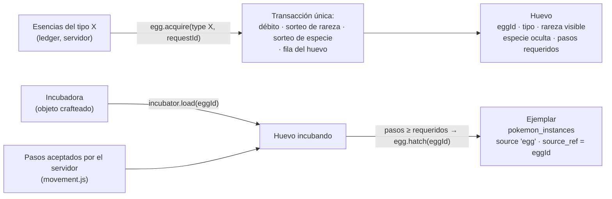
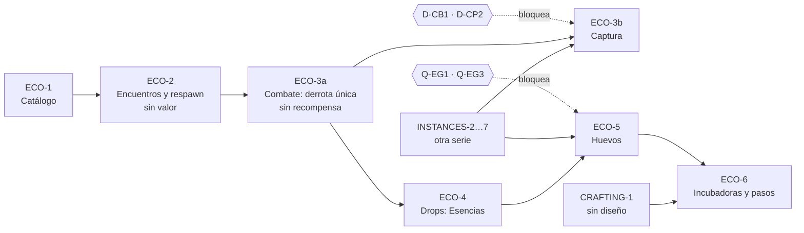

# POKÉMON ECOSYSTEM-1 — Catálogo inicial, población, drops, huevos e incubadoras

> Rama `design/pokemon-ecosystem-1`, creada desde `integration/world-skills-0.3 @ ad6a98e6c9389cedc88f07f541a7940dd70286e9` (verificado con `git fetch` + `git cat-file`; es el HEAD de `origin/integration/world-skills-0.3`).
> **Sólo documentación y un script de cálculo aislado.** No se modificó código, SQL, migraciones, bundles, configuración, dependencias, datos, hosted, Cloud, flags ni otros worktrees.
> Etiquetas: **FACT** (verificado en `archivo:línea` sobre `ad6a98e`), **INFERENCE** (deducido, no ejecutado), **OPEN QUESTION** (decisión del dueño), **PROPUESTA** (valor de playtest, no balance aprobado).
> Cálculos: `docs/design/pokemon-ecosystem-1/ecosystem_calc.mjs` (`node <ruta>`, Node ≥ 18, determinista, sólo lectura). Todas las cifras de este documento son su salida literal (§G).

**Documentos que este reutiliza y no repite** (prevalece este donde los contradiga, porque aplica las decisiones del dueño de 2026-10-05):

| Documento | Commit | Qué se toma |
| --- | --- | --- |
| `docs/design/MMO_SPAWN_RARITY_AND_INSTANCES.md` | `f3f5b81` | Tiers de rareza, esquema `SpawnTable`/`SpawnEntry` (§9), contrato de captura (§11), validaciones S1–S6, matriz C1–C6 |
| `docs/design/CAVE_RESPAWN_AND_TOKENS.md` | `bfb21ed` | Nidos, generación/ABA (§2.2), casillas prohibidas (§2.3), Esencias y ledger (§5) |
| `docs/design/CAVE_TYPES_AND_FAMILIES.md` | `bfb21ed` | Tipo `caliza`, familias verificadas, exclusiones (§4.3), huecos H1–H4 |
| `docs/design/CAVE_ECOSYSTEM_ROADMAP.md` | `bfb21ed` | Threat model T1–T21, fases CAVE WILD-1 … GACHA-2, decisiones D-* |
| `docs/design/SHARED_DUNGEON_ARCHITECTURE.md` | `bfb21ed` | Resolución exactly-once (§6), llaves personales (§4) |
| `docs/design/CAVES_3_REPORT.md`, `CAVES_4_REPORT.md` | `680178a`, `b9345f6` | Cueva caminable y navegación autoritativa |
| `docs/design/INSTANCES_1_AUDIT.md` (rama `design/pokemon-instances-audit-0.3`, **no está en la base**) | `a5e8338` | `pokemon_instances`, `source = 'egg'`, punto de no retorno, D-IN1 |
| `docs/design/SWAP_RETIRE_2_REPORT.md`, `SECURITY_3_REPORT.md` | `e16e059`, `e685e6a` | Swap y free-claim retirados; Silph Co. reservado para huevos |
| `docs/skills/RESOURCE_YIELD_2_REPORT.md` | `c55a4c1` | Patrón de commit, `stale`, multi-yield |

---

## 0. Resumen

- **Alcance:** Pradera (abierta + subzona `bosque`) y `cueva-inicial`. La subzona `cantera`, Dungeons, combate detallado, otras regiones y eventos quedan fuera.
- **Catálogo (§A):** 31 entradas, 25 especies, 22 familias. Las tres tablas tienen el mismo reparto: común 70 · poco común 24 · raro 5,5 · muy raro 0,5. No hay finales de 3 etapas, bebés, legendarios, míticos, pseudos, starters, fósiles ni Eevee. Todas las especies existen en `core.json` y tienen sprite overworld normal y shiny (0 problemas). Faltan arte de combate, huevos, incubadoras, Esencias y Ball.
- **Población (§B):**
  - nidos fijos con grupos de aparición;
  - un encuentro por miembro, con `encounterId = scope:nest:generación:miembro`;
  - nidos activos según la presencia;
  - respawn de 75–90 s tras resolver el grupo entero;
  - zona vacía dormida.
  - La cueva es chica (157 casillas de suelo): tope de 4 nidos. Con 30 jugadores dentro ofrece ~6 encuentros por jugador y hora: **se satura**.
- **Drops (§C):** sólo Esencias del tipo (recurso futuro). Ningún material existente y ningún `profiles.tokens` en v1. Para doble tipo se propone un **reparto** (R3): el total es igual al de una especie de un tipo, y cada unidad sale primaria con 2/3 y secundaria con 1/3. Producción estimada: **~32–35 Esencias/h** en ritmo activo (supuesto de 30 derrotas/h, sin medir).
- **Huevos (§D):**
  - el tipo elige el pool y la rareza sortea el tier;
  - **la distribución del dueño suma 99 %**, así que se dan cinco alternativas sin elegir ninguna;
  - con sólo las familias de Pradera y la cueva, **ningún tipo tiene los cuatro tiers poblados**. Hace falta un pool de huevo curado por tipo (borrador para Normal y Bicho, §D.3);
  - el tier "Legendario" del huevo **no tiene contenido definido**: bloquea la implementación;
  - los pasos válidos se pueden contar en el servidor, que ya valida cada paso (`movement.js:28-66`).
- **Plan (§E):** seis fases en el orden pedido. Catálogo y encuentros (sin valor) no dependen de Cloud. Todo lo que crea ejemplares o mueve valor depende de INSTANCES y de autoridad persistente.

---

## 1. Contexto recuperado (entregado antes de redactar)

### 1.1 Implementado en la base (`ad6a98e`)

| Sistema | Estado | Evidencia |
| --- | --- | --- |
| Ciudad Corazón, Pradera y `cueva-inicial` | Áreas de presencia. Pradera es procedural (seed 208); la Ciudad no tiene mundo dinámico | `services/realtime/src/world/areas.js:11-14` |
| Subzonas de Pradera | `bosque` (Talar), `cantera` (Minería) y reservas | `world/resourceZones.js:37,42,50-51` |
| Cueva compartida | Interior de 21×15 autorado, **vacío a propósito** (sin nodos ni salvajes) y sin instancias por jugador | `world/caveLayouts.js:1-37,66-68` |
| Navegación | El servidor valida cada paso (colisión, ritmo de 10 pasos/s con ráfaga de 15, secuencia) y los portales | `presence/movement.js:3-66`; `CAVES_4_REPORT.md` §1 |
| Salvajes de superficie | **Roster horario de 25 especies únicas** por área procedural: excluye especies con dueño, categoría `legendary` del 2 %, shiny 1/64 por hash y patrullas compartidas. **Sin combate, sin captura, sin respawn.** Sólo Pradera | `world/wildPopulation.js:21-29,47-77,141-160`; `wildService.js:62-69` |
| Habilidades | Talar, Minería y Agricultura probabilísticas con multi-yield. Caminar cancela | `RESOURCE_YIELD_2_REPORT.md`; `skills/domain/resources.ts:57-130` |
| Materiales | 14 (4 maderas, 5 minerales, 5 de cultivo), casi todos con uso `planned` | `skills/domain/materials.ts:10-49` |
| Moneda | `profiles.tokens` (mercado, ingreso pasivo, Dungeon legacy con tope de 3 000/día) | `docs/INVARIANTS.md` INV-TOK-1, INV-DGN-3 |
| Catálogo de especies | 493 especies Gen I–IV, tipos ORAS, `catchRate`. **Sin** familias, hábitat, tamaño, flags de legendario ni pasos de huevo | `battle/catalog/generated/core.json`; `CAVE_TYPES_AND_FAMILIES.md` §4.2 |
| Sprites overworld | 493 normales + 493 shiny | `public/assets/overworld/`, `wildlands/engine/characters.ts:304` |
| Combate y captura | **Sólo prototipo de cliente** en `/dev` (fórmula de captura "PROTOTYPE ASSUMPTION") | `dungeonPrototype/domain/capture.ts:1-60` |
| Ownership | Todavía una especie = un Pokémon: `slots PRIMARY KEY (pokemon_id)` | `MMO_SPAWN_RARITY_AND_INSTANCES.md` §2 U1 |
| Swap y free-claim | Retirados | `SWAP_RETIRE_2_REPORT.md`, `SECURITY_3_REPORT.md` |

### 1.2 Sólo diseñado

- **CAVE ECOSYSTEM-1** (en la base): tiers, tablas de aparición, nidos, Esencias, "Huevo de hábitat" (gacha), contrato de captura, fases.
- **INSTANCES-1** (`a5e8338`, otra rama, **no** en la base): `pokemon_instances` con `source IN (…,'egg',…)` y `UNIQUE (source, source_ref)`.
- **SHARED_DUNGEON_ARCHITECTURE**: runs compartidas y llaves personales.

### 1.3 Nunca diseñado

- **Incubadoras**, conteo de pasos, rareza de huevo Común/Raro/Épico/Legendario, receta crafteable.
- `CRAFTING-1` está nombrado como dependencia (`SWAP_RETIRE_2_REPORT.md:133,202`), pero no tiene diseño en ninguna rama.
- Búsqueda en todas las ramas locales y remotas con `git grep -i "incubad|incubator|huevo"`: sólo aparecen los documentos citados arriba.

### 1.4 Contradicciones

Ver §F.3: diecisiete, con su resolución.

---

## 2. Cómo se aplican las decisiones del dueño

| # | Decisión | Consecuencia en este documento |
| --- | --- | --- |
| 1 | No hay Pokémon únicos por especie | Las tablas no excluyen especies con dueño. El encuentro tiene identidad propia (§B.3). El ejemplar lo crea Postgres. |
| 2 | Distribución de MMO | Pradera y la cueva sólo tienen formas base comunes. Las intermedias quedan en `rare`/`very_rare`. Las finales de 3 etapas no entran (§A.4). |
| 3 | Legendarios sólo para eventos | Ninguna tabla ni huevo ordinario los contiene (validado por el script). El tier "Legendario" del huevo **no** contiene legendarios (§D.2). |
| 4 | Cuevas y Dungeons compartidas | La cueva es un área permanente con nidos compartidos. Las Dungeons no se tocan. |
| 5 | Familias ≠ grupos de aparición | `familyId` (evolución) y `spawnGroup` (quiénes aparecen juntos) son campos distintos (§A.1). |
| 6 | Captura + huevos, sin exclusividad | Sin stock ni unicidad. Los huevos se pagan con Esencias. |
| 7 | Huevos e incubadoras con autoridad de servidor | Rareza, especie, pasos y eclosión se deciden y validan en el servidor (§D.5–§D.6). |

---

## A. Catálogo inicial de encuentros

### A.1 Conceptos

| Concepto | Qué es | Ejemplo |
| --- | --- | --- |
| **Familia evolutiva** (`familyId`) | Línea de evolución; id = especie base **incluido el bebé** | `172` (Pichu → Pikachu → Raichu) |
| **Etapa** | Posición en la familia, contando desde la forma base no bebé | Pikachu = 2 si se cuenta Pichu; Pidgeotto = 2 |
| **Grupo de aparición** (`spawnGroup`) | Quiénes aparecen juntos en un nido: tamaño `[min,max]` y composición | Zubat 2–3 (colonia), Caterpie 1–3 (con Metapod opcional) |
| **Entrada de tabla** | Especie + tier + peso + grupo + restricciones, en una tabla de zona | `pradera.bosque` → Metapod, `uncommon`, 6, grupo 1–2 |

Un grupo puede **mezclar familias** (p. ej. Caterpie con Weedle en el bosque). Por eso no es lo mismo que la familia. En v1 se propone el grupo **homogéneo** (misma entrada repetida 1–N veces) para simplificar la autoría. La mezcla queda como extensión (`spawnGroup.companions`).

### A.2 Tablas propuestas (PROPUESTA)

Peso = relativo dentro de la tabla (suma 100). **cr** = `catchRate` de `core.json` (FACT). Sprites: `overworld/NNNN.png` y `shiny/NNNN.png` existen para todas las filas (FACT, verificado por el script). Nivel: Pradera 2–5, bosque 3–7, cueva 5–8.

**`pradera.abierta`** (Pradera fuera de subzonas, reservas y aproximación de llegada):

| Especie | Familia | Tipos | Hábitat | Tier | Peso | Grupo | Restricciones |
| --- | --- | --- | --- | --- | --- | --- | --- |
| 16 Pidgey | Pidgey (3 et.) | normal/flying | pasto abierto | common | 28 | 1–3 | — |
| 19 Rattata | Rattata (2) | normal | pasto abierto | common | 28 | 1–2 | — |
| 399 Bidoof | Bidoof (2) | normal | pasto, cerca de agua | common | 14 | 1–2 | — |
| 29 Nidoran♀ | Nidoran♀ (3) | poison | pasto alto | uncommon | 6 | 1 | — |
| 32 Nidoran♂ | Nidoran♂ (3) | poison | pasto alto | uncommon | 6 | 1 | — |
| 187 Hoppip | Hoppip (3) | grass/flying | pasto abierto | uncommon | 6 | 1–2 | — |
| 403 Shinx | Shinx (3) | electric | pasto abierto | uncommon | 6 | 1 | — |
| 17 Pidgeotto | Pidgey | normal/flying | pasto abierto | rare | 2 | 1 | intermedia |
| 20 Raticate | Rattata | normal | pasto abierto | rare | 1,5 | 1 | final de 2 etapas |
| 25 Pikachu | Pichu (172) | electric | pasto abierto | rare | 2 | 1 | demandado: nunca `common` |
| 30 Nidorina | Nidoran♀ | poison | pasto alto | very_rare | 0,25 | 1 | intermedia |
| 33 Nidorino | Nidoran♂ | poison | pasto alto | very_rare | 0,25 | 1 | intermedia |

**`pradera.bosque`** (subzona `bosque`, `resourceZones.js:37`):

| Especie | Familia | Tipos | Hábitat | Tier | Peso | Grupo | Restricciones |
| --- | --- | --- | --- | --- | --- | --- | --- |
| 10 Caterpie | Caterpie (3) | bug | sotobosque | common | 26 | 1–3 | — |
| 13 Weedle | Weedle (3) | bug/poison | sotobosque | common | 26 | 1–3 | — |
| 43 Oddish | Oddish (3) | grass/poison | claros húmedos | common | 18 | 1–2 | — |
| 11 Metapod | Caterpie | bug | ramas | uncommon | 6 | 1–2 | excepción: capullo, poder bajo |
| 14 Kakuna | Weedle | bug/poison | ramas | uncommon | 6 | 1–2 | excepción: capullo |
| 204 Pineco | Pineco (2) | bug | coníferas | uncommon | 6 | 1 | — |
| 165 Ledyba | Ledyba (2) | bug/flying | follaje | uncommon | 6 | 1–2 | — |
| 44 Gloom | Oddish | grass/poison | claros húmedos | rare | 2 | 1 | intermedia |
| 17 Pidgeotto | Pidgey | normal/flying | claros | rare | 1,5 | 1 | intermedia |
| 166 Ledian | Ledyba | bug/flying | follaje | rare | 1 | 1 | final de 2 etapas |
| 25 Pikachu | Pichu | electric | claros | rare | 1 | 1 | demandado |
| 205 Forretress | Pineco | bug/steel | coníferas | very_rare | 0,5 | 1 | final de 2 etapas, única fuente de `steel` |

**`cueva-inicial`** (interior compartido de tipo `caliza`):

| Especie | Familia | Tipos | Hábitat | Tier | Peso | Grupo | Restricciones |
| --- | --- | --- | --- | --- | --- | --- | --- |
| 41 Zubat | Zubat (3) | poison/flying | techo | common | 30 | 2–3 | colonia; nunca en la casilla de llegada ni en la salida |
| 74 Geodude | Geodude (3) | rock/ground | suelo pedregoso | common | 28 | 1–2 | — |
| 293 Whismur | Whismur (3) | normal | huecos | common | 12 | 1 | — |
| 50 Diglett | Diglett (2) | ground | suelo | uncommon | 9 | 1 | — |
| 46 Paras | Paras (2) | bug/grass | rincón húmedo | uncommon | 8 | 1 | — |
| 27 Sandshrew | Sandshrew (2) | ground | suelo seco | uncommon | 7 | 1 | — |
| 75 Graveler | Geodude | rock/ground | suelo pedregoso | rare | 2 | 1 | intermedia |
| 42 Golbat | Zubat | poison/flying | techo | rare | 1,5 | 1 | intermedia; tamaño L: sólo zona central |
| 185 Sudowoodo | Bonsly (438) | rock | huecos | rare | 1 | 1 | sin Bonsly (bebé) |
| 294 Loudred | Whismur | normal | huecos | rare | 1 | 1 | intermedia |
| 206 Dunsparce | Dunsparce (1) | normal | huecos | very_rare | 0,5 | 1 | "raro de la cueva"; tamaño L |

Shares por tabla (script §G.A): **common 70 · uncommon 24 · rare 5,5 · very_rare 0,5**.

### A.3 Qué entra al comienzo y por qué

| Criterio | Aplicación |
| --- | --- |
| Reconocible y accesible | Pidgey, Rattata y Caterpie (los ejemplos del dueño) son `common` y de peso alto en su subzona. |
| Pool chico | 12 / 12 / 11 entradas. Menos que las 14–15 de `MMO_SPAWN_RARITY_AND_INSTANCES.md` §7.2–§7.5. |
| Valor regulado | Las especies "demandadas" o valiosas, si entran, lo hacen como `rare` (Pikachu) o `very_rare`. Ninguna final de 3 etapas. |
| Cobertura de tipos | Normal, bicho, veneno, planta, eléctrico, tierra, roca y volador (sólo secundario). Acero sólo vía Forretress (`very_rare`), a propósito. |
| Sin condiciones horarias en v1 | El reloj de aparición del servidor (D-TM1) no existe; la fase visual difiere por cliente (`MMO` §9.3). Hoppip queda fijo y Hoothoot pasa a la segunda ola. |
| Sin excepciones de bebé | Bonsly, aprobado como excepción en MMO §7.5, se retira: Sudowoodo cubre la familia sin abrir la regla. |

**Quedan para progresión posterior** (no se descartan):

- **Cantera** completa (`MMO` §7.4).
- Sentret, Hoothoot, Spinarak y Starly (rotación horaria o de temporada).
- Butterfree, Beedrill, Pidgeot, Vileplume, Nidoqueen y Nidoking (finales de 3 etapas).
- Raichu.
- Onix: es XL y no conviene en una cueva de 157 casillas; queda para `caliza-d1` o `cantera`.
- Bonsly y bebés en general.
- Shinx → Luxio y el resto de las intermedias de las familias nuevas.

### A.4 Validaciones (requisito técnico)

Las validaciones S1–S3 de `MMO_SPAWN_RARITY_AND_INSTANCES.md` §9.2 y §14, más:

- **V-A1:** id y nombre de cada entrada coinciden con `core.json`.
- **V-A2:** sprite overworld normal y shiny existen. Hoy lo hace el script.
- **V-A3:** no hay ninguna especie de las categorías prohibidas en tablas sin `eventId`.
- **V-A4:** ninguna final de 3 etapas en `pradera.*` ni `cueva-inicial`.
- **V-A5:** `familyId ≠ spawnGroup` en el esquema: el grupo nunca se infiere de la familia.

### A.5 Recursos visuales

| Recurso | Estado | Nota |
| --- | --- | --- |
| Sprite overworld normal y shiny de las 25 especies | ✓ FACT | `public/assets/overworld/` |
| Sprite o arte de combate | ✗ **falta** | El combate de producción no existe. El prototipo dibuja SVG y `sprite_url` vive en la tabla hosted `pokemon` (no hay filas en el repo). Decidir si el combate usa el overworld escalado o un set nuevo. |
| Íconos de Esencia (18 tipos) | ✗ **falta** | `MaterialIcon.vue` sólo cubre los 14 materiales |
| Huevo (por tipo × rareza), eclosión | ✗ **falta** | — |
| Incubadora (ícono y, si se ve en el mundo, objeto) | ✗ **falta** | — |
| Ball (ítem de inventario) | parcial | `wildlands/engine/pokeball.ts` existe para el mundo; falta el ícono de ítem |
| Indicador de grupo o nido, encuentro "reservado" | ✗ **falta** | UX de COMBAT |

---

## B. Población y respawn

### B.1 Producto (decisiones a revisar)

| Pregunta | Propuesta |
| --- | --- |
| ¿Cuántos se ven? | Pocos y visibles. Pradera abierta, hasta 8 nidos (~12 Pokémon). Bosque, hasta 5 (~8). Cueva, hasta 4 (~6). |
| ¿Cuándo vuelve uno derrotado o capturado? | Cuando el **grupo entero** del nido se resolvió, a los 75 s ± 20 % (superficie) o 90 s ± 20 % (cueva). El tiempo exacto no se publica. |
| ¿Vuelve el mismo? | No necesariamente: cada aparición sortea una entrada nueva de la tabla. Si repite especie, es **otro** encuentro. |
| ¿Varios jugadores? | Ven los mismos encuentros. **Un encuentro, un combate:** el primero que lo enfrenta lo reserva (regla APPROVED del prototipo, `coop.ts:119-124`). Los demás lo ven ocupado. Unirse a un combate ajeno queda como OPEN QUESTION (D-CB1). |
| ¿Zona vacía? | A los 5 min sin jugadores la zona se duerme (sin timers ni patrullas). Al volver, los nidos reaparecen escalonados entre 5 y 15 s. |
| ¿Reconexión? | Sin ventaja ni pérdida (§B.4). |
| ¿Acampar un raro? | No sirve: el tier se sortea en cada aparición, no por nido. El rendimiento decreciente por nido y el tope diario de Esencias se mantienen (`CAVE_RESPAWN_AND_TOKENS.md` §3.1, §5.4). |

### B.2 Límites (PROPUESTA, script §G.B)

| Zona | Nidos activos | Respawn | Miembros por aparición | Oferta con 1 · 5 · 10 · 30 jugadores (encuentros/h por jugador) |
| --- | --- | --- | --- | --- |
| `pradera.abierta` | `min(8, 3 + ⌈p/2⌉)` | 75 s ± 20 % | 1,52 | 182 · 54,7 · 36,5 · **12,2** |
| `pradera.bosque` | `min(5, 2 + ⌈p/3⌉)` | 75 s ± 20 % | 1,70 | 153 · 40,8 · 25,5 · **8,5** |
| `cueva-inicial` (157 casillas) | `min(4, 2 + ⌈p/4⌉)` | 90 s ± 20 % | 1,59 | 127 · 33,9 · 17,0 · **5,7** |

`p` = jugadores presentes en esa zona. Supuesto del ciclo: respawn + 45 s de vida media.

**Lectura:**

- Con 1–5 jugadores la oferta sobra (el límite es el ritmo del combate).
- Con 30 jugadores en una sola zona, la oferta por jugador cae por debajo del ritmo "tranquilo" (18/h).
- **La cueva se satura primero.** Es una propiedad deseable para un área compartida chica, pero hay que medirla: si molesta, se agranda el interior (otra fase de CAVES) en lugar de subir la densidad.
- **No** se propone escalar sin techo: 157 casillas no admiten más de ~6 Pokémon visibles sin tapar la salida.

Requisitos espaciales: los de `CAVE_RESPAWN_AND_TOKENS.md` §2.3. En la cueva, además, ningún hogar a ≤ 3 casillas de `S` (llegada) ni de `E` (salida) (`caveLayouts.js:35,37`), y los tamaños L (Golbat, Dunsparce) sólo en las filas 3–10 de la zona central. En superficie, nada en la aproximación de llegada (radio 6), en rutas, stands, reservas ni en la reserva de la boca de la cueva (`caves.js:104`).

### B.3 Identidad del encuentro y exactly-once

```text
nest        = (scopeId, nestId)               scopeId: 'pradera' | 'cueva-inicial'
generation  = entero monótono por nido        sube cuando el grupo entero se resolvió o se despawneó
encounterId = `${scopeId}:${nestId}:${generation}:${member}`   member = 0..n-1 dentro del grupo
```

| Riesgo | Control |
| --- | --- |
| Doble captura del mismo encuentro | Una sola resolución por `encounterId`: `defeated \| captured \| fled`. En Postgres, `encounter_resolutions` con PK `encounterId` y `pokemon_instances UNIQUE (source 'wild_capture', source_ref = encounterId)`, en **una** transacción (`MMO` §11.1, `INSTANCES_1_AUDIT.md` §5.2) |
| Doble recompensa | `elemental_token_ledger UNIQUE (source_id = encounterId, user_id, token_type)` (`CAVE_RESPAWN` §5.3) |
| `engage` retrasado sobre un respawn (ABA) | El `encounterId` lleva la generación. Una generación vieja recibe `gone` |
| Dos jugadores a la vez | El realtime serializa la reserva y el segundo recibe `busy`. La base es la última defensa |
| Reintento tras ack perdido | Mismo `encounterId` → el servidor devuelve el resultado guardado (patrón de `3fca914`) |
| Cliente propone especie, nivel, shiny o resultado | Los intents no tienen esos campos (T1, T19) |

**Persistencia del nido.** Mientras no haya valor (fase ECO-2) el estado vive en memoria. Desde que existan derrotas con recompensa (ECO-3/ECO-4), `generation` y la resolución se persisten. Un reinicio pierde los encuentros vivos **sin pago** y reaparecen con un miembro nuevo. Nada derrotado resucita (`CAVE_RESPAWN` §3.1).

### B.4 Reconexión y despliegues (sin infraestructura nueva)

| Caso | Regla |
| --- | --- |
| Corte sin combate | Al volver, el snapshot muestra lo que hay. El jugador no tenía nada reservado. |
| Corte durante un combate | Gracia de 15 s (igual que D-DG3). Pasada la gracia, se aborta: el encuentro vuelve a `alive` con la misma generación y HP completo, y nadie cobra. Sin botín en riesgo, no hay incentivo a desconectarse. |
| Corte durante `resolving` | La resolución sigue. El resultado espera al jugador (`MMO` §11.3). |
| Reinicio o despliegue | Lo de la fila anterior. La ubicación del jugador la decide WORLD LOCATION (fuera de alcance). |
| Dos instancias del realtime | La que tiene el lease vencido no resuelve (`stale`), con el patrón de YIELD-2. No se diseña presencia nueva. |

### B.5 Producto vs técnica

| Decisión de **producto** (dueño) | Requisito **técnico** (implementador) |
| --- | --- |
| Densidad visible por zona y respawn | `activeNests`, CSPRNG del servidor, `respawnAt` secreto |
| ¿Unirse a combates ajenos? (D-CB1) | Reserva serializada en el realtime |
| ¿Captura en la cueva o sólo en superficie? | `encounterId` con generación y miembro |
| Tasa shiny (D-SH1, 1/512 propuesto) | Resolución única + `UNIQUE` en la base |
| Tamaño de la cueva | Dormancia, escalonado, persistencia de la generación |

---

## C. Drops

### C.1 Tres categorías, tres reglas

| Categoría | Qué es hoy | Propuesta v1 para encuentros |
| --- | --- | --- |
| **Materiales existentes** (14, `materials.ts`) | Salidas de Talar, Minería y Agricultura. Curva medida de ~28,5 h hasta nivel 50 (`balance.ts:22-24`) | **Ninguno.** Darlos en combate rompe la curva medida de SKILLS y duplica su fuente. Revisable con telemetría. |
| **Recursos de tipo futuros** ("Esencia de <Tipo>", `CAVE_RESPAWN` §5.1, D-TK1) | No existen | **Única recompensa v1**, intransferible, en ledger propio y nunca `profiles.tokens`. |
| **Moneda actual** (`profiles.tokens`) | Mercado, pasivo, Dungeon legacy | **Ninguna.** Evita una fuente nueva de la moneda de mercado antes de D-IN1. |

### C.2 Cantidad por derrota

- Base por etapa: **1** (etapa 1) y **2** (etapa 2). Ninguna entrada inicial tiene etapa 3.
- La rareza **no** suma (`CAVE_RESPAWN` §5.2): acceso, no multiplicador.
- Shiny: cosmético.
- La captura no da Esencias a quien captura (recibe el ejemplar). Si se aprueba D-CB2, los demás elegibles sí reciben la recompensa de derrota.

### C.3 Doble tipo: reglas comparadas (script §G.C)

| Regla | Qué hace | Esencias/derrota (abierta · bosque · cueva) | Ventaja | Problema |
| --- | --- | --- | --- | --- |
| R1 · sólo primario | El tipo secundario no da nada | 1,06 · 1,18 · 1,06 | Simple | `flying` no tiene ninguna fuente: **ninguna** especie lo tiene como primario (`CAVE_RESPAWN` §5.1). `steel` tampoco |
| R2 · primario + 25 % secundario (`CAVE_RESPAWN` §5.2) | Bonus | 1,15 · 1,33 · 1,23 | Acceso a secundarios | **Duplica parcialmente:** las especies de doble tipo rinden +25 %. Es lo que el dueño pide evitar |
| **R3 · reparto** *(recomendada)* | La cantidad es la de la etapa. Cada unidad sale primaria con 2/3 y secundaria con 1/3 (CSPRNG) | 1,06 · 1,18 · 1,05 | Total idéntico al de un tipo; da acceso a `flying` y `steel` | Un poco menos del primario |

Con R3, una especie de doble tipo **nunca** rinde más que una de un tipo de la misma etapa. Diferencia entre tablas: ≤ 0,13 por derrota.

### C.4 Recursos por hora (estimación, no balance)

**Supuestos explícitos:**

1. Derrotas por hora: tranquilo 18, activo 30, intenso 45 (`CAVE_RESPAWN` §7.1 usa 18/30/40). El tiempo de combate real **no existe** hasta COMBAT-1.
2. Regla R3.
3. Sin tope blando (300/día, no se alcanza en 1–2 h) y sin rendimiento decreciente.
4. Oferta suficiente, es decir ≤ 5 jugadores por zona (§B.2).

| Zona | Tranquilo | Activo | Intenso | Tipo principal (activo) |
| --- | --- | --- | --- | --- |
| `pradera.abierta` | 19,1/h | 31,8/h | 47,7/h | normal 19,9/h |
| `pradera.bosque` | 21,2/h | 35,4/h | 53,1/h | bug 22,6/h |
| `cueva-inicial` | 19,0/h | 31,6/h | 47,5/h | ground 8,0/h |

Mejor fuente por tipo, en horas de juego activo para juntar 20 / 40 / 60 Esencias de ese tipo:

| Tipo | 20 | 40 | 60 |
| --- | --- | --- | --- |
| bug | 0,9 | 1,8 | 2,7 |
| normal | 1,0 | 2,0 | 3,0 |
| ground | 2,5 | 5,0 | 7,5 |
| rock | 2,9 | 5,7 | 8,6 |
| poison | 3,0 | 6,1 | 9,1 |
| grass | 4,5 | 9,1 | 13,6 |
| flying | 5,3 | 10,5 | 15,8 |
| electric | 6,7 | 13,3 | 20,0 |
| steel | 200 | 400 | 600 |

**No son valores medidos.** Hay que recalibrarlos con la telemetría de ECO-3 (derrotas reales por hora y por zona).

---

## D. Huevos e incubadoras

### D.1 Flujo y autoridad



| Paso | Autoridad | Exactly-once |
| --- | --- | --- |
| Comprar huevo | Postgres (función `service_role` vía `world-authority`) | `requestId` del cliente + `user_id` → `egg_id`. Débito `WHERE balance >= cost` en la misma transacción |
| Rareza y especie | CSPRNG del servidor **al comprar**. La rareza se muestra; la especie se guarda oculta | El reintento devuelve el mismo huevo |
| Cargar incubadora | Servidor: el huevo y la incubadora son del jugador y están libres | CAS sobre el estado del huevo |
| Pasos | Realtime: sólo pasos **aceptados** por `applyMove` (§D.6) | Flush monótono con secuencia (CAS) |
| Eclosión | Postgres: `steps ≥ required`, crea el ejemplar | `UNIQUE (source 'egg', source_ref = eggId)` (`INSTANCES_1_AUDIT.md` §5.2) |

¿Por qué se sortea la especie al comprar y no al eclosionar? Así el resultado queda fijo y auditado en un solo evento: no se puede "esperar un cambio de pool". Esconder la especie es presentación. **Alternativa:** sortear al eclosionar, con el pool congelado por `pool_version`. Ambas son seguras. OPEN QUESTION menor (Q-EG6).

### D.2 Rareza del huevo: la distribución suma 99 %

El dueño dio **Común 80 %, Raro 15 %, Épico 3,9 %, Legendario 0,1 %** = **99 %**. No se normaliza en silencio. Alternativas (script §G.D):

| Opción | Común | Raro | Épico | Legendario | E[huevos hasta Épico+] | E[huevos hasta Legendario] | P(≥ 1 Legendario en 100) |
| --- | --- | --- | --- | --- | --- | --- | --- |
| A · Común absorbe el 1 % | **81** | 15 | 3,9 | 0,1 | 25 | 1 000 | 9,5 % |
| B · Raro absorbe | 80 | **16** | 3,9 | 0,1 | 25 | 1 000 | 9,5 % |
| C · Épico absorbe | 80 | 15 | **4,9** | 0,1 | 20 | 1 000 | 9,5 % |
| D · Legendario absorbe | 80 | 15 | 3,9 | **1,1** | 20 | 91 | 66,9 % |
| E · Proporcional | 80,81 | 15,15 | 3,94 | 0,10 | 24,7 | 990 | 9,6 % |
| F · 1 % explícito "otro resultado" | 80 | 15 | 3,9 | 0,1 | — | — | — |

- **D** multiplica por 11 la rareza máxima: cambia el producto, no es un redondeo.
- **E** produce porcentajes que no se pueden publicar limpios.
- **F** necesita definir el 1 % (¿shiny garantizado?, ¿reembolso?, ¿huevo vacío?). Un "huevo vacío" pagado es mala UX.

**No se elige.** Q-EG1.

Nombre: **"Legendario" como rareza de huevo choca** con la categoría de especie "legendario", que es sólo de eventos (decisión 3). Contiene especies **no legendarias**. Se sugiere renombrarlo en la UI ("Estelar", "Dorado") para que nadie lea "huevo de legendario". OPEN QUESTION Q-EG2.

### D.3 Cómo el tipo y la rareza delimitan el pool

**Regla propuesta:**

```text
pool(tipo X, rareza R) = entradas de egg_pool[X][R] (tabla autorada, versionada)
  cada entrada: especie base no bebé de una familia ordinaria, con X ∈ tipos(especie)
  nunca: legendarios, míticos, eventos, starters, pseudos, fósiles, Eevee (salvo decisión explícita)
  dentro del tier: peso uniforme por especie (publicado)
un huevo de tipo X se ofrece sólo si cada rareza con probabilidad > 0 tiene ≥ 1 especie
```

**Hecho del cálculo (§G.D).** Si el pool se arma sólo con las familias de Pradera y la cueva y se asigna el tier según la rareza de aparición, **ningún tipo queda completo**. Todas las familias iniciales tienen su base como común, así que los tiers Raro y Épico quedan vacíos salvo casos sueltos (Pikachu, Sudowoodo, Dunsparce), y el tier Legendario no tiene definición. Por lo tanto:

1. **Común** = bases de familias de las tablas de aparición liberadas. Conecta captura y huevos.
2. **Raro y Épico** = familias del mismo tipo **ausentes de las tablas iniciales**, curadas por valor (los huevos como vía de acceso a especies que no se encuentran todavía). Es la única forma de que un huevo Raro valga más que capturar.
3. **"Legendario"** = **decisión pendiente** (Q-EG3). Opciones:
   - (a) Épico con shiny garantizado;
   - (b) una categoría especial que el dueño defina (¿Eevee?, ¿starters?, ¿bases de pseudo?);
   - (c) pool propio de especies de alto valor no especiales.

   Mientras no se decida, **ningún huevo puede implementarse**: no hay forma honesta de sortear un tier vacío.

**Borrador ilustrativo** (sólo Normal y Bicho, los dos tipos con más producción; verificado por el script: tipo correcto, ninguna categoría prohibida, sprite presente):

| Huevo | Común | Raro | Épico | "Legendario" |
| --- | --- | --- | --- | --- |
| Normal | Pidgey, Rattata, Bidoof, Whismur | Teddiursa (cr 120), Skitty, Aipom (cr 45) | Dunsparce, Tauros (cr 45), Kangaskhan (cr 45) | — Q-EG3 |
| Bicho | Caterpie, Weedle, Ledyba, Pineco, Paras | Venonat, Spinarak, Shuckle | Scyther (cr 45), Pinsir (cr 45), Heracross (cr 45) | — Q-EG3 |

Los demás tipos (Veneno, Tierra, Roca, Planta, Volador, Eléctrico) se curan en su fase, con el mismo método. Mientras no estén completos, **no se ofrecen**.

**Doble tipo en huevos.** Una especie de doble tipo está en el pool de sus dos tipos (Pidgey en Normal y en Volador). No duplica rendimiento: un huevo da un ejemplar, sea del tipo que sea.

**Bebés.** Un huevo canónico da el bebé (Pichu, Bonsly). Se propone dar la base no bebé (Pikachu, Sudowoodo) hasta que el dueño decida qué hacer con los bebés (Q-EG7).

### D.4 Costo (PROPUESTA)

| Costo propuesto | Esencias del tipo del huevo | Horas de juego activo (mejor fuente) | Lectura |
| --- | --- | --- | --- |
| Bajo | 20 | Normal 1,0 h · Bicho 0,9 h | ~1 huevo por hora activa: sobreoferta de ejemplares (`MMO` §10.5) |
| **Medio** *(sugerido para playtest)* | 40 | Normal 2,0 h · Bicho 1,8 h | Activo de 2 h/día ≈ 1 huevo/día |
| Alto | 60 | Normal 3,0 h · Bicho 2,7 h | Casual (1 h/día) ≈ 1 huevo cada 3 días |

El costo es **igual para las cuatro rarezas**, porque la rareza se sortea después de pagar. Hay que sumar un tope de huevos por día y por cuenta (propuesta: 5) contra la acumulación. Tipos escasos (Eléctrico: 13,3 h por 40) → huevo poco frecuente **a propósito** o un costo por tipo (Q-EG4). La conversión 5:1 de `CAVE_RESPAWN` §5.6 sigue siendo una opción independiente.

### D.5 Incubadora (PROPUESTA)

| Pregunta | Opciones | Sugerencia |
| --- | --- | --- |
| Receta | Materiales existentes de SKILLS | **Incubadora básica:** 6 Tronco común + 4 Piedra + 2 Carbón. Son materiales de grado 1–2, ya obtenibles en Pradera (INFERENCE sobre nodos `tree`/`rock`), y los primeros con un uso real (hoy todos son `planned`, `materials.ts:32-49`). Su costo en minutos de recolección **no está medido**. |
| Durabilidad | Permanente · N usos · un uso | **Permanente, una por jugador, una ranura.** Sólo se craftea una vez y es la base para todos. Las incubadoras extra de N usos (p. ej. 3) son un sumidero posterior de materiales. |
| Cantidad simultánea | 1 · 2 · 3 | 1 en v1. La espera de pasos es el ritmo |
| ¿Dónde se craftea? | Silph Co. (reservado en `SWAP_RETIRE_2_REPORT.md:76-77`) · banco de crafteo | Depende de CRAFTING-1, que no tiene diseño |

### D.6 Pasos válidos

**FACT:** el servidor ya acepta o rechaza cada paso (`presence/movement.js:28-66`):

- `applyMove` devuelve `null` sólo si el paso es legal en dirección, secuencia, ritmo (10/s sostenido, ráfaga de 15) y colisión (`canStep`);
- caminar es 3,75 casillas/s y correr, 7,5 (`movement.js:3,63`).

**Propuesta: un paso cuenta para la incubación si…**

1. `applyMove` lo aceptó (nunca un paso declarado por el cliente);
2. ocurrió en un área elegible: Pradera y `cueva-inicial` (la Ciudad no, para no premiar AFK en el centro social);
3. la casilla de destino **no** está entre las últimas 8 casillas distintas visitadas, para que ir y venir entre dos casillas no cuente;
4. no es una colocación del servidor (portal, llegada, resync);
5. el jugador no superó 4 500 pasos contados en la ventana de 10 min (≈ 7,5/s): un techo contra bots, por encima del juego legítimo.

**Persistencia:**

- el realtime acumula en memoria por (jugador, huevo);
- hace flush a Postgres cada 100 pasos o 30 s, con `seq` monótona (CAS `WHERE seq = prev`);
- un reinicio pierde como mucho el último tramo sin flush, siempre a favor de "menos pasos" y nunca de más;
- la eclosión la pide el cliente, pero la valida la base (`steps ≥ required`).

No requiere infraestructura de presencia nueva: usa la validación de paso existente y el canal `world-authority`.

**Pasos por rareza** (PROPUESTA, script §G.D):

| Rareza | Pasos | Paseo (1 paso/s de juego) | Mixto (2/s) | Caminata continua (3,75/s) |
| --- | --- | --- | --- | --- |
| Común | 1 500 | 25 min | 12,5 min | 6,7 min |
| Raro | 3 000 | 50 min | 25 min | 13,3 min |
| Épico | 6 000 | 100 min | 50 min | 26,7 min |
| "Legendario" | 10 000 | 167 min | 83 min | 44 min |

Mínimo absoluto al techo del servidor (10 pasos/s): un Común en 2,5 min.

**Lectura:**

- Con el costo medio (≈ 2 h de Esencias), la incubación de un Común (~12 min) no es el cuello de botella: lo son las Esencias.
- Para Épico y "Legendario", la incubadora única sí marca el ritmo. Así el raro se "siente" largo sin cobrar más.

---

## E. Plan de implementación

Cada fase: una rama, un PR, un informe, y build/lint/typecheck/tests en verde (AGENTS §25). No se mezcla con trabajo de Cloud, hosts ni sesiones.



El orden pedido (catálogo → encuentros → combate y captura → drops → huevos → incubadoras) se respeta. La única salvedad es que la captura (ECO-3b) depende de INSTANCES y puede llegar **después** de los drops (ECO-4), que sólo necesitan la derrota.

| Fase | Alcance | Depende de | Autoridad | ¿Independiente de Cloud? | Criterios de aceptación |
| --- | --- | --- | --- | --- | --- |
| **ECO-1 · Catálogo** | `spawnTables.js` (3 tablas de §A.2), `pokemonFamilies.js` (familias, etapas, tamaño, categorías prohibidas: huecos H1–H3), `egg_pool` sólo como datos sin uso. Tests V-A1…V-A5 + S1–S3 contra `core.json` y sprites | — | Código (datos) | **Sí**: archivos puros + tests | Las tablas pasan las validaciones; un cambio que meta un legendario, un starter o una final de 3 etapas hace fallar los tests; shares 70/24/5,5/0,5 |
| **ECO-2 · Encuentros y respawn** | `NestAuthority` en el realtime: nidos fijos por zona, grupos, generación, `encounterId`, activación por presencia, dormancia, respawn, patrulla. Nidos en `cueva-inicial`. Pradera deja el roster horario (retira U19–U21, U26, U28, U29) | ECO-1 | Realtime, **en memoria** (sin valor) | **Casi**: no necesita base de datos ni Cloud. Choca en archivos (`worldRoom.js`, `wildService.js`, presencia) con el trabajo de la principal: coordinar el momento de integrar | Todos ven los mismos encuentros; respawn con `encounterId` nuevo; nada en casillas prohibidas; zona vacía dormida; sin legendarios ambientales; poseer una especie no la oculta; benchmark de bytes/s con 30 viewers |
| **ECO-3a · Combate (derrota)** | Reserva serializada, combate en el servidor (`battle/authority` empaquetado para el realtime), `encounter_resolutions` con `defeated`, `dungeon_nests`/`world_nests` con generación persistida. **Sin recompensa** | ECO-2 | Realtime + Postgres | **No**: exactly-once tras reinicios y dos instancias usa lease y persistencia | Una derrota mundial por `encounterId` con reintentos, reinicio y dos instancias; corte en combate según §B.4; ABA rechazado |
| **ECO-3b · Captura** | Contrato `MMO` §11 con reserva individual (o intención + sorteo si se aprueba D-CB1), Ball consumible, tope diario, caja llena | ECO-3a, **INSTANCES-7** (punto de no retorno), D-CP2, D-BOX | Postgres | **No** | C1–C6; un encuentro produce ≤ 1 ejemplar; ninguna Ball perdida por fallo |
| **ECO-4 · Drops** | `elemental_token_balances` + ledger, regla R3, tope blando, rendimiento decreciente, UI de Esencias | ECO-3a, D-TK1, decisión R3 | Postgres | **No** | Cada derrota acredita una vez lo publicado; R3 con semilla fija: total por derrota = base de la etapa; nada en snapshots públicos; RLS |
| **ECO-5 · Huevos** | `egg.acquire` (débito + rareza + especie en una transacción), `eggs` (estado, pasos requeridos, `pool_version`), tabla publicada de probabilidades, tope diario | ECO-4, INSTANCES-7, **Q-EG1, Q-EG2, Q-EG3** | Postgres | **No** | Mismo `requestId` → mismo huevo y un débito; distribución empírica = publicada (10⁵, ±0,1 pp); ningún legendario/mítico/evento en 10⁶ sorteos; tipos incompletos no se ofrecen |
| **ECO-6 · Incubadoras** | Receta (CRAFTING-1), incubadora, contador de pasos del realtime con reglas §D.6, flush CAS, `egg.hatch` que crea el ejemplar | ECO-5, CRAFTING-1 | Realtime + Postgres | **No** | Ir y venir no cuenta; pasos rechazados no cuentan; reinicio pierde ≤ un tramo; eclosión única (`UNIQUE source_ref`); un cliente que declara pasos no avanza nada |

**Qué se puede hacer ya, sin aprobaciones de economía ni Cloud:**

- ECO-1 completo.
- El diseño de detalle de ECO-2.

**Qué no:** ningún valor persistente (derrota con recompensa, ejemplar, Esencia, huevo) antes de que la autoridad persistente y los despliegues sin pérdida estén estables (trabajo de la principal) y antes de INSTANCES-7 para todo lo que crea ejemplares.

---

## F. Cierre

### F.1 Decisiones confirmadas (por el dueño, 2026-10-05, o ya aprobadas en el repo)

1. Varios ejemplares por especie. Identidad por encuentro para impedir la doble captura y la doble recompensa.
2. Zonas iniciales con comunes accesibles. El valor y la rareza se regulan por distribución.
3. Legendarios sólo en eventos: ni encuentros ni huevos ordinarios. La rareza "Legendario" del huevo no implica especies legendarias.
4. Cuevas y Dungeons compartidas, sin instancias. Llaves de piso individuales.
5. Familia evolutiva ≠ grupo de aparición.
6. Swap retirado. Obtención por captura y huevos. Sin economía de exclusividad.
7. Huevos con recursos de tipo, rareza por porcentajes, incubadora crafteable, pasos válidos y validación de servidor.
8. (Repo, APPROVED en el prototipo) Captura en mundo abierto y en Dungeons; la Ball básica tiene una probabilidad baja y las mejores llegan por crafteo (`capture.ts:3-5`). Los combates normales son personales (`coop.ts:4-5,119-124`).

### F.2 Propuestas nuevas de este documento (no aprobadas)

| Id | Propuesta | § |
| --- | --- | --- |
| P-1 | Tablas `pradera.abierta`, `pradera.bosque` y `cueva-inicial` (31 entradas, sin finales de 3 etapas ni bebés, sin condiciones horarias) | A.2 |
| P-2 | `spawnGroup` homogéneo separado de `familyId` | A.1 |
| P-3 | Límites de nidos por zona; la cueva tope 4; respawn por grupo completo | B.2 |
| P-4 | `encounterId` con miembro de grupo | B.3 |
| P-5 | Reconexión: gracia de 15 s y luego aborto sin pago | B.4 |
| P-6 | Drops v1 = sólo Esencias. Sin materiales ni `profiles.tokens` | C.1 |
| P-7 | Doble tipo R3 (reparto 2/3–1/3, total constante) | C.3 |
| P-8 | Pool de huevo curado por tipo; un tipo sólo se ofrece completo | D.3 |
| P-9 | Especie sorteada al comprar, oculta hasta eclosionar | D.1 |
| P-10 | Costo único por huevo (sugerido 40), tope de 5 huevos por día | D.4 |
| P-11 | Incubadora básica permanente, 1 ranura, receta con materiales de grado 1–2 | D.5 |
| P-12 | Pasos válidos = aceptados por `applyMove` + anti-oscilación + techo; flush CAS | D.6 |
| P-13 | Pasos 1 500 / 3 000 / 6 000 / 10 000 | D.6 |
| P-14 | Fases ECO-1…6 con la captura detrás de INSTANCES-7 | E |

### F.3 Contradicciones encontradas

| # | Contradicción | Fuentes | Resolución |
| --- | --- | --- | --- |
| K1 | El código vivo de salvajes dice "each PokeSwap Pokémon is unique", excluye especies con dueño y no repite especie | `wildPopulation.js:11-12,60-77` | Decisión 1 prevalece. Se retira en ECO-2 |
| K2 | Categoría ambiental `legendary` del 2 % en superficie | `wildPopulation.js:47-57` | Decisión 3 prevalece. Se retira en ECO-2 |
| K3 | Shiny 1/64 en código vs 1/512 propuesto | `wildPopulation.js:29`; `MMO` §6 | Abierto (D-SH1) |
| K4 | El prototipo dice que la llave de piso es de la **expedición** (grupo) | `coop.ts:7-8`, `floorKey.ts:3-6` | Decisión 4 (llaves individuales) prevalece. El prototipo queda desactualizado |
| K5 | El prototipo modela la expedición como "instancia que posee un jugador o grupo" | `expedition.ts:1` | Decisión 4 prevalece |
| K6 | Combate normal personal (APPROVED, prototipo) vs "unirse hasta 4" (recomendación de diseño) | `coop.ts:119-124`; `CAVE_ECOSYSTEM_ROADMAP.md` §4 D-CB1 | Este documento propone la regla APPROVED para v1. El dueño decide |
| K7 | Captura en Dungeon como botín que se pierde al caer (APPROVED, prototipo) vs "sin botín en riesgo en v1" (recomendación) | `expedition.ts:5-8`; D-DG5 | Fuera de alcance (Dungeons). Se registra |
| K8 | "Finales de 3 etapas: nunca en capas 2–5" vs Butterfree y Beedrill `rare` en el bosque. §8 nombra a Butterfree como excepción autorada, pero Beedrill no tiene excepción | `MMO` §8 (líneas 386-387) vs §7.3 | Este documento aplica la regla sin excepciones y excluye a los dos |
| K9 | Bonus de secundario +25 % duplica parcialmente el rendimiento | `CAVE_RESPAWN` §5.2 | Se propone R3 |
| K10 | Gacha "Huevo de hábitat" (mezcla de Esencias del hábitat, tiers `common`…`very_rare`) vs huevo **por tipo** con Común/Raro/Épico/Legendario | `CAVE_RESPAWN` §6.2; `MMO` §12 | Las decisiones 6–7 prevalecen: huevo por tipo. Los tiers del gacha anterior quedan como referencia |
| K11 | La distribución del huevo suma 99 % | Encargo | Q-EG1 (§D.2) |
| K12 | "Legendario" nombra a la vez una rareza de huevo y una categoría de especie de evento | Encargo; `CAVE_TYPES` §4.3 | Q-EG2 |
| K13 | El huevo exige un objeto crafteable, pero no existe crafteo; casi todos los materiales son `planned` | `materials.ts:1-6,32-49`; `SWAP_RETIRE_2_REPORT.md:133` | CRAFTING-1 es dependencia de ECO-6 |
| K14 | Lugar del huevo: "Criadero" de Ciudad vs Silph Co. reservado para huevos | `CAVE_RESPAWN` §6.2; `SWAP_RETIRE_2_REPORT.md:76-77,109` | Menor. Recomendado Silph Co., ya anunciado in-game |
| K15 | R32 `AcquisitionSource` todavía incluye `swap` | `instance.ts:46-54`; `INSTANCES_1_AUDIT.md` H-46 | Lo resuelve INSTANCES (fuente `egg` ya prevista) |
| K16 | `INVARIANTS.md` INV-OWN-1 conserva el FACT "una fila de `slots` por Pokémon" | `docs/INVARIANTS.md:74-80` | Se actualiza en INSTANCES. No se toca aquí |
| K17 | Bonsly (bebé) aprobado como excepción en la cueva vs la regla "bebés no ambientales" | `MMO` §6, §7.5 | Este documento lo retira; Sudowoodo cubre la familia |

### F.4 Preguntas imprescindibles al dueño

| Id | Pregunta | Bloquea |
| --- | --- | --- |
| **Q-EG1** | ¿Cómo se completa el 1 % que falta? (A–F, §D.2) | ECO-5 |
| **Q-EG2** | ¿Se mantiene el nombre "Legendario" para la rareza del huevo o se renombra? | ECO-5 (UI y textos) |
| **Q-EG3** | ¿Qué contiene un huevo "Legendario"? ¿Épico con shiny, una categoría especial (cuál) o un pool propio? ¿Qué pasa con starters, Eevee, bases de pseudo y bebés? | ECO-5 |
| **Q-EG4** | ¿Huevos sólo de los tipos con pool completo (al principio, Normal y Bicho)? ¿Y los tipos escasos: costo por tipo o conversión entre Esencias? | ECO-5 |
| **Q-CB1** (D-CB1) | Encuentros de superficie y cueva: ¿combate personal (APPROVED en el prototipo) o se puede unir otro? | ECO-3a/3b |
| **Q-CP2** (D-CP2) | ¿Ball consumible y tope diario de capturas desde el día 1? | ECO-3b |
| **Q-DR1** | ¿Se aprueba que los encuentros no den materiales existentes ni `profiles.tokens` en v1? | ECO-4 |
| **Q-DR2** | ¿Regla R3 para doble tipo? | ECO-4 |
| **Q-INC1** | Incubadora: ¿permanente o con usos?; ¿cuántas ranuras?; ¿dónde se craftea? | ECO-6 |
| Q-EG6 | Especie sorteada al comprar (recomendado) o al eclosionar | ECO-5 |
| Q-EG7 | ¿Los huevos dan bebés? | ECO-5 |
| D-SH1 | Tasa de shiny (1/512 propuesto) | ECO-2 |

Pendientes de balance (no bloquean el diseño; se miden): pesos, nidos, respawn, Esencias por etapa, costos, pasos, topes diarios.

### F.5 Primer bloque jugable recomendado

**ECO-1 + ECO-2: "Pradera viva y cueva habitada", sin valor persistente.**

- **Qué ve el jugador:**
  - Pidgey en bandadas, Rattata y Bidoof en la Pradera;
  - Caterpie y Weedle en el bosque;
  - colonias de Zubat y Geodude en la cueva;
  - los mismos para todos y en grupos coherentes, con respawn tras despejar un nido;
  - los raros (Pikachu, Pidgeotto, Dunsparce) aparecen de vez en cuando.
- **Qué no hay:** combate con recompensa, captura, Esencias ni huevos. Interactuar con un encuentro puede mostrar su ficha. No crea nada.
- **Por qué primero:**
  - entrega el cambio más visible (decisiones 1, 2, 3 y 5) sin tocar dinero, ownership ni base de datos;
  - retira dos contradicciones vivas (K1, K2);
  - mide la saturación real de la cueva y la densidad de la Pradera antes de fijar recompensas;
  - es independiente de Cloud salvo por la coordinación de archivos.
- **Criterio de salida:** los tests de ECO-1 y ECO-2 en verde; el benchmark de 30 viewers por zona dentro de la línea base; un smoke humano con 2–3 testers en la cueva.

---

## G. Salida del script (`ecosystem_calc.mjs`, Node 18.14.0)

Extracto literal; la salida completa se reproduce con el comando de la cabecera.

```text
## A · Verificación del catálogo (core.json + sprites)
pradera.abierta (suma de pesos 100) … shares: common 70 · uncommon 24 · rare 5.5 · very_rare 0.5
pradera.bosque (suma de pesos 100) … shares: common 70 · uncommon 24 · rare 5.5 · very_rare 0.5
cueva-inicial (suma de pesos 100) … shares: common 70 · uncommon 24 · rare 5.5 · very_rare 0.5
problemas: 0

## B · Población
cueva-inicial: 21×15, 157 casillas de suelo
pradera.abierta: miembros esperados por aparición de nido = 1.52
pradera.bosque: miembros esperados por aparición de nido = 1.7
cueva-inicial: miembros esperados por aparición de nido = 1.59
   1 jugadores en la zona: pradera.abierta 4 nidos → 182/h (182.4/jug) · pradera.bosque 3 nidos → 153/h (153/jug) · cueva-inicial 3 nidos → 127/h (127.2/jug)
   5 jugadores en la zona: pradera.abierta 6 nidos → 274/h (54.7/jug) · pradera.bosque 4 nidos → 204/h (40.8/jug) · cueva-inicial 4 nidos → 170/h (33.9/jug)
  10 jugadores en la zona: pradera.abierta 8 nidos → 365/h (36.5/jug) · pradera.bosque 5 nidos → 255/h (25.5/jug) · cueva-inicial 4 nidos → 170/h (17/jug)
  30 jugadores en la zona: pradera.abierta 8 nidos → 365/h (12.2/jug) · pradera.bosque 5 nidos → 255/h (8.5/jug) · cueva-inicial 4 nidos → 170/h (5.7/jug)

## C · Esencias por derrota
pradera.abierta R1: 1.06 · R2: 1.15 · R3: 1.06 (normal 0.66 · poison 0.13 · flying 0.13 · electric 0.1 · grass 0.04)
pradera.bosque  R1: 1.18 · R2: 1.33 · R3: 1.18 (bug 0.75 · poison 0.2 · grass 0.15 · flying 0.04 · normal 0.02 · electric 0.02 · steel 0)
cueva-inicial   R1: 1.06 · R2: 1.23 · R3: 1.05 (ground 0.27 · rock 0.23 · poison 0.22 · normal 0.14 · flying 0.11 · bug 0.05 · grass 0.03)
pradera.abierta: tranquilo 19.1/h · activo 31.8/h · intenso 47.7/h · tipo principal normal 19.9/h (activo)
pradera.bosque: tranquilo 21.2/h · activo 35.4/h · intenso 53.1/h · tipo principal bug 22.6/h (activo)
cueva-inicial: tranquilo 19/h · activo 31.6/h · intenso 47.5/h · tipo principal ground 8/h (activo)

## D · Huevos
distribución del dueño: suma 99 % (falta 1 %)
pools por tipo (sólo familias de Pradera + cueva): bug, electric, flying, grass, ground, normal, poison, rock → todos INCOMPLETO
borrador de pools curados (normal, bug): problemas acumulados: 0
costo 40: bug 1.8 h · normal 2 h · ground 5 h · rock 5.7 h · poison 6.1 h · grass 9.1 h · flying 10.5 h · electric 13.3 h · steel 400 h
comun 1500 pasos: paseo 1,0/s → 25 min · mixto 2,0/s → 12.5 min · caminata 3,75/s → 6.7 min
techo del servidor: 10 pasos/s sostenidos (MOVE_TOKENS_PER_SECOND) → común en 2.5 min como mínimo absoluto
```

## H. Verificación de este documento

- Base y rama verificadas con `git fetch`, `git cat-file -t ad6a98e…` y `git rev-parse origin/integration/world-skills-0.3`.
- Citas `archivo:línea` comprobadas con `sed -n`/`grep -n` sobre el worktree en `ad6a98e`. `INSTANCES_1_AUDIT.md` se leyó con `git show a5e8338:<ruta>`, sin mergear.
- Especies, tipos, `catchRate`, sprites, categorías prohibidas y tamaño de la cueva: los verifica el script contra los archivos del repo.
- Diff de la rama: este documento y `docs/design/pokemon-ecosystem-1/ecosystem_calc.mjs`. Nada más.
