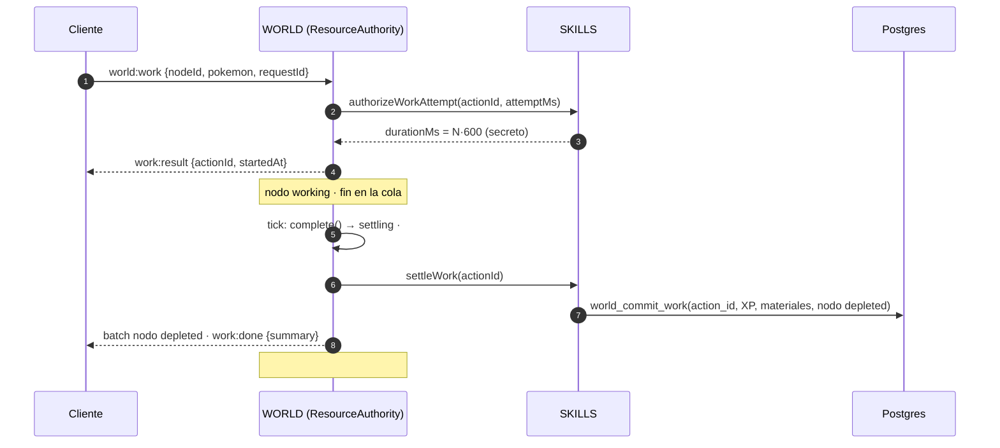

# RESOURCE YIELD-1 — Auditoría de recursos con múltiples unidades

> Sólo auditoría y diseño, sobre `integration/world-skills-0.3 @ d8b5571` (PROB-2 + WORK CANCEL-1). No se modificó código, SQL, bundles, gate ni nada hosted.
> Convenciones de AGENTS.md §1: **FACT** = verificado en el código citado; **INFERENCE** = deducido; **OPEN QUESTION** = decisión pendiente.
> Las cifras salen de las funciones canónicas (`attempts.ts`, `pacing.ts`) con el tope vigente ⌈1,5/p⌉ en [2, 20] y los parámetros de mundo actuales (respawn 90 s, bosque de 60 árboles comunes y 29 pinos, cantera de 45 rocas).

## 0. Resumen

- **Hoy, una acción es una unidad y un éxito agota el nodo.** Está codificado en cuatro lugares: la acción de WORLD (un `actionId`, una liquidación, `complete()` libera todo), el ciclo de vida `available → depleted` de `SIMPLE_LIFECYCLE`, la liquidación de SKILLS (una tirada de `rollDrop` por `actionId`) y la tabla `skill_work_settlements` (PK `action_id`). Las `charges` del catálogo son *advisory* y nadie las usa en el mundo.
- **Recomendación: stock oculto, sorteado en el servidor al primer toque del nodo** dentro de un rango por recurso (árbol común 2–4, pino 2–3, roca 1–3, avanzados 1). Se guarda en memoria y se persiste junto con cada unidad liquidada.
  - Una **secuencia** reserva el nodo como hoy y produce N unidades. Cada unidad es una autorización y liquidación independiente de SKILLS, con su propio sorteo de intentos (el tope de PROB-2 se aplica por unidad), y un `yieldId` derivado del `actionId` en el servidor.
  - El nodo se agota con la última unidad y el respawn empieza ahí.
  - Un nodo abandonado a medias se "rellena" solo a los 90 s sin trabajo.
- **Sin nuevas tablas ni cambios en la Edge Function.** Alcanza con una columna `stock` en `world_node_overrides` y un `CREATE OR REPLACE` de `world_commit_work` (migración aditiva). Protocolo de mundo 3, con un mensaje nuevo `world:work:yield`.
- **Economía** (nivel 1, aptitud 3, 2,5 s de reposicionamiento):
  - Talar rinde **1,42×** unidades y XP por hora (644 → 917) y Minería **1,28×** (630 → 807).
  - En nivel 50 llega a 2,1× y 1,7×.
  - La oferta de las zonas sube 2,8× en el bosque y 1,9× en la cantera. Con 10 jugadores se pasa de 72/55 % a 100/83 % del tiempo trabajando.
- **Hallazgo: el pacing actual ya supone varias unidades por nodo.** Toma las `charges` advisory, 3–5 por árbol. El mundo real entrega 1, así que el tiempo real hasta nivel 50 de Talar es ~28,7 h y no las 12,9 h que muestra la herramienta. La propuesta acelera sobre todo el juego temprano (Nv 25: 2,24 → 1,18 h). Los niveles altos casi no cambian, porque los recursos avanzados siguen dando 1 unidad.
- **Bloqueantes:**
  - el cliente no puede saber el stock: `publicNode` hoy filtraría `respawnAt` de un nodo parcial;
  - se necesita el protocolo 3;
  - la desconexión debe cortar la secuencia después de la unidad en curso.

## 1. Estado actual

### 1.1 Mapa del flujo (FACT, `d8b5571`)

| Pieza | Archivo · función | Qué hace hoy |
|---|---|---|
| Intent | `services/realtime/src/world/worldRoom.js` · `work()` L167 | protocolo < 2 ⇒ `client-outdated`; `workIntent` sólo lee `nodeId`, `pokemonInstanceId`, `requestId`, `cropId` |
| Rate limit | `resourceAuthority.js` · `requestWork()` L111 · `workRateLimit.js` | ráfaga 4, 2/s por jugador |
| Chequeo físico | `resourceAuthority.js` · `#physicalCheck()` L328 | nodo, área, alcance, estado ∈ `lifecycle.work`, `busy`, `actor-busy`, `pokemon-busy`, lugar |
| Ownership | `pokemonOwnership.js` · `verify()` | cache positiva 30 s |
| Autorización + sorteo | `resourceAuthority.js` L138 → `skillsWorldPolicy.ts` `authorizeWorkAttempt` → `skillsService.ts` L111–140 | nivel/aptitud, `p`, `drawAttempts` (tope ⌈1,5/p⌉), ledger en memoria por `actionId` |
| `actionId` | `resourceAuthority.js` · `newActionId` (`randomUUID`) | uno por acción; clave de ledger, liquidación y fila de DB |
| Reserva | `#start()` L303 | nodo `working` + worker/stand; jugador y Pokémon ocupados; fin privado en la cola |
| Cierre | `complete()` L211–256 | `running → settling` antes del `await`; `#nextState` decide `depleted` + `respawnAt`; `settleWork` con reintentos 1/3/9 s; **libera todo** (`#release`) y manda **un** `work:done` |
| Liquidación | `skillsService.ts` `settleWork` L148–180 | una tirada de `rollDrop` y la XP del recurso por `actionId`; `too_early`; ledger `committed` |
| Commit | `skillsWorldPolicy.ts` `settleWork` → `playerData.commitWork` → Edge `commit_work` (`handler.ts` L114) → SQL `world_commit_work` | una transacción: fila de liquidación (PK `action_id`) + XP + materiales + override del nodo |
| Agotamiento y respawn | `resourceLifecycle.js` `SIMPLE_LIFECYCLE` L25 (`available → depleted → available`); `worldTuning.js` `RESPAWN_MS` 90 s; `#timer()` L282 | un éxito agota; respawn 90 s |
| Persistencia de nodos | `world_node_overrides` (`node_id` PK, `state`, `respawn_at`, `plot`, `action_id`); `world_load_nodes` borra los vencidos | sólo hay filas para nodos fuera del estado base |
| Reinicio | `worldRoom.js` `start()` → `authority.restore()` L89 | restaura agotados y parcelas; las acciones en curso se pierden sin pago |
| Desconexión | `PresenceRoom.onLeave` L130 → `world.leave()` L90 | **no cancela**: la acción sigue, paga y el trabajador queda visible hasta el fin |
| Cancelación por movimiento | `viewerMoved`/`actorPlaced` → `reconcileActor()` L195 → `cancel()` L173 | sólo en fase `running`; en `settling` no cancela (WORK CANCEL-1) |
| Protocolo | `worldProtocol.js` `publicNode` | `{id, state, version, base?, actionId, workKind, worker{…, stand}, startedAt, respawnAt?, plot?}`; nunca el fin |
| Presentación | `useSkillsLayer.ts`, `gatheringOverlayCore.ts`, `workerPose.ts` | un golpe por tick; `work:done` cierra la escena (éxito: cae el árbol + pops) |
| Gate hosted | `20260926002207_world_skills_gate.sql`, Edge `commit_work` | `completed` requiere acceso ≠ `closed` |
| Catálogo | `resources.ts` `world.charges` (p. ej. árbol común [3, 5]) | **advisory**: WORLD no lo usa; `pacing.ts` sí |

### 1.2 Qué asume hoy "una acción = una recompensa" y "un éxito = agotado"

1. **`complete()` es terminal.** Después de liquidar, `#release` libera nodo, jugador y Pokémon, y `onDone` manda el único `work:done`. No hay "siguiente unidad".
2. **`#nextState` sólo conoce un salto.** `afterWork(SIMPLE_LIFECYCLE, 'available') = 'depleted'` y `respawnAt = now + 90 s`. No hay estado intermedio ni stock.
3. **La clave de idempotencia es la acción.** `actionId` es clave del ledger de SKILLS (`recordAuthorization`, `commitSettlement`), de `skill_work_settlements.action_id` y de `world_node_overrides.action_id`. Una segunda unidad con el mismo id sería un duplicado.
4. **SKILLS paga una tirada por autorización.** `rollDrop` se ejecuta una vez en `settleWork`, y el sorteo de intentos es uno por autorización.
5. **El cliente trata `work:done` como el fin.** `worldSkillsSession` guarda un resultado por `actionId`. `useSkillsLayer` cierra la timeline con el primer resultado y la tarjeta pasa a "resultado".
6. **La desconexión deja terminar la acción entera.** Con una sola unidad, "terminar la acción" y "terminar la unidad" son lo mismo. Con varias dejaría de serlo.

### 1.3 Diagrama actual



## 2. Alternativas

| | 1. Cantidad fija por tipo | 2. Stock aleatorio (rango) sorteado en el servidor | 3. Probabilidad de agotarse tras cada éxito (RuneScape) |
|---|---|---|---|
| Sensación | predecible y "contable"; al tercer tronco el jugador sabe que se acaba | variable pero acotada; sorpresa sin frustración | muy variable: con media 3, un 33 % da 1 sola unidad y un 13 % da ≥ 6 |
| Predictibilidad del diseño | exacta | rango exacto, media exacta | sólo la media; cola larga sin tope |
| Economía | fácil de calcular | fácil (media del rango) | media fácil, varianza alta; hace falta tope para acotar |
| Persistencia | "unidades restantes" por nodo tocado | ídem | **ninguna**: el nodo está disponible o agotado |
| Reinicios | restante persistido con cada unidad | ídem; un nodo sin unidades tomadas puede re-sortearse sin ventaja | trivial |
| Concurrencia | el stock se decrementa en el commit de cada unidad | ídem | la tirada de agotamiento va dentro del commit de la unidad |
| Balance | un número por recurso | dos números por recurso | una probabilidad por recurso (más un tope) |
| Reroll explotable | no hay nada que rerollear | sólo si el stock se ve o se re-sortea tras consumir; se evita ocultándolo y persistiéndolo | si el cliente pudiera abortar la tirada; aquí la decide el servidor dentro del commit, así que no hay reroll |
| Deseo del brief ("2–4", "1–3") | no representa rangos | **sí** | no (geométrica sin límites salvo tope) |

**Recomendación: 2, stock aleatorio oculto.** Es la única que expresa los rangos pedidos con límites exactos y mantiene la economía calculable. El costo de persistir el restante es chico, porque ya existe un override por nodo y un commit transaccional por unidad. La opción 3 es la más simple de persistir, pero su cola larga ("este árbol me dio 9 troncos") contradice el rango del brief. La opción 1 pierde la variedad sin ganar nada relevante.

## 3. Arquitectura recomendada

### 3.1 Conceptos

- **Secuencia**: una reserva de WORLD, como la acción de hoy, con un `actionId`. Dura mientras el nodo tenga stock y el jugador siga al lado, conectado y sin moverse.
- **Unidad**: cada éxito dentro de la secuencia. Tiene su propio `yieldId`, su propia autorización y sorteo de SKILLS (tope ⌈1,5/p⌉ **por unidad**) y su propia liquidación exactly-once, que incluye el nuevo stock del nodo.
- **Stock**: unidades que le quedan al nodo. Es privado del servidor.

### 3.2 Cuándo y dónde se determina el stock

- **Rango:** es regla de SKILLS. Pasa a ser dato normativo del catálogo; hoy es `world.charges`, que es advisory. SKILLS lo devuelve en la parte **privada** de la autorización (como `durationMs`), por ejemplo `yield: { min, max }`.
- **Sorteo:** es estado físico de WORLD. WORLD sortea el stock con su RNG del servidor (cripto, inyectable en tests) **la primera vez que un nodo en estado base recibe una secuencia**. Un nodo parcial usa su stock guardado.
- **Memoria:** el stock vive en el registro privado del nodo en `ResourceStore` y nunca en `publicNode`.
- **Base de datos:** en `world_node_overrides.stock`, escrito en la misma transacción que cada unidad.
- **Restantes:** un nodo con restante `k > 0` queda como `available` + `stock = k` + `respawn_at = ahora + 90 s` (el temporizador de "rellenado", §3.4). Con `k = 0` queda como `depleted` + `respawn_at = ahora + 90 s`, igual que hoy.
- **Re-sorteo:** si el proceso se reinicia antes de la primera unidad liquidada, el stock no llegó a persistirse y se vuelve a sortear. No da ventaja, porque nadie lo vio y no se consumió nada.

### 3.3 El cliente no conoce las cargas

- **Proyección pública:** un nodo parcial inactivo se publica como `{ id, state: 'available', version, base: true }`, idéntico a un nodo sin tocar. No lleva `respawnAt` ni `stock`.
- **Requisito:** hoy `publicNode` copia `respawnAt` si existe, así que **hay que cambiarlo** o el temporizador de rellenado delataría que el nodo está parcial. Es el bloqueante 1.
- **Durante una secuencia:** el nodo se ve `working` como hoy. Al agotarse se ve `depleted` + `respawnAt`, como hoy.
- **Sin contador:** no hay contador ni barra.

### 3.4 Respawn y nodos parciales

- **Agotado:** con la última unidad, `depleted` y respawn a los 90 s. Sin cambios.
- **Parcial abandonado:** el stock guardado se conserva hasta el **rellenado**, 90 s después de la última unidad (**OPEN QUESTION D4**). Usa la maquinaria existente: `respawn_at`, la cola de temporizadores y `world_load_nodes`, que ya borra filas vencidas con `plot IS NULL`. Al vencer, la fila desaparece y el nodo vuelve a base, es decir, lleno.
- **Economía del rellenado:** equivale al respawn. Tomar k−1 unidades y volver a los 90 s no rinde más que agotar el nodo y esperar el respawn.

### 3.5 Flujo de una secuencia

```mermaid
sequenceDiagram
  autonumber
  participant C as Cliente (protocolo 3)
  participant W as WORLD
  participant S as SKILLS
  participant D as Postgres
  C->>W: world:work {nodeId, pokemon, requestId}
  W->>S: authorize(yieldId₀, attemptMs)
  S-->>W: durationMs₀ (secreto) · yield {min,max} (privado)
  W->>W: stock = guardado ?? sortear(min..max)
  W-->>C: work:result {actionId, startedAt}
  loop mientras stock > 0 y el jugador sigue (al lado, conectado, sin moverse)
    W->>W: tick: complete(unidad i) → settling
    W->>S: settleWork(yieldIdᵢ)
    S->>D: world_commit_work(yieldIdᵢ, XP, +1 material, nodo {stock-1 | depleted})
    W-->>C: world:work:yield {actionId, index i, summary}
    W->>S: authorize(yieldIdᵢ₊₁) (nivel recalculado; nuevo sorteo)
  end
  W-->>C: world:work:done {actionId, reason: depleted | moved | disconnected | refused | error}
  W-->>C: batch: nodo depleted (o base si quedó parcial)
```

### 3.6 `yieldId`: exactly-once por unidad

- `yieldId = actionId + '-' + hex2(index)`, por ejemplo `…-00`, `…-01`, hasta `…-13` (20 unidades como máximo). Tiene 39 caracteres, así que cumple `^[0-9a-f-]{8,64}$` (`playerData.js`, `handler.ts`) y el CHECK de `skill_work_settlements.action_id` (8–64).
- **Lo deriva el servidor**, nunca el cliente. `index` es el contador de la secuencia en memoria. No hay campo de protocolo para `yieldIndex`, así que no se puede manipular.
- **Reintentos:** reusan el mismo `yieldId`. La DB devuelve `applied: false` y no toca el nodo. SKILLS responde `already_settled`.
- **Serialización:** WORLD liquida las unidades de a una (espera el commit de la unidad i, con sus reintentos, antes de autorizar la i+1). Un commit viejo nunca pisa el stock de uno nuevo.
- **Dónde se decide el stock:** en WORLD, antes del commit (como `#nextState` hoy), y viaja en `p_node`. La transacción escribe la liquidación y el stock juntos, o nada.

### 3.7 Dos jugadores y la última unidad

- **Reserva exclusiva, como hoy:** si A trabaja el nodo, B recibe `busy`. Cuando A se va, cancela o se desconecta, B puede empezar una secuencia con el **stock restante**.
- **La última unidad no puede duplicarse:** el decremento y el agotamiento van en el commit de la unidad, y sólo existe una secuencia por nodo.
- **OPEN QUESTION D2:** ¿varios trabajadores simultáneos en el mismo nodo (estilo RuneScape)? Rompe VISUAL-2 (un stand por nodo) y obliga a un decremento atómico por unidad en la DB, con versión o `stock = stock - 1 WHERE stock > 0`. Recomendado: **no** en YIELD-1.

### 3.8 Movimiento, éxito y mismo tick

- **Movimiento con la unidad en `running`:** se cancela como hoy. La unidad no se paga, el stock queda y llega `done {reason: 'moved'}`.
- **Movimiento con la unidad en `settling`** (éxito confirmado primero): la unidad **se paga**, y después `complete()` **no autoriza la siguiente**, porque comprueba que el jugador sigue en el anchor. Llega `done {reason: 'moved'}`.
- **Garantía:** nunca hay cancelación y pago de la misma unidad. Es la misma garantía de WORK CANCEL-1, ahora por unidad.

### 3.9 Desconexión y reconexión

- **Preferencia de producto:** la unidad en curso puede terminar y después el Pokémon se retira.
- **Implementación:** `WorldRoom.leave()` avisa a la autoridad con `authority.ownerLeft(playerId)`, que marca la secuencia con `stopAfterCurrent`.
  - Si la unidad está en `running`, se deja terminar: se paga en su fin secreto, igual que hoy, y no se pierde un settlement legítimo.
  - Después no se autoriza otra unidad y llega `done {reason: 'disconnected'}` (aunque no haya quién lo reciba).
- **Reconexión antes del fin de la unidad** (**OPEN QUESTION D3**):
  - Recomendado: si el jugador reaparece en la misma posición, `actorPlaced` limpia `stopAfterCurrent` y la secuencia continúa. Con ReconnectCache de 15 s, una recarga de página no corta el trabajo.
  - Alternativa estricta: nunca se reanuda.
- **Reconexión después:** no hay acción. `player:state` trae la XP y los materiales ya persistidos. El nodo queda parcial (oculto) o agotado.

### 3.10 Reinicio entre dos unidades

- **Unidades ya liquidadas:** están en la DB con su stock restante. `restore()` las carga (hace falta leer `stock`) y el nodo queda parcial, con su temporizador de rellenado.
- **Unidad en curso:** se pierde sin pago, como hoy.
- **Sin regeneración:** el stock no se regenera, porque quedó persistido. La única forma de "regenerarlo" es el rellenado a los 90 s, que es la regla de diseño.

### 3.11 Errores o timeouts de la autoridad

- **Reintentos agotados o error no reintentable:** la unidad no se paga, el nodo conserva el stock previo a esa unidad, la secuencia termina con `done {reason: 'error'}` y el Pokémon se retira.
- **Unidades anteriores:** ya están pagadas y son firmes.
- **Autorización rechazada a mitad** (por ejemplo, el gate se cerró, el Pokémon se vendió o la aptitud cambió): termina con `done {reason: 'refused', message}`.

### 3.12 Feedback visual y sonoro

- **Cada unidad:** golpe de éxito, sonido corto y pop `+1 Tronco común · +10 XP` sobre el nodo (sólo para el dueño; los observadores ven el golpe y un destello genérico, **OPEN QUESTION D6**). El Pokémon **sigue** con el gesto por tick, sin pausa.
- **Última unidad:** además cae el árbol o se parte la roca (las animaciones `fell` actuales).
- **Otros finales:** en `moved`/`disconnected` la escena termina en el acto, como en WORK CANCEL-1. En `error`/`refused`, lo mismo con un mensaje en la tarjeta.
- **Tarjeta:** "Scyther está talando…" durante toda la secuencia, sin contador. Al terminar muestra el total de la secuencia ("+3 Tronco común · +30 XP").

### 3.13 Protocolo (mundo 3)

| Mensaje | Cambio |
|---|---|
| `world:work` | sin cambios |
| `world:work:result` | sin cambios (`actionId`, `startedAt`) |
| **`world:work:yield`** (nuevo, sólo al dueño) | `{ actionId, index, summary: { skillId, xpGained, xpAfter, rewards, levelBefore, levelAfter, levelUpLine, unlocks } }` |
| `world:work:done` | + `reason: 'depleted' \| 'moved' \| 'disconnected' \| 'refused' \| 'error' \| 'cancelled'`, + `total` (suma de la secuencia); ya no trae el `summary` de una unidad |
| `publicNode` | nodo parcial inactivo ⇒ `base: true` sin `respawnAt`; nunca `stock` |
| `ownAction` en snapshot | sin cambios; el `index` no viaja |

**Compatibilidad:**
- `WORLD_PROTOCOL = 3`, revisión de presencia 5.
- Un cliente de protocolo 2 trataría el primer `work:done` como fin y no entiende `yield`. Recomendado: `client-outdated` con mensaje, igual que en PROB-2, mientras el gate siga cerrado.
- Alternativa: servir a v2 con secuencias de una sola unidad (**OPEN QUESTION D5**).

### 3.14 Base de datos y migraciones

| Objeto | Cambio | Tipo |
|---|---|---|
| `world_node_overrides` | `ADD COLUMN stock smallint NULL CHECK (stock BETWEEN 1 AND 20)` | aditivo |
| `world_commit_work` | `CREATE OR REPLACE`: escribe `stock` desde `p_node ->> 'stock'` en el upsert; misma firma | reemplazo compatible |
| `world_load_nodes` | sin cambios (`SELECT *` ya trae la columna; los rellenados vencidos se borran por `respawn_at`) | — |
| `skill_work_settlements` | sin cambios (`action_id` guarda el `yieldId`; `node_id` ya existe). Opcional: índice por prefijo de secuencia para auditoría | — |
| Edge Function `world-authority` | **sin cambios** (`commitArgs` pasa `p_node` opaco) | — |
| Gate / testers | sin cambios | — |

**Rollback.** El código anterior ignora `stock`:
- una fila parcial (`available` + `respawn_at`) se restaura como base, o sea llena;
- lo peor que puede pasar es un rellenado anticipado, con inflación mínima y acotada;
- la columna puede quedar, porque es nula y compatible;
- las liquidaciones con `yieldId` son filas normales.

No hay rollback de datos que haga falta.

## 4. Economía (propuesta: árbol 2–4, pino 2–3, roca 1–3, avanzados 1)

Parámetros:
- **Tiempo por unidad:** el tiempo esperado canónico (aptitud 3, tope ⌈1,5/p⌉).
- **Reposicionamiento entre nodos:** 2,5 s (el supuesto de PROB-2 §2). Con la propuesta se reparte entre las unidades del nodo: `t + 2,5/k̄`.
- **Oferta de una zona:** `N·k̄·3600 / (k̄·t + 90)`.

| Recurso | Nv | t/unidad | k̄ | Agotar un nodo | Unidades/h (1 → multi) | XP/h (1 → multi) | Jugadores sin espera en la zona (1 → multi) |
|---|---|---|---|---|---|---|---|
| Árbol común | 1 | 3,09 s | 3 | 9,3 s | 644 → 917 (1,42×) | 6 435 → 9 166 | 3,6 → 7,1 |
| Árbol común | 25 | 1,52 s | 3 | 4,6 s | 896 → 1 532 (1,71×) | 8 963 → 15 319 | 2,6 → 4,5 |
| Árbol común | 50 | 0,63 s | 3 | 1,9 s | 1 150 → 2 460 (2,14×) | 11 502 → 24 601 | 2,1 → 2,9 |
| Pino | 12 | 3,69 s | 2,5 | 9,2 s | 581 → 767 (1,32×) | 12 791 → 16 880 | 1,9 → 3,4 |
| Pino | 50 | 0,69 s | 2,5 | 1,7 s | 1 129 → 2 130 (1,89×) | 24 828 → 46 864 | 1,0 → 1,3 |
| Roca | 1 | 3,21 s | 2 | 6,4 s | 630 → 807 (1,28×) | 6 302 → 8 067 | 2,8 → 4,2 |
| Roca | 25 | 1,54 s | 2 | 3,1 s | 891 → 1 291 (1,45×) | 8 915 → 12 911 | 2,0 → 2,7 |
| Roca | 50 | 0,63 s | 2 | 1,3 s | 1 150 → 1 915 (1,66×) | 11 502 → 19 149 | 1,6 → 1,9 |
| Avanzados (madera dura, hierro, oro, boreal, cristal) | — | igual | 1 | igual | **sin cambio** | sin cambio | sin cambio |

**Capacidad** (nivel 1, jugadores repartidos mitad Talar y mitad Minería; % del tiempo trabajando):

| Jugadores | 2 | 5 | 10 | 30 |
|---|---|---|---|---|
| Talar (60 árboles comunes): 1 unidad → multi | 100 → 100 % | 100 → 100 % | 72 → **100 %** | 24 → **47 %** |
| Minería (45 rocas): 1 unidad → multi | 100 → 100 % | 100 → 100 % | 55 → **83 %** | 18 → **28 %** |

**Oferta de las zonas** (unidades/h a nivel 1): bosque 2 320 → **6 527** (2,8×), cantera 1 738 → **3 360** (1,9×). Sigue mandando el respawn de 90 s: un nodo tarda 6–9 s en agotarse y 90 s en volver.

**Nivel 1 → 50** (modelo de pacing: overhead 1,5 s, walk 8 s, aptitud 3; horas hasta Nv 10 / 25 / 40 / 50):

| | Talar | Minería |
|---|---|---|
| Lo que muestra hoy `pacing.ts` (supone las `charges` advisory del catálogo, 3–6 por nodo) | 0,22 / 1,11 / 4,51 / 12,86 | 0,23 / 1,18 / 5,67 / 18,28 |
| **Mundo real hoy** (1 unidad por nodo) | 0,43 / 2,24 / 9,49 / **28,70** | 0,44 / 2,18 / 10,13 / **31,23** |
| **Propuesta** (k̄ de arriba; overhead y walk por nodo) | 0,21 / 1,18 / 8,43 / **27,64** | 0,27 / 2,01 / 9,96 / **31,07** |

**Lectura:**
- **Juego temprano:** la propuesta lo duplica en velocidad (Nv 25 en ~1,2 h en lugar de ~2,2 h). El tramo 25→50 casi no cambia, porque los recursos que lo dominan (madera dura, boreal, hierro, oro, cristal) siguen en 1 unidad.
- **Pacing:** `pacing.ts` sobreestima hoy el ritmo real (**riesgo R6**). Con YIELD-1 tiene que usar el `k̄` normativo en lugar de las `charges` advisory.
- **Inflación:** la de materiales **básicos** es real (×1,3–2,1 por jugador, ×1,9–2,8 de oferta por zona). Hoy no hay sumideros (MAP-1/INTEGRATION-1: "todavía no hay dónde gastar materiales"), así que sólo se acumulan. XP por unidad y materiales por unidad no cambian; se sugiere medir por `rules_version` (**OPEN QUESTION D7**).

## 5. Seguridad

| Vector | Mitigación en el diseño |
|---|---|
| Duplicación por reintentos | `yieldId` estable por unidad; PK en `skill_work_settlements`; ledger `already_settled`; WORLD serializa las unidades |
| Settlement repetido | igual; `complete()` sólo en `running`; cola de temporizadores idempotente |
| Última carga consumida por dos jugadores | reserva exclusiva por nodo; decremento dentro del commit de la unidad |
| Reinicio para regenerar stock | stock persistido con cada unidad; sin unidades tomadas, re-sortear no da ventaja porque es oculto |
| Desconexión para seguir recolectando | `stopAfterCurrent` al irse el socket; como máximo una unidad más |
| Spam | rate limit de `world:work` sin cambios; las unidades siguientes las genera el servidor, no el cliente |
| Cliente inventando cargas | no hay campo; el stock es privado; `publicNode` no lo expone |
| Manipulación de `yieldIndex` | no existe en el protocolo; lo deriva el servidor |
| Nodo agotado que reaparece incorrectamente | `depleted` sigue igual; un parcial se publica como base, pero su stock persistido es el que manda al trabajarlo; el test de reinicio cubre ambos |
| Acciones antiguas contra reglas nuevas | `rules_version skills-1.3`; las autorizaciones viven 10 min y no sobreviven un reinicio; las filas viejas sin `stock` se leen como "sin tocar" |
| Fuga del stock por tiempo | el nodo parcial se proyecta idéntico a uno lleno; el rellenado no viaja |

## 6. Riesgos

| # | Riesgo | Severidad |
|---|---|---|
| R1 | `publicNode` filtraría el stock o el rellenado (hoy copia `respawnAt`) | **Bloqueante** |
| R2 | Protocolo 3: los clientes v2 no entienden `yield` | **Bloqueante para el rollout** (se decide en D5) |
| R3 | Desconexión: sin `stopAfterCurrent`, un jugador desconectado agotaría el nodo | **Bloqueante** |
| R4 | Inflación de materiales básicos sin sumideros | Alto (diseño, D7) |
| R5 | Más commits por hora (una fila por unidad): hasta ×2,1 por jugador en nivel alto sobre básicos | Medio; medir con el benchmark de 100 |
| R6 | `pacing.ts` ya asume cargas del catálogo: hoy sobreestima el ritmo real | Medio (herramienta) |
| R7 | Nodos parciales huérfanos si falla el rellenado | Bajo (`world_load_nodes` limpia los vencidos) |
| R8 | Level-up a mitad de secuencia cambia `p` para la unidad siguiente | Bajo; deseado |

## 7. Plan de implementación (commits pequeños)

1. **skills: stock ranges as rules.** `yield {min,max}` normativo por recurso (reemplaza el uso advisory de `charges`); devuelto en la parte privada de la autorización; `rules_version skills-1.3`; tests.
2. **db: `world_node_overrides.stock`** + `world_commit_work` que lo escribe (migración aditiva, PGlite + staging).
3. **world: stock and partial nodes.** `ResourceStore` con `stock` privado; `restore()` lo lee; rellenado por `respawn_at`; `publicNode` proyecta un parcial como base; tests de no-fuga.
4. **world: sequences.** `yieldId`, bucle unidad a unidad en `complete()`, serialización, fin por agotamiento; `done.reason`; métricas.
5. **world: stop rules.** Movimiento en `settling` ⇒ pago y fin; `stopAfterCurrent` al desconectarse; reanudación al reconectar (según D3).
6. **world: protocol 3.** `world:work:yield`, `done.total`, `client-outdated` para v2 (según D5).
7. **client: continuous work.** Pops por unidad, sonido, la timeline sigue abierta entre unidades y se cierra con `done`; la caída sólo con `depleted`; tarjeta con el total.
8. **tools: pacing con k̄ normativo;** tablas de economía en el reporte.
9. **docs.**

## 8. Matriz de tests

| Área | Casos |
|---|---|
| Reintentos | la misma unidad liquidada 1, 2 y 20 veces ⇒ un pago, stock decrementado una vez; reintento tras timeout con el commit ya aplicado |
| Dos jugadores | B `busy` durante la secuencia de A; B continúa el stock restante; nunca más unidades que el stock sorteado |
| Última unidad | éxito de la última ⇒ `depleted` + respawn 90 s; `done.reason = depleted`; nadie puede empezar |
| Desconexión | antes del éxito: la unidad termina y paga, luego se retira; después del éxito: no hay unidad siguiente; reconexión antes del fin (según D3) |
| Movimiento | en `running`: sin pago, stock intacto; en `settling`: pago y fin; varias órdenes; e2e con teclado, tap y D-pad (harness de WORK CANCEL-1) |
| Reinicio | entre unidades: stock restaurado, sin regeneración; antes de la primera: re-sorteo sin fuga; durante `settling`: la DB decide, nunca doble |
| Persistencia | fila parcial con `stock` y `respawn_at`; rellenado vencido borrado por `world_load_nodes`; agotado igual que hoy |
| Rollback | código anterior + filas con `stock`: el nodo se restaura como base sin errores |
| Talar | árbol común 2–4, pino 2–3: distribución exacta del stock con RNG guionado |
| Minería | roca 1–3; avanzados = 1 (secuencia de una unidad) |
| Agricultura | sin cambios: plantar, cuidar y cosechar siguen siendo acción = una unidad |
| Observadores | ven `working` toda la secuencia; nunca `stock` ni el temporizador; el parcial se ve como base; el agotado como hoy |
| No-fuga | escáner de claves y valores (PROB-2) extendido a `stock`, `yieldIndex` y el rellenado |
| Carga | benchmark 10/30/100 con secuencias: commits/s, `accepted→done` por unidad, rate-limited |
| Economía | tests deterministas de unidades por hora y oferta de zona con las fórmulas de §4; pacing fijado |
| Clientes incompatibles | v2 ⇒ `client-outdated` con mensaje (o secuencia de una unidad, según D5) |

## 9. Decisiones que necesito

| # | Decisión | Opciones | Recomendación |
|---|---|---|---|
| D1 | Modelo | fijo · **stock aleatorio oculto** · probabilidad de agotarse | stock aleatorio oculto |
| D2 | Trabajo simultáneo en un nodo | **exclusivo** · varios trabajadores | exclusivo en YIELD-1 |
| D3 | Reconexión antes del fin de la unidad en curso | **continúa** · nunca continúa | continúa (una recarga no corta el trabajo) |
| D4 | Nodo parcial abandonado | **se rellena a los 90 s** · conserva el stock hasta el respawn · nunca se rellena | se rellena a los 90 s |
| D5 | Clientes protocolo 2 | **`client-outdated`** · secuencias de 1 unidad | `client-outdated` (gate cerrado) |
| D6 | Feedback a observadores por unidad | **golpe + destello genérico** · nada · pop público sin cantidades | golpe + destello |
| D7 | Rangos y sumideros | los propuestos (2–4 / 2–3 / 1–3 / 1) · otros; ¿sumideros antes de abrir? | propuestos; medir por `rules_version` antes de ampliar |
| D8 | Pacing | actualizar `pacing.ts` al `k̄` normativo en YIELD-1 · aparte | en YIELD-1 (hoy ya está desalineado con el mundo real) |

## 10. Recomendación final

Implementar **stock aleatorio oculto por nodo** (§3) con **secuencias de unidades** que reusan íntegra la maquinaria de PROB-2 por unidad: sorteo, tope, `too_early`, liquidación exactly-once y no-fuga. Hace falta una columna aditiva en la DB y ningún cambio en la Edge Function ni en el gate.

Antes de implementar hay que cerrar D1–D5 y resolver los tres bloqueantes:
- ocultar el nodo parcial;
- protocolo 3;
- `stopAfterCurrent` al desconectarse.
