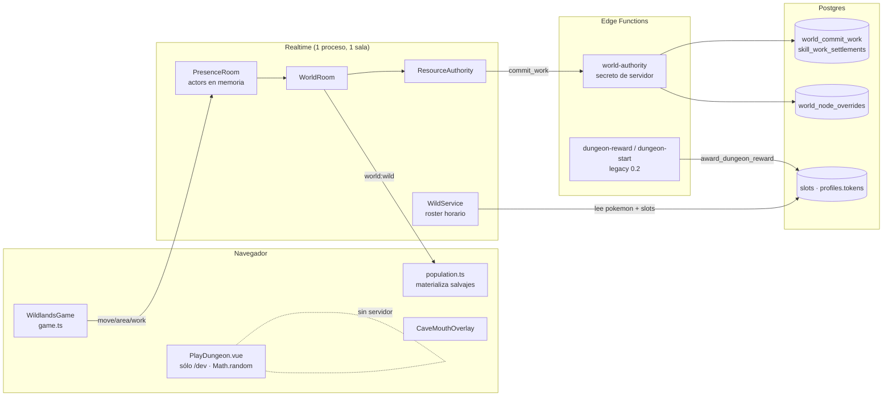
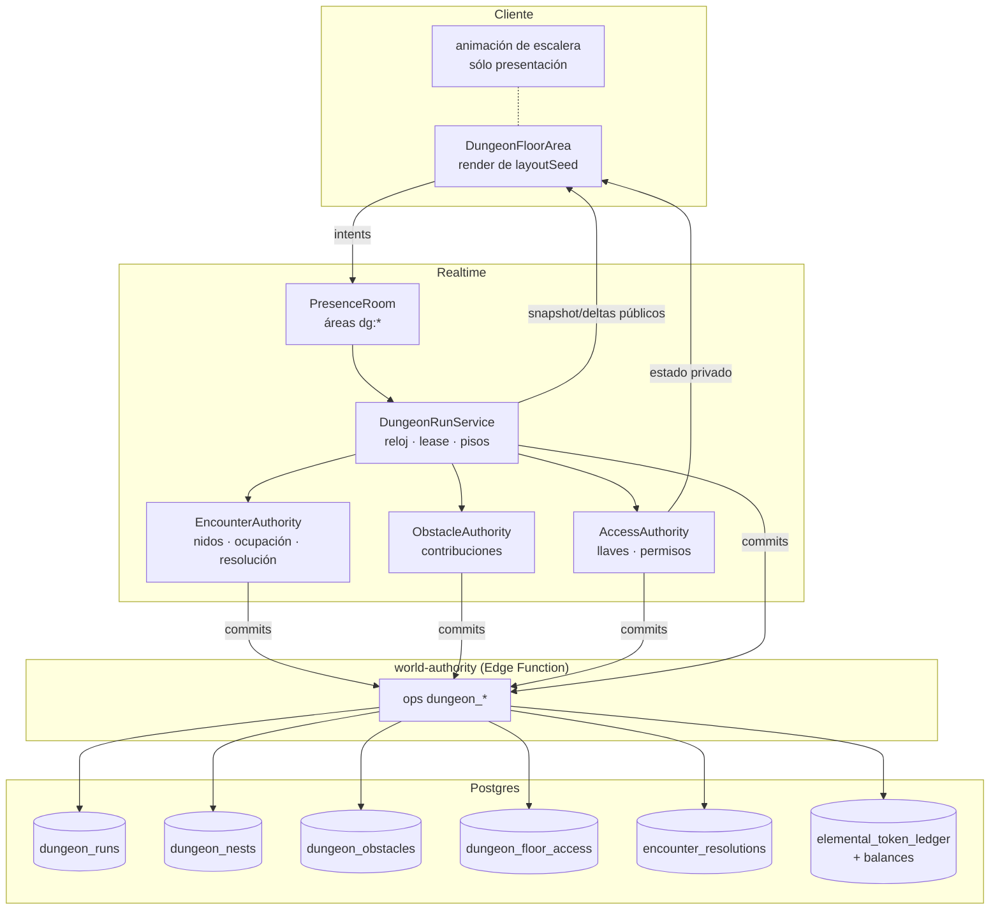
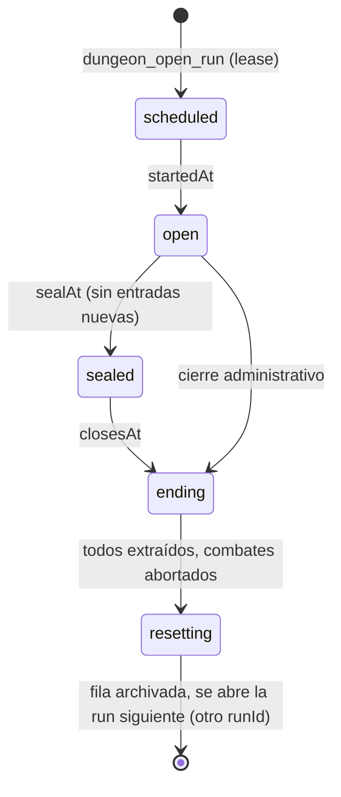
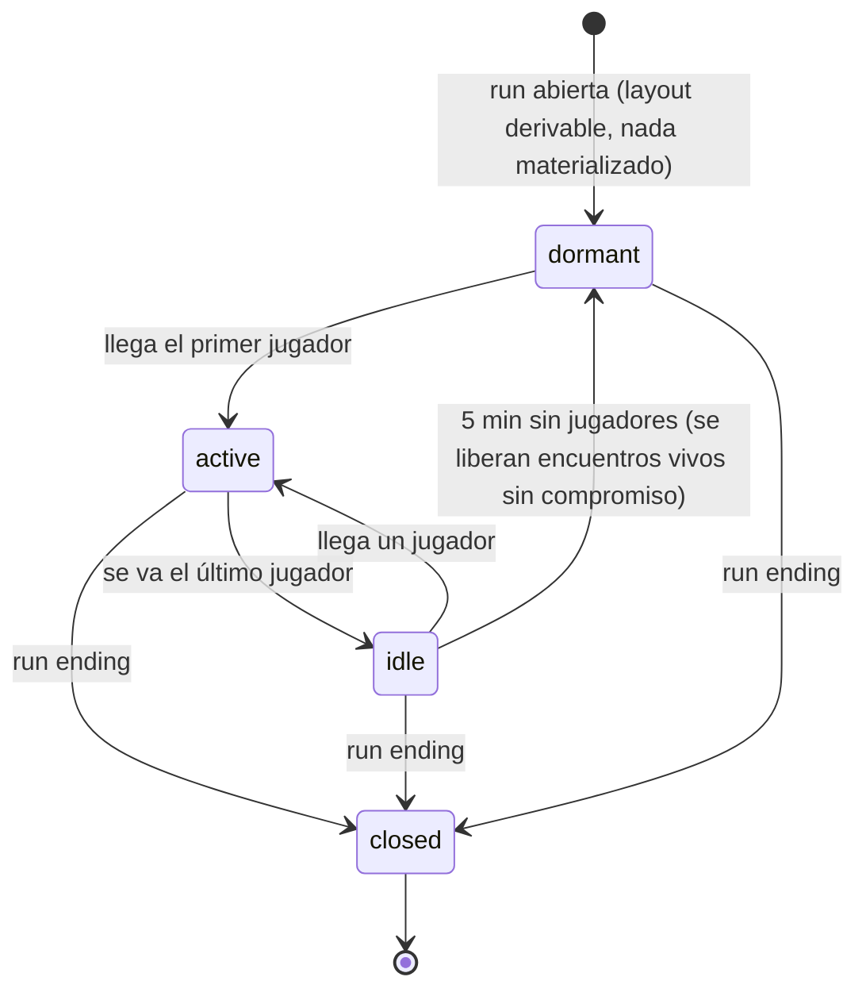
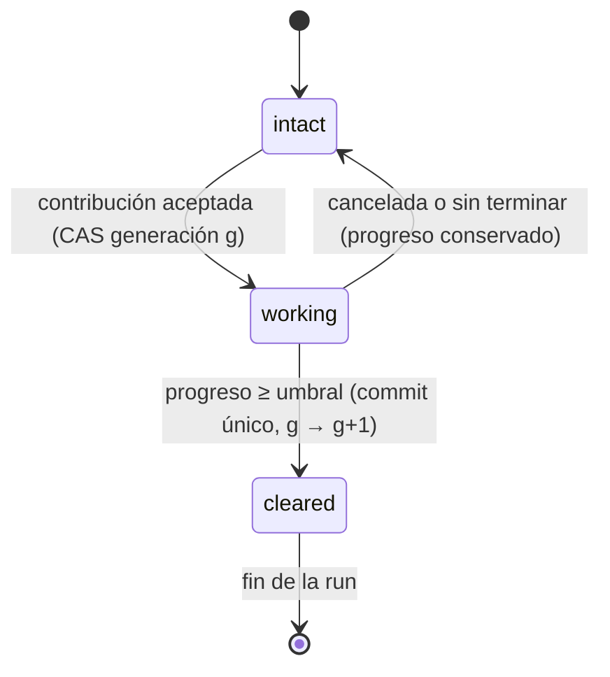
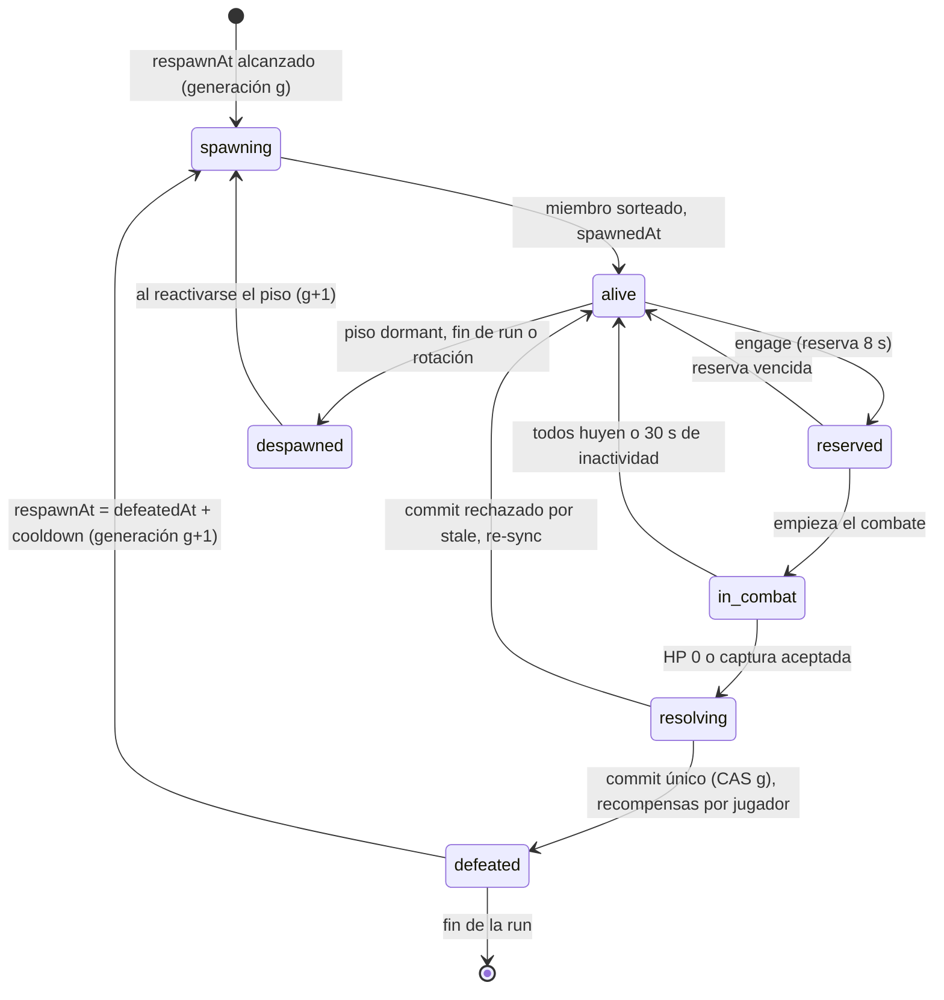
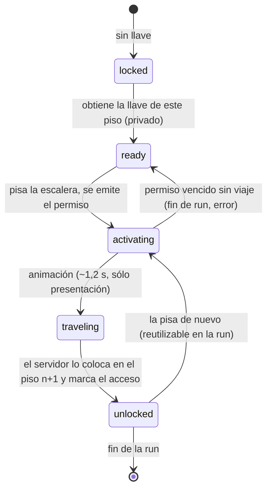
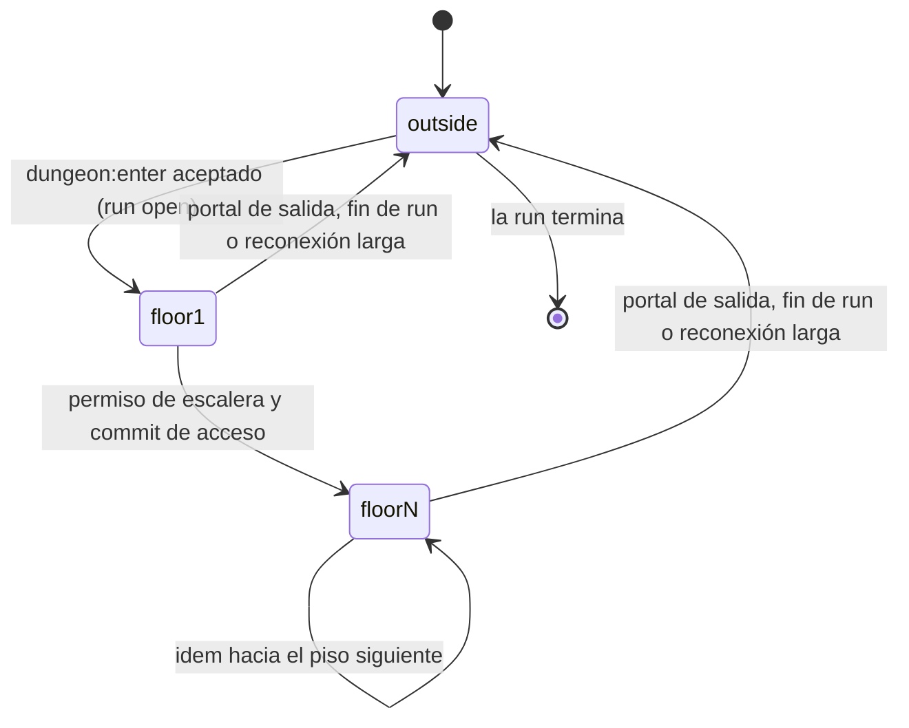

# CAVE ECOSYSTEM-1 — Arquitectura de Dungeons compartidas

> Rama `design/cave-ecosystem-0.3`, base exacta `2652a58` (CAVES-2 aprobado, que deriva de `design/caves-audit-0.3 @ f4323c9`).
> Verificado antes de empezar: `origin/world/caves-foundation-0.3 = 2652a5859c54965279b5f1db2aa66d9d641e313f`, `design/caves-audit-0.3 = f4323c9`, `f4323c9` es ancestro de `2652a58`, `world/multi-yield-recovery-0.3 = 3fca914` (YIELD-2, congelado).
> Fase **exclusivamente documental**. No se modificó código, assets, SQL, bundles ni tests.
> Etiquetas: **FACT** = verificado en el código citado (`archivo:línea` sobre `2652a58`); **INFERENCE** = deducido del código, no ejecutado; **OPEN QUESTION** = requiere decisión o verificación.

Documentos de esta serie:

| Documento | Contenido |
| --- | --- |
| `SHARED_DUNGEON_ARCHITECTURE.md` (este) | §1 auditoría técnica · §2 modelo de pisos compartidos · §3 máquinas de estado · §4 llaves y escaleras personales · §5 obstáculos compartidos · §6 combate compartido y atribución · §7 datos y protocolo |
| `CAVE_TYPES_AND_FAMILIES.md` | Taxonomía de cuevas, familias evolutivas y pools |
| `CAVE_RESPAWN_AND_TOKENS.md` | Nidos, spawn y respawn, tokens elementales, gacha y simulación económica |
| `CAVE_ECOSYSTEM_ROADMAP.md` | Threat model, matriz de pruebas, fases de implementación y decisiones |

---

## 0. Resumen ejecutivo

1. **Hoy no existe nada compartido bajo tierra.** La única cueva es una boca **cerrada** en Pradera (`caves.js`), sin interior registrado. La Dungeon es un prototipo 100 % cliente, alcanzable sólo desde rutas DEV, que genera su run con `Math.random()` y `Date.now()`. (FACT, §1.2–§1.3)
2. **Los Pokémon salvajes no tienen ciclo de vida individual.** El servidor sortea cada hora un pool de 25 especies únicas por área y lo reemplaza entero. No hay derrota, despawn, respawn, generación ni persistencia por individuo. (FACT, §1.4)
3. **El modelo de propiedad condiciona todo.** En PokeSwap cada especie es un único Pokémon con, a lo sumo, un dueño (`slots.pokemon_id`), y el salvaje de superficie es esa entidad única. Un nido que reaparece o un gacha que entrega Pokémon chocan con esa unicidad. Es la decisión bloqueante principal de esta serie. (FACT §1.4, decisión en `CAVE_ECOSYSTEM_ROADMAP.md`)
4. **La maquinaria exactly-once ya existe y es reutilizable.** `world_commit_work` deduplica por `action_id`. YIELD-2 agrega lock por nodo, token de generación y CAS. `battle/authority` aporta semilla CSPRNG, `actionId` ordenado e idempotencia. Nada de esto está conectado a Dungeons. (FACT, §1.5–§1.6)
5. **La palabra "tokens" ya está tomada.** `profiles.tokens` es la moneda del mercado y de la Dungeon legacy 0.2. Los tokens elementales tienen que ser otra moneda, en otra tabla, que nunca se convierta en esa. (FACT, §1.5)

**Recomendación.** Construir la Dungeon compartida como **un área de presencia por piso**, con un `DungeonRunService` en el realtime que posea el estado vivo de cada run. Cada cambio que mueva valor (obstáculo roto, derrota, llave, recompensa) se liquida en Postgres, en una transacción con dedupe y CAS, siguiendo el patrón de YIELD-2. El avance entre pisos es **personal**: una llave por jugador × run × piso, un permiso de viaje efímero firmado por el servidor y una escalera que sólo teletransporta a su dueño.

---

## 1. Auditoría del sistema actual

### 1.1 Mapa de autoridad hoy



### 1.2 Cuevas, áreas, presencia y viajes

| Tema | Estado | Evidencia | Etiqueta |
| --- | --- | --- | --- |
| Fuente canónica | Una sola cueva, `pradera-cueva-inicial`, entrada `closed`, interior `cueva-inicial` sin registrar en ningún protocolo. | `services/realtime/src/world/caves.js:32,71-80` | FACT |
| Consultas | `cavesIn`, `isCaveRock` e `isCaveReserved` son las únicas lecturas. No hay un `caveById` ni datos de interior. | `caves.js:89,97,102` | FACT |
| Colisión compartida | La roca de la cueva entra en la capa sólida de servidor y cliente, y la reserva (footprint + claro) en el terreno planificado. | `resourceZones.js:80-82,114-115` | FACT |
| Áreas de presencia | Sólo `ciudad-corazon` y `pradera`. | `services/realtime/src/protocol/messages.js:2-3`; `src/features/wildlands/multiplayer/domain/presence.ts:3-8` | FACT |
| Llegadas | Tabla fija `ARRIVALS` + `arrivalFor(to, from)` con un único caso especial (Pradera → Ciudad). | `services/realtime/src/protocol/arrival.js:12-26` | FACT |
| Mundo servido | `WORLD_AREAS` sólo conoce Pradera (procedural, seed 208) y Ciudad. | `services/realtime/src/world/areas.js:11-13` | FACT |
| Cambio de área | `changeArea` acepta cualquier id de `AREAS` y coloca al actor en `arrivalFor`. No valida ninguna condición de acceso. | `rooms/PresenceRoom.js:170-181` | FACT |
| Viaje en el cliente | `travelTo` rechaza áreas fuera de presencia ("Esta zona llegará próximamente"). El área de presencia se elige con un ternario de dos valores. | `src/features/wildlands/engine/game.ts:188,760-765,793,913` | FACT |
| Movimiento | El servidor acota el ritmo de los pasos, pero no la caminabilidad: "Walkability is decided by the client". | `services/realtime/src/presence/movement.js:12` | FACT |
| Reconexión | Al salir, el actor se recuerda 15 s y se restaura en el mismo área y casilla. Pasado ese plazo, reaparece en Ciudad `(31,20)`. | `presence/reconnectCache.js:2`; `PresenceRoom.js:101-104,143-145` | FACT |
| Capacidad | Una sola sala `presence`, límite de 100 conexiones, estado en `Map` de módulo. | `presence/capacity.js:1`; `PresenceRoom.js:15,25,34`; `services/realtime/src/index.js:23` | FACT |
| Interior autorado | No existe (`caveLayouts.js` no está en el repo). | búsqueda de archivos | FACT |
| Oscuridad y render | `DUNGEON_DARKNESS = 0.62` y `DungeonArea implements Area` existen, pero sólo dentro del prototipo. | `src/features/dungeonPrototype/world/dungeonArea.ts:27,143` | FACT |
| Varias áreas salvajes | `WildService` genera rosters para toda área `procedural` de `WORLD_AREAS`: la estructura soporta N áreas, aunque hoy hay una. `skillsResourceFor` sólo resuelve áreas `procedural`. | `wildService.js:65-70`; `src/features/worldSkills/resourceMapping.ts:47` | FACT |

**Conclusión 1.2.** Todo lo necesario para una **cueva permanente** ya se planificó en CAVES-1/CAVES-2 (§10 del informe CAVES-2). Faltan tres cosas para Dungeons:

- **Áreas de presencia dinámicas.** `AREAS` es un `Set` constante y `arrivalFor` es una tabla. Una Dungeon con `runId` y pisos necesita ids de área que no están en ninguna lista fija.
- **Validación de acceso en `changeArea`.** Hoy cualquier cliente puede pedir cualquier área conocida.
- **Colisión de servidor en interiores.** El servidor no valida caminabilidad, así que un cliente modificado puede atravesar un obstáculo.

### 1.3 Prototipo de Dungeon

| Pieza | Qué hace | Evidencia | Etiqueta |
| --- | --- | --- | --- |
| `PlayDungeon.vue` (976 líneas) | Orquesta la run completa en el navegador. | `components/PlayDungeon.vue` | FACT |
| Semilla | `seed: Math.floor(Math.random() * 100000)`, reloj `Date.now()`, posición fija `pradera (0,0)`. | `PlayDungeon.vue:439-443` | FACT |
| Semilla de expedición | Se deriva de `spawn.seed` y `now`: cada jugador que entra genera **otra** run. | `domain/playSession.ts:93` | FACT |
| Generación de pisos | Pura y determinista desde `(seed, tier, floor, theme)`: `generateFloor`, `buildFloorTiles`, `placeEntities`. | `domain/floorPlan.ts:99`; `domain/floorTiles.ts:139,507` | FACT |
| Temporizador | Reloj de la aparición (`DEFAULT_DUNGEON_MINUTES = 180`) con avisos a los 30, 10, 5 y 1 minutos. `DungeonRunPanel` lo calcula con `Date.now()` del cliente. | `domain/dungeonSpawn.ts:64,67`; `DungeonRunPanel.vue:48` | FACT |
| Tiers | Cinco tiers y 5–30 pisos. `TIER_CONFIG` es un parámetro de playtest. | `domain/tiers.ts:17,31` | FACT |
| Party y desgaste | La party se clona y se desgasta dentro de la run. Sale por `emit('exit', party)`. | `playSession.ts:111`; `PlayDungeon.vue:698` | FACT |
| Derrota y drops | `settleCombat` marca `entity.taken = true`, tira la llave y aplica `lootFor()`. Todo local. | `playSession.ts:204-239` | FACT |
| Llave de piso | Pertenece a la **expedición**: la encuentra uno y abre para el grupo. Tiene pity (35 % + 20 % por derrota, garantizada a la 4.ª). | `domain/coop.ts:7`; `domain/floorKey.ts:29,55` | FACT |
| Avance de piso | `descend` regenera el piso siguiente para esa expedición. En co-op hay un *ready check* grupal. | `playSession.ts:324-344`; `coop.ts:72` | FACT |
| Obstáculos | Un bloque por boca de recoveco, nunca en el camino a la escalera. Despejarlo no paga nada. | `domain/obstacles.ts:47,175-199`; `playSession.ts:292-300` | FACT |
| Ocupación de encuentros | Contrato puro de reserva: `AVAILABLE → RESERVED → IN_COMBAT → DEFEATED`, reserva de 8 s, un solo titular. | `domain/occupancy.ts:16,32,55,100` | FACT |
| Elegibilidad y botín personal | `participation` (≥5 % del daño **o** ≥3 acciones y ≥10 s, y presente al final) y `personalLoot` por jugador. | `domain/rewards.ts:55-66` | FACT |
| RNG | mulberry32 + `deriveSeed` FNV-1a + `streamFor`, ya pensados para portarse al servidor. | `domain/rng.ts:27,43,73` | FACT |
| Rutas | `/dev/dungeon` y `/dev/superficies` sólo con `import.meta.env.DEV`. | `src/app/router/routes.ts:38,44` | FACT |
| Mundo | Desconectado desde CAVES-2: ninguna superficie del mundo abre el prototipo (guarda en `caves.guard.test.ts`). | `docs/design/CAVES_2_REPORT.md` §5–§6 | FACT |
| Autoridad de combate | `battle/authority` define semilla CSPRNG, `actionId = controller:sequence`, un libro de idempotencia acotado con piso por controlador y `ExpeditionRoomCore`. No lo importa nada fuera de `src/features/battle/`. | `battle/authority/seed.ts:35`; `actionId.ts:28`; `idempotency.ts:60`; `expeditionRoomCore.ts:43` | FACT |
| Dungeon legacy 0.2 | `DungeonView` usa `award_dungeon_reward`, que **acepta los montos del cliente**: los acota, pero no los recalcula. Acredita `profiles.tokens` con tope de 3 000 por día. Sólo existe en builds sin playtest. | `routes.ts:30`; `supabase/migrations/20260908_010_dungeon_reward.sql:29,46,70` | FACT |

**Qué reutilizar y qué retirar.**

| Pieza | Veredicto | Motivo |
| --- | --- | --- |
| `rng.ts` | **Reutilizar como dominio puro** (portado o compartido con el realtime). | Determinista, por streams. Hoy es TS y el realtime es JS sin build: habría que empaquetarlo como `skills.generated.js` o reescribirlo en JS sin dependencias. |
| `tiers.ts`, `floorPlan.ts`, `floorTiles.ts`, `tileKinds.ts`, `decorPlan.ts` | **Reutilizar** para generar layouts **en el servidor**, desde una semilla del servidor. | Ya son puros y deterministas. El servidor los necesita para colisión, nidos y obstáculos. |
| `obstacles.ts` (colocación, `reachableFrom`) | **Reutilizar la colocación**. La regla "nunca en el camino a la escalera" se conserva para obstáculos opcionales. | El despeje pasa a ser una operación compartida (§5). |
| `floorKey.ts` (pity) | **Reutilizar la matemática**, cambiando el dueño de la llave: jugador × run × piso, no expedición (§4). | La regla "el RNG puede hacer lento un piso, nunca imposible" sigue valiendo. |
| `occupancy.ts` | **Reutilizar como máquina de estado de encuentro** (§3.4) y extenderla con generación y participantes. | Ya fija la regla "a lo sumo un titular". |
| `rewards.ts` (`participation`, `personalLoot`, `deliverRewards`) | **Reutilizar** como base del modelo de elegibilidad (§6). | Coincide con la dirección: botín personal sobre combate compartido. |
| `coop.ts` (llave de expedición, *ready check*, `MAX_PLAYERS = 4`) | **Retirar**. | Contradice la dirección aprobada: el acceso es personal, no se espera a nadie y no hay grupos. |
| `dungeonSpawn.ts` | **Reutilizar la semántica** (el reloj es de la aparición, avisos, auto-extracción). El reloj pasa al servidor. | `acceptsEntries` y `expirationNotice` son reglas de producto aprobadas. |
| `expedition.ts` (botín en riesgo, wipe) | **OPEN QUESTION**: ¿el botín de una run compartida está en riesgo hasta salir? | La dirección actual pide tokens liquidados exactly-once por derrota. Recomendación en §6.6: liquidar al instante y no tener botín en riesgo en la primera versión. |
| `PlayDungeon.vue`, `DungeonRunPanel.vue`, `entrancePlacement.ts`, `entranceSpawns.ts`, `speciesFixtures.ts` / `THEME_POOLS` | **Retirar** cuando exista la run compartida (DUNGEONS-2). | Son el orquestador cliente, el reloj falso y rosters fijos. Mantener dos Dungeons activas viola AGENTS §14. |
| `battle/authority/*` | **Reutilizar el patrón** (semilla CSPRNG, `actionId` ordenado, libro de idempotencia) para comandos de la run. | Resuelve reintentos y replays del lado del realtime antes de llegar a Postgres. |
| `award_dungeon_reward` / `consume_dungeon_energy` (legacy) | **No reutilizar** para cuevas. Queda para la Dungeon 0.2 y su propio retiro. | Acredita `profiles.tokens` con montos del cliente (V-02/V-08 de `docs/INVARIANTS.md`). |

### 1.4 Pokémon salvajes

| Tema | Estado | Evidencia | Etiqueta |
| --- | --- | --- | --- |
| Pool | 25 especies por área y por hora. Categorías: `legendary` 2 %, `highAura` 12 %, resto 86 %. **Los legendarios pueden aparecer en superficie.** | `services/realtime/src/world/wildPopulation.js:21-22,47-57` | FACT |
| Unicidad | El pool excluye especies con dueño (`slots.owner_id`) y no repite especie. Id del salvaje: `wild:<área>:<época>:<pokemonId>`. | `wildPopulation.js:64-77,151`; `wildService.js:96` | FACT |
| Hogares | Casillas de spawn históricas por chunk, empezando por las más cercanas a la llegada, radio de 3 chunks, filtradas por bioma (`BIOME_TYPES`) y fuera de reservas de cueva. | `wildPopulation.js:92-100,112-123,138-156` | FACT |
| Patrulla | Bucle determinista `(key, home, terreno, reloj del servidor)`, correa de 4 casillas. Cliente y servidor la muestrean igual. | `services/realtime/src/world/patrol.js:19,34,82` | FACT |
| Ownership en el cliente | El cliente oculta los salvajes cuya especie ve con dueño (`availableWildPool`). Es sólo presentación. | `src/features/pokemon/domain/wildPool.ts:11`; `wildlands/lobby/usePlazaData.ts:61`; `wildlands/engine/population.ts:66` | FACT |
| Desaparición | Sólo existe el reemplazo del roster entero al cambiar de hora (`switchRoster`) o la ocultación por dueño. | `population.ts:115-121`; `worldRoom.js` `#rosterChanged` | FACT |
| Respawn individual | **No existe.** No hay estado vivo/derrotado, `respawnAt` ni generación por salvaje. | ausencia en `wildPopulation.js` / `wildService.js` | FACT |
| Reinicio del realtime | El roster de la hora se recalcula desde `(época, catálogo, dueños)`: el mismo, salvo que haya cambiado un dueño. No se persiste nada. Sin catálogo no hay salvajes (fail closed). | `wildService.js:51-81` | INFERENCE (determinismo) / FACT (fail closed) |
| Límite de población | 25 por área, 1 por especie. El cliente materializa sólo cerca del jugador. | `wildPopulation.js:21`; `population.ts:20-21` | FACT |
| Catálogo | Producción: `pokemon(id, type1, type2, is_legendary, base_aura)` leído con la clave publicable. Sin Supabase y fuera de producción: catálogo sintético. | `wildService.js:92-99,109` | FACT |
| Catálogo local de especies | `core.json` (Battle Catalog ORAS): 493 especies con tipos, stats y `catchRate`. **Sin familias evolutivas, flags de legendario/mítico/pseudo, altura/peso ni hábitat.** | `src/features/battle/catalog/types.ts:37`; `skills/domain/aptitude/speciesFacts.ts:2` | FACT |

**Hueco de respawn.** El modelo actual es un *pool* sin estado, no una población. Para cuevas y Dungeons hace falta:

- una entidad con ciclo de vida (`alive → engaged → defeated → respawning`);
- una generación contra ABA;
- persistencia de las derrotas, para que un reinicio no resucite lo derrotado ni duplique recompensas.

**Conflicto de modelo (bloqueante para CAVE WILD-1 y GACHA-1).** El salvaje de superficie **es** el Pokémon único ownable. Un nido que reaparece crea ejemplares repetidos de una especie en el tiempo, y quizá a la vez. `CAVE_RESPAWN_AND_TOKENS.md` §1 propone separar *ejemplar de encuentro* de *Pokémon único*. Es la decisión **D-EC1**.

### 1.5 Economía, inventario y monedas

| Tema | Estado | Evidencia | Etiqueta |
| --- | --- | --- | --- |
| XP de profesiones | `player_skill_xp`, sólo servidor. | `supabase/migrations/20260926002154_world_skills_authority.sql:32-38` | FACT |
| Materiales | `player_materials(user_id, material_id, quantity ≥ 0)`. "Quantities only go up here": no hay sumidero. | `…world_skills_authority.sql:7-8,40-46` | FACT |
| Settlement | `skill_work_settlements.action_id` PK + `ON CONFLICT DO NOTHING`: un `action_id` se liquida una vez. Si se repite, devuelve el resultado original. | `…world_skills_authority.sql:48-61,158-169` | FACT |
| Estado de nodos | `world_node_overrides` con upsert **sin CAS** en la base de esta rama (el último que escribe gana). | `…world_skills_authority.sql:66-77,194-204` | FACT |
| CAS por generación | YIELD-2 (no está en esta base) agrega lock consultivo por nodo, dedupe primero y CAS contra un **token de generación** (`action_id` del último settlement aplicado). Si no coincide, devuelve `stale_node` sin pagar. | `world/multi-yield-recovery-0.3:supabase/migrations/20260928120000_world_multi_yield.sql:1-59` | FACT (otra rama) |
| Reintentos | Mismo `actionId` en cada reintento (1 s, 3 s, 9 s). La fase `settling` impide una doble finalización. | `services/realtime/src/world/resourceAuthority.js:17,211-255` | FACT |
| Moneda existente | `profiles.tokens` + `token_ledger`. Es **la moneda del mercado** (`market_listings.price_tokens`), del ingreso pasivo y de la Dungeon legacy. | `docs/INVARIANTS.md:118`; `20260907_005_token_economy_rpcs.sql:13,81`; `20260907_003_buy_market_listing.sql:47-58` | FACT |
| Dinero real | `create-checkout` desactivado. `kofi-webhook` todavía convierte $1 en un reinicio del cooldown de swap: no acredita tokens. | `supabase/functions/create-checkout/index.ts:1,20`; `supabase/functions/kofi-webhook/index.ts:8,90` | FACT |
| Tokens elementales | No existen. | búsqueda en `src`, `services`, `supabase` | FACT |
| Gacha | No existe ningún prototipo (las coincidencias de "banner" son el banner del playtest). | búsqueda | FACT |

**Consecuencias.**

- Los tokens elementales **no pueden** vivir en `profiles.tokens`: sería mezclarlos con el mercado, con un historial de pagos y con la Dungeon legacy.
- Tampoco conviene reutilizar `player_materials` tal cual. Los materiales no tienen sumidero ni libro de movimientos, y el gacha necesita débito atómico, ledger y dedupe por tirada.
- Se recomienda una tabla propia de saldos y un ledger con la misma técnica de `world_commit_work` (`CAVE_RESPAWN_AND_TOKENS.md` §5).

### 1.6 Autoridad, persistencia e instancias

| Tema | Estado | Evidencia |
| --- | --- | --- |
| Canal servidor → base | Realtime → Edge Function `world-authority` (secreto `x-world-authority-secret`, comparación en tiempo constante) → RPC `service_role`. Operaciones: `access`, `player_state`, `owns_pokemon`, `commit_work`, `load_nodes`. | `supabase/functions/world-authority/handler.ts:4,70,95-121` |
| Identidad | `actor.id` = usuario autenticado en el join. Ningún token del cliente viaja a la autoridad. | `resourceAuthority.js:47-48`; `pokemonOwnership.js:16` |
| `actionId` | UUID del servidor por acción de trabajo. En combate (`battle/authority`), `controller:sequence`. | `resourceAuthority.js:125`; `battle/authority/actionId.ts:28` |
| Dedupe | Por petición y por conexión (`recent`, 32 ids) en la sala, por `action_id` en Postgres. | `resourceAuthority.js:18,115-118` |
| Estado WORLD | Nodos en memoria (`ResourceStore`), restaurados desde `world_load_nodes` antes de servir. La sala no sirve mundo hasta tenerlos (`ready`). | `worldRoom.js:57-71` |
| Estado por jugador | Materiales y XP: sólo en Postgres, enviados por `player:state`. Presencia: en memoria. | `worldRoom.js:98-106` |
| Varias instancias | **No soportadas.** Una sala `presence`, estado en `Map` de módulo, sin bus entre procesos. Una segunda instancia tendría otra presencia y otro `ResourceStore`. En la base, sus escrituras de nodo se pisan (sin CAS). YIELD-2 lo acota con CAS (`test(world): … a stale second instance`, commit `2ea684c`). | `PresenceRoom.js:15,25,34`; historia de `world/multi-yield-recovery-0.3` |

**Conclusión 1.6.** Para Dungeons compartidas:

- **Una instancia es suficiente y es el objetivo inicial**, con límites explícitos (CAVES-1 §13.2 punto 10).
- Todo cambio que mueva valor tiene que ser correcto **aunque** aparezca una segunda instancia. Eso exige CAS en Postgres por `(runId, entidad, generación)` y que ninguna recompensa dependa sólo de la memoria.
- La presencia y el estado efímero (posiciones, animaciones) pueden seguir en memoria.

---

## 2. Modelo de una Dungeon de varios pisos

### 2.1 Identidades

| Id | Forma | Quién lo crea | Estabilidad | Ejemplo |
| --- | --- | --- | --- | --- |
| `caveId` | literal autorado | diseño (`caves.js`) | permanente | `pradera-cueva-inicial` |
| `dungeonId` | literal autorado: la Dungeon que ofrece una cueva | diseño (`dungeonDefinitions.js`) | permanente | `caliza-d1` |
| `runId` | UUID v4 del servidor | `DungeonRunService` al abrir la run | una run | `7f3c…` |
| `runNumber` | secuencia por `dungeonId`, sólo para mostrar | Postgres (`dungeon_runs`) | una run | `#128` |
| `floorAreaId` | `dg:<dungeonId>:<n>` | derivado | permanente (el **área** es fija; el contenido cambia por run) | `dg:caliza-d1:3` |
| `floorKey` | `<runId>:<n>` | derivado | una run | `7f3c…:3` |
| `nestId` | literal del generador: `f<n>-nest<i>` | generador puro (desde `layoutSeed`) | una run | `f3-nest2` |
| `encounterId` | `<runId>:<nestId>:<generation>` | servidor, en cada aparición | una aparición | `7f3c…:f3-nest2:4` |
| `obstacleId` | `f<n>-obs<i>` (como el prototipo, `obstacles.ts:190-191`) | generador puro | una run | `f2-obs0` |
| `stairsId` | `f<n>-down` | generador puro | una run | `f3-down` |
| `permitId` | UUID v4 del servidor | servidor, al validar la escalera | ≤ 5 s | — |

**Por qué el área de presencia no lleva el `runId`.** No hay instancias: en cada momento existe **una sola run activa por `dungeonId`**. Así los ids de área son finitos y se pueden declarar con un predicado (`isDungeonFloorArea(id)`, con `n ≤ floors`) en lugar de un `Set` abierto. La run vigente viaja en cada snapshot. Un cliente cuyo snapshot trae otro `runId` descarta su estado (§2.9).

### 2.2 Semillas y qué se filtra

| Semilla | Origen | Uso | ¿Viaja al cliente? |
| --- | --- | --- | --- |
| `layoutSeed` | CSPRNG del servidor al abrir la run (patrón `battle/authority/seed.ts:35`) | Forma de los pisos y posición de nidos, obstáculos y escaleras: todo lo que el cliente dibuja igual | **Sí**, con `generatorVersion`. El cliente regenera las casillas con los mismos generadores puros (`floorPlan.ts:99`, `floorTiles.ts:139`). |
| Azar de recompensas, llaves, miembro del nido, shiny | CSPRNG del servidor **en el momento** de cada resolución, como el sorteo secreto de PROB-2 (cabecera de `worldProtocol.js`) | Drops, llaves, qué miembro de la familia reaparece | **Nunca**. No existe una semilla de recompensas derivable. |

**Regla.** `layoutSeed` y cualquier azar de valor son **independientes**. Derivar el segundo del primero con FNV (`rng.ts:27`) sería reversible por fuerza bruta con 32 bits.

### 2.3 Reloj y ciclo

- **Fuente única:** reloj del servidor. El cliente sólo muestra `closesAt − serverNow`, con la hora de servidor que ya expone la capa WORLD.
- **Ciclo recomendado para `caliza-d1`:** run de **45 min**, cierre de entradas a los **40 min** (`sealAt`) y **5 min** de intermedio (`resetting`). Es un parámetro de playtest. Los 180 min del prototipo (`dungeonSpawn.ts:64`) son demasiado largos para una actividad compartida sin instancias: quien llega tarde espera horas.
- **Avisos:** a los 10, 5 y 1 minutos, más "entradas cerradas" (subconjunto de `WARNING_MINUTES`, `dungeonSpawn.ts:67`).
- **Sin jugadores:** la run corre igual, porque el reloj es de la Dungeon. La simulación de un piso sin nadie se suspende (§3.2 y `CAVE_RESPAWN_AND_TOKENS.md` §3).

### 2.4 Entrada, salida y fin

| Situación | Regla |
| --- | --- |
| Entrar | Desde la **puerta de Dungeon** del vestíbulo de la cueva (`CAVE_LAYOUTS`). El cliente envía `dungeon:enter`. El servidor valida que la run esté `open` y que el jugador esté en la casilla de la puerta, y lo coloca en la llegada del piso 1. |
| Entrada tardía | Permitida hasta `sealAt`. Ve el estado **actual**: obstáculos rotos, Pokémon vivos o en respawn, reloj real. No hereda llaves de nadie. |
| Salida voluntaria | Cada piso tiene, junto a su llegada, un **portal de salida** al vestíbulo. Salir no cuesta nada y no borra el acceso personal: al volver entra por el piso 1 y reutiliza las escaleras ya desbloqueadas (§4). |
| Fin (`closesAt`) | Auto-extracción de todos a la casilla segura frente a la puerta del vestíbulo. Lo ya liquidado se conserva (se liquida al instante, §6.6). Un combate en curso se aborta sin recompensa, como en el prototipo (`dungeonSpawn.ts:1-13`). |
| Reset | La run siguiente es otra fila, con otro `runId`, otra `layoutSeed` y sin obstáculos ni accesos. No se "limpia" nada: todo el estado por run está indexado por `runId`. |

### 2.5 Desconexión, reconexión y reinicio

| Evento | Comportamiento |
| --- | --- |
| Desconexión breve (≤ 15 s, `reconnectCache.js:2`) | Se restaura en el mismo piso **si** la run sigue siendo la misma, el piso existe y el jugador todavía tiene acceso a él. Si no, va al vestíbulo. |
| Desconexión larga | D8: reaparece en la aproximación exterior de la cueva. El acceso personal de la run sigue en Postgres: si vuelve antes de `sealAt`, baja rápido. |
| En combate al desconectar | Deja de actuar. La elegibilidad se evalúa al resolver (§6). |
| Reinicio del realtime | Se pierde la memoria. Al arrancar, `DungeonRunService` ejecuta `dungeon_load_run` (run activa, obstáculos, nidos con generación y `respawnAt`, accesos) y **no sirve** la Dungeon hasta tenerlo, como `WorldRoom.start` (`worldRoom.js:57-71`). Si la run venció durante la caída, se cierra y se abre la siguiente. Los jugadores reconectan por el camino normal. |
| Dos instancias (futuro) | La run tiene un **lease** (`lease_owner`, `lease_until`) en `dungeon_runs` y sólo su dueño la simula. Aun sin lease, toda escritura de valor hace CAS sobre la generación: una instancia vieja recibe `stale` y no paga. La presencia necesita routing pegajoso por `dungeonId` (fuera de alcance). |

### 2.6 Diagrama de componentes propuesto



`DungeonRunService` vive **al lado** de `WorldRoom`, no dentro de `ResourceAuthority`: WORLD es el mundo permanente y la Dungeon es temporal (D1). Comparten el socket, el tick de 50 ms (`PresenceRoom.js:74`) y el canal a `world-authority`.

### 2.7 Qué vive dónde

| Estado | Memoria del realtime | Postgres | Cliente |
| --- | --- | --- | --- |
| Run (id, estado, reloj, `layoutSeed`) | sí (autoridad viva) | sí (`dungeon_runs`) | copia pública |
| Casillas del piso | derivadas de `layoutSeed` | no | derivadas de `layoutSeed` |
| Obstáculos | sí | sí, disperso (sólo los que cambiaron) | copia pública |
| Nidos y encuentros | sí | generación, estado y `respawnAt` | copia pública, sin el miembro futuro |
| Ocupación y combate en curso | sí | no (se pierde en un reinicio y nada se paga) | copia pública |
| Accesos y llaves | caché | sí (`dungeon_floor_access`) | **sólo el dueño** |
| Tokens | no | sí | **sólo el dueño** |
| Posiciones | sí (presencia) | no | predicción local |

### 2.8 Capacidad

Hoy hay una sala con límite de 100 conexiones (`capacity.js:1`), y la interest management de presencia ya filtra por área. Un piso es un área: con 100 jugadores repartidos en 5 pisos + vestíbulo, cada piso tiene ~15–20 jugadores visibles, comparable a Pradera. El costo nuevo está en nidos y encuentros (carga estimada en `CAVE_RESPAWN_AND_TOKENS.md` §4).

### 2.9 Clientes anteriores

- Un cliente que no declara `dungeonProtocol` no recibe mensajes de Dungeon, y su `dungeon:enter` recibe `client-outdated`: mismo patrón que WORLD (`worldRoom.js:79-83,167-174`).
- `changeArea` **rechaza** cualquier `dg:*`: las áreas de Dungeon sólo se alcanzan por colocación del servidor (§4.6).

---

## 3. Máquinas de estado

### 3.1 Dungeon (una run)



| Estado | Entradas | Combate | Recompensas | Escaleras |
| --- | --- | --- | --- | --- |
| `scheduled` | no | no | no | no |
| `open` | sí | sí | sí | sí |
| `sealed` | no (quien ya está, sigue) | sí | sí | sí |
| `ending` | no | abortado | no (lo en curso no paga) | no |
| `resetting` | no | no | no | no |

### 3.2 Piso



`dormant` no significa "reseteado": los obstáculos rotos siguen rotos (Postgres). Sólo se deja de simular.

### 3.3 Obstáculo



### 3.4 Pokémon (encuentro de un nido)



Deriva de `occupancy.ts:16` (`AVAILABLE → RESERVED → IN_COMBAT → DEFEATED | DESPAWNED`). Agrega `generation` (anti-ABA), `resolving` (el commit en curso) y el regreso a `spawning`.

### 3.5 Escalera (vista por un jugador)



Para cualquier otro jugador la escalera es un objeto neutro: nunca ve un `ready` ni un `unlocked` ajeno.

### 3.6 Acceso personal del jugador en una run



Volver a entrar desde `outside` antes de `sealAt` lleva de nuevo a `floor1` con los accesos intactos.

---

## 4. Llaves y escaleras personales

### 4.1 Decisiones

| Pregunta | Recomendación | Motivo |
| --- | --- | --- |
| ¿Cómo se obtiene la llave? | **Drop personal con pity** en cada derrota del piso en la que el jugador fue **elegible** (§6). Reutiliza la matemática aprobada del prototipo: 35 % + 20 % por intento fallido, garantizada al 4.º (`floorKey.ts:29`). | Es regla aprobada ("el RNG puede hacer lento un piso, nunca imposible"). Las asistencias cuentan: cooperar ayuda y nadie depende del golpe final. |
| ¿Drop, objetivo, fragmentos o recompensa? | Drop con pity. Se evaluaron "3 fragmentos" (equivalente, pero con una UI de inventario más) y "objetivo de piso" (convierte el piso en una búsqueda, alternativa ya descartada en la cabecera de `floorKey.ts`). | Mínima superficie nueva. |
| ¿Se consume o se activa? | La llave es **un permiso, no un ítem**: una fila `dungeon_floor_access(run, jugador, piso)` con estado `held → used`. El primer uso la pasa a `used` y el piso siguiente queda **desbloqueado para ese jugador durante la run**. | No hay inventario que duplicar, transferir ni filtrar. |
| ¿Puede reutilizar la escalera? | Sí, durante toda la run. | Salir, volver y bajar rápido no debe castigar. |
| ¿Se reinicia con cada run? | Sí: todo está indexado por `runId`. Una run nueva no tiene filas. | Reset sin borrados. |
| Pity y concurrencia | El contador de pity es por (run, jugador, piso) y se actualiza en el **mismo commit** que resuelve el encuentro. | Dos derrotas simultáneas del mismo jugador no pueden leer el mismo contador. |

### 4.2 Contrato del viaje

```mermaid
sequenceDiagram
  autonumber
  participant C as Cliente (jugador A)
  participant R as Realtime (AccessAuthority)
  participant E as world-authority
  participant P as Postgres
  participant O as Otros clientes del piso
  C->>R: move hasta la casilla f3-down
  C->>R: dungeon:stairs {runId, stairsId, requestId}
  R->>R: valida run open/sealed, piso de A = 3, posición = escalera, sin transición en 2 s, fuera de combate
  R->>R: acceso(A,3) en held o used (caché; si falta, lee Postgres)
  alt sin llave
    R-->>C: {ok: false, reason: 'locked'}
  else con llave
    R->>E: dungeon_use_access(runId, A, 3, permitId)
    E->>P: tx held → used (o ya used), idempotente por permitId
    P-->>E: ok
    E-->>R: ok
    R-->>C: dungeon:transit {permitId, to: 4, startsAt, durationMs: 1200}
    R-->>O: delta {actor A, transit: 'stairs', stairsId} (sin llave ni inventario)
    Note over C: animación local (sólo presentación)
    R->>R: en startsAt + 1200 ms coloca a A en la llegada del piso 4 (placeActor)
    R-->>C: dungeon:snapshot del piso 4
  end
```

- **El servidor mueve al jugador**, no el cliente. El permiso prueba que el viaje fue emitido, y su fin lo marca un temporizador del servidor: ningún mensaje del cliente puede adelantarlo ni cancelarlo.
- `dungeon_use_access` es idempotente. Repetirlo con el mismo `permitId` devuelve lo mismo, y un segundo permiso sobre un acceso `used` es válido (reutilización).

### 4.3 Casos límite

| Caso | Resultado |
| --- | --- |
| Desconecta durante la animación | El servidor completa el viaje igual: A queda en la llegada del piso 4. Al reconectar se aplica §2.5. |
| La run termina durante la animación | El temporizador ve la run en `ending` y extrae a A al vestíbulo. El acceso marcado ya no tiene efecto. |
| Dos jugadores activan a la vez | Permisos independientes, sin estado mutable compartido: ambos viajan si ambos tienen llave. |
| A con llave, B sin llave, ambos en la escalera | A viaja; B recibe `locked`. B **no** puede "seguirlo": no existe ninguna orden de "ir al área de A". |
| Pedido directo del piso 5 | Imposible por protocolo. `changeArea` rechaza `dg:*` (§2.9), y la única colocación en `dg:<id>:n+1` la hace `AccessAuthority` después de validar el acceso a `n`. La reconexión y la re-entrada también validan el acceso del piso destino. |
| Loop llegada ↔ escalera | La llegada de cada piso está a ≥ 4 casillas de su escalera de bajada y **no** es portal (guarda sobre el generador). Una escalera sólo dispara al **entrar** en su casilla desde otra casilla (flanco, no nivel), con 2 s de enfriamiento por jugador tras cualquier transición. No hay escalera de subida: se vuelve por el portal de salida. |
| Pedido repetido | `requestId` recientes por conexión deduplicados (patrón `resourceAuthority.js:115-118`); el permiso, deduplicado por `permitId` en Postgres. |
| En combate | Rechazado (`in-combat`): primero hay que resolver o huir. |

### 4.4 Qué ven los demás

| Dato | Dueño | Resto del piso |
| --- | --- | --- |
| La escalera se ilumina o está lista | sí | no (siempre neutra) |
| Tiene llave o acceso | sí | no |
| Animación de viaje | sí | sí: el avatar hace la animación de "bajar" y desaparece (delta `transit`) |
| A qué piso fue | sí | no; sólo que "dejó el piso" |
| Contador de pity | no (es secreto, como en PROB-2) | no |

### 4.5 Por qué no la llave de expedición del prototipo

`coop.ts:7` asigna la llave a la **expedición** y exige un *ready check* grupal (`coop.ts:72`). La dirección aprobada es la opuesta: acceso personal y nadie espera a nadie. Esa regla se retira, no se adapta.

### 4.6 Guardas necesarias

- `changeArea` con `dg:*` → rechazado (test de sala).
- Colocación en `dg:X:n` sin acceso a `n−1` → imposible (test de propiedad sobre `AccessAuthority`).
- En cada piso generado para 1 000 semillas: llegada ≠ escalera, llegada ≠ portal y distancia(llegada, escalera) ≥ 4 (test del generador).

---

## 5. Obstáculos compartidos

### 5.1 Principios

1. Un obstáculo es **estado de la run**: lo que uno rompe queda roto para todos hasta que la run termina.
2. En la primera Dungeon **nunca** bloquea el camino crítico (llegada → escalera). Sólo cierra recovecos, atajos o cámaras de nidos. Es la regla del prototipo (`obstacles.ts:171-199`) y garantiza que una persona sola pueda avanzar.
3. Contribuir es un **trabajo** con la mecánica de WORLD: intent → validación → acción con ticks de servidor → commit. Ningún mensaje del cliente "rompe" nada.
4. El commit va a Postgres con **lock por obstáculo, dedupe por `actionId` y CAS por generación** (patrón YIELD-2). El paso a `cleared` ocurre una sola vez.
5. **Sin recompensa material** por despejar, como en el prototipo aprobado ("a way past, not a way to farm", `obstacles.ts:16-19`): la recompensa es el acceso. Dar XP de profesión es OPEN QUESTION (D-DG4); se recomienda **no** hacerlo en v1.

### 5.2 Catálogo

| Obstáculo | Estados | Transición y contribución | Autoridad | Idempotencia | Persistencia y reset | Carrera entre jugadores | Efecto visual | Abuso posible |
| --- | --- | --- | --- | --- | --- | --- | --- | --- |
| **Derrumbe de roca** | `intact → working → cleared` | Minería; 1 trabajador a la vez (como un nodo, `busy`); umbral = 1 acción | `ObstacleAuthority`, que reutiliza `workPlacement` y la cancelación por movimiento | `actionId` único; commit `cleared` con CAS `g` | Fila en `dungeon_obstacles`; muere con la run | El segundo recibe `busy`; si llegan dos commits (dos instancias), uno recibe `stale` | Polvo y roca que desaparece para todos (delta) | No hay nada que ganar. "Bloquear" trabajando sin terminar no sirve: la acción termina sola |
| **Muro agrietado** | `intact → working(k/N) → cleared` | Minería; hasta 3 trabajadores; N = 3 acciones (una persona sola: 3 acciones) | Igual, con progreso acumulado | Cada contribución es un `actionId`; `k` sólo sube por CAS | Progreso persistido: un reinicio no lo pierde | Contribuciones concurrentes serializadas por el lock; nunca `k > N` | Grietas por etapa (k/N) visibles para todos | Contribuir sin terminar no suma: sólo suma cada acción completa |
| **Puente roto** | `broken → repairing(k/N) → repaired` | Tala (tablas); N = 2 | Igual | Igual | Igual | Igual | Aparecen tablas | — |
| **Puerta ambiental** | `closed ↔ open` | Ciclo del servidor: abierta 60 s, cerrada 30 s, en fase con `startedAt` de la run | Sólo el reloj del servidor: nadie la abre ni la cierra | Sin commit (no paga nada); el estado se deriva del reloj | Derivado; no se persiste | No hay carrera: es una función del tiempo | Sube y baja a la vez para todos | Ninguno |
| **Sello resonante** (varios jugadores) | `sealed(k/N) → broken` | Contribuciones de cualquiera; N según jugadores **presentes** al primer trabajo (1 jugador: N = 4; tope N = 12) | Igual que el muro | Igual | Igual | Igual | Barra de resonancia compartida | Multicuenta para subir N: N se fija en el primer trabajo y ya no cambia |

### 5.3 Idempotencia y carreras

```text
dungeon_commit_obstacle(p_run_id, p_obstacle_id, p_action_id, p_user_id,
                        p_expected_generation, p_delta, p_threshold)
  1. pg_advisory_xact_lock(hash(run_id, obstacle_id))
  2. si ya existe la contribución action_id → devolver lo guardado (applied = false)
  3. leer la fila (o la base: generation 0, progress 0, state intact)
  4. si generation ≠ p_expected_generation → {applied: false, rejected: 'stale'}
  5. si state = cleared → {applied: false, rejected: 'already-cleared'} (nadie cobra nada)
  6. progress := least(progress + p_delta, p_threshold); generation := generation + 1;
     state := cleared si progress = threshold
  7. insertar la contribución (action_id único) y devolver {applied: true, state, progress, generation}
```

No hay drops, XP ni progreso duplicados:

- la contribución es clave primaria;
- el paso a `cleared` sólo lo hace el commit que, bajo el lock, lleva el progreso a N.

### 5.4 Alcance recomendado

| Obstáculo | Primera Dungeon (DUNGEONS-3) | Después |
| --- | --- | --- |
| Derrumbe de roca | **Sí** (prototipo aprobado, 1 trabajador, simple) | — |
| Muro agrietado | **Sí** (primer progreso compartido; sigue siendo opcional) | — |
| Puente roto | No | `humeda`, `mina` |
| Puerta ambiental | No | `volcanica` (vapor), `humeda` (marea) |
| Sello resonante | No | `cristalina`, siempre fuera del camino crítico |

---

## 6. Combate compartido y atribución (contrato para drops y respawn)

No se diseña el motor de combate (eso es COMBAT-1). Sólo el contrato que necesitan drops, llaves y respawn.

### 6.1 Modelo recomendado: combate abierto con ventana de participación

| Aspecto | Regla |
| --- | --- |
| Quién inicia | Cualquier jugador del piso adyacente a un encuentro `alive`. `engage` reserva el encuentro (8 s, `occupancy.ts:32`) y el combate empieza. |
| Quién participa | El iniciador y hasta **3** más, que se unen mientras el combate sigue y están a ≤ 6 casillas. Se aparta del `canJoinNormalCombat() = false` del prototipo (`coop.ts`): un Pokémon compartido que sólo uno puede pelear invita a la carrera por el primer toque. |
| Qué cuenta | Contribución, **no** golpe final: daño, acciones (curación y soporte cuando existan) y tiempo activo. |
| Elegible | Presente en el piso al resolver **y** además ≥ 10 % del daño, **o** ≥ 3 acciones con ≥ 10 s activo. Es la regla de `rewards.ts:55-66`, con el mínimo de daño subido de 5 % a 10 % porque, sin soporte real, casi todo es daño. Máximo 4 elegibles. |
| Llega tarde | Se une si hay lugar, y es elegible sólo si cumple los mínimos antes de la resolución. |
| Espectador | Nunca elegible (sin acciones ni daño). |
| Desconexión | Deja de acumular. Si al resolver no está presente (fuera de la gracia de 15 s), no es elegible. |
| Resolución | **Una sola** por encuentro y generación: `dungeon_resolve_encounter` con lock y CAS `g`. Una segunda resolución (reintento u otra instancia) recibe `stale` o el resultado guardado. |
| Recompensa personal | Por jugador elegible, con `rewardId = <encounterId>:<userId>` único en el ledger: un jugador no cobra dos veces la misma derrota. |
| Captura (futuro) | Una captura aceptada **resuelve** el encuentro con `outcome: captured`, bajo la misma exclusión. Si los demás elegibles reciben la recompensa de derrota se decidirá después (D-CB2). |
| Encuentro ya resuelto | `engage` o `action` sobre una generación vieja → `gone`. |
| AFK | Sin acciones en 30 s, el participante sale del combate. Si nadie actúa en 30 s, el combate se aborta y el encuentro vuelve a `alive`. |
| Griefing (bloquear un Pokémon) | La reserva vence a los 8 s y la inactividad en combate expulsa a los 30 s. Además, como otros pueden unirse, "apropiarse" de un Pokémon no impide que otros lo peleen. |
| Multicuenta | La cuenta secundaria tiene que actuar de verdad. Las recompensas son **intransferibles** (`CAVE_RESPAWN_AND_TOKENS.md` §5): la ganancia no se puede concentrar. Hay tope diario blando por cuenta. |

### 6.2 Resolución exactly-once

```mermaid
sequenceDiagram
  autonumber
  participant EA as EncounterAuthority
  participant E as world-authority
  participant P as Postgres
  EA->>EA: HP 0, estado resolving (nadie más puede actuar)
  EA->>EA: elegibles = participation(...), sorteo CSPRNG por jugador (tokens, llave)
  EA->>E: dungeon_resolve_encounter {encounterId, scopeId, nestId, expectedGeneration, outcome, rewards}
  E->>P: tx lock del nido, dedupe de la resolución, CAS de generación, ledger por jugador, pity y accesos, nido defeated (g+1, respawnAt)
  P-->>E: applied | stored | stale
  E-->>EA: resultado
  EA->>EA: applied o stored → defeated y aviso privado a cada elegible; stale → re-sync del nido
```

- Los **reintentos** usan el mismo `encounterId` (1 s, 3 s, 9 s, como `resourceAuthority.js:17`).
- Si el commit falla definitivamente, el encuentro vuelve a `alive` con la misma generación y nadie cobra. Que el Pokémon "reviva" es preferible a pagar sin estado.

### 6.3 Qué decide el cliente

Nada que mueva valor. El cliente envía intents (`engage`, `action`) y dibuja. El daño lo calcula el servidor (COMBAT-1, sobre `battle/authority`).

### 6.4 Por qué no "último golpe" ni "primer toque"

- **"Último golpe"** premia a quien llega al final (*kill stealing*) y a quien tiene menos latencia.
- **"Primer toque"** premia a quien llega primero y bloquea a los demás.
- **Contribución con mínimos** es la única de las tres que no regala recompensas a espectadores ni castiga a quien ayuda.

### 6.5 Derrota simultánea

- Dos combates no pueden compartir un encuentro: la ocupación garantiza un combate por encuentro.
- Dos commits del mismo encuentro (reintento contra reintento, o dos instancias) chocan en el lock y el CAS: uno aplica y el otro devuelve lo guardado o `stale`.

### 6.6 Botín en riesgo

El prototipo guarda el botín como "de expedición" y lo pierde en un wipe (cabecera de `expedition.ts`).

**Recomendación v1:** tokens liquidados al instante en cada resolución, **sin** botín en riesgo. Motivos:

- en una run compartida, con salidas, reconexiones y reinicios, un escrow es fuente de errores;
- la dirección pide exactly-once por derrota.

El botín en riesgo queda como decisión futura (D-DG5).

---

## 7. Datos y protocolo (propuesta, sin implementar)

### 7.1 Tablas

Todas con RLS activa y sin permisos para `anon`/`authenticated`, salvo la lectura de las propias filas donde se indica. La escritura, sólo por funciones `service_role` (patrón `20260926002154_world_skills_authority.sql:82-114`).

| Tabla | Clave | Columnas principales | Lectura del cliente |
| --- | --- | --- | --- |
| `dungeon_runs` | `run_id uuid` | `dungeon_id`, `run_number`, `rules_version`, `generator_version`, `layout_seed bigint`, `status`, `started_at`, `seal_at`, `closes_at`, `ended_at`, `lease_owner`, `lease_until`, `generation` | no (la da el realtime) |
| `dungeon_obstacles` | `(run_id, obstacle_id)` | `state`, `progress`, `threshold`, `generation`, `last_action_id`, `updated_at` | no |
| `dungeon_obstacle_contributions` | `action_id` | `run_id`, `obstacle_id`, `user_id`, `delta`, `applied_at` | propias |
| `dungeon_nests` | `(scope_id, nest_id)` (`scope_id` = `runId` o `caveId`) | `generation`, `state`, `species_id`, `spawned_at`, `defeated_at`, `respawn_at`, `last_resolution_id` | no |
| `encounter_resolutions` | `resolution_id` = `encounterId` | `scope_id`, `nest_id`, `generation`, `outcome`, `participants jsonb`, `rules_version`, `resolved_at` | propias (por participante) |
| `dungeon_floor_access` | `(run_id, user_id, floor)` | `key_state (held/used)`, `pity`, `granted_by`, `used_permit_id`, `updated_at` | propias, **sin** `pity` |
| `elemental_token_balances`, `elemental_token_ledger` | ver `CAVE_RESPAWN_AND_TOKENS.md` §5 | — | propias |

### 7.2 Funciones (nuevas operaciones de `world-authority`)

| Operación | Transacción |
| --- | --- |
| `dungeon_open_run` | Inserta la run si no hay otra activa para el `dungeonId` (índice único parcial `WHERE status IN ('scheduled','open','sealed','ending')`) y toma el lease. |
| `dungeon_load_run` | Run activa + obstáculos + nidos + accesos de los jugadores presentes. |
| `dungeon_commit_obstacle` | §5.3. |
| `dungeon_resolve_encounter` | §6.2: resolución + ledger + pity y llaves + nido. |
| `dungeon_use_access` | `held → used`, idempotente por `permitId`. |
| `dungeon_close_run` | `status = ended`, idempotente. |

### 7.3 Mensajes

| Dirección | Mensaje | Payload (sólo intents) |
| --- | --- | --- |
| C→S | `dungeon:enter` | `{ caveId, requestId }` |
| C→S | `dungeon:leave` | `{ requestId }` |
| C→S | `dungeon:stairs` | `{ runId, stairsId, requestId }` |
| C→S | `dungeon:obstacle:work` | `{ runId, obstacleId, pokemonInstanceId, requestId }` |
| C→S | `encounter:engage` | `{ encounterId, requestId }` |
| C→S | `encounter:action` | lo define COMBAT-1 (`actionId = controller:sequence`, `battle/authority/actionId.ts:28`) |
| S→C | `dungeon:snapshot` | pública: `{ now, runId, dungeonId, floor, status, startedAt, sealAt, closesAt, layoutSeed, generatorVersion, obstacles[], encounters[] }` |
| S→C | `dungeon:batch` | deltas públicos: obstáculos, encuentros, `transit` de actores |
| S→C | `dungeon:self` | **privado**: `{ runId, access: { [floor]: 'locked' \| 'held' \| 'used' }, lastRewards[] }` |
| S→C | `dungeon:transit` | privado: `{ permitId, to, startsAt, durationMs }` |
| S→C | `dungeon:result` | privado: respuesta a cada `requestId` |

### 7.4 Campos públicos y privados

| Campo | Público | Privado (dueño) | Nunca sale del servidor |
| --- | --- | --- | --- |
| `runId`, reloj, `layoutSeed`, estado de la run | ✓ | | |
| Estado y progreso de los obstáculos | ✓ | | |
| Encuentro: especie **actual**, posición/patrulla, estado, generación | ✓ | | |
| Encuentro: miembro que aparecerá, `respawnAt` exacto | | | ✓ (sólo se publica "reapareciendo") |
| Participantes de un combate (ids públicos de presencia) | ✓ | | |
| Llave, acceso | | ✓ | |
| Pity de llave | | | ✓ |
| Tokens ganados | | ✓ | |
| Probabilidades de drop y de llave | como **tabla de reglas** publicada (`CAVE_RESPAWN_AND_TOKENS.md` §6) | | cada tirada |

### 7.5 Capas de estado

| Capa | Ejemplos | Dueño | Persistencia | Reset |
| --- | --- | --- | --- | --- |
| Mundo compartido permanente | `CAVES`, `CAVE_LAYOUTS`, nidos del vestíbulo | diseño + realtime | código + `dungeon_nests` (`scope = caveId`) | nunca (los nidos reaparecen) |
| Por run | `runId`, reloj, `layoutSeed`, estado | realtime | `dungeon_runs` | nueva run |
| Por piso | obstáculos, nidos y encuentros, jugadores presentes | realtime | `dungeon_obstacles`, `dungeon_nests` (`scope = runId`) | con la run |
| Por jugador en la run | acceso, llave, pity, piso actual | realtime | `dungeon_floor_access` (la posición, en memoria) | con la run |
| Económico persistente | tokens, XP | Postgres | ledger + saldos | nunca |
| Presentación local | animación de escalera, partículas, cámara | cliente | ninguna | — |

### 7.6 Dedupe y CAS

| Operación | Dedupe | CAS |
| --- | --- | --- |
| Intent del cliente | `requestId` por conexión (memoria, 32 recientes) | — |
| Contribución a un obstáculo | `action_id` PK | `generation` del obstáculo |
| Resolución de un encuentro | `resolution_id` = `encounterId` PK | `generation` del nido |
| Recompensa | `(source_id, user_id, token_id)` único en el ledger | — (dentro de la resolución) |
| Uso de escalera | `permitId` | `key_state` |
| Apertura de run | índice único parcial por `dungeon_id` | `lease_until` |
