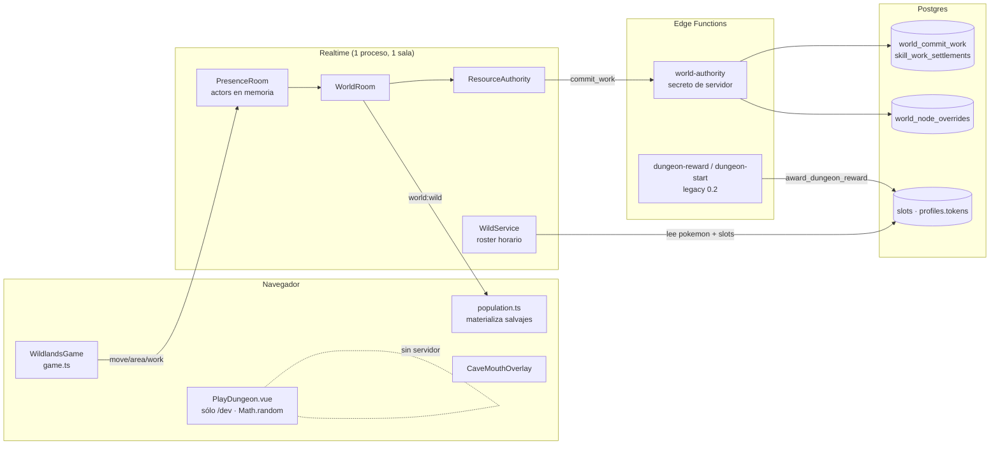

# CAVE ECOSYSTEM-1 — Arquitectura de Dungeons compartidas

> Rama `design/cave-ecosystem-0.3`, base exacta `2652a58` (CAVES-2 aprobado, que deriva de `design/caves-audit-0.3 @ f4323c9`).
> Verificado antes de empezar: `origin/world/caves-foundation-0.3 = 2652a5859c54965279b5f1db2aa66d9d641e313f`, `design/caves-audit-0.3 = f4323c9`, `f4323c9` es ancestro de `2652a58`, `world/multi-yield-recovery-0.3 = 3fca914` (YIELD-2, congelado).
> Fase **exclusivamente documental**. No se modificó código, assets, SQL, bundles ni tests.
> Etiquetas: **FACT** = verificado en el código citado (`archivo:línea` sobre `2652a58`); **INFERENCE** = deducido del código, no ejecutado; **OPEN QUESTION** = requiere decisión o verificación.

Documentos de esta serie:

| Documento | Contenido |
| --- | --- |
| `SHARED_DUNGEON_ARCHITECTURE.md` (este) | §1 auditoría técnica · §2 modelo de pisos compartidos · §3 máquinas de estado · §4 llaves y escaleras personales · §5 obstáculos compartidos · §6 combate compartido y atribución · §7 datos y protocolo |
| `CAVE_TYPES_AND_FAMILIES.md` | Taxonomía de cuevas, familias evolutivas y pools |
| `CAVE_RESPAWN_AND_TOKENS.md` | Nidos, spawn y respawn, tokens elementales, gacha y simulación económica |
| `CAVE_ECOSYSTEM_ROADMAP.md` | Threat model, matriz de pruebas, fases de implementación y decisiones |

---

## 0. Resumen ejecutivo

1. **Hoy no existe nada compartido bajo tierra.** La única cueva es una boca **cerrada** en Pradera (`caves.js`), sin interior registrado. La Dungeon es un prototipo 100 % cliente, alcanzable sólo desde rutas DEV, que genera su run con `Math.random()` y `Date.now()`. (FACT, §1.2–§1.3)
2. **Los Pokémon salvajes no tienen ciclo de vida individual.** El servidor sortea cada hora un pool de 25 especies únicas por área y lo reemplaza entero. No hay derrota, despawn, respawn, generación ni persistencia por individuo. (FACT, §1.4)
3. **El modelo de propiedad condiciona todo.** En PokeSwap cada especie es un único Pokémon con, a lo sumo, un dueño (`slots.pokemon_id`), y el salvaje de superficie es esa entidad única. Un nido que reaparece o un gacha que entrega Pokémon chocan con esa unicidad. Es la decisión bloqueante principal de esta serie. (FACT §1.4, decisión en `CAVE_ECOSYSTEM_ROADMAP.md`)
4. **La maquinaria exactly-once ya existe y es reutilizable.** `world_commit_work` deduplica por `action_id`. YIELD-2 agrega lock por nodo, token de generación y CAS. `battle/authority` aporta semilla CSPRNG, `actionId` ordenado e idempotencia. Nada de esto está conectado a Dungeons. (FACT, §1.5–§1.6)
5. **La palabra "tokens" ya está tomada.** `profiles.tokens` es la moneda del mercado y de la Dungeon legacy 0.2. Los tokens elementales tienen que ser otra moneda, en otra tabla, que nunca se convierta en esa. (FACT, §1.5)

**Recomendación.** Construir la Dungeon compartida como **un área de presencia por piso**, con un `DungeonRunService` en el realtime que posea el estado vivo de cada run. Cada cambio que mueva valor (obstáculo roto, derrota, llave, recompensa) se liquida en Postgres, en una transacción con dedupe y CAS, siguiendo el patrón de YIELD-2. El avance entre pisos es **personal**: una llave por jugador × run × piso, un permiso de viaje efímero firmado por el servidor y una escalera que sólo teletransporta a su dueño.

---

## 1. Auditoría del sistema actual

### 1.1 Mapa de autoridad hoy

### 1.2 Cuevas, áreas, presencia y viajes

| Tema | Estado | Evidencia | Etiqueta |
| --- | --- | --- | --- |
| Fuente canónica | Una sola cueva, `pradera-cueva-inicial`, entrada `closed`, interior `cueva-inicial` sin registrar en ningún protocolo. | `services/realtime/src/world/caves.js:32,71-80` | FACT |
| Consultas | `cavesIn`, `isCaveRock` e `isCaveReserved` son las únicas lecturas. No hay un `caveById` ni datos de interior. | `caves.js:89,97,102` | FACT |
| Colisión compartida | La roca de la cueva entra en la capa sólida de servidor y cliente, y la reserva (footprint + claro) en el terreno planificado. | `resourceZones.js:80-82,114-115` | FACT |
| Áreas de presencia | Sólo `ciudad-corazon` y `pradera`. | `services/realtime/src/protocol/messages.js:2-3`; `src/features/wildlands/multiplayer/domain/presence.ts:3-8` | FACT |
| Llegadas | Tabla fija `ARRIVALS` + `arrivalFor(to, from)` con un único caso especial (Pradera → Ciudad). | `services/realtime/src/protocol/arrival.js:12-26` | FACT |
| Mundo servido | `WORLD_AREAS` sólo conoce Pradera (procedural, seed 208) y Ciudad. | `services/realtime/src/world/areas.js:11-13` | FACT |
| Cambio de área | `changeArea` acepta cualquier id de `AREAS` y coloca al actor en `arrivalFor`. No valida ninguna condición de acceso. | `rooms/PresenceRoom.js:170-181` | FACT |
| Viaje en el cliente | `travelTo` rechaza áreas fuera de presencia ("Esta zona llegará próximamente"). El área de presencia se elige con un ternario de dos valores. | `src/features/wildlands/engine/game.ts:188,760-765,793,913` | FACT |
| Movimiento | El servidor acota el ritmo de los pasos, pero no la caminabilidad: "Walkability is decided by the client". | `services/realtime/src/presence/movement.js:12` | FACT |
| Reconexión | Al salir, el actor se recuerda 15 s y se restaura en el mismo área y casilla. Pasado ese plazo, reaparece en Ciudad `(31,20)`. | `presence/reconnectCache.js:2`; `PresenceRoom.js:101-104,143-145` | FACT |
| Capacidad | Una sola sala `presence`, límite de 100 conexiones, estado en `Map` de módulo. | `presence/capacity.js:1`; `PresenceRoom.js:15,25,34`; `services/realtime/src/index.js:23` | FACT |
| Interior autorado | No existe (`caveLayouts.js` no está en el repo). | búsqueda de archivos | FACT |
| Oscuridad y render | `DUNGEON_DARKNESS = 0.62` y `DungeonArea implements Area` existen, pero sólo dentro del prototipo. | `src/features/dungeonPrototype/world/dungeonArea.ts:27,143` | FACT |
| Varias áreas salvajes | `WildService` genera rosters para toda área `procedural` de `WORLD_AREAS`: la estructura soporta N áreas, aunque hoy hay una. `skillsResourceFor` sólo resuelve áreas `procedural`. | `wildService.js:65-70`; `src/features/worldSkills/resourceMapping.ts:47` | FACT |

**Conclusión 1.2.** Todo lo necesario para una **cueva permanente** ya se planificó en CAVES-1/CAVES-2 (§10 del informe CAVES-2). Faltan tres cosas para Dungeons:

- **Áreas de presencia dinámicas.** `AREAS` es un `Set` constante y `arrivalFor` es una tabla. Una Dungeon con `runId` y pisos necesita ids de área que no están en ninguna lista fija.
- **Validación de acceso en `changeArea`.** Hoy cualquier cliente puede pedir cualquier área conocida.
- **Colisión de servidor en interiores.** El servidor no valida caminabilidad, así que un cliente modificado puede atravesar un obstáculo.

### 1.3 Prototipo de Dungeon

| Pieza | Qué hace | Evidencia | Etiqueta |
| --- | --- | --- | --- |
| `PlayDungeon.vue` (976 líneas) | Orquesta la run completa en el navegador. | `components/PlayDungeon.vue` | FACT |
| Semilla | `seed: Math.floor(Math.random() * 100000)`, reloj `Date.now()`, posición fija `pradera (0,0)`. | `PlayDungeon.vue:439-443` | FACT |
| Semilla de expedición | Se deriva de `spawn.seed` y `now`: cada jugador que entra genera **otra** run. | `domain/playSession.ts:93` | FACT |
| Generación de pisos | Pura y determinista desde `(seed, tier, floor, theme)`: `generateFloor`, `buildFloorTiles`, `placeEntities`. | `domain/floorPlan.ts:99`; `domain/floorTiles.ts:139,507` | FACT |
| Temporizador | Reloj de la aparición (`DEFAULT_DUNGEON_MINUTES = 180`) con avisos a los 30, 10, 5 y 1 minutos. `DungeonRunPanel` lo calcula con `Date.now()` del cliente. | `domain/dungeonSpawn.ts:64,67`; `DungeonRunPanel.vue:48` | FACT |
| Tiers | Cinco tiers y 5–30 pisos. `TIER_CONFIG` es un parámetro de playtest. | `domain/tiers.ts:17,31` | FACT |
| Party y desgaste | La party se clona y se desgasta dentro de la run. Sale por `emit('exit', party)`. | `playSession.ts:111`; `PlayDungeon.vue:698` | FACT |
| Derrota y drops | `settleCombat` marca `entity.taken = true`, tira la llave y aplica `lootFor()`. Todo local. | `playSession.ts:204-239` | FACT |
| Llave de piso | Pertenece a la **expedición**: la encuentra uno y abre para el grupo. Tiene pity (35 % + 20 % por derrota, garantizada a la 4.ª). | `domain/coop.ts:7`; `domain/floorKey.ts:29,55` | FACT |
| Avance de piso | `descend` regenera el piso siguiente para esa expedición. En co-op hay un *ready check* grupal. | `playSession.ts:324-344`; `coop.ts:72` | FACT |
| Obstáculos | Un bloque por boca de recoveco, nunca en el camino a la escalera. Despejarlo no paga nada. | `domain/obstacles.ts:47,175-199`; `playSession.ts:292-300` | FACT |
| Ocupación de encuentros | Contrato puro de reserva: `AVAILABLE → RESERVED → IN_COMBAT → DEFEATED`, reserva de 8 s, un solo titular. | `domain/occupancy.ts:16,32,55,100` | FACT |
| Elegibilidad y botín personal | `participation` (≥5 % del daño **o** ≥3 acciones y ≥10 s, y presente al final) y `personalLoot` por jugador. | `domain/rewards.ts:55-66` | FACT |
| RNG | mulberry32 + `deriveSeed` FNV-1a + `streamFor`, ya pensados para portarse al servidor. | `domain/rng.ts:27,43,73` | FACT |
| Rutas | `/dev/dungeon` y `/dev/superficies` sólo con `import.meta.env.DEV`. | `src/app/router/routes.ts:38,44` | FACT |
| Mundo | Desconectado desde CAVES-2: ninguna superficie del mundo abre el prototipo (guarda en `caves.guard.test.ts`). | `docs/design/CAVES_2_REPORT.md` §5–§6 | FACT |
| Autoridad de combate | `battle/authority` define semilla CSPRNG, `actionId = controller:sequence`, un libro de idempotencia acotado con piso por controlador y `ExpeditionRoomCore`. No lo importa nada fuera de `src/features/battle/`. | `battle/authority/seed.ts:35`; `actionId.ts:28`; `idempotency.ts:60`; `expeditionRoomCore.ts:43` | FACT |
| Dungeon legacy 0.2 | `DungeonView` usa `award_dungeon_reward`, que **acepta los montos del cliente**: los acota, pero no los recalcula. Acredita `profiles.tokens` con tope de 3 000 por día. Sólo existe en builds sin playtest. | `routes.ts:30`; `supabase/migrations/20260908_010_dungeon_reward.sql:29,46,70` | FACT |

**Qué reutilizar y qué retirar.**

| Pieza | Veredicto | Motivo |
| --- | --- | --- |
| `rng.ts` | **Reutilizar como dominio puro** (portado o compartido con el realtime). | Determinista, por streams. Hoy es TS y el realtime es JS sin build: habría que empaquetarlo como `skills.generated.js` o reescribirlo en JS sin dependencias. |
| `tiers.ts`, `floorPlan.ts`, `floorTiles.ts`, `tileKinds.ts`, `decorPlan.ts` | **Reutilizar** para generar layouts **en el servidor**, desde una semilla del servidor. | Ya son puros y deterministas. El servidor los necesita para colisión, nidos y obstáculos. |
| `obstacles.ts` (colocación, `reachableFrom`) | **Reutilizar la colocación**. La regla "nunca en el camino a la escalera" se conserva para obstáculos opcionales. | El despeje pasa a ser una operación compartida (§5). |
| `floorKey.ts` (pity) | **Reutilizar la matemática**, cambiando el dueño de la llave: jugador × run × piso, no expedición (§4). | La regla "el RNG puede hacer lento un piso, nunca imposible" sigue valiendo. |
| `occupancy.ts` | **Reutilizar como máquina de estado de encuentro** (§3.4) y extenderla con generación y participantes. | Ya fija la regla "a lo sumo un titular". |
| `rewards.ts` (`participation`, `personalLoot`, `deliverRewards`) | **Reutilizar** como base del modelo de elegibilidad (§6). | Coincide con la dirección: botín personal sobre combate compartido. |
| `coop.ts` (llave de expedición, *ready check*, `MAX_PLAYERS = 4`) | **Retirar**. | Contradice la dirección aprobada: el acceso es personal, no se espera a nadie y no hay grupos. |
| `dungeonSpawn.ts` | **Reutilizar la semántica** (el reloj es de la aparición, avisos, auto-extracción). El reloj pasa al servidor. | `acceptsEntries` y `expirationNotice` son reglas de producto aprobadas. |
| `expedition.ts` (botín en riesgo, wipe) | **OPEN QUESTION**: ¿el botín de una run compartida está en riesgo hasta salir? | La dirección actual pide tokens liquidados exactly-once por derrota. Recomendación en §6.6: liquidar al instante y no tener botín en riesgo en la primera versión. |
| `PlayDungeon.vue`, `DungeonRunPanel.vue`, `entrancePlacement.ts`, `entranceSpawns.ts`, `speciesFixtures.ts` / `THEME_POOLS` | **Retirar** cuando exista la run compartida (DUNGEONS-2). | Son el orquestador cliente, el reloj falso y rosters fijos. Mantener dos Dungeons activas viola AGENTS §14. |
| `battle/authority/*` | **Reutilizar el patrón** (semilla CSPRNG, `actionId` ordenado, libro de idempotencia) para comandos de la run. | Resuelve reintentos y replays del lado del realtime antes de llegar a Postgres. |
| `award_dungeon_reward` / `consume_dungeon_energy` (legacy) | **No reutilizar** para cuevas. Queda para la Dungeon 0.2 y su propio retiro. | Acredita `profiles.tokens` con montos del cliente (V-02/V-08 de `docs/INVARIANTS.md`). |

### 1.4 Pokémon salvajes

| Tema | Estado | Evidencia | Etiqueta |
| --- | --- | --- | --- |
| Pool | 25 especies por área y por hora. Categorías: `legendary` 2 %, `highAura` 12 %, resto 86 %. **Los legendarios pueden aparecer en superficie.** | `services/realtime/src/world/wildPopulation.js:21-22,47-57` | FACT |
| Unicidad | El pool excluye especies con dueño (`slots.owner_id`) y no repite especie. Id del salvaje: `wild:<área>:<época>:<pokemonId>`. | `wildPopulation.js:64-77,151`; `wildService.js:96` | FACT |
| Hogares | Casillas de spawn históricas por chunk, empezando por las más cercanas a la llegada, radio de 3 chunks, filtradas por bioma (`BIOME_TYPES`) y fuera de reservas de cueva. | `wildPopulation.js:92-100,112-123,138-156` | FACT |
| Patrulla | Bucle determinista `(key, home, terreno, reloj del servidor)`, correa de 4 casillas. Cliente y servidor la muestrean igual. | `services/realtime/src/world/patrol.js:19,34,82` | FACT |
| Ownership en el cliente | El cliente oculta los salvajes cuya especie ve con dueño (`availableWildPool`). Es sólo presentación. | `src/features/pokemon/domain/wildPool.ts:11`; `wildlands/lobby/usePlazaData.ts:61`; `wildlands/engine/population.ts:66` | FACT |
| Desaparición | Sólo existe el reemplazo del roster entero al cambiar de hora (`switchRoster`) o la ocultación por dueño. | `population.ts:115-121`; `worldRoom.js` `#rosterChanged` | FACT |
| Respawn individual | **No existe.** No hay estado vivo/derrotado, `respawnAt` ni generación por salvaje. | ausencia en `wildPopulation.js` / `wildService.js` | FACT |
| Reinicio del realtime | El roster de la hora se recalcula desde `(época, catálogo, dueños)`: el mismo, salvo que haya cambiado un dueño. No se persiste nada. Sin catálogo no hay salvajes (fail closed). | `wildService.js:51-81` | INFERENCE (determinismo) / FACT (fail closed) |
| Límite de población | 25 por área, 1 por especie. El cliente materializa sólo cerca del jugador. | `wildPopulation.js:21`; `population.ts:20-21` | FACT |
| Catálogo | Producción: `pokemon(id, type1, type2, is_legendary, base_aura)` leído con la clave publicable. Sin Supabase y fuera de producción: catálogo sintético. | `wildService.js:92-99,109` | FACT |
| Catálogo local de especies | `core.json` (Battle Catalog ORAS): 493 especies con tipos, stats y `catchRate`. **Sin familias evolutivas, flags de legendario/mítico/pseudo, altura/peso ni hábitat.** | `src/features/battle/catalog/types.ts:37`; `skills/domain/aptitude/speciesFacts.ts:2` | FACT |

**Hueco de respawn.** El modelo actual es un *pool* sin estado, no una población. Para cuevas y Dungeons hace falta:

- una entidad con ciclo de vida (`alive → engaged → defeated → respawning`);
- una generación contra ABA;
- persistencia de las derrotas, para que un reinicio no resucite lo derrotado ni duplique recompensas.

**Conflicto de modelo (bloqueante para CAVE WILD-1 y GACHA-1).** El salvaje de superficie **es** el Pokémon único ownable. Un nido que reaparece crea ejemplares repetidos de una especie en el tiempo, y quizá a la vez. `CAVE_RESPAWN_AND_TOKENS.md` §1 propone separar *ejemplar de encuentro* de *Pokémon único*. Es la decisión **D-EC1**.

### 1.5 Economía, inventario y monedas

| Tema | Estado | Evidencia | Etiqueta |
| --- | --- | --- | --- |
| XP de profesiones | `player_skill_xp`, sólo servidor. | `supabase/migrations/20260926002154_world_skills_authority.sql:32-38` | FACT |
| Materiales | `player_materials(user_id, material_id, quantity ≥ 0)`. "Quantities only go up here": no hay sumidero. | `…world_skills_authority.sql:7-8,40-46` | FACT |
| Settlement | `skill_work_settlements.action_id` PK + `ON CONFLICT DO NOTHING`: un `action_id` se liquida una vez. Si se repite, devuelve el resultado original. | `…world_skills_authority.sql:48-61,158-169` | FACT |
| Estado de nodos | `world_node_overrides` con upsert **sin CAS** en la base de esta rama (el último que escribe gana). | `…world_skills_authority.sql:66-77,194-204` | FACT |
| CAS por generación | YIELD-2 (no está en esta base) agrega lock consultivo por nodo, dedupe primero y CAS contra un **token de generación** (`action_id` del último settlement aplicado). Si no coincide, devuelve `stale_node` sin pagar. | `world/multi-yield-recovery-0.3:supabase/migrations/20260928120000_world_multi_yield.sql:1-59` | FACT (otra rama) |
| Reintentos | Mismo `actionId` en cada reintento (1 s, 3 s, 9 s). La fase `settling` impide una doble finalización. | `services/realtime/src/world/resourceAuthority.js:17,211-255` | FACT |
| Moneda existente | `profiles.tokens` + `token_ledger`. Es **la moneda del mercado** (`market_listings.price_tokens`), del ingreso pasivo y de la Dungeon legacy. | `docs/INVARIANTS.md:118`; `20260907_005_token_economy_rpcs.sql:13,81`; `20260907_003_buy_market_listing.sql:47-58` | FACT |
| Dinero real | `create-checkout` desactivado. `kofi-webhook` todavía convierte $1 en un reinicio del cooldown de swap: no acredita tokens. | `supabase/functions/create-checkout/index.ts:1,20`; `supabase/functions/kofi-webhook/index.ts:8,90` | FACT |
| Tokens elementales | No existen. | búsqueda en `src`, `services`, `supabase` | FACT |
| Gacha | No existe ningún prototipo (las coincidencias de "banner" son el banner del playtest). | búsqueda | FACT |

**Consecuencias.**

- Los tokens elementales **no pueden** vivir en `profiles.tokens`: sería mezclarlos con el mercado, con un historial de pagos y con la Dungeon legacy.
- Tampoco conviene reutilizar `player_materials` tal cual. Los materiales no tienen sumidero ni libro de movimientos, y el gacha necesita débito atómico, ledger y dedupe por tirada.
- Se recomienda una tabla propia de saldos y un ledger con la misma técnica de `world_commit_work` (`CAVE_RESPAWN_AND_TOKENS.md` §5).

### 1.6 Autoridad, persistencia e instancias

| Tema | Estado | Evidencia |
| --- | --- | --- |
| Canal servidor → base | Realtime → Edge Function `world-authority` (secreto `x-world-authority-secret`, comparación en tiempo constante) → RPC `service_role`. Operaciones: `access`, `player_state`, `owns_pokemon`, `commit_work`, `load_nodes`. | `supabase/functions/world-authority/handler.ts:4,70,95-121` |
| Identidad | `actor.id` = usuario autenticado en el join. Ningún token del cliente viaja a la autoridad. | `resourceAuthority.js:47-48`; `pokemonOwnership.js:16` |
| `actionId` | UUID del servidor por acción de trabajo. En combate (`battle/authority`), `controller:sequence`. | `resourceAuthority.js:125`; `battle/authority/actionId.ts:28` |
| Dedupe | Por petición y por conexión (`recent`, 32 ids) en la sala, por `action_id` en Postgres. | `resourceAuthority.js:18,115-118` |
| Estado WORLD | Nodos en memoria (`ResourceStore`), restaurados desde `world_load_nodes` antes de servir. La sala no sirve mundo hasta tenerlos (`ready`). | `worldRoom.js:57-71` |
| Estado por jugador | Materiales y XP: sólo en Postgres, enviados por `player:state`. Presencia: en memoria. | `worldRoom.js:98-106` |
| Varias instancias | **No soportadas.** Una sala `presence`, estado en `Map` de módulo, sin bus entre procesos. Una segunda instancia tendría otra presencia y otro `ResourceStore`. En la base, sus escrituras de nodo se pisan (sin CAS). YIELD-2 lo acota con CAS (`test(world): … a stale second instance`, commit `2ea684c`). | `PresenceRoom.js:15,25,34`; historia de `world/multi-yield-recovery-0.3` |

**Conclusión 1.6.** Para Dungeons compartidas:

- **Una instancia es suficiente y es el objetivo inicial**, con límites explícitos (CAVES-1 §13.2 punto 10).
- Todo cambio que mueva valor tiene que ser correcto **aunque** aparezca una segunda instancia. Eso exige CAS en Postgres por `(runId, entidad, generación)` y que ninguna recompensa dependa sólo de la memoria.
- La presencia y el estado efímero (posiciones, animaciones) pueden seguir en memoria.
