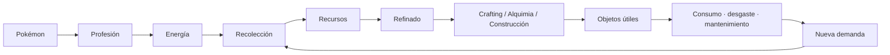
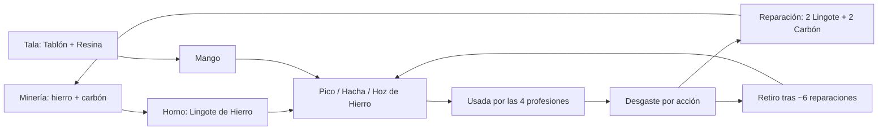
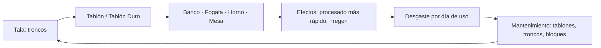
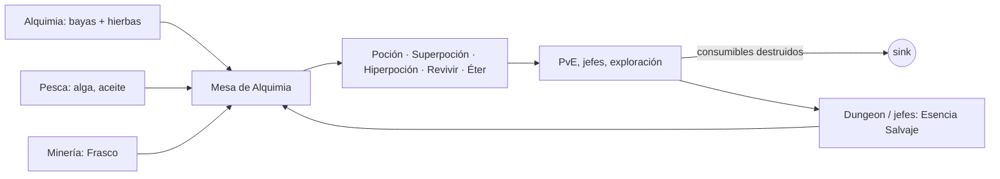
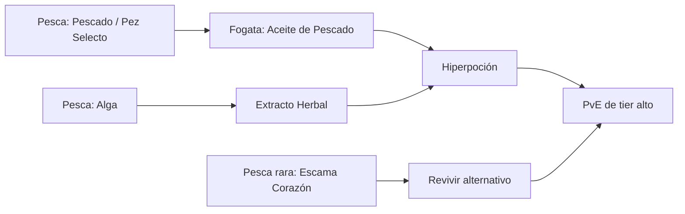
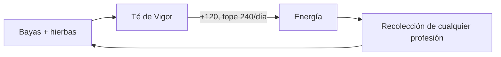
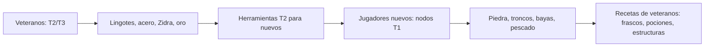

# R31 — Loops económicos

> Estado: diseño R31, **no integrado**. Cada loop indica faucet, transformación, sink, regulador, modo de fallo y, cuando existe, evidencia del simulador (`npm run sim:economy`).
> Recetas y cantidades: [`RESOURCE_ECONOMY.md`](RESOURCE_ECONOMY.md). Energía y desgaste: [`ENERGY_DURABILITY.md`](ENERGY_DURABILITY.md).

## Loop principal

---

## 1. Minería → forja → herramientas → desgaste → reparación → Minería

- **Faucet:** nodos de hierro y carbón (energía).
- **Sink:** reparación (proporcional al daño) y retiro de la herramienta.
- **Regulador:** durabilidad por tier; −8 % de máximo por reparación.
- **Modo de fallo:** reparar gratis o para siempre → ninguna herramienta nueva → el metal pierde demanda. Mitigado con la vida útil finita.
- **Evidencia:** en `base`, 109 de 318 Lingotes de Hierro se destruyeron en reparaciones; en `month-100`, 1.678 de 3.217.

## 2. Tala → construcción → mantenimiento → Tala

- **Faucet:** árboles.
- **Sink:** construcción (lote grande de una vez) y mantenimiento (goteo).
- **Regulador:** el decaimiento solo ocurre en días de uso.
- **Modo de fallo:** hoy el mantenimiento es chico frente al volumen de troncos (29.356 en stock a los 30 días). Es la principal señal para priorizar housing y más estructuras en R33+.

## 3. Recolección/PvE → Alquimia → consumibles → PvE

- **Faucet:** bayas y hierbas (energía), Esencia Salvaje (energía de dungeon).
- **Sink:** consumo en combate. Es el sink **más limpio**: el objeto desaparece mientras aporta valor.
- **Regulador de demanda:** el Centro Pokémon con restricciones (decisión de producto prevista). **OPEN QUESTION:** su cooldown exacto define cuánta Alquimia necesita el juego.
- **Modo de fallo:** si el Centro Pokémon cura gratis e inmediatamente, la demanda de pociones cae a casi cero.
- **Evidencia:** en `base` se consumieron 2.100 Pociones, 400 Superpociones, 80 Hiperpociones y 150 Éter; Revivir quedó con 210 de demanda insatisfecha (Hierba Revivir rara).

## 4. Pesca → aceite → Hiperpoción → PvE

- Pesca abastece a Alquimia en tiers medio y alto, y compite con los drops PvE como insumo de Revivir. Así el precio de la Esencia Salvaje y el de la Escama Corazón quedan vinculados.
- **Modo de fallo actual:** el Pescado T1 tiene poco sink (24.490 en stock a los 30 días). **Propuesta R33:** cocina/Poffins en la Casa de los Poffins (ya existe como edificio), con consumibles para Pokémon.

## 5. Energía ↔ Té de Vigor

- Convierte recursos de Alquimia en tiempo de recolección para las demás profesiones.
- El tope diario impide un loop infinito.
- Invariante: un Té nunca debe producir más valor del que cuesta. Con el tope de 240/día, es como máximo 40 % de una barra extra.

## 6. Rarezas → progresión alta

| Rareza | Fuente | Consumida por |
|---|---|---|
| Fragmento Evolutivo | Minería (vetas de hierro/oro, cúmulos) | Herramientas T3 |
| Perla | Pesca | Caña Maestra |
| Escama Corazón | Pesca costera/arrecife | Revivir alternativo |
| Hierba Revivir | Alquimia T2/T3 | Revivir |
| Bonguri | Tala | *Reservado:* Poké Balls (fase posterior) |
| Reliquia de Jefe | Jefes PvE | *Reservado:* mejoras de estructuras |

- Las rarezas aparecen al recolectar recursos comunes, con probabilidad escalada por `rareFind`. Dan un nicho a los Pokémon de detección sin crear un "mejor Pokémon".
- **Evidencia:** en `veterans` se acumularon 637 Fragmentos Evolutivos. El sink T3 es chico y hay que ampliarlo antes de habilitar T3 en producción.

## 7. Nuevos ↔ veteranos

- La XP se reduce a la mitad con 25 o más niveles sobre el contenido. Los veteranos pasan a nodos altos y los básicos quedan para los jugadores nuevos.
- **Evidencia:** en `veterans` (todos nivel 40) faltan 2.100 Pociones porque nadie recolecta Baya Aranja; en `month-100` la Baya Aranja se agota mientras los alquimistas prefieren T2.

## 8. Interdependencia obligatoria

- **Evidencia:** en `mining-only`, sin Tala no hay Tablones ni Mangos. Hay 0 herramientas equipadas y 29.393 de 64.433 acciones terminan a mano.
- Es la prueba ejecutable de que el catálogo no permite que una profesión se autoabastezca. Hay un test (`economySim.test.ts`) que lo mantiene.
